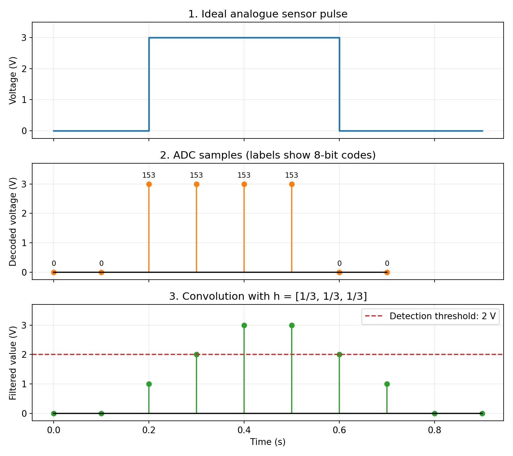

# Menghitung Objek pada Konveyor dengan Sensor Cahaya

## Seputar tutorial

Tutorial ini menghubungkan materi pertemuan 1–3 melalui satu aplikasi sederhana: menghitung objek yang melewati berkas cahaya pada konveyor. Kita akan memodelkan tegangan<!--  --> analog sensor, mengubahnya menjadi sampel digital, menghitung konvolusi, lalu menggunakan hasilnya untuk mendeteksi dan menghitung objek.

## Persiapan

Tutorial dapat diikuti secara manual terlebih dahulu, kemudian diperiksa menggunakan Python. Program memerlukan Python 3, NumPy, dan Matplotlib. Seluruh berkas pendamping dapat diletakkan dalam satu direktori.

```bash
python -m pip install numpy matplotlib
```

Berkas pendamping tutorial adalah `conveyor_convolution.py` dan `conveyor_convolution.png`. Gambar akan dibuat ulang ketika program dijalankan.

---

## Langkah 1: memahami situasi fisisnya

Bayangkan sebuah konveyor membawa objek melewati berkas cahaya yang diarahkan ke sensor. Ketika objek menghalangi berkas tersebut, rangkaian pengondisi sinyal menghasilkan kenaikan tegangan yang menandai keberadaan objek.

Dalam contoh ini, tegangan keluaran rangkaian diasumsikan sekitar 0 V ketika berkas tidak terhalang dan sekitar 3 V ketika berkas terhalang. Arah perubahan tegangan tersebut merupakan pilihan rangkaian pengondisi, sehingga tidak harus sama untuk semua jenis sensor cahaya.

Alur pengolahan yang digunakan adalah sebagai berikut:

1. Sensor dan rangkaian pengondisi menghasilkan tegangan waktu-kontinu.
2. Filter analog membatasi komponen frekuensi yang tidak diinginkan sebelum sampling.
3. ADC melakukan sampling dan kuantisasi untuk menghasilkan kode digital.
4. Program menghaluskan sampel menggunakan rata-rata bergerak tiga sampel.
5. Detektor membandingkan hasil penghalusan dengan ambang deteksi.
6. Pencacah bertambah ketika status berubah dari tidak ada objek menjadi ada objek.

ADC, filter rata-rata bergerak, dan detektor memiliki tugas yang berbeda. Filter analog sebelum ADC membatasi komponen yang dapat menimbulkan aliasing, sedangkan filter digital dalam tutorial ini menghaluskan data yang sudah diperoleh.

## Langkah 2: memodelkan bentuk sinyal analog

### 2.1 Pulsa persegi dari tegangan sensor

Misalkan satu objek menghalangi cahaya sejak $t=0.2$ s hingga sebelum $t=0.6$ s. Tegangan idealnya berbentuk pulsa persegi dengan tinggi 3 V dan durasi 0.4 s.

```math
v(t)=
\begin{cases}
3\ \text{V}, & 0.2\leq t<0.6, \\
0, & \text{lainnya}.
\end{cases}
```

Tegangan tersebut merupakan sinyal waktu-kontinu karena nilainya dinyatakan pada setiap saat. Walaupun model idealnya hanya mempunyai dua nilai amplitudo, sinyal ini belum berupa deret sampel yang dikodekan secara digital.

Sensor nyata memiliki waktu respons berhingga, dan rangkaian analog akan membulatkan tepi pulsa. Pulsa persegi ideal digunakan agar perhitungan mudah diikuti; pulsa dengan tepi sesaat tidak terbatas pita, sehingga tepinya tidak dapat direkonstruksi secara tepat menggunakan frekuensi sampling berhingga.

### 2.2 Menuliskan pulsa dengan unit step

Gunakan konvensi $u(t)=0$ untuk $t<0$ dan $u(t)=1$ untuk $t\geq0$. Pulsa dapat dinyatakan sebagai selisih dua unit step yang digeser.

$$
v(t)=3\bigl[u(t-0.2)-u(t-0.6)\bigr].
$$

Sebelum 0.2 s, kedua unit step bernilai nol sehingga tegangan juga nol. Pada interval $0.2\leq t<0.6$, hanya unit step pertama bernilai satu; mulai 0.6 s, keduanya bernilai satu dan saling meniadakan.

### 2.3 Menghubungkannya dengan klasifikasi sinyal

Pulsa ini merupakan sinyal real, waktu-kontinu, dan aperiodik. Terhadap titik acuan $t=0$, pulsa tersebut tidak genap maupun ganjil karena seluruh bagian tak nolnya berada pada waktu positif.

Dalam model ini, tinggi dan waktu pulsa sudah ditentukan sehingga sinyalnya deterministik. Pengukuran nyata dapat mengandung derau acak atau variasi waktu kedatangan objek, yang memerlukan model tambahan.

Energi sinyal dalam pengertian pengolahan sinyal diperoleh dengan mengintegralkan kuadrat magnitudo tegangan. Untuk pulsa di atas, hasilnya adalah berikut.

$$
E_v=\int_{-\infty}^{\infty}|v(t)|^2dt
=3^2(0.6-0.2)
=3.6\ \text{V}^2\text{s}.
$$

Besaran ini belum merupakan energi dalam joule karena resistansi beban belum ditentukan. Rata-rata kuadrat amplitudonya pada interval pengamatan yang diperpanjang tanpa batas adalah nol, sebagaimana pada pulsa tunggal berdurasi berhingga.

**Yang telah digunakan dari pertemuan 1:** sinyal waktu-kontinu, pulsa persegi, unit step, pergeseran waktu, klasifikasi sinyal, dan energi sinyal. Semua konsep tersebut kini menggambarkan satu kejadian pengukuran yang sama.

## Langkah 3: melakukan sampling

Pilih frekuensi sampling $f_s=10$ Hz sehingga periode samplingnya $T_s=1/f_s=0.1$ s. ADC mengamati tegangan pada waktu $t_n=nT_s$.

$$
v[n]=v(nT_s)
=3\bigl[u[n-2]-u[n-6]\bigr].
$$

Untuk unit step diskret, gunakan $u[n]=1$ ketika $n\geq0$ dan nol pada indeks lainnya. Sampel tak nol muncul pada $n=2,3,4,5$, yaitu pada waktu 0.2, 0.3, 0.4, dan 0.5 s.

| Indeks $n$ | Waktu $nT_s$ (s) | Sampel tegangan $v[n]$ (V) |
|---:|---:|---:|
| 0 | 0.0 | 0 |
| 1 | 0.1 | 0 |
| 2 | 0.2 | 3 |
| 3 | 0.3 | 3 |
| 4 | 0.4 | 3 |
| 5 | 0.5 | 3 |
| 6 | 0.6 | 0 |
| 7 | 0.7 | 0 |

Pada sistem nyata, frekuensi sampling dan filter analog dipilih berdasarkan pita sinyal yang relevan serta ketelitian waktu yang diperlukan. Nilai 10 Hz di sini merupakan contoh yang memberi empat sampel selama pulsa, bukan ketentuan umum untuk setiap konveyor atau pulsa persegi.

## Langkah 4: menguantisasi dan mengodekan sampel

### 4.1 Menentukan konvensi ADC

ADC 8 bit menghasilkan 256 kode yang mungkin, yaitu 0 hingga 255. Dalam tutorial ini, gunakan model pendidikan dengan 256 tingkat rekonstruksi yang berjarak sama dari 0 hingga 5 V dan mencakup kedua titik ujungnya.

Jarak antartingkat pada model tersebut adalah sebagai berikut. Penyebutnya 255 karena 256 titik tingkat rekonstruksi mempunyai 255 interval di antaranya.

$$
\Delta=\frac{5}{255}\ \text{V}
\approx0.01961\ \text{V}.
$$

Konvensi ADC lain dapat menggunakan interval kuantisasi $5/256$ V, sehingga kedua konvensi tidak boleh dicampur dalam satu perhitungan. ADC nyata harus dimodelkan menurut spesifikasi ambang transisi dan pengodeannya.

### 4.2 Mengubah tegangan menjadi kode digital

Batasi terlebih dahulu tegangan masukan ke rentang 0–5 V melalui operasi pemotongan nilai atau *clipping*. Untuk tegangan yang sudah berada dalam rentang tersebut, rumus kode digital dan tegangan hasil dekodenya adalah berikut.

$$
q[n]=\text{round}\left(\frac{255v[n]}{5}\right),
\qquad
x[n]=\frac{5q[n]}{255}.
$$

Kode $q[n]$ merupakan bilangan bulat yang disimpan secara digital, sedangkan $x[n]$ adalah estimasi tegangannya dalam volt. Program menggunakan pembulatan ke bilangan genap terdekat ketika nilainya tepat di tengah dua kode; tidak ada sampel contoh ini yang berada pada kondisi tersebut.

Untuk tegangan 3 V, kode yang diperoleh adalah 153. Jika ditulis menggunakan delapan bit, kode tersebut adalah `10011001`.

$$
q=\text{round}\left(\frac{255\times3}{5}\right)=153,
\qquad
x=\frac{5\times153}{255}=3\ \text{V}.
$$

| $n$ | $v[n]$ (V) | Kode $q[n]$ | Kode biner | Hasil dekode $x[n]$ (V) |
|---:|---:|---:|---|---:|
| 0 | 0 | 0 | `00000000` | 0 |
| 1 | 0 | 0 | `00000000` | 0 |
| 2 | 3 | 153 | `10011001` | 3 |
| 3 | 3 | 153 | `10011001` | 3 |
| 4 | 3 | 153 | `10011001` | 3 |
| 5 | 3 | 153 | `10011001` | 3 |
| 6 | 0 | 0 | `00000000` | 0 |
| 7 | 0 | 0 | `00000000` | 0 |

Dengan demikian, kode ADC adalah $\{0,0,153,153,153,153,0,0\}$ dan sampel tegangan hasil dekodenya adalah $\{0,0,3,3,3,3,0,0\}$. Elemen pertama terletak pada $n=0$, dan sinyal ideal di luar pulsa bernilai nol.

### 4.3 Memeriksa galat kuantisasi

Definisikan galat rekonstruksi sebagai $e_q[n]=x[n]-v[n]$. Galatnya nol untuk nilai 0 V dan 3 V yang dipilih, tetapi bukan berarti ADC 8 bit tidak menimbulkan galat untuk tegangan lainnya.

Sebagai contoh, tegangan 2.83 V menghasilkan kode 144. Hasil dekode dan galatnya adalah berikut.

$$
x=\frac{5\times144}{255}\approx2.82353\ \text{V},
\qquad
e_q\approx-0.00647\ \text{V}.
$$

Di dalam rentang masukan tanpa clipping, pembulatan ke tingkat terdekat membatasi magnitudo galat hingga $\Delta/2$. Jika masukan berada di luar rentang, clipping memberi galat tambahan sehingga batas tersebut tidak berlaku terhadap tegangan asli.

**Yang telah digunakan dari pertemuan 2:** sampling, periode sampling, tingkat kuantisasi, kode biner, dan galat kuantisasi. Selanjutnya, kita menggunakan persamaan selisih dan unit delay untuk mengolah sampel tersebut.

## Langkah 5: merancang filter rata-rata bergerak

### 5.1 Menentukan persamaan selisih

Gunakan filter rata-rata bergerak tiga sampel yang bersifat kausal. Setiap keluaran merupakan rata-rata sampel masukan sekarang dan dua sampel sebelumnya.

$$
y[n]=\frac{x[n]+x[n-1]+x[n-2]}{3}.
$$

Implementasi diagram bloknya memerlukan dua unit delay, tiga pengali dengan faktor $1/3$, dan satu penjumlah. Sistem ini nonrekursif karena ruas kanan tidak memuat keluaran sebelumnya.

### 5.2 Memeriksa sifat sistem

Filter bersifat linear karena keluarannya merupakan jumlah berbobot dari sampel masukan. Filter juga invarian terhadap waktu karena koefisien dan penundaan relatifnya tidak bergantung pada indeks waktu pengamatan.

| Sifat | Klasifikasi | Alasan |
|---|---|---|
| Linearitas | Linear | Jumlah berbobot memenuhi superposisi |
| Ketergantungan waktu | Invarian terhadap waktu | Koefisien dan delay tetap |
| Memori | Memiliki memori | Menggunakan dua sampel masukan sebelumnya |
| Kausalitas | Kausal | Tidak menggunakan sampel masa depan |
| Rekursi | Nonrekursif | Tidak menggunakan keluaran sebelumnya |
| Stabilitas BIBO | Stabil | Masukan terbatas menghasilkan keluaran terbatas |

Jika $|x[n]|\leq B$, ketaksamaan segitiga memberikan $|y[n]|\leq(B+B+B)/3=B$. Klasifikasi tersebut berlaku pada tahap penghalusan, sedangkan kuantisasi ADC dan deteksi ambang merupakan operasi nonlinear.

### 5.3 Menentukan respons impuls

Berikan masukan $x[n]=\delta[n]$ pada persamaan filter. Keluaran yang diperoleh adalah respons impuls berikut.

$$
h[n]=\frac{1}{3}\bigl[\delta[n]+\delta[n-1]+\delta[n-2]\bigr].
$$

Respons impuls mempunyai tiga koefisien tak nol yang semuanya bernilai $1/3$. Jika elemen pertama berindeks nol, barisannya adalah $h[n]=\{1/3,1/3,1/3\}$.

## Langkah 6: menghitung konvolusi secara manual

### 6.1 Menghubungkan konvolusi dengan persamaan selisih

Untuk sistem LTI dengan memori awal nol, keluaran adalah konvolusi masukan dengan respons impuls. Substitusikan tiga koefisien respons impuls yang telah ditemukan.

$$
\begin{aligned}
y[n]
&=\sum_{k=-\infty}^{\infty}x[k]h[n-k]\\
&=\frac{x[n]+x[n-1]+x[n-2]}{3}.
\end{aligned}
$$

Jadi, persamaan selisih dan konvolusi menyatakan operasi yang sama. Pada model pulsa ini, semua sampel sebelum pulsa bernilai nol sehingga memori awal filter juga sesuai dengan keadaan sinyal.

### 6.2 Menghitung setiap sampel keluaran

Gunakan $x[n]=\{0,0,3,3,3,3,0,0\}$ dan anggap sinyal bernilai nol sebelum serta sesudah pulsa. Untuk setiap $n$, ambil sampel sekarang dan dua sampel sebelumnya, lalu jumlahkan dan bagi tiga.

| $n$ | $x[n]$ | $x[n-1]$ | $x[n-2]$ | Perhitungan | $y[n]$ (V) |
|---:|---:|---:|---:|---|---:|
| 0 | 0 | 0 | 0 | $(0+0+0)/3$ | 0 |
| 1 | 0 | 0 | 0 | $(0+0+0)/3$ | 0 |
| 2 | 3 | 0 | 0 | $(3+0+0)/3$ | 1 |
| 3 | 3 | 3 | 0 | $(3+3+0)/3$ | 2 |
| 4 | 3 | 3 | 3 | $(3+3+3)/3$ | 3 |
| 5 | 3 | 3 | 3 | $(3+3+3)/3$ | 3 |
| 6 | 0 | 3 | 3 | $(0+3+3)/3$ | 2 |
| 7 | 0 | 0 | 3 | $(0+0+3)/3$ | 1 |
| 8 | 0 | 0 | 0 | $(0+0+0)/3$ | 0 |
| 9 | 0 | 0 | 0 | $(0+0+0)/3$ | 0 |

Hasil konvolusi lengkapnya adalah berikut. Sampel pertama dalam barisan keluaran tetap berada pada $n=0$.

$$
y[n]=\{0,0,1,2,3,3,2,1,0,0\}.
$$

Konvolusi penuh dari larik masukan delapan elemen dan kernel tiga elemen mengembalikan $8+3-1=10$ elemen. Dua elemen terakhir bernilai nol, sehingga panjang larik tersebut tidak sama dengan panjang dukungan tak nol sinyal.

Pada tepi awal, keluaran naik bertahap karena jendela rata-rata masih memuat sampel nol. Pada tepi akhir, sampel tinggi sebelumnya tetap berkontribusi walaupun sampel sekarang sudah nol.

### 6.3 Membaca grafik hasil

Panel pertama menunjukkan pulsa tegangan analog ideal, panel kedua menunjukkan sampel yang diberi label kode ADC, dan panel ketiga menunjukkan keluaran konvolusi. Sumbu waktu yang sama membantu memperlihatkan keterlambatan respons filter.



Label pada gambar menggunakan bahasa Inggris agar sesuai dengan program pendamping yang diberikan. Besaran yang dibaca tetap sama: tegangan, waktu, kode digital, dan ambang deteksi.

**Yang telah digunakan dari pertemuan 3:** respons impuls dan konvolusi linear untuk menghitung keluaran sistem LTI. Contoh ini berfokus pada konvolusi dan tidak memerlukan operasi korelasi.

## Langkah 7: mendeteksi dan menghitung objek

### 7.1 Memilih ambang deteksi

Nyatakan objek terdeteksi ketika $y[n]\geq2$ V. Untuk hasil di atas, syarat tersebut terpenuhi pada $n=3,4,5,6$ dan tidak terpenuhi pada indeks lainnya.

Deteksi pertama terjadi pada $n=3$, yaitu $t=0.3$ s, atau 0.1 s setelah pulsa ideal mulai. Status deteksi juga tetap aktif pada $n=6$, satu sampel setelah pulsa masukan berakhir.

### 7.2 Menghitung perubahan status

Jika setiap sampel di atas ambang dihitung sebagai satu objek, objek yang sama akan dihitung empat kali. Karena itu, pencacah hanya bertambah saat status berubah dari tidak terdeteksi menjadi terdeteksi.

Misalkan $b[n]$ adalah status Boolean deteksi. Peristiwa naik terjadi ketika $b[n]$ benar dan $b[n-1]$ salah, dengan status awal diasumsikan tidak ada objek.

Program menemukan tepat satu peristiwa naik pada sampel 3. Oleh karena itu, contoh pulsa ini menghasilkan satu objek yang terhitung.

### 7.3 Mengapa konvolusi membantu menolak gangguan singkat?

Sebagai pembanding, misalkan gangguan hanya menghasilkan satu sampel 3 V yang dikelilingi sampel nol. Konvolusinya menghasilkan tiga sampel keluaran yang masing-masing hanya 1 V.

$$
x_{\text{gangguan}}[n]=3\delta[n-n_s]
$$

$$
y_{\text{gangguan}}[n]
=\delta[n-n_s]+\delta[n-n_s-1]+\delta[n-n_s-2].
$$

Gangguan tersebut tidak mencapai ambang 2 V, sedangkan pulsa objek empat sampel mencapai 3 V. Inilah manfaat konvolusi dalam aplikasi ini: penghalusan membuat detektor kurang peka terhadap gangguan satu sampel yang dimodelkan tersebut.

Perbandingan ini tidak berarti semua jenis derau dapat dihilangkan. Objek nyata yang hanya menghasilkan satu sampel tinggi juga akan ditolak oleh detektor yang sama.

### 7.4 Menilai batas penerapan

Panjang rata-rata harus disesuaikan dengan durasi objek, kecepatan konveyor, dan keterlambatan deteksi yang diizinkan. Objek yang lewat terlalu cepat atau terlalu berdekatan dapat terlewat atau tergabung menjadi satu kejadian deteksi.

Filter digital tidak dapat membatalkan aliasing yang sudah terjadi saat akuisisi. Pembatasan pita analog sebelum ADC dan pemilihan frekuensi sampling tetap diperlukan.

Perhitungan utama ini menggunakan pulsa tanpa derau dan tidak mensimulasikan filter antialias analog. Tujuannya adalah memperlihatkan hubungan matematis materi tiga pertemuan, sedangkan pembanding gangguan satu sampel menjelaskan salah satu manfaat praktis penghalusan.

## Langkah 8: menjalankan program Python lengkap

### 8.1 Menjalankan berkas

Simpan kode berikut sebagai `conveyor_convolution.py`, atau gunakan berkas yang disertakan dalam paket. Setelah NumPy dan Matplotlib tersedia, jalankan perintah berikut.

```bash
python conveyor_convolution.py
```

Program menghasilkan sampel, melakukan pengodean dan dekode ADC, menghitung konvolusi, menentukan peristiwa naik, dan menyimpan gambar tiga panel. Backend Matplotlib yang digunakan tidak memerlukan tampilan grafis, sehingga program juga dapat berjalan pada server.

### 8.2 Kode sumber lengkap

Kode berikut sama persis dengan berkas Python pendamping. Pernyataan `assert` memeriksa kode ADC, hasil konvolusi, dan indeks peristiwa deteksi terhadap hasil hitungan manual.

```python
"""Rectangular sensor pulse, ADC, and causal moving-average convolution.
Run with Python 3, NumPy, and Matplotlib. The ideal pulse is a teaching model;
real analogue conditioning rounds the pulse edges before sampling.
"""
from pathlib import Path
import numpy as np
import matplotlib
matplotlib.use('Agg')
import matplotlib.pyplot as plt

fs = 10.0
Ts = 1/fs
n = np.arange(8)
# Ideal pulse: 3 V for 0.2 <= t < 0.6 s. Explicit indices avoid float-boundary issues.
v_samples = np.where((n >= 2) & (n < 6), 3.0, 0.0)
# Endpoint-inclusive teaching ADC model: 256 levels from 0 to 5 V.
# An actual ADC's transition thresholds and coding depend on its specification.
q = np.rint(255*np.clip(v_samples, 0, 5)/5).astype(int)
x = 5*q/255
h = np.ones(3)/3
y = np.convolve(x, h, mode='full')
ny = np.arange(len(y))
assert np.array_equal(q, [0, 0, 153, 153, 153, 153, 0, 0])
assert np.allclose(y, [0, 0, 1, 2, 3, 3, 2, 1, 0, 0])
flag = y >= 2
rising = flag & ~np.r_[False, flag[:-1]]
assert np.flatnonzero(rising).tolist() == [3]

plt.rcParams.update({'font.size': 11, 'axes.grid': True, 'grid.alpha': .25})
fig, ax = plt.subplots(3, 1, figsize=(9, 8), sharex=True)
ax[0].plot([0,.2,.2,.6,.6,.9], [0,0,3,3,0,0], color='tab:blue', lw=2)
ax[0].set(title='1. Ideal analogue sensor pulse', ylabel='Voltage (V)', ylim=(-.25,3.5))
ax[1].stem(n*Ts, x, linefmt='C1-', markerfmt='C1o', basefmt='k-')
for ti, vi, code in zip(n*Ts,x,q):
    ax[1].annotate(str(code), (ti,vi), xytext=(0,8), textcoords='offset points', ha='center', fontsize=9)
ax[1].set(title='2. ADC samples (labels show 8-bit codes)', ylabel='Decoded voltage (V)', ylim=(-.25,3.7))
ax[2].stem(ny*Ts, y, linefmt='C2-', markerfmt='C2o', basefmt='k-')
ax[2].axhline(2, color='tab:red', ls='--', label='Detection threshold: 2 V')
ax[2].set(title='3. Convolution with h = [1/3, 1/3, 1/3]', ylabel='Filtered value (V)', xlabel='Time (s)', ylim=(-.25,3.7))
ax[2].legend(loc='upper right')
fig.tight_layout()
fig.savefig(Path(__file__).with_name('conveyor_convolution.png'), dpi=170)
print('ADC codes:',q)
print('Decoded samples:',x)
print('Convolution:',y)
print('Object counted at sample:',np.flatnonzero(rising))
```

### 8.3 Memeriksa keluaran program

Keluaran yang dicetak harus sesuai dengan hasil di bawah ini. Indeks peristiwa naik 3 menunjukkan satu objek yang terhitung pada waktu 0.3 s.

```text
ADC codes: [  0   0 153 153 153 153   0   0]
Decoded samples: [0. 0. 3. 3. 3. 3. 0. 0.]
Convolution: [0. 0. 1. 2. 3. 3. 2. 1. 0. 0.]
Object counted at sample: [3]
```

Berkas gambar disimpan sebagai `conveyor_convolution.png` di direktori yang sama dengan program. Lokasi penyimpanan tersebut tidak bergantung pada direktori kerja saat program dijalankan.

### 8.4 Memahami bagian penting kode

Sampel pulsa ditentukan melalui indeks bulat, bukan perbandingan bilangan titik mengambang dengan batas 0.2 dan 0.6. Cara ini menghindari ambiguitas numerik pada titik batas dan mempertahankan interval pulsa yang tertutup di kiri serta terbuka di kanan.

`np.clip` membatasi nilai masukan ke rentang ADC, sedangkan `np.rint` membulatkannya menjadi kode terdekat. Faktor `5/255` kemudian mengubah kode menjadi estimasi tegangan untuk perhitungan filter.

`np.convolve(x, h, mode='full')` menghitung konvolusi linear dengan perluasan nol di luar larik. Kondisi `y >= 2` menghasilkan status deteksi, sedangkan `rising` membandingkan status tersebut dengan status sebelumnya yang diawali satu nilai salah.

## Langkah 9: mencoba variasi sederhana

Lakukan variasi berikut satu per satu agar pengaruh setiap perubahan mudah dikenali. Bandingkan hasilnya dengan pulsa awal sebelum mengubah beberapa parameter sekaligus.

1. Ganti pulsa dengan satu sampel 3 V dan periksa bahwa keluaran filter tidak mencapai 2 V.
2. Pendekkan pulsa menjadi dua sampel tinggi, lalu periksa waktu dan durasi deteksinya.
3. Ganti kernel tiga sampel dengan rata-rata lima sampel, lalu bandingkan nilai puncak dan keterlambatan deteksi.
4. Buat dua pulsa objek dengan beberapa jarak yang berbeda, kemudian cari keadaan ketika detektor menggabungkannya.
5. Tambahkan gangguan terbatas pada sampel tegangan sebelum kuantisasi, lalu bandingkan deteksi dengan dan tanpa penghalusan.

Untuk kernel lima sampel, perubahan kode utamanya adalah `h = np.ones(5) / 5`. Pernyataan pemeriksaan yang memuat hasil khusus kernel tiga sampel perlu disesuaikan karena hasil dan panjang konvolusinya berubah.

## Hubungan dengan pertemuan 1–3

Satu kejadian fisis telah melalui beberapa representasi dan operasi yang berbeda. Tabel berikut menunjukkan konsep kuliah yang digunakan pada setiap tahap tutorial.

| Pertemuan | Konsep yang digunakan | Peran dalam aplikasi |
|---|---|---|
| 1: representasi sinyal | Sinyal waktu-kontinu, pulsa, unit step, pergeseran, energi sinyal | Memodelkan tegangan sensor |
| 2: sistem dan akuisisi | Sampling, kuantisasi, pengodean, unit delay, persamaan selisih, klasifikasi sistem | Mengubah tegangan menjadi kode dan menerapkan filter |
| 3: konvolusi dan sistem LTI | Respons impuls, konvolusi linear, interkoneksi tahap pengolahan | Menghitung sinyal hasil penghalusan |

Penghalusan merupakan tahap LTI, sedangkan ADC, detektor ambang, dan pencacah harus dipahami sebagai tahap yang berbeda. Gabungan beberapa tahap tersebut menghasilkan aplikasi sederhana yang dapat menghitung objek sambil menolak gangguan singkat tertentu.
