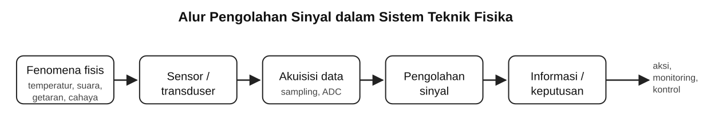
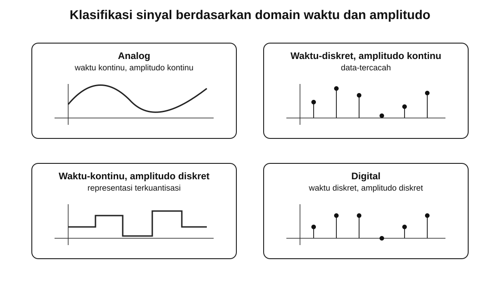
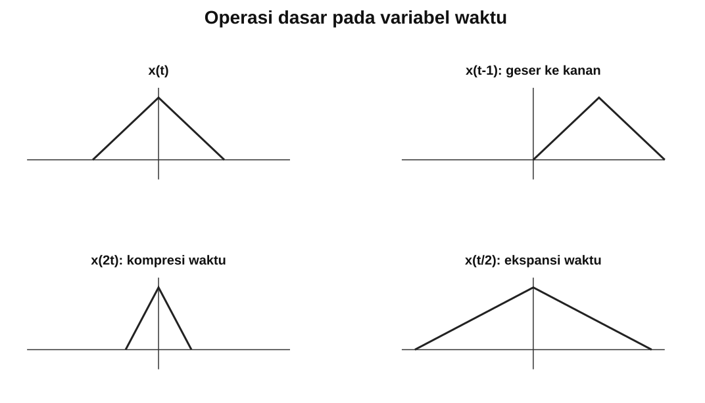

# Kuliah 1: Pengantar Pengolahan Sinyal dan Representasi Sinyal

## Tujuan pembelajaran

Setelah mengikuti kuliah ini, mahasiswa diharapkan mampu:
- menjelaskan pengertian sinyal dan pengolahan sinyal dalam konteks Teknik Fisika;
- membedakan sinyal waktu-kontinu dan waktu-diskret;
- membedakan sinyal analog, data-tercacah, sinyal terkuantisasi, dan sinyal digital;
- membedakan sinyal deterministik dan acak;
- menentukan apakah suatu sinyal bersifat periodik atau aperiodik;
- menentukan komponen genap dan ganjil suatu sinyal;
- menentukan energi dan daya rata-rata sinyal;
- mengenali sinyal-sinyal dasar seperti eksponensial, sinusoidal, *unit step*, impuls, *ramp*, dan sinc;
- melakukan operasi dasar pada amplitudo dan variabel bebas sinyal;
- membangun dan memvisualisasikan sinyal sederhana menggunakan Python, NumPy, dan Matplotlib.

---

## Fenomena fisis dalam bentuk sinyal

Dalam Teknik Fisika, banyak besaran fisis yang diukur sebagai fungsi waktu atau posisi. Beberapa contoh adalah:
- temperatur ruang sebagai fungsi waktu;
- tekanan pada saluran fluida;
- percepatan dari sensor getaran;
- tegangan keluaran fotodiode;
- sinyal akustik dari mikrofon;
- medan magnet yang diukur sensor Hall;
- intensitas cahaya pada kamera;
- sinyal elektrokardiogram;
- citra termal.

Besaran-besaran tersebut dapat dipandang sebagai **sinyal** ketika nilainya membawa informasi mengenai suatu sistem fisis.

Secara sederhana, alur pengukuran dapat digambarkan sebagai
```text
fenomena fisis
      |
      v
sensor / transduser
      |
      v
sinyal listrik
      |
      v
akuisisi data
      |
      v
pengolahan sinyal
      |
      v
informasi / keputusan
```



Sebuah sinyal biasanya direpresentasikan secara matematis sebagai fungsi dari satu atau lebih variabel bebas. Untuk sinyal satu dimensi yang berubah terhadap waktu,
```math
x=x(t).
```
Untuk sinyal diskret,
```math
x=x[n].
```
Untuk citra dua dimensi,
```math
x=x(m,n),
```
atau dalam notasi kontinu,
```math
x=x(x_1,x_2).
```
Pada kuliah ini kita terutama membahas sinyal satu dimensi.

---

## Apa yang dimaksud dengan pengolahan sinyal?

Secara umum, **pengolahan sinyal** adalah sekumpulan metode untuk
- menganalisis sinyal;
- memodifikasi sinyal;
- mengekstraksi informasi dari sinyal.
Contoh persoalan sederhana adalah:
- mengurangi derau;
- mencari frekuensi dominan;
- memperkirakan pergeseran waktu;
- memisahkan komponen frekuensi;
- mengubah laju pencuplikan (*sampling*);
- mengompresi data;
- memperbaiki kualitas sinyal;
- mengambil fitur tertentu untuk keperluan pengukuran atau kontrol.

Dalam sistem digital, pengolahan dilakukan menggunakan komputer, mikrokontroler, DSP processor, FPGA, atau perangkat digital lain. Secara konseptual,

```math
\boxed{
\text{sinyal masukan}
\longrightarrow
\text{algoritma pengolahan}
\longrightarrow
\text{sinyal keluaran atau informasi}
}
```

---

## Sinyal waktu-kontinu dan waktu-diskret

### Sinyal waktu-kontinu

Sinyal waktu-kontinu didefinisikan untuk setiap nilai waktu dalam suatu interval. Notasi yang kita gunakan adalah
```math
x(t).
```
Sebagai contoh,
```math
x(t)=A\cos(\Omega t+\phi),
```
dengan
- $A$ adalah amplitudo;
- $\Omega$ adalah frekuensi sudut dalam rad/s;
- $\phi$ adalah fase awal.
Karena variabel bebasnya kontinu, nilai $t$ dapat mengambil nilai real.

Contoh nilai $t$ lebih spesifik:
```math
t=0,\;0.001,\;0.0015,\;0.00151,\ldots
```
Secara prinsip, semuanya diperbolehkan.

### Sinyal waktu-diskret

Sinyal waktu-diskret hanya didefinisikan pada indeks-indeks tertentu. Kita menuliskannya sebagai
```math
x[n].
```
Indeks $n$ biasanya berupa bilangan bulat,
```math
n=\ldots,-2,-1,0,1,2,\ldots
```

Jika sinyal waktu-diskret diperoleh dari pencuplikan sinyal waktu-kontinu dengan periode pencuplikan $T_s$, kita dapat tuliskan
```math
x[n]=x(nT_s).
```
Frekuensi pencuplikan adalah
```math
f_s=\frac{1}{T_s}.
```

Perbedaan penting:
- $x(t)$  : fungsi terhadap waktu kontinu
- $x[n]$  : deret nilai pada indeks diskret

---

## Sinyal analog, data-tercacah, terkuantisasi, dan digital

Istilah **waktu-kontinu** dan **waktu-diskret** menjelaskan domain variabel bebas. Istilah **amplitudo kontinu** dan **amplitudo diskret** menjelaskan nilai sinyal. Kombinasi keduanya menghasilkan empat kategori konseptual.


### Sinyal analog

Sinyal analog mempunyai:
- waktu kontinu;
- amplitudo kontinu.

Sebagai contoh,
```math
x(t)=2.5\cos(100\pi t).
```

### Sinyal data-tercacah (*discrete-data*)

Sinyal data-tercacah mempunyai:
- waktu diskret;
- amplitudo kontinu.

Contohnya:
```math
x[n]=x(nT_s).
```
Secara matematis amplitudonya masih dapat bernilai real.

### Sinyal terkuantisasi waktu-kontinu

Secara konseptual kita juga dapat membentuk sinyal yang memiliki:
- waktu kontinu;
- amplitudo diskret.

Jenis ini lebih jarang digunakan sebagai representasi utama dalam pengolahan sinyal digital.

### Sinyal digital

Sinyal digital mempunyai:
- waktu diskret;
- amplitudo diskret.

Nilai amplitudo direpresentasikan dengan sejumlah bit yang terbatas. Sebagai contoh, perangkat *analog-to-digital converter* (ADC) 8-bit menyediakan paling banyak
```math
2^8=256
```
kode digital.

### Eksperimen Python: sinyal kontinu dan diskret

Program berikut membandingkan representasi kontinu dan hasil *sampling* atau pencuplikan diskret. Untuk eksekusi paling cepat dan mudah, pembaca dapat menyalinnya ke dalam suatu sel dalam Jupyter Notebook atau [Google Colab](https://colab.research.google.com/).
```python
import numpy as np
import matplotlib.pyplot as plt

A = 1.0
f = 5.0
fs = 40.0

t = np.linspace(0.0, 1.0, 2000)
x = A * np.cos(2.0 * np.pi * f * t)

n = np.arange(0, int(fs) + 1)
tn = n / fs
xn = A * np.cos(2.0 * np.pi * f * tn)

plt.figure(figsize=(9, 4))
plt.plot(t, x, label="x(t)")
plt.stem(tn, xn, linefmt="C1-", markerfmt="C1o",
         basefmt="k-", label="x[n]")
plt.xlabel("Waktu (s)")
plt.ylabel("Amplitudo")
plt.grid(True, alpha=0.3)
plt.legend()
plt.tight_layout()
plt.show()
```
Versi skrip Python terpisah tersedia di
```text
Kode/pertemuan-01/01_sinyal_dasar.py
```

Perhatikan bahwa `plt.plot` cocok untuk menunjukkan kurva kontinu, sedangkan `plt.stem` cocok untuk menunjukkan sampel diskret.

---

## Sinyal deterministik dan sinyal acak

### Sinyal deterministik

Sinyal deterministik dapat ditentukan oleh aturan yang pasti. Contohnya,
```math
x(t)=3\cos(20\pi t)+2\sin(50\pi t).
```
Jika nilai $t$ diketahui, nilai $x(t)$ dapat dihitung secara pasti.

### Sinyal acak

Sinyal acak tidak dapat diprediksi secara tepat hanya dari satu persamaan deterministik sederhana. Contohnya:
- derau termal (*thermal noise*);
- fluktuasi turbulen;
- *noise* sensor;
- sebagian komponen *electroencephalography* (EEG);
- variasi proses statistik.

Dalam praktiknya, banyak sinyal yang terukur adalah gabungan komponen deterministik dan acak. Sebagai contoh,
```math
x[n]
=
A\cos(\omega_0 n+\phi)
+
\eta[n],
```
dengan $\eta[n]$ menyatakan *noise*.

---

## Sinyal periodik dan aperiodik

### Sinyal waktu-kontinu periodik

Sinyal waktu-kontinu $x(t)$ disebut periodik jika terdapat $T>0$ sehingga
```math
x(t+T)=x(t)
```
untuk semua $t$. Nilai positif terkecil yang memenuhi hubungan tersebut disebut **periode fundamental**.

Dari periode fundamental, kita dapat definisikan frekuensi biasa adalah
```math
f_0=\frac{1}{T_0}.
```
Sementara itu, frekuensi sudutnya
```math
\Omega_0=2\pi f_0
=
\frac{2\pi}{T_0}.
```

Sebagai contoh,
```math
x(t)=\cos(20\pi t).
```
Karena $x(t)$ dapat dituliskan sebagai $x(t) = \cos(\Omega_0 t)$, frekuensi sudutnya adalah
```math
\Omega_0=20\pi,
```
sehingga
```math
f_0=\frac{20\pi}{2\pi}=10\text{ Hz},
```
dan

```math
T_0=\frac{1}{10}=0.1\text{ s}.
```

### Sinyal waktu-diskret periodik

Sinyal diskret $x[n]$ disebut periodik jika terdapat bilangan bulat positif $N$ sehingga
```math
x[n+N]=x[n]
```
untuk semua $n$. Nilai positif terkecil $N$ disebut periode fundamental dalam satuan sampel.

Untuk sinusoid diskret,
```math
x[n]=A\cos(\omega_0 n+\phi),
```
periodisitas mensyaratkan terdapat bilangan bulat $m$ dan $N$ yang memenuhi
```math
\omega_0 N=2\pi m.
```
Dengan kata lain,
```math
\frac{\omega_0}{2\pi}
```
harus merupakan bilangan rasional. Hal ini merupakan perbedaan penting dengan sinusoid waktu-kontinu. Setiap sinusoid waktu-kontinu dengan frekuensi bukan nol bersifat periodik, sedangkan tidak semua sinusoid waktu-diskret bersifat periodik.

### Contoh: periodisitas sinusoid diskret

Mari kita tinjau
```math
x[n]=\cos\left(\frac{\pi}{3}n\right).
```
Kita mencari $N$ sehingga
```math
\frac{\pi}{3}N=2\pi m.
```
Maka,
```math
N=6m.
```
Pilihan positif terkecil adalah `m=1`, sehingga
```math
\boxed{N_0=6}.
```

Sekarang tinjau
```math
x[n]=\cos(n).
```
Dalam kasus ini,
```math
\frac{\omega_0}{2\pi}
=
\frac{1}{2\pi}
```
bukan bilangan rasional. Dengan demikian, sinyal tersebut tidak periodik.

---

## Sinyal genap dan ganjil

Sinyal kontinu $x(t)$ disebut **genap** jika
```math
x(-t)=x(t).
```
Sementara itu, suatu sinyal disebut **ganjil** jika
```math
x(-t)=-x(t).
```
Untuk sinyal diskret,
```math
x[-n]=x[n]
```
menyatakan sinyal genap, sedangkan
```math
x[-n]=-x[n]
```
menyatakan sinyal ganjil.

Contoh:
```math
\cos(-t)=\cos(t),
```
maka kosinus di sini adalah fungsi genap. Sementara itu,
```math
\sin(-t)=-\sin(t),
```
maka sinus di sini bersifat ganjil.

### Dekomposisi genap-ganjil

Setiap sinyal dapat dituliskan sebagai penjumlahan komponen genap dan ganjil,
```math
x(t)
=
x_e(t)+x_o(t),
```
dengan
```math
x_e(t)
=
\frac{1}{2}
\left[
x(t)+x(-t)
\right],
```
dan
```math
x_o(t)
=
\frac{1}{2}
\left[
x(t)-x(-t)
\right].
```
Untuk sinyal diskret,
```math
x_e[n]
=
\frac{1}{2}
\left[
x[n]+x[-n]
\right],
```
```math
x_o[n]
=
\frac{1}{2}
\left[
x[n]-x[-n]
\right].
```

Misal kita diberikan
```math
x(t)
=
3\cos(2t)+2\sin(5t).
```
Karena kosinus genap dan sinus ganjil,
```math
x(-t)
=
3\cos(2t)-2\sin(5t).
```
Komponen genap adalah
```math
x_e(t)
=
\frac{x(t)+x(-t)}{2}
=
3\cos(2t).
```
Komponen ganjil adalah
```math
x_o(t)
=
\frac{x(t)-x(-t)}{2}
=
2\sin(5t).
```

### Eksperimen Python: dekomposisi genap-ganjil

Program Python berikut ini menguraikan sinyal:
$$
x(t)
=
\begin{cases}e^{-t},&t\ge0,\\0,&t<0.\end{cases}
$$
menjadi komponen genap dan ganjilnya. 

```python
import numpy as np
import matplotlib.pyplot as plt

t = np.linspace(-2.0, 2.0, 2001)

def x(t):
    return np.exp(-t) * (t >= 0)

xe = 0.5 * (x(t) + x(-t))
xo = 0.5 * (x(t) - x(-t))

plt.figure(figsize=(9, 7))

plt.subplot(3, 1, 1)
plt.plot(t, x(t))
plt.ylabel("x(t)")
plt.grid(True, alpha=0.3)

plt.subplot(3, 1, 2)
plt.plot(t, xe)
plt.ylabel("x_e(t)")
plt.grid(True, alpha=0.3)

plt.subplot(3, 1, 3)
plt.plot(t, xo)
plt.xlabel("t")
plt.ylabel("x_o(t)")
plt.grid(True, alpha=0.3)

plt.tight_layout()
plt.show()
```
Versi skrip Python terpisah tersedia di
```text
Kode/pertemuan-01/02_genap_ganjil.py
```

---

## Sinyal energi dan sinyal daya

Dalam analisis sinyal, istilah energi dan daya digunakan sebagai ukuran matematis. Untuk sinyal kompleks, kita menggunakan magnitudo kuadrat,
```math
|x(t)|^2
=
x(t)x^*(t).
```
Untuk sinyal real,
```math
|x(t)|^2=x^2(t).
```

### Energi sinyal waktu-kontinu

Energi total didefinisikan sebagai
```math
E
=
\int_{-\infty}^{\infty}
|x(t)|^2\,dt.
```

### Daya rata-rata sinyal waktu-kontinu

Daya rata-rata didefinisikan sebagai
```math
P
=
\lim_{T\to\infty}
\frac{1}{T}
\int_{-T/2}^{T/2}
|x(t)|^2\,dt.
```
Untuk sinyal periodik dengan periode $T_0$,
```math
P
=
\frac{1}{T_0}
\int_{t_0}^{t_0+T_0}
|x(t)|^2\,dt.
```

### Energi sinyal waktu-diskret

Energi sinyal waktu-diskret didefinisikan sebagai
```math
E
=
\sum_{n=-\infty}^{\infty}
|x[n]|^2.
```

### Daya rata-rata sinyal waktu-diskret

Daya rata-rata sinyal waktu-diskret didefinisikan sebagai
```math
P
=
\lim_{N\to\infty}
\frac{1}{2N+1}
\sum_{n=-N}^{N}
|x[n]|^2.
```
Untuk sinyal periodik dengan periode $N_0$,
```math
P
=
\frac{1}{N_0}
\sum_{n=0}^{N_0-1}
|x[n]|^2.
```

### Klasifikasi sinyal energi vs. sinyal daya

Sinyal dapat diklasifikasikan menurut energi dan dayanya. Sinyal energi memenuhi
```math
0<E<\infty
```
dan mempunyai daya rata-rata nol. Sementara itu, sinyal daya memenuhi
```math
0<P<\infty
```
dan biasanya mempunyai energi total tak berhingga.

Catatan penting: Tidak semua sinyal harus termasuk salah satu dari kedua kelas tersebut.

#### Eksponensial diskret sebagai sinyal energi

Tinjau
```math
x[n]
=
a^n u[n],
```
dengan
```math
|a|<1.
```
Energinya dapat dihitung dengan
```math
E
=
\sum_{n=0}^{\infty}
|a|^{2n}.
```
Deret geometri memberikan
```math
E
=
\frac{1}{1-|a|^2}.
```

Jadi, untuk $|a|<1$, sinyal tersebut merupakan sinyal energi. Sebagai contoh, jika
```math
a=0.8,
```
maka
```math
E
=
\frac{1}{1-0.8^2}
=
\frac{1}{0.36}
\approx
2.7778.
```

#### Sinusoid sebagai sinyal daya

Misalkan
```math
x(t)=A\cos(\Omega_0 t+\phi).
```
Daya rata-ratanya adalah
```math
P
=
\frac{1}{T_0}
\int_{0}^{T_0}
A^2
\cos^2(\Omega_0 t+\phi)\,dt.
```

Rata-rata $\cos^2$ dalam satu periode adalah $1/2$ sehingga
```math
\boxed{
P=\frac{A^2}{2}
}.
```
Energi total sinusoid periodik tak berhingga, tetapi dayanya berhingga. Dengan begitu, sinusoid merupakan sinyal daya.

#### Eksperimen Python: energi dan daya numerik

Kita dapat memperkirakan energi sinyal diskret berhingga dengan
```math
E_N
=
\sum_n |x[n]|^2.
```
Untuk sinyal periodik dengan satu periode sepanjang `N_0` sampel,
```math
P
=
\frac{1}{N_0}
\sum_{n=0}^{N_0-1}
|x[n]|^2.
```
Program Python yang terkait dapat ditulis sebagai berikut.

```python
import numpy as np

n = np.arange(0, 100)
x_energy = 0.8**n
E = np.sum(np.abs(x_energy)**2)

N0 = 40
n0 = np.arange(N0)
x_power = 3.0 * np.cos(2.0 * np.pi * n0 / N0)
P = np.mean(np.abs(x_power)**2)

print("Energi eksponensial =", E)
print("Daya sinusoid       =", P)
```

Secara teoretis,
```math
E
=
\frac{1}{1-0.8^2}
\approx
2.7778,
```
sedangkan untuk sinusoid dengan amplitudo `A=3`,
```math
P
=
\frac{A^2}{2}
=
4.5.
```

Versi skrip Python terpisah tersedia di
```text
Kode/pertemuan-01/03_energi_daya.py
```

---

## Sinyal-sinyal dasar

Beberapa sinyal dasar akan muncul berulang kali sepanjang mata kuliah.

### Sinyal eksponensial kontinu

Sinyal ini didefinisikan sebagai
```math
x(t)=Be^{at}.
```
- Jika $a<0$, amplitudo meluruh. 
- Jika $a>0$, amplitudo bertambah.

### Sinyal eksponensial diskret

Sinyal ini didefinisikan oleh
```math
x[n]=Br^n.
```
- Jika $0<|r|<1$, magnitudonya meluruh.
- Jika $|r|>1$, magnitudonya bertambah.
- Jika $r<0$, tanda sinyal berubah bergantian.

---

### Sinyal sinusoidal

#### Waktu-kontinu

Sinyal sinusoidal waktu-kontinu memiliki bentuk
```math
x(t)
=
A\cos(\Omega_0t+\phi).
```
Periode fundamentalnya adalah
```math
T_0
=
\frac{2\pi}{|\Omega_0|}.
```

#### Waktu-diskret

Sinyal sinusoidal waktu-diskret memiliki bentuk
```math
x[n]
=
A\cos(\omega_0 n+\phi).
```
Sinyal ini hanya periodik jika
```math
\frac{\omega_0}{2\pi}
```
rasional.

### Sinusoid kompleks

Dengan identitas Euler,
```math
e^{j\theta}
=
\cos\theta
+
j\sin\theta,
```
sinyal sinusoid kompleks dapat dituliskan sebagai
```math
x(t)
=
Ae^{j(\Omega_0t+\phi)}.
```
Representasi ini akan sangat penting ketika kita membahas sistem *linear-time invariant* (LTI) dan transformasi Fourier.

---

### Sinyal *Unit step*

#### Waktu-kontinu

Dalam representasi waktu-kontinu untuk fungsi *unit step*, kita definisikan
```math
u(t)
=
\begin{cases}
1, & t>0,\\
0, & t<0.
\end{cases}
```
Nilai fungsi ketika tepat di $t=0$ bergantung pada konvensi yang digunakan. Dalam kuliah ini kita akan menyatakan konvensinya secara eksplisit jika nilainya diperlukan.

#### Waktu-diskret

Dalam bentuk waktu-diskret, fungsi *unit step* didefinisikan sebagai
```math
u[n]
=
\begin{cases}
1, & n\ge 0,\\
0, & n<0.
\end{cases}
```

---

### Fungsi Impuls ($\delta$-*function*)

#### Impuls waktu-kontinu

Impuls Dirac dituliskan sebagai
```math
\delta(t).
```
Secara informal,
```math
\delta(t)=0
```
untuk $t\ne 0$, sedangkan
```math
\int_{-\infty}^{\infty}
\delta(t)\,dt
=
1.
```
Impuls Dirac bukan fungsi biasa dalam pengertian klasik. Secara matematis, impuls Dirac merupakan distribusi.

Sifat yang sangat penting adalah **shifting property**,
```math
\int_{-\infty}^{\infty}
x(t)\delta(t-t_0)\,dt
=
x(t_0).
```

#### Impuls diskret

Impuls diskret didefinisikan sebagai
```math
\delta[n]
=
\begin{cases}
1, & n=0,\\
0, & n\ne 0.
\end{cases}
```
Ada hubungan fungsi ini dengan *unit step*, yakni
```math
\delta[n]
=
u[n]-u[n-1].
```
Hubungan ini akan sangat penting ketika nantinya kita membahas representasi sistem LTI.

---

### *Ramp*

Sinyal *ramp* kontinu dapat didefinisikan sebagai
```math
r(t)
=
t\,u(t).
```
Jadi,
```math
r(t)
=
\begin{cases}
t, & t\ge 0,\\
0, & t<0.
\end{cases}
```

---

### Fungsi sinc

Kita akan menggunakan definisi ternormalisasi untuk sinc, yakni
```math
\text{sinc}(x)
=
\frac{\sin(\pi x)}{\pi x},
```
dengan nilai limit
```math
\text{sinc}(0)=1.
```
Dalam NumPy, fungsi
```python
np.sinc(x)
```
menggunakan definisi ternormalisasi itu.

Fungsi sinc akan muncul kembali ketika kita membahas:
- transformasi Fourier sinyal kotak (*rectangular*);
- *ideal low-pass filter*;
- rekonstruksi sinyal dari sampel.

---

## Operasi dasar pada sinyal

Operasi sinyal dapat dibagi menjadi operasi terhadap amplitudo dan operasi terhadap variabel bebas.

### Penskalaan amplitudo

Jika
```math
y(t)
=
A x(t),
```
maka amplitudo sinyal dikalikan dengan $A$. Untuk sinyal diskret,
```math
y[n]
=
A x[n].
```
- Jika $|A|>1$, amplitudo bertambah.
- Jika $0<|A|<1$, amplitudo mengecil.
- Jika $A<0$, selain terjadi penskalaan juga terjadi pembalikan tanda.

### Penjumlahan sinyal

Operasi penjumlahan melibatkan relasi semacam
```math
y(t)
=
x_1(t)+x_2(t),
```
atau
```math
y[n]
=
x_1[n]+x_2[n].
```
Contoh penerapannya adalah pencampuran beberapa komponen sinyal.

### Perkalian sinyal

Operasi perkalian sinyal paling sederhana didefinisikan sebagai
```math
y(t)
=
x_1(t)x_2(t).
```
Perkalian sinyal digunakan, antara lain, pada modulasi dan *windowing*.

### Pergeseran waktu

Jika
```math
y(t)
=
x(t-t_0),
```
maka untuk $t_0>0$ sinyal bergeser ke kanan sejauh $t_0$.

Jika
```math
y(t)
=
x(t+t_0),
```
dengan $t_0>0$, sinyal bergeser ke kiri.

Untuk sinyal diskret,
```math
y[n]
=
x[n-n_0].
```

### Pencerminan waktu

Operasi pencerminan terhadap waktu didefinisikan sebagai
```math
y(t)
=
x(-t).
```
Untuk sinyal diskret,
```math
y[n]
=
x[-n].
```
Operasi ini mencerminkan sinyal terhadap $t=0$ atau $n=0$.

### Penskalaan waktu

Untuk sinyal kontinu, penskalaan waktu terkait dengan formulasi
```math
y(t)
=
x(at).
```
- Jika $|a|>1$, sinyal mengalami kompresi waktu.
- Jika $0<|a|<1$, sinyal mengalami ekspansi waktu.

Untuk sinyal diskret, penskalaan waktu harus diperlakukan lebih hati-hati karena indeks hanya mengambil nilai bilangan bulat.

Sebagai contoh,
```math
y[n]=x[2n]
```
memilih setiap sampel kedua dari $x[n]$.

### Urutan operasi untuk transformasi waktu

Misalkan
```math
y(t)
=
x(2t+3).
```
Kita dapat menulis hubungan yang setara dengannya sebagai
```math
y(t)
=
x\left(2\left(t+\frac{3}{2}\right)\right).
```


### Eksperimen Python: pergeseran, pencerminan, dan penskalaan

Program berikut menggunakan sinyal segitiga sederhana,

```math
x(t)
=
\max(1-|t|,0).
```

```python
import numpy as np
import matplotlib.pyplot as plt

def x(t):
    return np.maximum(1.0 - np.abs(t), 0.0)

t = np.linspace(-4.0, 4.0, 2001)

signals = {
    "x(t)": x(t),
    "x(t - 1)": x(t - 1.0),
    "x(-t)": x(-t),
    "x(2t)": x(2.0 * t),
    "x(t/2)": x(0.5 * t),
}

plt.figure(figsize=(9, 8))

for i, (label, y) in enumerate(signals.items(), start=1):
    plt.subplot(len(signals), 1, i)
    plt.plot(t, y)
    plt.ylabel(label)
    plt.grid(True, alpha=0.3)

plt.xlabel("t")
plt.tight_layout()
plt.show()
```

Versi skrip Python terpisah tersedia di
```text
Kode/pertemuan-01/04_operasi_sinyal.py
```


---

## Pengolahan sinyal analog menjadi digital

Sinyal fisis pada umumnya bersifat analog. Agar dapat diproses menggunakan komputer, sinyal analog perlu dikonversi menjadi data digital.

Secara umum,
```math
\boxed{
\text{sinyal analog}
\rightarrow
\text{sampling}
\rightarrow
\text{kuantisasi}
\rightarrow
\text{coding}
\rightarrow
\text{data digital}
}
```
Jika hasil pengolahan digital ingin dikembalikan menjadi sinyal analog, digunakan jalur
```math
\boxed{
\text{data digital}
\rightarrow
\text{DAC}
\rightarrow
\text{reconstruction filter}
\rightarrow
\text{sinyal analog}
}
```

Kita belum membahas detail *sampling*, kuantisasi, *analog-to-digital converter* (ADC), dan *digital-to-analog converter* (DAC) pada kuliah kali ini. Proses-proses tersebut akan menjadi topik utama pada beberapa kuliah mendatang.

### Mengapa pengolahan sinyal digital?

Pengolahan digital memiliki beberapa keuntungan praktis.

#### Reprodusibilitas algoritma

Algoritma digital dapat dijalankan kembali dengan parameter yang sama dan menghasilkan proses komputasi yang konsisten.

#### Fleksibilitas

Filter atau metode analisis dapat diubah melalui perangkat lunak tanpa harus mengubah seluruh rangkaian elektronik.

#### Penyimpanan

Sinyal digital dapat disimpan, disalin, dan dianalisis kembali.

#### Pengolahan yang kompleks

Operasi seperti FFT, adaptive filtering, image processing, dan spectral estimation dapat dilakukan secara efisien dengan perangkat digital.

#### Integrasi dengan sistem komputasi

Data dapat langsung dihubungkan dengan:
- sistem kontrol;
- machine learning;
- database;
- komunikasi data;
- sistem monitoring;
- instrumentasi.

Namun, pengolahan digital juga mempunyai keterbatasan:
- memerlukan ADC dan DAC bila berinteraksi dengan dunia analog;
- mempunyai batas laju sampling;
- menimbulkan error kuantisasi;
- membutuhkan sumber daya komputasi;
- dapat mengalami *aliasing* atau distorsi jika sistem akuisisinya dirancang tidak benar.

---

## Contoh alur pengolahan sinyal: Sensor getaran

Misalkan sebuah *accelerometer* menghasilkan tegangan yang berbanding lurus terhadap percepatan. Model sederhana yang terkait perangkat ini adalah:
```math
v(t)
=
K a(t)
+
n(t),
```
dengan
- $a(t)$ adalah percepatan;
- $K$ adalah sensitivitas sensor;
- $n(t)$ adalah *noise*.

Misalkan mesin berputar pada frekuensi 30 Hz, sehingga percepatan mempunyai komponen
```math
a(t)
=
A\cos(2\pi 30t).
```

Tegangan sensor kemudian dicuplik atau di-*sampling*. Kita memperoleh
```math
v[n]
=
v(nT_s).
```

Dari data tersebut kita mungkin ingin menjawab:
- apakah terdapat komponen 30 Hz?
- apakah muncul harmonik 60 Hz atau 90 Hz?
- apakah amplitudo getaran meningkat?
- apakah terdapat *noise*?
- apakah terjadi perubahan pola terhadap waktu?

Pertanyaan sederhana ini akan membawa kita ke hampir seluruh topik semester:

```text
representasi sinyal
      ↓
sampling
      ↓
sistem LTI
      ↓
Fourier / FFT
      ↓
filter digital
      ↓
analisis spektral
```

---

## Cek pemahaman

Jawablah tanpa melihat kembali catatan.

1. Apa perbedaan antara sinyal waktu-kontinu dan waktu-diskret?
2. Apakah setiap sinyal waktu-diskret merupakan sinyal digital?
3. Apa perbedaan antara domain waktu yang diskret dan amplitudo yang terkuantisasi?
4. Mengapa $x[n]=x(nT_s)$ tidak berarti bahwa amplitudo $x[n]$ harus berupa bilangan bulat?
5. Apa syarat periodisitas sinyal waktu-kontinu?
6. Apa syarat periodisitas sinusoid waktu-diskret?
7. Mengapa $\cos(n)$ tidak periodik sebagai fungsi indeks integer $n$?
8. Apa perbedaan geometris antara sinyal genap dan ganjil?
9. Bagaimana cara mendapatkan komponen genap dan ganjil suatu sinyal?
10. Apa perbedaan sinyal energi dan sinyal daya?
11. Apakah sinusoid ideal merupakan sinyal energi atau sinyal daya?
12. Apakah impuls diskret $\delta[n]$ sama dengan impuls Dirac $\delta(t)$?
13. Apa hubungan antara $u[n]$ dan $\delta[n]$?
14. Apa yang terjadi pada $x(t)$ jika dibentuk sebagai $x(2t)$? Apa yang terjadi jika dibentuk $x(t-3)$?
15. Sebutkan paling sedikit tiga keuntungan pengolahan sinyal digital.


---

## Latihan hitungan tangan

### 1. Klasifikasi sinyal

Klasifikasikan masing-masing sinyal berikut sebagai kontinu/diskret, periodik/aperiodik, dan genap/ganjil.

```math
x_1(t)=3\cos(8\pi t),
```

```math
x_2(t)=e^{-2t}u(t),
```

```math
x_3[n]=\cos\left(\frac{\pi n}{4}\right),
```

```math
x_4[n]=\sin\left(\frac{\pi n}{5}\right),
```

```math
x_5[n]=(0.7)^n u[n].
```

---

### 2. Periode fundamental

Tentukan periode fundamental sinyal

```math
x(t)
=
\cos(10\pi t)
+
2\sin(20\pi t).
```

---

### 3. Periodisitas sinusoid diskret

Tentukan apakah sinyal berikut periodik. Jika periodik, tentukan periode fundamentalnya.

```math
x_1[n]
=
\cos\left(\frac{\pi n}{6}\right),
```

```math
x_2[n]
=
\sin\left(\frac{3\pi n}{5}\right),
```

```math
x_3[n]
=
\cos(\sqrt{2}\,n).
```

---

### 4. Dekomposisi genap-ganjil

Tentukan komponen genap dan ganjil dari
```math
x(t)
=
2e^t+3e^{-t}.
```
Verifikasi bahwa
```math
x(t)
=
x_e(t)+x_o(t).
```

---

### 5. Dekomposisi sinyal polinomial

Untuk
```math
x(t)
=
3+2t+t^2-t^3,
```
tentukan $x_e(t)$ (fungsi dekomposisi genap) dan $x_o(t)$ (fungsi dekomposisi ganjil).

---

### 6. Energi eksponensial

Tentukan energi
```math
x[n]
=
\left(\frac{1}{2}\right)^n u[n].
```

---

### 7. Daya sinusoid

Tentukan daya rata-rata
```math
x(t)
=
5\cos(100\pi t+\pi/3).
```
Apakah daya bergantung pada fase awal?

---

### 8. Pergeseran sinyal

Diberikan
```math
x(t)
=
\begin{cases}
1, & -1\le t\le 1,\\
0, & \text{lainnya}.
\end{cases}
```
Buatlah sketsa

```math
x(t-2),
```

```math
x(t+1),
```

```math
x(-t),
```

dan

```math
x(2t).
```

---

### 9. Transformasi gabungan

Untuk sinyal pada soal sebelumnya, buatlah sketsa
```math
y(t)
=
x(2t-4).
```
Tentukan terlebih dahulu lokasi batas kiri dan kanan dari sinyal hasil transformasi.

---

### 10. Unit step

Nyatakan sinyal rectangular
```math
x(t)
=
\begin{cases}
3, & -2\le t<1,\\
0, & \text{lainnya},
\end{cases}
```
menggunakan fungsi unit step.

---

## Latihan pemrograman

### 1. Generator sinusoid

Buat program yang menerima parameter
```text
amplitudo
frekuensi
fase
durasi
sampling rate
```
kemudian menggambar sinusoid waktu-kontinu yang diperkirakan dengan grid rapat dan sampel diskretnya pada gambar yang sama.

---

### 2. Eksperimen periodisitas diskret

Bandingkan
```math
x_1[n]
=
\cos\left(\frac{\pi}{4}n\right)
```
dan
```math
x_2[n]
=
\cos(n).
```
Gambarkan untuk
```math
-50\le n\le 50.
```
Dari plot tersebut, jelaskan mengapa satu sinyal periodik dan yang lain tidak.

---

### 3. Dekomposisi genap-ganjil numerik

Pilih suatu sinyal buatan sendiri. Hitung secara numerik
```math
x_e(t)
=
\frac{x(t)+x(-t)}{2}
```
dan
```math
x_o(t)
=
\frac{x(t)-x(-t)}{2}.
```
Verifikasi secara numerik bahwa
```math
x(t)
-
x_e(t)
-
x_o(t)
```
mendekati nol.

---

### 4. Energi sinyal terpotong

Misalkan kita diberikan sinyal
```math
x[n]=(0.9)^n u[n].
```
Hitung
```math
E_N
=
\sum_{n=0}^{N}|x[n]|^2
```
untuk
```math
N=5,\;10,\;20,\;50,\;100.
```
Bandingkan dengan energi teoretisnya. Buat plot `E_N` terhadap `N`.

---

### 5. Penskalaan waktu

Gunakan sinyal segitiga
```math
x(t)
=
\max(1-|t|,0).
```

Gambarkan

```math
x(t),
```

```math
x(2t),
```

```math
x(t/2),
```

```math
x(-t),
```

dan

```math
x(2t-3).
```
Jelaskan perubahan lebar, posisi, dan orientasi setiap sinyal.

---

### 6. Membuat sinyal dari unit step

Bentuklah sinyal
```math
x[n]
=
2u[n+3]
-
2u[n-4].
```
Gambarkan dengan pemrograman Python menggunakan `plt.stem`. Tentukan secara manual rentang indeks tempat sinyal bernilai 2.

---

### 7. Simulasi data sensor

Misalkan kita diberi suatu sinyal
```math
x(t)
=
2\cos(2\pi 5t)
+
0.5\cos(2\pi 12t)
+
n(t),
```
dengan `n(t)` berupa *noise* acak Gaussian kecil.

Gambarkan:
- sinyal tanpa *noise*;
- *noise* saja;
- sinyal hasil pengukuran.
(Gunakan NumPy untuk membuat *noise*.)

---

### 8. Pemeriksaan periodisitas secara numerik

Buatlah fungsi Python
```python
is_periodic(x, N)
```
untuk data diskret berhingga yang memeriksa apakah
```math
x[n+N]\approx x[n]
```
pada semua indeks yang dapat dibandingkan. Gunakan toleransi numerik kecil. Uji fungsi tersebut pada beberapa sinusoid diskret.

---

## Rangkuman

- Sinyal adalah representasi matematis dari informasi yang berkaitan dengan suatu fenomena atau sistem.

- Sinyal waktu-kontinu ditulis sebagai $x(t)$, sedangkan sinyal waktu-diskret ditulis sebagai $x[n]$.

- Diskret pada domain waktu tidak sama dengan kuantisasi amplitudo.

- Sinyal digital mempunyai waktu diskret dan amplitudo yang direpresentasikan dengan jumlah tingkat yang terbatas.

- Sinyal dapat diklasifikasikan sebagai deterministik atau acak, periodik atau aperiodik, genap atau ganjil, energi atau daya.

- Sinyal periodik kontinu memenuhi
```math
x(t+T)=x(t).
```

- Sinyal periodik diskret memenuhi
```math
x[n+N]=x[n].
```

- Tidak semua sinusoid waktu-diskret bersifat periodik.

- Setiap sinyal dapat didekomposisi menjadi komponen genap dan ganjil.

- Energi sinyal kontinu diberikan oleh
```math
E
=
\int_{-\infty}^{\infty}
|x(t)|^2\,dt.
```

- Energi sinyal diskret diberikan oleh
```math
E
=
\sum_{n=-\infty}^{\infty}
|x[n]|^2.
```

- Sinyal dasar yang penting meliputi eksponensial, sinusoidal, unit step, impuls, ramp, dan sinc.

- Operasi utama meliputi penskalaan amplitudo, penjumlahan, perkalian, pergeseran, pencerminan, dan penskalaan waktu.

- Pengolahan sinyal digital bekerja pada data yang telah mengalami proses akuisisi digital.

- Pada kuliah berikutnya kita akan mempelajari sistem sebagai pemetaan dari sinyal masukan menuju sinyal keluaran, kemudian menguji linearitas, invariansi waktu, kausalitas, memori, invertibilitas, dan stabilitas.

---

## Referensi

1. D. Gunawan dan F. H. Juwono, *Pengolahan Sinyal Digital*.
2. A. V. Oppenheim dan R. W. Schafer, *Discrete-Time Signal Processing*.
3. S. W. Smith, *The Scientist and Engineer's Guide to Digital Signal Processing*.
