# Kuliah 2: Sistem, Sampling, dan Kuantisasi

## Tujuan pembelajaran

Pada pertemuan pertama, kita mempelajari representasi sinyal dan operasi dasar terhadap sinyal. Pada pertemuan ini, pembahasan berjalan dari aturan yang mengolah sinyal menuju cara memperoleh data digital dari pengukuran analog.

Setelah mempelajari catatan ini, mahasiswa diharapkan dapat menjelaskan hubungan antara model matematis dan pelaksanaan pengolahan sinyal. Kemampuan khusus yang dituju dirangkum dalam daftar berikut.

- Menyatakan sistem sebagai pemetaan masukan menjadi keluaran.
- Menguji linearitas, invariansi waktu, memori, kausalitas, invertibilitas, dan stabilitas *bounded-input bounded-output* (BIBO).
- Menggunakan penjumlah, pengali, penunda, dan diagram blok untuk menyatakan operasi sistem.
- Menyusun serta menghitung persamaan selisih atau persamaan perbedaan (*difference equation*) rekursif dan nonrekursif.
- Menentukan solusi homogen dan partikular serta menerapkan kondisi awal secara tepat.
- Membedakan solusi partikular, respons masukan-nol, dan respons keadaan-nol.
- Menghubungkan periode sampling, frekuensi sampling, dan frekuensi sinyal diskret.
- Menjelaskan teorema sampling, aliasing, filter antialiasing, dan *sample-and-hold*.
- Menghitung tingkat, langkah, dan galat kuantisasi serta kode biner suatu sampel.
- Memahami asumsi dasar SQNR dan tujuan kuantisasi tidak seragam.
- Memeriksa hasil hitungan melalui program Python yang menggunakan NumPy dan Matplotlib.

---

## Pendahuluan: sistem sebagai aturan pengolahan sinyal

Sebuah sensor mengubah besaran fisis menjadi sinyal yang dapat diukur, misalnya temperatur menjadi tegangan. Sinyal tersebut kemudian dapat diperkuat, disaring, dicuplik, dan diubah menjadi bilangan yang diolah komputer.

Setiap tahap menjalankan aturan tertentu terhadap sinyal masukannya. Aturan yang menghubungkan masukan dan keluaran itulah yang kita sebut **sistem**, baik ketika diwujudkan sebagai perangkat fisis maupun sebagai program komputer.

Misalkan sensitivitas sensor adalah $K=0.01\ \mathrm{V}/{}^\circ\mathrm{C}$ terhadap suatu temperatur acuan. Perubahan temperatur sebesar $30\ {}^\circ\mathrm{C}$ menghasilkan perubahan tegangan $K(30)=0.30\ \mathrm{V}$, lalu penguat dengan penguatan lima menghasilkan $1.50\ \mathrm{V}$.

Setelah menjadi data diskret, tegangan dapat dihaluskan dengan merata-ratakan beberapa sampel terakhir. Sebagai contoh, tiga sampel $1.48$, $1.56$, dan $1.49\ \mathrm{V}$ memberikan rata-rata berikut.

```math
y[2]=\frac{x[2]+x[1]+x[0]}{3}
=\frac{1.49+1.56+1.48}{3}=1.51\ \mathrm{V}.
```

Hasil rata-rata lebih sedikit mengikuti lonjakan sesaat dibandingkan dengan penggunaan satu sampel saja. Namun, penghalusan juga dapat memperlambat respons terhadap perubahan yang benar-benar terjadi, sehingga sifat sistem perlu dipahami sebelum parameter pengolahannya dipilih.

### Sistem waktu-kontinu dan waktu-diskret

Sistem waktu-kontinu menerima dan menghasilkan sinyal yang didefinisikan terhadap waktu kontinu. Sistem waktu-diskret menerima dan menghasilkan deretan nilai pada indeks bilangan bulat.

Kita menuliskan operator sistem sebagai $\mathcal{T}$ ("transformasi"). Hubungan masukan-keluaran untuk kedua jenis sistem dinyatakan sebagai berikut.

```math
y(t)=\mathcal{T}\{x\}(t),
\qquad
y[n]=\mathcal{T}\{x\}[n].
```

Operator tersebut dapat bekerja pada keseluruhan sinyal, sehingga keluaran sekarang tidak harus hanya menggunakan masukan sekarang. Sebagai contoh, $y[n]=2x[n]$ hanya menggunakan satu sampel, sedangkan $y[n]=(x[n]+x[n-1])/2$ menggunakan dua sampel dari waktu berbeda.

Sistem tidak harus mengubah nilai masukan menjadi nilai yang berbeda. Sistem identitas $y[n]=x[n]$ tetap merupakan sistem, karena aturan masukan-keluarannya terdefinisi dengan jelas.

### Model matematis dan batas pengamatan

Dalam pengujian sifat sistem, kita umumnya menggunakan sinyal yang didefinisikan untuk seluruh $n\in\mathbb{Z}$. Dalam program, rekaman hanya memuat sejumlah sampel, sehingga nilai sebelum atau sesudah rekaman harus dinyatakan melalui asumsi tambahan.

Jika pemrosesan dimulai pada $n=0$, kita dapat menetapkan $x[n]=0$ untuk $n<0$ atau memberikan riwayat masukan tertentu. Kondisi awal elemen penyimpanan juga perlu dinyatakan, karena masukan yang sama dapat menghasilkan keluaran berbeda ketika keadaan awal sistem berbeda.

---

## Sifat dan klasifikasi sistem

Sifat sistem menjawab beberapa pertanyaan yang berbeda tentang aturan pengolahan. Suatu sistem dapat linear tetapi berubah terhadap waktu, atau nonlinear tetapi stabil, sehingga setiap sifat harus diperiksa secara tersendiri.

### Linearitas, homogenitas, dan superposisi

Sistem linear memungkinkan pengaruh beberapa masukan dihitung terpisah lalu digabungkan. Hal ini berguna ketika sinyal pengukuran terdiri atas beberapa komponen, misalnya getaran mesin, gangguan periodik, dan derau (*noise*).

#### Homogenitas

Homogenitas berarti pengalian masukan dengan suatu konstanta menghasilkan pengalian keluaran dengan konstanta yang sama. Untuk faktor skala $\alpha$, syaratnya dituliskan sebagai berikut.

```math
\mathcal{T}\{\alpha x\}=\alpha\mathcal{T}\{x\}.
```

Penguat ideal $y[n]=3x[n]$ memenuhi syarat tersebut. Masukan yang digandakan menghasilkan keluaran yang juga digandakan, selama model penguat ideal masih berlaku.

#### Aditivitas dan prinsip superposisi

Aditivitas berarti keluaran akibat jumlah dua masukan sama dengan jumlah keluaran masing-masing masukan. Dengan menggabungkan aditivitas dan homogenitas, kita memperoleh prinsip superposisi berikut.

```math
\boxed{
\mathcal{T}\{\alpha x_1+\beta x_2\}
=\alpha\mathcal{T}\{x_1\}+\beta\mathcal{T}\{x_2\}
}.
```

Kesamaan tersebut harus berlaku untuk semua masukan dan semua konstanta yang diizinkan pada ruang sinyal yang digunakan. Untuk membuktikan ketidaklinearan, cukup ditemukan satu contoh yang melanggar kesamaan itu.

Dalam catatan ini, kata superposisi digunakan untuk bentuk gabungan tersebut. Penjumlahan tanpa faktor skala merupakan kasus khusus dengan $\alpha=\beta=1$, yang disebut aditivitas.

#### Contoh: rata-rata tiga sampel

Tinjau sistem:
```math
\mathcal{T}\{x\}[n]=(x[n]+x[n-1]+x[n-2])/3. 
```
Kita ganti masukannya dengan kombinasi umum $\alpha x_1+\beta x_2$ untuk menguji linearitas.
```math
\begin{aligned}
\mathcal{T}\{\alpha x_1+\beta x_2\}[n]
&=\frac13\sum_{k=0}^{2}
\bigl(\alpha x_1[n-k]+\beta x_2[n-k]\bigr)\\
&=\alpha\frac13\sum_{k=0}^{2}x_1[n-k]
+\beta\frac13\sum_{k=0}^{2}x_2[n-k]\\
&=\alpha\mathcal{T}\{x_1\}[n]+\beta\mathcal{T}\{x_2\}[n].
\end{aligned}
```

Hasil ini berlaku tanpa memilih bentuk khusus bagi kedua masukan. Dengan demikian, rata-rata tiga sampel merupakan sistem linear jika perlakuan terhadap riwayat dan batas sinyal dilakukan secara konsisten.

#### Contoh: penguadratan dan offset

Sistem $y[n]=x^2[n]$ tidak homogen karena $\mathcal{T}\{2x\}=4x^2$, sedangkan $2\mathcal{T}\{x\}=2x^2$. Pada satu sampel dengan $x=3$, kedua hasil itu adalah $36$ dan $18$.

Hubungan $y[n]=2x[n]+3$ juga tidak linear meskipun grafik keluaran terhadap masukan berbentuk garis lurus. Pemetaan ini disebut afin (*affine*) karena memiliki tambahan tetap, dan masukan nol memberikan keluaran tiga.

Setiap pemetaan linear harus memenuhi $\mathcal{T}\{0\}=0$. Syarat ini perlu (*necessary*) tetapi belum cukup (*sufficient*), karena penguadratan memenuhi syarat tersebut walaupun tidak linear.

#### Eksperimen Python: dua jalur superposisi

Program berikut membandingkan pemrosesan masukan gabungan dengan penggabungan keluaran yang dihitung terpisah. Data sebelum indeks nol dianggap nol, dan kedua jalur diperiksa pada sistem $2x[n]-0.5x[n-1]$ serta sistem penguadratan.

```python
import numpy as np
import matplotlib.pyplot as plt


def sistem_linear(x):
    x_lama = np.zeros(len(x))
    x_lama[1:] = x[:-1]
    return 2.0 * x - 0.5 * x_lama


def sistem_kuadrat(x):
    return x**2


n = np.arange(8)
x1 = np.array([0, 1, 2, 1, 0, -1, 0, 0], dtype=float)
x2 = np.array([1, 0, -1, 2, 1, 0, 0, 0], dtype=float)
alpha = 1.5
beta = -0.5

fig, axes = plt.subplots(2, 1, figsize=(7, 6), sharex=True)

for ax, sistem, nama in zip(
    axes,
    [sistem_linear, sistem_kuadrat],
    ["Sistem linear", "Sistem penguadratan"],
):
    langsung = sistem(alpha * x1 + beta * x2)
    terpisah = alpha * sistem(x1) + beta * sistem(x2)
    galat = np.max(np.abs(langsung - terpisah))
    print(f"{nama}: galat maksimum = {galat:.3e}")

    ax.plot(n, langsung, "o-", label="Gabung masukan, lalu proses")
    ax.plot(n, terpisah, "s--", label="Proses terpisah, lalu gabung")
    ax.set_ylabel("Keluaran")
    ax.text(0.03, 0.94, nama, transform=ax.transAxes, va="top")
    ax.margins(y=0.25)
    ax.grid(True, alpha=0.3)
    ax.legend(loc="lower right", fontsize=9)

axes[-1].set_xlabel("Indeks n")
fig.tight_layout()
plt.show()
```

Skrip tersedia di [01_superposisi.py](../Kode/pertemuan-02/01_superposisi.py). Grafik berikut memperlihatkan kedua jalur yang berhimpit pada sistem linear dan berbeda pada sistem nonlinear.

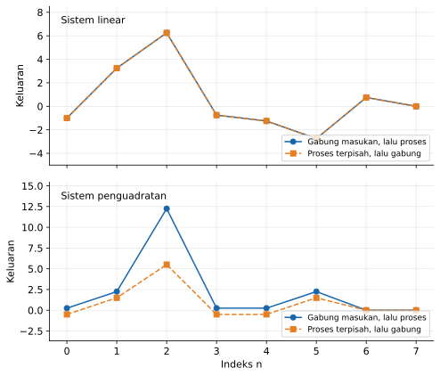

Garis yang menghubungkan titik-titik hanya membantu pembacaan deretan sampel. Keberhasilan beberapa uji numerik belum membuktikan linearitas untuk semua masukan, sehingga pembuktian aljabar tetap diperlukan.

### Invariansi waktu

Sistem invarian terhadap waktu, atau *time-invariant*, memiliki aturan yang tidak berubah ketika titik asal waktu digeser. Jika suatu masukan ditunda, keluarannya cukup ditunda dengan jumlah yang sama tanpa perubahan bentuk lainnya.

Ambil $y[n]=\mathcal{T}\{x\}[n]$ dan bentuk masukan yang digeser $x_s[n]=x[n-n_0]$. Dua jalur pengujian yang perlu dibandingkan adalah sebagai berikut.

```math
y_A[n]=\mathcal{T}\{x_s\}[n],
\qquad
y_B[n]=y[n-n_0].
```

Sistem invarian waktu jika $y_A[n]=y_B[n]$ untuk semua masukan dan semua pergeseran bilangan bulat $n_0$. Pengujian waktu-kontinu menggunakan langkah yang sama dengan mengganti $n$ dan $n_0$ menjadi $t$ dan $t_0$.

#### Contoh: penundaan dan penguatan yang berubah

Untuk rata-rata dua sampel, kedua jalur menghasilkan ekspresi yang sama. Perhitungan langsung memperlihatkan hubungan berikut.

```math
\begin{aligned}
y_A[n]&=\frac{x[n-n_0]+x[n-1-n_0]}{2},\\
y_B[n]&=\frac{x[n-n_0]+x[n-n_0-1]}{2}.
\end{aligned}
```

Untuk $y[n]=nx[n]$, indeks pada faktor penguatan harus diperlakukan sebagai bagian aturan sistem. Menggeser masukan saja tidak menggeser faktor tersebut, sedangkan menggeser keluaran menggeser seluruh ekspresinya.

```math
y_A[n]=n\,x[n-n_0],
\qquad
y_B[n]=(n-n_0)x[n-n_0].
```

Kedua hasil secara umum berbeda, sehingga sistem tersebut berubah terhadap waktu atau *time-varying*. Namun, sistem ini tetap linear terhadap $x$, karena faktor $n$ tidak bergantung pada amplitudo masukannya.

Sistem nonlinear $y[n]=x^2[n]$ justru invarian waktu karena kedua jalur menghasilkan $x^2[n-n_0]$. Karena itu, invariansi waktu tidak boleh disimpulkan hanya dari linearitas atau ketidaklinearan.

#### Eksperimen Python: urutan pergeseran dan pemrosesan

Program berikut mendefinisikan masukan sebagai fungsi indeks agar dapat dievaluasi pada indeks negatif maupun positif. Cara ini menghindari kekeliruan akibat menganggap batas larik (*array*) sebagai batas matematis sinyal.

```python
import numpy as np
import matplotlib.pyplot as plt


def x(n):
    return np.maximum(1.0 - np.abs(n) / 3.0, 0.0)


def rata_dua(sinyal, n):
    return 0.5 * (sinyal(n) + sinyal(n - 1))


def penguat_berubah(sinyal, n):
    return n * sinyal(n)


n = np.arange(-5, 11)
n0 = 3


def x_geser(n):
    return x(n - n0)


fig, axes = plt.subplots(2, 1, figsize=(7, 6), sharex=True)

for ax, sistem, nama in zip(
    axes,
    [rata_dua, penguat_berubah],
    ["Rata-rata dua sampel", "Penguatan y[n] = n x[n]"],
):
    jalur_a = sistem(x_geser, n)
    jalur_b = sistem(x, n - n0)
    galat = np.max(np.abs(jalur_a - jalur_b))
    print(f"{nama}: galat maksimum = {galat:.3e}")

    ax.plot(n, jalur_a, "o-", label="Geser masukan, lalu proses")
    ax.plot(n, jalur_b, "s--", label="Proses, lalu geser keluaran")
    ax.set_ylabel("Keluaran")
    ax.text(0.03, 0.94, nama, transform=ax.transAxes, va="top")
    ax.margins(y=0.3)
    ax.grid(True, alpha=0.3)
    ax.legend(loc="lower right", fontsize=9)

axes[-1].set_xlabel("Indeks n")
fig.tight_layout()
plt.show()
```

Skrip tersedia di [02_invariansi_waktu.py](../Kode/pertemuan-02/02_invariansi_waktu.py). Perhatikan bahwa kedua jalur pada sistem rata-rata berhimpit, sedangkan pada sistem penguatan yang berubah terhadap indeks keduanya berbeda.


### Sistem tanpa memori dan dengan memori

Sistem tanpa memori hanya menggunakan masukan pada waktu yang sama untuk menentukan keluaran sekarang. Penguat $y[n]=Kx[n]$ dan penguadratan $y[n]=x^2[n]$ sama-sama tanpa memori meskipun linearitasnya berbeda.

Sistem dengan memori menggunakan masukan pada waktu lain atau suatu keadaan internal yang menyimpan pengaruh masa lalu. Contoh paling sederhana adalah penunda $y[n]=x[n-1]$, yang memerlukan penyimpanan satu sampel.

Pada rangkaian ideal, resistor memenuhi $v(t)=Ri(t)$ sehingga hubungan arus-tegangannya tanpa memori. Kapasitor memenuhi hubungan berikut dan memerlukan informasi muatan atau tegangan awal.

```math
v(t)=v(t_0)+\frac{1}{C}\int_{t_0}^{t}i(\tau)\,d\tau.
```

Jika arus konstan $1\ \mathrm{mA}$ mengalir selama $2\ \mathrm{ms}$ pada kapasitor $10\ \mu\mathrm{F}$, kenaikan tegangannya adalah $0.2\ \mathrm{V}$. Tegangan akhir tetap bergantung pada tegangan awal, sehingga arus sekarang saja tidak cukup untuk menentukannya.

### Kausalitas

Sistem kausal menentukan keluaran sekarang menggunakan masukan sekarang, masukan masa lalu, dan keadaan awal yang telah diketahui. Sistem nonkausal memerlukan setidaknya satu masukan masa depan untuk menentukan suatu keluaran.

Definisi yang teliti membandingkan dua masukan yang sama hingga indeks $n_{\star}$. Dengan keadaan awal yang sama, sistem kausal harus menghasilkan keluaran yang sama pada $n_{\star}$ meskipun kedua masukan berbeda setelah waktu itu.

| Aturan sistem | Memori | Kausalitas | Informasi yang diperlukan |
|---|---|---|---|
| $y[n]=2x[n]$ | Tanpa memori | Kausal | Sampel sekarang |
| $y[n]=x[n-2]$ | Dengan memori | Kausal | Dua sampel sebelumnya |
| $y[n]=x[n+1]$ | Dengan memori | Nonkausal | Sampel berikutnya |
| $y[n]=(x[n-1]+x[n]+x[n+1])/3$ | Dengan memori | Nonkausal | Sampel sebelum, sekarang, dan sesudah |
| $y[n]=x[-n]$ pada seluruh $\mathbb{Z}$ | Dengan memori | Nonkausal | Untuk $n<0$, indeks $-n$ berada di masa depan |

#### Pengolahan langsung dan rekaman lengkap

Sistem nonkausal dapat digunakan untuk mengolah rekaman yang seluruh sampelnya sudah tersedia. Kausalitas membatasi ketersediaan informasi pada waktu keluaran diminta, bukan melarang perhitungan setelah pengukuran selesai.

Misalkan $v[n]=(x[n-1]+x[n]+x[n+1])/3$ adalah rata-rata simetris. Nilai itu dapat dihitung setelah satu sampel berikutnya datang, sehingga sistem baru dengan keluaran tertunda $y[n]=v[n-1]$ menjadi kausal.

```math
y[n]=\frac{x[n-2]+x[n-1]+x[n]}{3}.
```

Perubahan ini menyertakan keterlambatan satu sampel pada informasi yang ditampilkan. Keluaran pada indeks $n$ sekarang merepresentasikan rata-rata yang berpusat pada indeks $n-1$.

#### Eksperimen Python: mengubah masa depan masukan

Kedua masukan dalam program berikut sama sampai indeks tujuh dan berbeda mulai indeks delapan. Kita memeriksa apakah perubahan tersebut memengaruhi keluaran pada indeks tujuh untuk rata-rata kausal dan rata-rata simetris.

```python
import numpy as np
import matplotlib.pyplot as plt


def kausal(x):
    z = np.pad(x, (2, 0))
    return (z[2:] + z[1:-1] + z[:-2]) / 3


def terpusat(x):
    z = np.pad(x, (1, 1))
    return (z[:-2] + z[1:-1] + z[2:]) / 3


n = np.arange(16)
n0 = 7
x1 = np.sin(0.4 * n)
x2 = x1.copy()
x2[n > n0] += 2.0

fig, axes = plt.subplots(3, 1, figsize=(8, 8), sharex=True)
axes[0].plot(n, x1, 'o-', label='Masukan 1')
axes[0].plot(n, x2, 's--', label='Masukan 2')
axes[0].set_title('Kedua masukan identik sampai n = 7')

for ax, fungsi, nama in zip(axes[1:], [kausal, terpusat],
                          ['Rata-rata kausal', 'Rata-rata terpusat']):
    y1, y2 = fungsi(x1), fungsi(x2)
    beda = np.flatnonzero(~np.isclose(y1, y2))
    print(nama, ': keluaran pertama berbeda pada n =', beda[0])
    ax.plot(n, y1, 'o-', label='Keluaran 1')
    ax.plot(n, y2, 's--', label='Keluaran 2')
    ax.set_title(nama)

for ax in axes:
    ax.axvline(n0, color='gray', linestyle=':', label='Batas n = 7')
    ax.set_ylabel('Amplitudo')
    ax.grid(alpha=0.3)
    ax.legend(loc='upper left', fontsize=8)
axes[-1].set_xlabel('Indeks n')
fig.tight_layout()
plt.show()
```

Skrip tersedia di [03_memori_kausalitas.py](../Kode/pertemuan-02/03_memori_kausalitas.py). Pada titik pengujian, keluaran rata-rata kausal tidak berubah, sedangkan rata-rata simetris sudah terpengaruh oleh sampel masa depan.

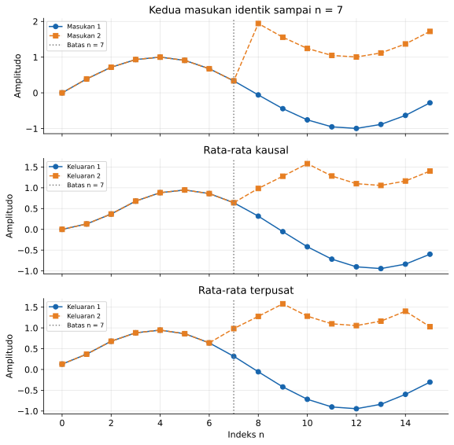

### Invertibilitas

Sistem invertibel memungkinkan masukan dipulihkan secara unik dari keluarannya pada kelas masukan yang dinyatakan. Jika dua masukan berbeda menghasilkan keluaran yang sama, informasi telah hilang dan invers yang unik tidak tersedia pada kelas tersebut.

Untuk $y[n]=Kx[n]$ dengan $K\ne0$, inversnya adalah $x[n]=y[n]/K$. Untuk penunda $y[n]=x[n-1]$ pada deretan dua sisi, inversnya adalah $x[n]=y[n+1]$, sehingga invers yang ada secara matematis belum tentu kausal.

Sistem $y[n]=x^2[n]$ tidak invertibel pada seluruh sinyal real karena masukan satu dan minus satu memberikan keluaran yang sama. Jika masukannya dibatasi nonnegatif, invers $x[n]=\sqrt{y[n]}$ menjadi unik.

#### Contoh: nilai awal dalam rekonstruksi selisih pertama

Sistem $d[n]=x[n]-x[n-1]$ menghilangkan komponen konstan pada deretan dua sisi. Namun, jika $x[-1]$ diketahui dan pemulihan dimulai pada $n=0$, rekonstruksi berurutan dapat dilakukan.

```math
x[n]=x[n-1]+d[n]
=x[-1]+\sum_{k=0}^{n}d[k].
```

Ambil $x[-1]=10$ dan deretan selisih $d[0]=2$, $d[1]=-1$, serta $d[2]=3$. Hasilnya adalah $x[0]=12$, $x[1]=11$, dan $x[2]=14$.

Jika nilai awal dinaikkan menjadi $20$, hasil pemulihan menjadi $22$, $21$, dan $24$. Dengan demikian, invertibilitas harus dinilai bersama kelas sinyal dan informasi batas yang tersedia.

### Stabilitas BIBO

BIBO merupakan singkatan dari *bounded-input bounded-output*, yaitu masukan terbatas menghasilkan keluaran terbatas. Sistem stabil BIBO jika setiap masukan yang memiliki batas amplitudo berhingga menghasilkan keluaran yang juga memiliki batas amplitudo berhingga pada seluruh waktu pengamatan.

Dalam notasi matematis, definisi tersebut dinyatakan sebagai implikasi berikut. Konstanta batas keluaran tidak boleh tumbuh tanpa batas ketika rentang waktu pengamatan diperpanjang.

```math
|x[n]|\le M_x<\infty
\quad\Longrightarrow\quad
|y[n]|\le M_y<\infty.
```

Untuk sistem dinamis, stabilitas BIBO sebagai pemetaan masukan-keluaran biasanya diperiksa dengan keadaan awal nol. Perilaku akibat keadaan awal tak nol tetap perlu diperiksa tersendiri ketika menilai suatu realisasi fisis.

#### Contoh sistem stabil

Jika $y[n]=3x[n]-2x[n-1]$, pertidaksamaan segitiga memberikan batas yang berlaku bagi setiap masukan terbatas. Besar batas tersebut dihitung sebagai berikut.

```math
|y[n]|\le3|x[n]|+2|x[n-1]|\le5M_x.
```

Untuk $M_x=2$, kita dapat mengambil $M_y=10$. Batas ini tidak menyatakan bahwa setiap masukan akan menghasilkan amplitudo sepuluh, tetapi menjamin keluaran tidak melampauinya.

Sistem penguadratan juga stabil BIBO karena $|y[n]|\le M_x^2$. Jadi, stabilitas BIBO tidak mensyaratkan linearitas dan tidak berarti amplitudo keluaran harus lebih kecil daripada amplitudo masukan.

#### Contoh sistem tidak stabil

Akumulator dengan keadaan awal nol memenuhi $y[n]=y[n-1]+x[n]$ dan $y[-1]=0$. Untuk masukan unit step $x[n]=u[n]$, keluaran berturut-turut adalah $1,2,3,\ldots$, sehingga $y[n]=n+1$ pada $n\ge0$.

Masukannya dibatasi satu, tetapi keluarannya terus bertambah tanpa batas. Satu contoh penyangkal ini cukup untuk membuktikan bahwa akumulator tersebut tidak stabil BIBO.

Kestabilan tidak dapat dibuktikan hanya karena grafik selama beberapa puluh sampel tampak terbatas. Bukti stabilitas harus menjamin batas keluaran untuk semua waktu yang termasuk dalam definisi sistem.

### Sistem linear time-invariant dan hubungan antarsifat

Sistem **linear time-invariant**, disingkat LTI, memenuhi linearitas dan invariansi waktu sekaligus. Kausalitas, memori, invertibilitas, dan stabilitas tetap merupakan sifat tambahan yang tidak otomatis mengikuti singkatan tersebut.

Tabel berikut merangkum beberapa sistem pada deretan real dua sisi. Invertibilitas dinilai tanpa informasi batas tambahan, sehingga hasilnya dapat berubah jika kelas masukan dipersempit.

| Sistem | Linear | Invarian waktu | Kausal | Stabil BIBO | Invertibel |
|---|:---:|:---:|:---:|:---:|:---:|
| $2x[n]$ | Ya | Ya | Ya | Ya | Ya |
| $2x[n]+3$ | Tidak | Ya | Ya | Ya | Ya |
| $x^2[n]$ | Tidak | Ya | Ya | Ya | Tidak |
| $nx[n]$ | Ya | Tidak | Ya | Tidak | Tidak |
| $x[n+1]$ | Ya | Ya | Tidak | Ya | Ya |
| $x[n]-x[n-1]$ | Ya | Ya | Ya | Ya | Tidak |

Pada sistem $nx[n]$, nilai masukan di indeks nol selalu dikalikan nol, sehingga tidak dapat dipulihkan. Pada sistem selisih pertama, komponen konstan hilang, sesuai contoh rekonstruksi yang memerlukan nilai awal.

---

## Komponen dasar sistem waktu-diskret

Setelah mengetahui sifat suatu aturan, kita perlu menyatakan operasi yang harus dilakukan untuk menghitung keluarannya. Diagram blok membantu memperlihatkan aliran data, pengalian, penjumlahan, serta penyimpanan nilai antarsampel.

### Penjumlah dan pengali

Penjumlah menggabungkan dua atau lebih sinyal pada indeks yang sama. Pengali konstanta mengubah amplitudo sebuah sinyal tanpa mengubah indeks waktunya.

```math
w[n]=v_1[n]+v_2[n],
\qquad
z[n]=Kv[n].
```

Sebagai contoh, dua masukan bernilai $2$ dan $-0.5$ menghasilkan keluaran penjumlah $1.5$. Jika hasil tersebut masuk ke pengali $K=4$, keluarannya menjadi $6$.

Pengali sinyal mengalikan dua nilai sinyal pada indeks yang sama, yaitu $w[n]=v_1[n]v_2[n]$. Operasi ini berbeda dari pengali konstanta karena kedua faktornya dapat berubah terhadap waktu.

Jika kedua faktor dipandang sebagai masukan bebas, pengali sinyal tidak linear terhadap pasangan masukan karena penskalaan keduanya menghasilkan faktor skala kuadrat. Jika salah satu faktor telah ditetapkan sebagai sinyal referensi $r[n]$, pemetaan $x[n]\mapsto r[n]x[n]$ linear terhadap $x$, tetapi umumnya berubah terhadap waktu jika $r[n]$ tidak konstan.

### Unit delay dan unit advance

Penunda satu sampel atau *unit delay* menghasilkan $w[n]=v[n-1]$. Penunda ini membutuhkan memori, karena nilai pada waktu sebelumnya harus disimpan sampai pembaruan berikutnya.

Operator $D$ digunakan untuk menyatakan penundaan, sehingga $Dv[n]=v[n-1]$ dan $D^kv[n]=v[n-k]$. Simbol $z^{-1}$ yang sering muncul pada diagram berarti penundaan yang sama dan akan dihubungkan dengan transformasi Z pada pertemuan keenam.

Operasi kebalikannya adalah pemaju satu sampel atau *unit advance*, yaitu $w[n]=v[n+1]$. Operasi ini nonkausal jika keluaran diminta pada saat $n$, karena sampel berikutnya belum tersedia.

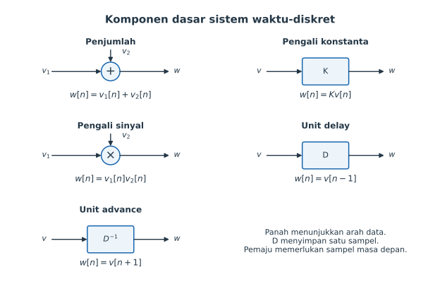

Setiap panah pada gambar menunjukkan arah pemakaian data. Titik percabangan pada diagram selanjutnya menyalin nilai ke beberapa jalur, bukan membagi amplitudo sinyal menjadi beberapa bagian.

### Diagram blok nonrekursif

Rata-rata tiga sampel dapat dibentuk dengan dua penunda dan tiga pengali konstanta. Masing-masing jalur membawa $x[n]$, $x[n-1]$, dan $x[n-2]$ ke penjumlah.

```math
y[n]=\frac13x[n]+\frac13x[n-1]+\frac13x[n-2].
```


Diagram ini tidak mengembalikan keluaran ke operasi sebelumnya. Keluaran dihitung hanya dari masukan sekarang dan masukan lama, sehingga bentuk implementasinya disebut nonrekursif.

### Diagram blok dengan umpan balik

Contoh berikut menggabungkan masukan sekarang, satu masukan lama, dan satu keluaran lama. Koefisiennya dipilih sama dengan contoh diagram pada bagian 3.1 buku agar hubungan gambar dan persamaannya mudah dibandingkan.

```math
y[n]=0.25y[n-1]+0.5x[n]+0.5x[n-1].
```

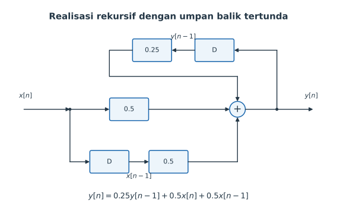

Umpan balik melewati penunda, sehingga $y[n-1]$ sudah diketahui ketika $y[n]$ dihitung. Isi awal kedua penunda adalah $x[-1]$ dan $y[-1]$ jika penghitungan dimulai pada $n=0$.

Misalkan $x[-1]=y[-1]=0$, $x[0]=2$, dan $x[1]=0$. Keluaran pertama adalah $y[0]=1$, sedangkan keluaran berikutnya adalah $y[1]=0.25(1)+0.5(0)+0.5(2)=1.25$.

Keluaran tetap ada ketika masukan sekarang sudah nol karena penunda masih menyimpan nilai lama. Pada setiap pembaruan, nilai lama harus digunakan terlebih dahulu sebelum isi penyimpanan diganti dengan nilai yang baru.

---

## Persamaan selisih

Diagram blok menunjukkan jalur aliran data, sedangkan persamaan selisih menyatakan hubungan antarsampel secara aljabar. Keduanya merupakan dua representasi dari aturan pengolahan yang sama, sehingga kita dapat berpindah dari gambar ke persamaan atau sebaliknya.

Persamaan selisih berperan dalam sistem waktu-diskret sebagaimana persamaan diferensial berperan dalam sistem waktu-kontinu. Perbedaannya adalah hubungan waktu pada persamaan selisih dinyatakan melalui pergeseran indeks, bukan turunan terhadap waktu kontinu.

### Bentuk umum dan orde persamaan

Salah satu bentuk yang sering digunakan adalah persamaan selisih linear berkoefisien konstan. Dengan $a_0\ne0$, bentuk tersebut dapat dituliskan sebagai berikut.

```math
\sum_{k=0}^{N}a_k y[n-k]
=\sum_{k=0}^{M}b_k x[n-k].
```

Koefisien $a_k$ dan $b_k$ menentukan pengaruh setiap sampel pada hubungan masukan-keluaran. Jika $a_N\ne0$ dan $N\ge1$, persamaan tersebut berorde $N$ terhadap keluaran dan umumnya membutuhkan $N$ nilai awal keluaran untuk dihitung maju.

Untuk implementasi, keluaran sekarang dipisahkan dari semua besaran yang sudah diketahui. Hasilnya adalah aturan komputasi berikut.

```math
\boxed{
y[n]=\frac{1}{a_0}
\left(\sum_{k=0}^{M}b_kx[n-k]
-\sum_{k=1}^{N}a_ky[n-k]\right).
}
```

Tanda negatif pada jumlah keluaran lama berasal dari pemindahan ruas. Karena itu, persamaan $y[n]-0.75y[n-1]+0.125y[n-2]=x[n]$ menggunakan kontribusi $+0.75y[n-1]$ dan $-0.125y[n-2]$ ketika dihitung maju.

Untuk bentuk di atas, masukan hanya muncul pada indeks sekarang atau masa lalu. Dengan keadaan awal yang ditentukan tanpa menggunakan masukan masa depan, realisasi komputasinya bersifat kausal.

### Sistem nonrekursif dan rekursif

Sistem **nonrekursif** menghitung keluaran tanpa menggunakan keluaran sebelumnya. Dalam bentuk umum tadi, semua $a_k$ untuk $k\ge1$ bernilai nol, tetapi koefisien $a_0$ tetap tidak nol.

```math
y[n]=\frac{1}{a_0}\sum_{k=0}^{M}b_kx[n-k].
```

Sistem **rekursif** menggunakan paling sedikit satu keluaran lama dalam perhitungan keluaran sekarang. Kehadiran umpan balik membuat nilai keluaran membawa pengaruh keadaan dari langkah sebelumnya.

```math
y[n]=0.8y[n-1]+0.2x[n].
```

Nonrekursif tidak berarti tanpa memori, karena $y[n]=x[n]+x[n-1]$ tetap memerlukan penyimpanan masukan lama. Rekursif juga tidak otomatis berarti tidak stabil, karena kestabilan bergantung pada koefisien dan struktur hubungan tersebut.

Pada pertemuan berikutnya, bentuk nonrekursif dengan jumlah tap berhingga akan dikaitkan dengan respons impuls berhingga atau FIR. Namun, istilah rekursif menjelaskan cara menghitung, sehingga tidak boleh selalu disamakan dengan respons impuls tak berhingga tanpa memeriksa persamaan dan kemungkinan pembatalannya.

### Kondisi awal dan keadaan diam awal

Jika penghitungan dimulai pada $n=0$, persamaan berorde $N$ membutuhkan riwayat $y[-1],\ldots,y[-N]$. Jika ruas masukan memuat penundaan, nilai $x[-1],\ldots,x[-M]$ juga harus diketahui atau diasumsikan.

**Keadaan diam awal** berarti elemen penyimpanan yang relevan mula-mula bernilai nol. Pada realisasi langsung dengan riwayat masukan dan keluaran, kita dapat menetapkan seluruh riwayat tersebut nol sebelum awal pengamatan.

Sebagai contoh, persamaan $y[n]=0.5y[n-1]+x[n]$ menghasilkan $y[0]=1$ untuk $x[0]=1$ dan $y[-1]=0$. Masukan yang sama menghasilkan $y[0]=3$ jika $y[-1]=4$, sehingga persamaan tanpa kondisi awal belum menentukan keluaran secara unik.

Persamaan linear berkoefisien konstan dengan pemetaan keadaan-nol menghasilkan sistem LTI. Akan tetapi, jika keadaan awal tak nol dipertahankan sebagai tambahan tetap ketika masukan diubah, pemetaan dari masukan saja umumnya bersifat afin, bukan linear, karena masukan nol masih menghasilkan keluaran.

#### Contoh nonrekursif: rata-rata tiga sampel

Gunakan $y[n]=(x[n]+x[n-1]+x[n-2])/3$ dengan riwayat masukan nol. Untuk masukan pada tabel, perhitungan menunjukkan bahwa keluaran masih dapat muncul setelah masukan sekarang kembali nol.

| $n$ | $x[n]$ | $x[n-1]$ | $x[n-2]$ | $y[n]$ |
|---:|---:|---:|---:|---:|
| 0 | 3 | 0 | 0 | 1 |
| 1 | 6 | 3 | 0 | 3 |
| 2 | 0 | 6 | 3 | 3 |
| 3 | −3 | 0 | 6 | 1 |
| 4 | 0 | −3 | 0 | −1 |
| 5 | 0 | 0 | −3 | −1 |
| 6 | 0 | 0 | 0 | 0 |

Pada $n=4$, misalnya, keluaran adalah $(0-3+0)/3=-1$. Sesudah dua sampel nol tambahan melewati penyimpanan, pengaruh masukan lama habis dan keluaran kembali nol.

#### Contoh rekursif: perhitungan orde dua

Tinjau persamaan berikut untuk $n\ge0$, dengan $y[-1]=1$ dan $y[-2]=0$. Masukannya adalah $x[n]=(1/2)^n$ pada interval penghitungan tersebut.

```math
y[n]-\frac34y[n-1]+\frac18y[n-2]
=\left(\frac12\right)^n.
```

Aturan maju diperoleh dengan memindahkan kedua suku keluaran lama ke ruas kanan. Dengan mengganti indeks secara berurutan, kita mendapatkan tiga nilai awal berikut.

```math
\begin{aligned}
y[0]&=1+\frac34(1)-\frac18(0)=\frac74=1.75,\\
y[1]&=\frac12+\frac34\left(\frac74\right)-\frac18(1)
=\frac{27}{16}=1.6875,\\
y[2]&=\frac14+\frac34\left(\frac{27}{16}\right)
-\frac18\left(\frac74\right)
=\frac{83}{64}=1.296875.
\end{aligned}
```

Perhitungan tidak dapat dilompati dengan menganggap semua keluaran lama nol. Nilai $y[-1]=1$ merupakan bagian dari masalah dan memengaruhi setiap langkah berikutnya.

### Penyelesaian numerik dengan Python

Program berikut mengimplementasikan bentuk umum tanpa fungsi filter siap pakai. Riwayat disimpan dari nilai paling baru ke paling lama, sehingga elemen pertama selalu mewakili indeks $n-1$.

```python
import numpy as np
import matplotlib.pyplot as plt


def persamaan_selisih(x, a, b, y_awal=None, x_awal=None):
    x = np.asarray(x, dtype=float)
    a = np.asarray(a, dtype=float)
    b = np.asarray(b, dtype=float)
    if a.ndim != 1 or b.ndim != 1 or len(a) == 0 or len(b) == 0:
        raise ValueError('a dan b harus berupa vektor yang tidak kosong')
    if a[0] == 0 or x.ndim != 1:
        raise ValueError('a[0] harus tidak nol dan x harus berupa vektor')
    ny, nx = len(a) - 1, len(b) - 1
    yh = np.zeros(ny) if y_awal is None else np.array(y_awal, dtype=float)
    xh = np.zeros(nx) if x_awal is None else np.array(x_awal, dtype=float)
    if yh.shape != (ny,) or xh.shape != (nx,):
        raise ValueError('Panjang riwayat tidak sesuai dengan koefisien')
    y = np.zeros(len(x))
    for n in range(len(x)):
        maju = b[0] * x[n] + np.dot(b[1:], xh)
        balik = np.dot(a[1:], yh)
        y[n] = (maju - balik) / a[0]
        if ny:
            yh[1:] = yh[:-1].copy()
            yh[0] = y[n]
        if nx:
            xh[1:] = xh[:-1].copy()
            xh[0] = x[n]
    return y


n = np.arange(21)
x = 0.5**n
y = persamaan_selisih(x, [1, -0.75, 0.125], [1], y_awal=[1, 0])
y_rumus = (1 + 2 * n) * 0.5**n + 0.75 * 0.25**n
print('Tiga keluaran pertama:', y[:3])
print('Galat maksimum:', np.max(np.abs(y - y_rumus)))
assert np.allclose(y, y_rumus)

fig, ax = plt.subplots(figsize=(8, 4))
ax.plot(n, y, 'o', label='Iterasi persamaan selisih')
ax.plot(n, y_rumus, '--', label='Solusi analitis')
ax.set(xlabel='Indeks n', ylabel='Keluaran y[n]',
       title='Orde dua dengan kondisi awal y[-1] = 1, y[-2] = 0')
ax.grid(alpha=0.3)
ax.legend()
fig.tight_layout()
plt.show()
```

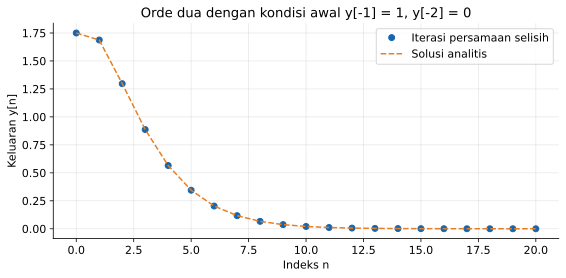

Program mandiri tersedia di [04_persamaan_selisih.py](../Kode/pertemuan-02/04_persamaan_selisih.py). Nilai numeriknya akan dibandingkan dengan rumus analitis yang diturunkan pada bagian berikut, sehingga kedua pendekatan saling memeriksa.

### Solusi homogen dan persamaan karakteristik

Solusi homogen diperoleh dengan meniadakan ruas pemaksa pada persamaan selisih. Untuk persamaan berkoefisien konstan, kita mencoba bentuk eksponensial $y_h[n]=Cr^n$ dan mencari nilai $r$ yang memungkinkan solusi tak nol.

```math
a_0y_h[n]+a_1y_h[n-1]+\cdots+a_Ny_h[n-N]=0.
```

Untuk akar tak nol, substitusi dan pembagian dengan $Cr^{n-N}$ memberikan persamaan karakteristik. Penanganan akar nol dapat dilakukan langsung melalui rekurensi tanpa membagi dengan pangkat nol.

```math
a_0r^N+a_1r^{N-1}+\cdots+a_N=0.
```

Jika terdapat $N$ akar berbeda $r_1,\ldots,r_N$, solusi homogen merupakan kombinasi semua mode akar. Konstanta dalam kombinasi tersebut selanjutnya ditentukan dari kondisi awal, bukan dari akar saja.

```math
y_h[n]=C_1r_1^n+C_2r_2^n+\cdots+C_Nr_N^n.
```

#### Contoh akar berbeda

Ambil persamaan homogen yang berkorespondensi dengan contoh orde dua. Persamaan karakteristiknya dapat difaktorkan tanpa pendekatan numerik.

```math
r^2-\frac34r+\frac18
=\left(r-\frac12\right)\left(r-\frac14\right)=0.
```

Dengan demikian, $y_h[n]=C_1(1/2)^n+C_2(1/4)^n$. Sebagai contoh terpisah, jika rekurensi homogen dijalankan untuk $n\ge2$ dengan $y[0]=2$ dan $y[1]=3/4$, kedua konstanta diperoleh dari persamaan berikut.

```math
C_1+C_2=2,
\qquad
\frac12C_1+\frac14C_2=\frac34.
```

Penyelesaiannya adalah $C_1=C_2=1$, sehingga $y[n]=(1/2)^n+(1/4)^n$. Kedua mode mengecil karena besar masing-masing akar kurang dari satu.

#### Contoh akar berulang

Jika suatu akar $r$ berulang $m$ kali, satu eksponensial saja tidak menyediakan cukup solusi yang bebas. Mode yang terkait dengan akar itu menjadi $(C_0+C_1n+\cdots+C_{m-1}n^{m-1})r^n$.

Untuk $y[n]-y[n-1]+\tfrac14y[n-2]=0$, persamaan karakteristiknya adalah $(r-1/2)^2=0$. Dengan $y[0]=1$ dan $y[1]=1$, substitusi pada bentuk solusi menghasilkan hasil berikut.

```math
y[n]=(C_0+C_1n)\left(\frac12\right)^n,
\qquad
C_0=1,\quad \frac{1+C_1}{2}=1,
\qquad
y[n]=(1+n)\left(\frac12\right)^n.
```

Untuk akar kompleks berkonjugat $r=\rho e^{\pm j\theta}$ pada persamaan berkoefisien real, pasangan mode dapat digabungkan menjadi bentuk real. Hasilnya adalah $\rho^n(C\cos n\theta+D\sin n\theta)$, yang memperlihatkan osilasi beserta selubung amplitudonya.

### Solusi partikular dan pengaruh bentuk masukan

Solusi partikular $y_p[n]$ adalah satu solusi yang memenuhi persamaan lengkap dengan ruas pemaksa yang diberikan. Solusi umum kemudian ditulis sebagai $y[n]=y_h[n]+y_p[n]$, dan kondisi awal diterapkan pada jumlah tersebut.

Metode koefisien tak tentu memilih bentuk percobaan yang sejenis dengan ruas pemaksa. Tabel berikut memberikan pilihan awal yang lazim, selama bentuk itu tidak bertumpang tindih dengan solusi homogen.

| Ruas pemaksa | Bentuk percobaan solusi partikular |
|---|---|
| Konstanta $K$ | Konstanta $A$ |
| Polinom berderajat $p$ | Polinom umum berderajat $p$ |
| $Kc^n$ | $Ac^n$ |
| $K\cos(\omega n)$ atau $K\sin(\omega n)$ | $A\cos(\omega n)+B\sin(\omega n)$ |
| $c^n\cos(\omega n)$ atau $c^n\sin(\omega n)$ | $c^n[A\cos(\omega n)+B\sin(\omega n)]$ |

Jika bentuk percobaan bertumpang tindih dengan mode homogen, bentuk tersebut dikalikan dengan $n^m$, dengan $m$ sesuai banyaknya pengulangan akar terkait. Langkah ini diperlukan agar bentuk percobaan tidak kembali menghasilkan nol ketika dimasukkan ke operator homogen.

#### Contoh lengkap: masukan eksponensial yang berimpit dengan akar

Kembali ke persamaan dengan masukan $(1/2)^n$ dan riwayat $y[-1]=1$, $y[-2]=0$. Karena $1/2$ merupakan akar karakteristik sederhana, bentuk $K(1/2)^n$ gagal dan harus diganti dengan $y_p[n]=Kn(1/2)^n$.

```math
\begin{aligned}
y_p[n]-\frac34y_p[n-1]+\frac18y_p[n-2]
&=K\left(\frac12\right)^n
\left[n-\frac32(n-1)+\frac12(n-2)\right]\\
&=\frac K2\left(\frac12\right)^n.
\end{aligned}
```

Penyamaan dengan ruas kanan memberikan $K=2$. Solusi umum sekarang memuat dua konstanta yang harus memenuhi kondisi awal semula.

```math
y[n]=(A+2n)\left(\frac12\right)^n+B\left(\frac14\right)^n.
```

Nilai rumus pada $n=-1$ dan $n=-2$ digunakan untuk menyambungkan solusi dengan riwayat yang diberikan. Substitusinya memberikan sistem persamaan berikut.

```math
2(A-2)+4B=1,
\qquad
4(A-4)+16B=0.
```

Hasilnya adalah $A=1$ dan $B=3/4$. Jadi, solusi untuk $n\ge0$ dapat ditulis dalam bentuk tertutup berikut.

```math
\boxed{
y[n]=(1+2n)\left(\frac12\right)^n
+\frac34\left(\frac14\right)^n.
}
```

Substitusi $n=0,1,2$ menghasilkan $7/4$, $27/16$, dan $83/64$, sama dengan perhitungan maju. Faktor $n$ tidak mencegah peluruhan jangka panjang, karena eksponensial $(1/2)^n$ tetap mendominasi pertumbuhan faktor polinomial tersebut.

#### Contoh solusi partikular sinusoidal

Sekarang gunakan ruas pemaksa $2\sin(\pi n/2)$ pada operator orde dua yang sama. Kita mencoba $y_p[n]=C\cos(\pi n/2)+D\sin(\pi n/2)$, karena pergeseran indeks pada sinusoid menghasilkan kombinasi sinus dan kosinus.

Tuliskan $c_n=\cos(\pi n/2)$ dan $s_n=\sin(\pi n/2)$. Pergeseran satu dan dua sampel memberikan hubungan berikut.

```math
y_p[n-1]=Cs_n-Dc_n,
\qquad
y_p[n-2]=-Cc_n-Ds_n.
```

Setelah suku kosinus dan sinus dikumpulkan, koefisiennya harus sama dengan ruas kanan. Kita memperoleh dua persamaan aljabar berikut.

```math
\frac78C+\frac34D=0,
\qquad
-\frac34C+\frac78D=2.
```

Penyelesaiannya adalah $C=-96/85$ dan $D=112/85$. Solusi lengkap masih harus ditambah $A(1/2)^n+B(1/4)^n$, dengan $A$ dan $B$ ditentukan setelah kondisi awal diberikan.

### Respons masukan-nol dan respons keadaan-nol

Pembagian solusi menjadi homogen dan partikular berguna untuk menyelesaikan persamaan. Namun, pembagian tersebut berbeda dari pemisahan respons berdasarkan sumber pengaruh fisiknya, yaitu keadaan awal dan masukan luar.

**Respons masukan-nol** diperoleh dengan meniadakan masukan tetapi mempertahankan keadaan awal. **Respons keadaan-nol** diperoleh dengan meniadakan keadaan awal tetapi mempertahankan masukan yang diberikan.

Untuk sistem linear, kedua respons tersebut dapat dijumlahkan untuk memperoleh respons total. Pembagian ini memiliki makna kondisi awal yang tegas, sedangkan pilihan solusi partikular tidak unik karena dapat ditambah dengan suatu solusi homogen.

Tinjau $y[n]=ay[n-1]+bx[n]$ untuk $n\ge0$, dengan $y[-1]=q$. Substitusi berulang memberikan bentuk berikut.

```math
\begin{aligned}
y[0]&=aq+bx[0],\\
y[1]&=a^2q+abx[0]+bx[1],\\
y[n]&=\underbrace{a^{n+1}q}_{\text{masukan-nol}}
+\underbrace{b\sum_{k=0}^{n}a^{n-k}x[k]}_{\text{keadaan-nol}}.
\end{aligned}
```

Ambil $a=1/2$, $b=1$, dan $x[n]=1$ untuk $n\ge0$. Respons keadaan-nolnya merupakan jumlah geometri, sehingga hasilnya dapat dihitung secara eksplisit.

```math
y_{\mathrm{KN}}[n]=2\left[1-\left(\frac12\right)^{n+1}\right],
\qquad
y_{\mathrm{MN}}[n]=q\left(\frac12\right)^{n+1}.
```

Solusi partikular konstan untuk masukan tersebut adalah $y_p[n]=2$. Solusi partikular ini bukan respons keadaan-nol, karena respons keadaan-nol juga mengandung suku sementara $-2(1/2)^{n+1}$ untuk memenuhi keadaan awal nol.

Jika $q=3$, respons total menjadi $y[n]=2+(1/2)^{n+1}$. Tiga nilai pertamanya adalah $2.5$, $2.25$, dan $2.125$, lalu keluaran mendekati dua.

```python
import numpy as np
import matplotlib.pyplot as plt


def orde_satu(x, a, b, q):
    y = np.zeros(len(x))
    lama = float(q)
    for n in range(len(x)):
        y[n] = a * lama + b * x[n]
        lama = y[n]
    return y


n = np.arange(13)
a, b, q = 0.5, 1.0, 3.0
x = np.ones(len(n))
y_total = orde_satu(x, a, b, q)
y_mn = q * a**(n + 1)
y_kn = b * (1 - a**(n + 1)) / (1 - a)
print('Tiga keluaran pertama:', y_total[:3])
assert np.allclose(y_total, y_mn + y_kn)
assert np.allclose(y_mn, orde_satu(np.zeros(len(n)), a, b, q))
assert np.allclose(y_kn, orde_satu(x, a, b, 0))

fig, ax = plt.subplots(figsize=(8, 4.7))
ax.plot(n, y_total, 'o-', label='Respons total, q = 3')
ax.plot(n, y_mn, 's-', label='Respons masukan-nol')
ax.plot(n, y_kn, '^-', label='Respons keadaan-nol')
ax.axhline(2, color='gray', linestyle='--', label='Solusi partikular = 2')
ax.set(xlabel='Indeks n', ylabel='Keluaran',
       title='Respons keadaan-nol tidak sama dengan solusi partikular')
ax.grid(alpha=0.3)
ax.legend(loc='center right', fontsize=9)
fig.tight_layout()
plt.show()
```

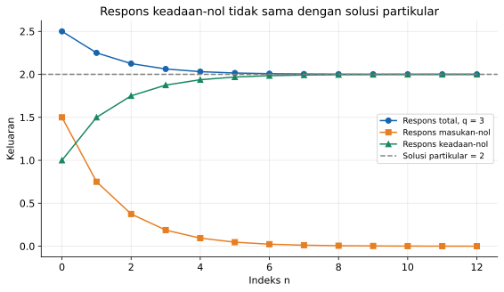

Program [05_solusi_dan_kondisi_awal.py](../Kode/pertemuan-02/05_solusi_dan_kondisi_awal.py) membandingkan rumus dan iterasi secara langsung. Garis solusi partikular ditampilkan terpisah untuk menegaskan bahwa ia tidak sama dengan kurva respons keadaan-nol pada awal pengamatan.

### Hubungan koefisien dengan stabilitas

Untuk sistem orde satu $y[n]=ay[n-1]+bx[n]$ dalam keadaan awal nol, bentuk jumlah tadi memberikan cara langsung menguji BIBO. Jika $|x[n]|\le M_x$ dan $|a|<1$, batas keluaran memenuhi ketaksamaan berikut.

```math
|y[n]|
\le |b|M_x\sum_{k=0}^{n}|a|^{n-k}
\le\frac{|b|M_x}{1-|a|}.
```

Sebagai contoh, $a=0.8$ dan $b=0.2$ memberikan batas $|y[n]|\le M_x$. Keadaan awal berhingga menambahkan suku $a^{n+1}q$ yang juga terbatas dan meluruh ketika $|a|<1$.

Untuk $b\ne0$, nilai $|a|\ge1$ pada sistem orde satu tersebut tidak memberikan kestabilan BIBO keadaan-nol. Masukan impuls sudah menunjukkan pertumbuhan jika $|a|>1$, sedangkan untuk $a=1$ masukan konstan menghasilkan akumulasi dan untuk $a=-1$ masukan berganti tanda dapat menghasilkan pertumbuhan amplitudo.

Kestabilan sistem berorde lebih tinggi akan dipelajari kembali melalui respons impuls dan transformasi Z. Pada tahap ini, yang penting adalah membedakan peluruhan keadaan awal, kestabilan BIBO, dan hasil simulasi berhingga, karena ketiganya bukan pernyataan yang identik.

---

## Konversi sinyal analog menjadi digital

Persamaan selisih mengolah deretan bilangan, sedangkan banyak sumber informasi di dunia nyata menghasilkan tegangan yang berubah secara kontinu. Karena itu, sebelum pengolahan digital dapat dilakukan, diperlukan antarmuka yang mengubah sinyal analog menjadi representasi numerik.

Konversi analog-ke-digital mencakup tiga operasi konseptual: sampling, kuantisasi, dan pengkodean. Ketiganya mengubah aspek yang berbeda dari representasi sinyal, sehingga tidak boleh diperlakukan sebagai istilah yang saling menggantikan.

| Tahap | Operasi utama | Representasi setelah tahap tersebut |
|---|---|---|
| Pengondisian analog | Menyesuaikan penguatan dan membatasi pita frekuensi | Tegangan analog yang sesuai dengan rentang dan pita ADC |
| Sampling | Mengambil nilai pada waktu tertentu | $x[n]=x_a(nT_s)$, waktu diskret tetapi amplitudo belum dibatasi ke sejumlah tingkat |
| Kuantisasi | Memetakan amplitudo ke salah satu tingkat yang tersedia | $x_q[n]$ dengan himpunan amplitudo berhingga |
| Pengkodean | Memberi label biner pada tingkat kuantisasi | Kata biner $B$ bit untuk setiap sampel |

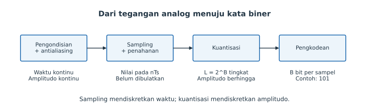

Dalam perangkat nyata, pembagian fungsi tersebut dapat berada di dalam satu cip ADC atau tersebar pada beberapa komponen. Diagram ini menjelaskan fungsi konseptualnya, bukan mengharuskan setiap tahap berupa perangkat yang terpisah.

Filter antialiasing bekerja pada sinyal analog sebelum sampling. Penguat atau pelemah juga dapat diperlukan agar amplitudo memanfaatkan rentang ADC tanpa melewati batas masukannya.

### Periode dan frekuensi sampling

Pada sampling seragam, nilai sinyal diambil pada waktu $t=nT_s$ dengan selang tetap $T_s$. Besaran $T_s$ disebut periode sampling, sedangkan banyaknya pengambilan sampel per detik disebut frekuensi sampling $f_s$.

```math
\boxed{x[n]=x_a(nT_s)},
\qquad
\boxed{f_s=\frac{1}{T_s}}.
```

Periode sampling dinyatakan dalam sekon per sampel, sedangkan frekuensi sampling lazim dinyatakan dalam sampel per sekon atau hertz. Indeks $n$ sendiri tidak bersatuan waktu, sehingga grafik terhadap $n$ harus dibedakan dari grafik terhadap $t$.

Untuk sinyal analog sinusoidal $x_a(t)=A\cos(2\pi f_0t+\phi)$, substitusi $t=nT_s$ menghasilkan bentuk diskret. Hubungan frekuensi analog dan frekuensi sudut diskretnya dinyatakan sebagai berikut.

```math
x[n]=A\cos\left(2\pi\frac{f_0}{f_s}n+\phi\right)
=A\cos(\omega_0n+\phi),
\qquad
\omega_0=2\pi\frac{f_0}{f_s}.
```

Frekuensi $f_0$ bersatuan hertz, frekuensi sudut analog $\Omega_0=2\pi f_0$ bersatuan radian per sekon, dan $\omega_0$ bersatuan radian per sampel. Besaran $f_0/f_s$ juga sering digunakan sebagai frekuensi ternormalisasi dalam siklus per sampel.

#### Contoh menghitung sampel dan frekuensi diskret

Misalkan $x_a(t)=\cos(2\pi\cdot20t)$ disampling dengan $f_s=80\ \mathrm{Hz}$. Periode samplingnya adalah $T_s=1/80=0.0125\ \mathrm{s}=12.5\ \mathrm{ms}$, sehingga diperoleh hasil berikut.

```math
\omega_0=2\pi\frac{20}{80}=\frac\pi2,
\qquad
x[n]=\cos\left(\frac\pi2n\right).
```

Sampel pada $n=0,1,2,3,4$ adalah $1,0,-1,0,1$. Satu periode sinusoid analog berlangsung selama $50\ \mathrm{ms}$ dan pada contoh ini mencakup empat interval sampling.

Sampling ideal kadang digambarkan secara matematis dengan deretan impuls $x_s(t)=\sum_n x[n]\delta(t-nT_s)$. Model ini tetap merupakan objek waktu-kontinu berupa impuls berbobot, sedangkan deretan $x[n]$ adalah nilai numeriknya; batang pada grafik sampel tidak berarti ADC menghasilkan impuls dengan tinggi fisik tak berhingga.

### Teorema sampling dan frekuensi Nyquist

Teorema sampling menyatakan bahwa sinyal terbatas pita dapat ditentukan kembali dari sampel seragamnya jika frekuensi sampling cukup tinggi. Untuk sinyal pita dasar yang tidak memiliki komponen di atas $f_{\max}$, syarat aman yang digunakan di sini adalah $f_s>2f_{\max}$.

```math
\boxed{f_s>2f_{\max}}.
```

Pernyataan rekonstruksi tepat mengasumsikan pembatasan pita yang ideal, sampel tepat tanpa galat, dan informasi sampel yang memadai sepanjang waktu. Dalam praktik, filter tidak ideal, rekaman berhingga, derau, ketidakpastian waktu sampling, dan kuantisasi membuat rekonstruksi hanya mendekati model ideal tersebut.

Istilah laju Nyquist dan frekuensi Nyquist sering tertukar karena keduanya mengandung faktor dua. Tabel berikut membedakan besaran yang ditentukan oleh sinyal dari besaran yang ditentukan oleh perangkat sampling.

| Istilah | Rumus | Ditentukan oleh |
|---|---|---|
| Laju Nyquist sinyal | $2f_{\max}$ | Frekuensi tertinggi yang perlu dipertahankan |
| Frekuensi Nyquist pencuplikan | $f_s/2$ | Frekuensi sampling yang dipilih |

Sebagai contoh, sinyal dengan frekuensi tertinggi $4\ \mathrm{kHz}$ memiliki laju Nyquist $8\ \mathrm{kHz}$. Jika digunakan $f_s=10\ \mathrm{kHz}$, frekuensi Nyquist pencuplikan adalah $5\ \mathrm{kHz}$ dan periode samplingnya $0.1\ \mathrm{ms}$.

#### Mengapa tidak selalu cukup tepat pada batas dua kali?

Pada $f_s=2f_0$, sinusoid $x_a(t)=\sin(2\pi f_0t)$ menghasilkan $x[n]=\sin(\pi n)=0$ untuk setiap bilangan bulat $n$. Sinyal analog yang tidak nol tersebut menjadi tidak dapat dibedakan dari sinyal nol berdasarkan sampelnya saja.

Karena fase pada frekuensi batas dapat menimbulkan kehilangan informasi, penggunaan tanda lebih besar menghindari persoalan komponen tepat di batas. Selain itu, sistem nyata memerlukan ruang transisi filter antialiasing, sehingga memilih frekuensi sampling hanya sedikit di atas batas teoritis belum tentu memadai.

Aturan praktis seperti menggunakan $2.2f_{\max}$ dapat memberikan margin pada situasi tertentu, tetapi bukan teorema universal. Margin yang benar bergantung pada penolakan frekuensi di luar pita, bentuk filter analog, dan ketelitian yang dibutuhkan.

#### Makna rekonstruksi ideal

Dalam model ideal, informasi di antara titik sampel dapat dipulihkan dengan interpolasi sinc, bukan sekadar menghubungkan titik menggunakan garis lurus. Dengan fungsi sinc ternormalisasi, salah satu bentuk rumus rekonstruksinya adalah sebagai berikut.

```math
x_a(t)=\sum_{n=-\infty}^{\infty}x[n]\,
\operatorname{sinc}\left(\frac{t-nT_s}{T_s}\right),
\qquad
\operatorname{sinc}(u)=
\begin{cases}
\dfrac{\sin(\pi u)}{\pi u},&u\ne0,\\[5pt]
1,&u=0.
\end{cases}
```

Pada $t=mT_s$, semua suku selain $n=m$ bernilai nol, sehingga rumus mengembalikan nilai sampel $x[m]$. Di antara titik sampling, setiap sampel menyumbang bagian kurva sinc dan penjumlahannya memulihkan sinyal terbatas pita sesuai asumsi teorema.

Rumus tersebut memerlukan sampel ke kedua arah tanpa batas dan fungsi interpolasi yang juga tidak berhingga durasinya. Implementasi nyata menggunakan pendekatan berhingga dengan keterlambatan tertentu, sehingga model ideal ini perlu dibedakan dari rangkaian penahanan sampel yang akan dibahas sesudah aliasing.

### Aliasing: frekuensi berbeda dengan sampel yang sama

Aliasing terjadi ketika dua atau lebih sinyal analog yang berbeda menghasilkan deretan sampel yang sama. Akibatnya, komponen frekuensi tinggi dapat tampak sebagai komponen frekuensi yang lebih rendah pada data digital.

Untuk eksponensial kompleks, penambahan kelipatan bulat $f_s$ tidak mengubah sampel. Hal ini mengikuti identitas berikut untuk setiap bilangan bulat $k$ dan $n$.

```math
e^{j2\pi(f_0+kf_s)n/f_s}
=e^{j2\pi f_0n/f_s}e^{j2\pi kn}
=e^{j2\pi f_0n/f_s}.
```

Pada kosinus real, pencerminan frekuensi juga dapat menghasilkan sampel yang sama karena kosinus merupakan fungsi genap. Untuk sinus atau sinusoid berfase sembarang, pencerminan tersebut perlu disertai penyesuaian fase atau tanda, sehingga kesamaan tidak boleh diasumsikan tanpa pemeriksaan.

Frekuensi alias nonnegatif dalam interval $[0,f_s/2]$ dapat dihitung melalui pelipatan berikut. Operasi modulo digunakan untuk terlebih dahulu menempatkan frekuensi dalam interval $[-f_s/2,f_s/2)$.

```math
f_{\mathrm{alias}}
=\left|\left((f_0+f_s/2)\bmod f_s\right)-f_s/2\right|.
```

#### Contoh aliasing pada sampling 100 Hz

Sinyal kosinus $70\ \mathrm{Hz}$ yang disampling pada $100\ \mathrm{Hz}$ tidak memenuhi syarat pita dasar, karena frekuensi Nyquistnya hanya $50\ \mathrm{Hz}$. Sampelnya sama dengan kosinus $30\ \mathrm{Hz}$ seperti diperlihatkan oleh identitas berikut.

```math
\cos\left(2\pi\frac{70}{100}n\right)
=\cos\left(2\pi n-2\pi\frac{30}{100}n\right)
=\cos\left(2\pi\frac{30}{100}n\right).
```

Dengan frekuensi sampling yang sama, komponen $130\ \mathrm{Hz}$ juga terlipat menjadi $30\ \mathrm{Hz}$, sedangkan $60\ \mathrm{Hz}$ terlipat menjadi $40\ \mathrm{Hz}$. Komponen $20\ \mathrm{Hz}$ tetap berada pada $20\ \mathrm{Hz}$, tetapi tetap dapat tercampur dengan alias dari komponen analog lain jika komponen tersebut tidak disaring sebelum sampling.

```python
import numpy as np
import matplotlib.pyplot as plt


f0 = 70.0
t = np.linspace(0, 0.1, 2001)
analog = np.cos(2 * np.pi * f0 * t)
fig, axes = plt.subplots(2, 1, figsize=(9, 6.5), sharex=True)

for ax, fs in zip(axes, [200.0, 100.0]):
    n = np.arange(int(round(0.1 * fs)) + 1)
    ts = n / fs
    x = np.cos(2 * np.pi * f0 * ts)
    ax.plot(t, analog, color='C0', label='Analog 70 Hz')
    if fs == 100:
        alias = np.cos(2 * np.pi * 30 * t)
        ax.plot(t, alias, '--', color='C1', label='Analog 30 Hz')
        galat = np.max(np.abs(x - np.cos(2 * np.pi * 30 * ts)))
        print('Selisih sampel 70 Hz dan 30 Hz:', galat)
        assert galat < 1e-12
    ax.plot(ts, x, 'ko', markersize=5, label='Sampel')
    ax.set_ylabel('Amplitudo')
    ax.set_title(f'fs = {fs:g} Hz; frekuensi Nyquist = {fs / 2:g} Hz')
    ax.grid(alpha=0.3)
    ax.legend(loc='upper right', fontsize=8)
axes[-1].set_xlabel('Waktu t (s)')
fig.tight_layout()
plt.show()
```

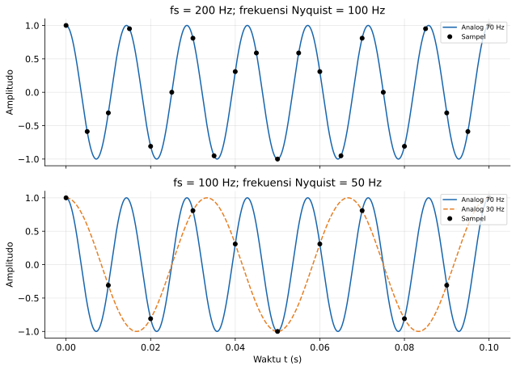

Program [06_sampling_aliasing.py](../Kode/pertemuan-02/06_sampling_aliasing.py) membandingkan sampling pada $200\ \mathrm{Hz}$ dan $100\ \mathrm{Hz}$. Pada panel kedua, kedua kurva analog berbeda tetapi semua titik sampelnya berimpit, sehingga ambiguitasnya terlihat langsung.

#### Pencegahan aliasing

Filter antialiasing harus mengurangi komponen yang dapat terlipat ke pita pengamatan sebelum sinyal dicuplik. Menambahkan filter digital sesudah sampling tidak dapat memisahkan dua komponen yang sudah menghasilkan sampel identik.

Menaikkan $f_s$ memperlebar daerah frekuensi yang dapat ditangani, tetapi meningkatkan laju data dan kebutuhan komputasi. Pilihan yang masuk akal menggabungkan batas pita sinyal, filter analog, dan kapasitas penyimpanan, bukan hanya memperbesar satu parameter tanpa memeriksa keseluruhan sistem.

### Pengayaan: sampling sinyal pita lewat

Syarat $f_s>2f_{\max}$ merupakan pilihan sederhana untuk sinyal pita dasar atau ketika letak spektrum tidak dimanfaatkan. Sinyal pita lewat yang hanya menempati $f_L\le |f|\le f_H$ dapat disampling lebih rendah melalui pemilihan interval $f_s$ yang mencegah salinan spektrumnya bertumpang tindih, dengan penjelasan tambahan tentang salinan spektrum pada Referensi 5.

Dengan lebar pita $W=f_H-f_L$, salah satu keluarga interval sampling ideal adalah sebagai berikut. Bilangan bulat $m$ menyatakan pilihan penempatan salinan spektrum, bukan jumlah bit atau jumlah sampel.

```math
\frac{2f_H}{m}\le f_s\le\frac{2f_L}{m-1},
\qquad
1\le m\le\left\lfloor\frac{f_H}{W}\right\rfloor.
```

Untuk $m=1$, batas atas dipahami tidak membatasi, sehingga kembali diperoleh pilihan sampling di atas dua kali $f_H$. Batas pada $m$ berasal dari syarat interval tidak kosong, yaitu $f_H(m-1)\le mf_L$, yang setara dengan $mW\le f_H$.

Sebagai contoh, pita $90$ sampai $100\ \mathrm{kHz}$ memiliki $W=10\ \mathrm{kHz}$. Pilihan $m=5$ memberikan interval $40\le f_s\le45\ \mathrm{kHz}$, sehingga $f_s=42\ \mathrm{kHz}$ merupakan salah satu pilihan ideal yang berada di dalam interval.

Pada pilihan tersebut, pita positif dapat bergeser sebesar $2f_s=84\ \mathrm{kHz}$ menjadi $6$ sampai $16\ \mathrm{kHz}$. Hasilnya berada di bawah $f_s/2=21\ \mathrm{kHz}$ tanpa bertumpang tindih dengan pita negatif pasangannya.

Tidak setiap nilai $f_s\ge2W$ otomatis aman, dan batas interval ideal sebaiknya diberi margin. Selain itu, rangkaian analog tetap harus mampu menerima frekuensi hingga $f_H$ dan memerlukan filter pita lewat yang sesuai, sehingga teknik ini bukan alasan untuk mengabaikan kemampuan masukan ADC.

### Sample-and-hold

ADC nyata memerlukan waktu tertentu untuk menyelesaikan konversi suatu nilai tegangan. Rangkaian *sample-and-hold* atau *track-and-hold* membantu menjaga tegangan yang dikonversi tetap mendekati nilai pada saat pengambilan sampel.

Pada fase pelacakan, elemen penyimpan mengikuti tegangan masukan. Pada fase penahanan, tegangan disimpan sementara agar perubahan masukan berikutnya tidak terus mengubah nilai yang sedang dikonversi.

Model penahanan ideal yang sederhana mempertahankan nilai sampel selama satu interval sampling. Hubungannya dinyatakan sebagai berikut.

```math
x_{\mathrm{hold}}(t)=x[n],
\qquad nT_s\le t<(n+1)T_s.
```

Bentuk tangga ini masih merupakan tegangan analog terhadap waktu kontinu. Amplitudonya belum otomatis dikuantisasi, sehingga proses penahanan tidak sama dengan pembulatan ke tingkat digital.

#### Contoh penahanan sampel

Ambil $x_a(t)=\sin(2\pi\cdot5t)$ dengan $f_s=40\ \mathrm{Hz}$, sehingga $T_s=25\ \mathrm{ms}$. Sampel pertamanya adalah $0$, $\sqrt2/2$, $1$, dan $\sqrt2/2$ pada waktu $0$, $25$, $50$, dan $75\ \mathrm{ms}$.

Model penahanan mempertahankan nol selama $0\le t<25\ \mathrm{ms}$ dan mempertahankan $\sqrt2/2$ selama $25\le t<50\ \mathrm{ms}$. Pada $t=37\ \mathrm{ms}$, nilai yang ditahan tetap $\sqrt2/2$, walaupun nilai sinusoid analog pada waktu itu berbeda.

```python
import numpy as np
import matplotlib.pyplot as plt


fs, f0 = 40.0, 5.0
ts = np.arange(13) / fs
x = np.sin(2 * np.pi * f0 * ts)
t = np.linspace(0, ts[-1], 3001)
analog = np.sin(2 * np.pi * f0 * t)
print('Empat sampel pertama:', x[:4])
print('Nilai yang ditahan pada t = 0.037 s:', x[int(0.037 * fs)])

fig, ax = plt.subplots(figsize=(9, 4.5))
ax.plot(t, analog, label='Sinyal analog')
ax.step(ts, x, where='post', linewidth=2, label='Penahanan orde nol')
ax.plot(ts, x, 'ko', markersize=5, label='Nilai sampel')
ax.set(xlabel='Waktu t (s)', ylabel='Amplitudo',
       title='Sample-and-hold: f0 = 5 Hz, fs = 40 Hz')
ax.grid(alpha=0.3)
ax.legend(loc='lower left', fontsize=9)
fig.tight_layout()
plt.show()
```

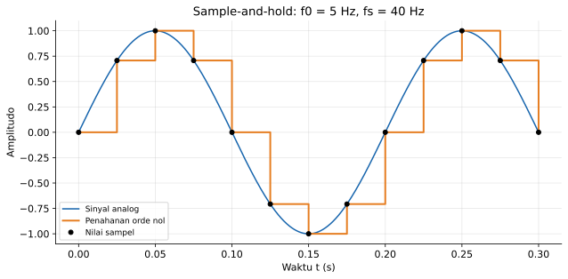

Program [07_sample_hold.py](../Kode/pertemuan-02/07_sample_hold.py) menggunakan tangga yang berubah tepat pada waktu sampel. Model ini juga dikenal sebagai penahanan orde nol, tetapi kurva tangga tersebut bukan rekonstruksi ideal sinyal terbatas pita.

Pada perangkat nyata, tegangan tersimpan dapat sedikit turun selama penahanan, dan saat sampling dapat mengalami ketidakpastian waktu atau *jitter*. Karena itu, pemenuhan batas frekuensi sampling saja tidak menjamin seluruh galat akuisisi menjadi kecil.

---

## Kuantisasi dan pengkodean digital

Sesudah sampling, kita mempunyai satu nilai amplitudo pada setiap indeks, tetapi nilai tersebut secara ideal masih dapat mengambil sembarang bilangan real. Komputer tidak dapat menyimpan seluruh kemungkinan itu dengan kata biner yang panjangnya berhingga, sehingga diperlukan kuantisasi.

Kuantisasi memetakan suatu interval amplitudo ke satu nilai perwakilan. Akibatnya, beberapa nilai masukan yang berbeda menghasilkan nilai keluaran yang sama, sehingga proses ini kehilangan informasi dan tidak invertibel pada himpunan masukan kontinu.

### Jumlah tingkat dan langkah kuantisasi

ADC dengan $B$ bit menyediakan paling banyak $L=2^B$ pola kode berbeda. Untuk kuantisator seragam, lebar interval kuantisasi sama pada seluruh rentang masukannya.

Dalam catatan ini, kita menggunakan kuantisator seragam **mid-rise** dengan rentang nominal $[V_{\min},V_{\max})$. Ada $L$ interval dengan nilai perwakilan di titik tengah setiap interval, sehingga definisinya adalah sebagai berikut.

```math
L=2^B,
\qquad
\Delta=\frac{V_{\max}-V_{\min}}{L},
\qquad
q_k=V_{\min}+\left(k+\frac12\right)\Delta,
\quad k=0,1,\ldots,L-1.
```

Nilai $\Delta$ disebut langkah kuantisasi, dan pada model ideal ini setara dengan ukuran satu LSB dalam satuan tegangan. Aturan pada tepat batas interval perlu dinyatakan agar hitungan manual dan program tidak berbeda akibat konvensi pembulatan.

Kita memasukkan batas bawah suatu interval ke interval tersebut dan memetakan nilai di luar rentang ke tingkat terdekat pada ujung rentang. Dengan konvensi ini, indeks tingkat dan nilai keluarannya dihitung melalui rumus berikut.

```math
k[n]=\operatorname{clip}\left(
\left\lfloor\frac{x[n]-V_{\min}}{\Delta}\right\rfloor,
0,L-1\right),
\qquad
x_q[n]=V_{\min}+\left(k[n]+\frac12\right)\Delta.
```

Ada pula konvensi yang menempatkan nilai perwakilan tepat pada kedua ujung rentang, dengan jarak antartingkat $(V_{\max}-V_{\min})/(L-1)$. Konvensi tersebut tidak digunakan di sini, sehingga penyebut $L$ dan $L-1$ tidak boleh dicampur dalam satu perhitungan.

Pada kuantisator mid-rise simetris dengan jumlah tingkat genap, nol merupakan batas antara dua tingkat dan bukan nilai keluaran. Kuantisator **mid-tread** menyediakan tingkat nol, tetapi pengaturan tingkat dan ambangnya harus didefinisikan kembali sebelum rumus diterapkan.

#### Contoh kuantisator 3 bit

Ambil $B=3$, $V_{\min}=-4\ \mathrm{V}$, dan $V_{\max}=4\ \mathrm{V}$. Jumlah tingkatnya $L=8$ dan langkahnya $\Delta=8/8=1\ \mathrm{V}$, sehingga tabel pemetaan nominalnya adalah sebagai berikut.

| Interval masukan nominal (V) | Tingkat $q_k$ (V) | Indeks $k$ | Kode biner |
|---|---:|---:|:---:|
| $[-4,-3)$ | −3.5 | 0 | 000 |
| $[-3,-2)$ | −2.5 | 1 | 001 |
| $[-2,-1)$ | −1.5 | 2 | 010 |
| $[-1,0)$ | −0.5 | 3 | 011 |
| $[0,1)$ | 0.5 | 4 | 100 |
| $[1,2)$ | 1.5 | 5 | 101 |
| $[2,3)$ | 2.5 | 6 | 110 |
| $[3,4)$ | 3.5 | 7 | 111 |

Sebagai contoh, $x=1.3\ \mathrm{V}$ memberikan $k=\lfloor(1.3+4)/1\rfloor=5$. Nilai perwakilannya $x_q=1.5\ \mathrm{V}$ dan kode binernya `101`.

Dengan mendefinisikan galat sebagai $e_q=x_q-x$, deretan sampel berikut memberikan hasil yang dapat diperiksa satu per satu. Perhatikan bahwa tanda galat menunjukkan apakah nilai perwakilan berada di atas atau di bawah masukan asli.

| $x[n]$ (V) | $x_q[n]$ (V) | $e_q[n]$ (V) | $k[n]$ | Kode |
|---:|---:|---:|---:|:---:|
| 1.3 | 1.5 | 0.2 | 5 | 101 |
| 3.6 | 3.5 | −0.1 | 7 | 111 |
| 2.3 | 2.5 | 0.2 | 6 | 110 |
| 0.7 | 0.5 | −0.2 | 4 | 100 |
| −0.7 | −0.5 | 0.2 | 3 | 011 |
| −2.4 | −2.5 | −0.1 | 1 | 001 |
| −3.4 | −3.5 | −0.1 | 0 | 000 |

### Galat kuantisasi dan kelebihan rentang

Untuk nilai yang berada dalam rentang nominal kuantisator titik-tengah, jarak ke nilai perwakilan tidak melebihi setengah langkah. Dengan definisi galat tadi, batasnya dinyatakan sebagai berikut.

```math
e_q[n]=x_q[n]-x[n],
\qquad
\boxed{|e_q[n]|\le\frac{\Delta}{2}}.
```

Batas tersebut tidak berlaku secara umum ketika masukan melewati rentang dan mengalami saturasi atau *clipping*. Pada contoh 3 bit tadi, masukan $4.8\ \mathrm{V}$ dipetakan ke $3.5\ \mathrm{V}$, sehingga galatnya $-1.3\ \mathrm{V}$, lebih besar dari $\Delta/2=0.5\ \mathrm{V}$ dalam nilai mutlak.

Karena itu, memperbesar jumlah bit tidak dapat menggantikan pemilihan rentang masukan yang benar. Sebaliknya, rentang yang terlalu lebar mengurangi ketelitian untuk sinyal kecil karena lebih sedikit tingkat yang benar-benar digunakan oleh sinyal tersebut.

#### Contoh resolusi ADC dan kebutuhan jumlah bit

Untuk ADC 12 bit dengan rentang $-10$ sampai $10\ \mathrm{V}$, terdapat $4096$ tingkat. Langkah dan batas galat ideal dalam rentang dihitung sebagai berikut.

```math
\Delta=\frac{20}{4096}\ \mathrm{V}
=4.8828125\ \mathrm{mV},
\qquad
|e_q|\le2.44140625\ \mathrm{mV}.
```

Jika batas galat ideal yang dikehendaki adalah $\varepsilon$, syarat $\Delta/2\le\varepsilon$ dapat disusun ulang untuk menentukan jumlah bit. Pembulatan ke atas diperlukan karena jumlah bit harus berupa bilangan bulat.

```math
B\ge\left\lceil
\log_2\left(\frac{V_{\max}-V_{\min}}{2\varepsilon}\right)
\right\rceil.
```

Untuk rentang $20\ \mathrm{V}$ dan batas galat $2\ \mathrm{mV}$, diperoleh $B\ge\lceil\log_2 5000\rceil=13$. Angka ini hanya menyatakan kebutuhan kuantisasi ideal, bukan jaminan akurasi perangkat karena galat offset, penguatan, derau, dan ketidaklinieran belum diperhitungkan.

### Demo kuantisasi dan kode PCM dengan Python

Program berikut mengimplementasikan tabel 3 bit tadi serta menggambar karakteristik tangga dan galatnya. Operasi `floor` digunakan untuk pemilihan interval, sedangkan `clip` membatasi indeks agar selalu merupakan kode yang sah.

```python
import numpy as np
import matplotlib.pyplot as plt


def kuantisasi(x, bit, vmin, vmax):
    if not isinstance(bit, (int, np.integer)) or bit < 1 or vmax <= vmin:
        raise ValueError('Bit harus positif dan vmax harus melebihi vmin')
    x = np.asarray(x, dtype=float)
    tingkat = 2**bit
    delta = (vmax - vmin) / tingkat
    indeks = np.floor((x - vmin) / delta)
    kode = np.clip(indeks, 0, tingkat - 1).astype(int)
    xq = vmin + (kode + 0.5) * delta
    return kode, xq


bit, vmin, vmax = 3, -4.0, 4.0
delta = (vmax - vmin) / 2**bit
x = np.array([1.3, 3.6, 2.3, 0.7, -0.7, -2.4, -3.4])
kode, xq = kuantisasi(x, bit, vmin, vmax)
galat = xq - x
print('Masukan  Kuantisasi  Galat  Kode')
for xi, qi, ei, ki in zip(x, xq, galat, kode):
    print(f'{xi:7.1f} {qi:10.1f} {ei:6.1f}  {ki:0{bit}b}')
assert np.max(np.abs(galat)) <= delta / 2

fig, axes = plt.subplots(3, 1, figsize=(8, 8.5))
uji = np.linspace(-5, 5, 2001)
_, tangga = kuantisasi(uji, bit, vmin, vmax)
axes[0].plot(uji, tangga, label='Kuantisator mid-rise')
axes[0].plot(uji, uji, '--', color='gray', label='Identitas')
axes[0].axvspan(-5, vmin, color='C1', alpha=0.15)
axes[0].axvspan(vmax, 5, color='C1', alpha=0.15)
axes[0].set(xlabel='Masukan (V)', ylabel='Keluaran (V)',
            title='Rentang nominal -4 sampai 4 V; saturasi di luar rentang')
n = np.arange(len(x))
axes[1].plot(n, x, 'o-', label='Sampel asli')
axes[1].plot(n, xq, 's--', label='Hasil kuantisasi')
axes[1].set(xlabel='Indeks n', ylabel='Tegangan (V)')
axes[2].stem(n, galat)
axes[2].axhline(delta / 2, color='C1', linestyle='--', label='Batas ±Δ/2')
axes[2].axhline(-delta / 2, color='C1', linestyle='--')
axes[2].set(xlabel='Indeks n', ylabel='Galat (V)', ylim=(-0.65, 0.65))
for ax in axes:
    ax.grid(alpha=0.3)
    ax.legend(fontsize=8)
fig.tight_layout()
plt.show()
```

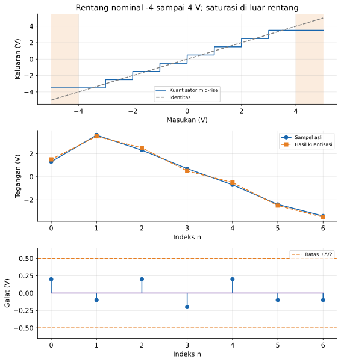

Program [08_kuantisasi_pcm.py](../Kode/pertemuan-02/08_kuantisasi_pcm.py) juga mencetak kode biner setiap sampel. Pada panel karakteristik, daerah di luar rentang menunjukkan saturasi, sedangkan batas setengah langkah pada panel galat hanya digunakan untuk sampel yang masih berada dalam rentang.

### Model derau kuantisasi dan SQNR

Galat kuantisasi sebenarnya merupakan akibat deterministik dari aturan pemetaan amplitudo. Untuk analisis tertentu, galat ini dapat didekati sebagai peubah acak seragam pada interval $[-\Delta/2,\Delta/2]$ jika sinyal menjelajahi cukup banyak tingkat dan hubungan galat dengan sinyal cukup lemah, sebagaimana juga dibahas dalam Referensi 4.

Model tersebut bukan sifat universal setiap sinyal terkuantisasi. Sebagai contoh, masukan nol pada kuantisator mid-rise yang digunakan di sini selalu menghasilkan $+\Delta/2$, sehingga galatnya konstan dan tidak memiliki rata-rata nol.

Jika asumsi seragam dan rata-rata nol layak digunakan, daya galat sama dengan variansnya. Integrasi distribusi seragam memberikan hasil berikut.

```math
P_q=\sigma_q^2
=\frac{1}{\Delta}\int_{-\Delta/2}^{\Delta/2}e^2\,de
=\frac{\Delta^2}{12}.
```

Rasio daya sinyal terhadap daya galat kuantisasi disebut *signal-to-quantization-noise ratio* atau SQNR. Besarannya dalam desibel dihitung menggunakan rasio daya, sehingga faktor pengalinya adalah sepuluh.

```math
\mathrm{SQNR}=10\log_{10}\left(\frac{P_x}{P_q}\right)\ \mathrm{dB}.
```

#### SQNR sinusoid skala penuh

Sinusoid dengan amplitudo puncak $A$ memiliki daya rata-rata $A^2/2$. Jika rentang kuantisator simetris membentang dari $-A$ sampai $A$, maka $\Delta=2A/2^B$ dan pendekatan SQNR menjadi sebagai berikut.

```math
\begin{aligned}
\mathrm{SQNR}
&\approx10\log_{10}\left(
\frac{A^2/2}{(2A/2^B)^2/12}\right)\\
&=10\log_{10}\left(\frac32\,2^{2B}\right)\\
&\approx6.0206B+1.7609\ \mathrm{dB}.
\end{aligned}
```

Dengan model tersebut, sinusoid skala penuh menghasilkan sekitar $49.93\ \mathrm{dB}$ untuk 8 bit dan $74.01\ \mathrm{dB}$ untuk 12 bit. Penambahan satu bit meningkatkan SQNR ideal sekitar $6.02\ \mathrm{dB}$ selama asumsi dan rentang operasi tetap terpenuhi.

Jika amplitudo sinusoid hanya $A_s$ sedangkan batas puncak rentang kuantisator adalah $A_{\mathrm{FS}}$, daya sinyal lebih kecil tanpa perubahan langkah kuantisasi. Koreksi amplitudonya diberikan oleh rumus berikut.

```math
\mathrm{SQNR}\approx6.0206B+1.7609
+20\log_{10}\left(\frac{A_s}{A_{\mathrm{FS}}}\right)\ \mathrm{dB}.
```

Pengurangan amplitudo menjadi sepersepuluh skala penuh menurunkan prediksi SQNR sebesar $20\ \mathrm{dB}$. Rumus tersebut tetap merupakan pendekatan, khususnya ketika hanya sedikit tingkat kuantisasi yang digunakan atau galat berkorelasi kuat dengan sinyal.

```python
import numpy as np
import matplotlib.pyplot as plt


n = np.arange(100000)
amplitudo, skala_penuh = 3.8, 4.0
x = amplitudo * np.sin(2 * np.pi * np.sqrt(2) * n / 100)
bits = np.array([3, 4, 6, 8, 10, 12])
sqnr_ukur = []
for bit in bits:
    delta = 2 * skala_penuh / 2**bit
    kode = np.floor((x + skala_penuh) / delta)
    kode = np.clip(kode, 0, 2**bit - 1)
    xq = -skala_penuh + (kode + 0.5) * delta
    px = np.mean(x**2)
    pe = np.mean((xq - x)**2)
    sqnr = 10 * np.log10(px / pe)
    sqnr_ukur.append(sqnr)
    print(f'{bit:2d} bit: SQNR = {sqnr:.3f} dB')
teori = 6.0206 * bits + 1.7609 + 20 * np.log10(amplitudo / skala_penuh)

fig, ax = plt.subplots(figsize=(8, 4.5))
ax.plot(bits, sqnr_ukur, 'o-', label='Pengukuran numerik')
ax.plot(bits, teori, '--', label='Model galat seragam')
ax.set(xlabel='Jumlah bit B', ylabel='SQNR (dB)',
       title='Sinusoid dengan amplitudo 95% skala penuh', xticks=bits)
ax.grid(alpha=0.3)
ax.legend()
fig.tight_layout()
plt.show()
```

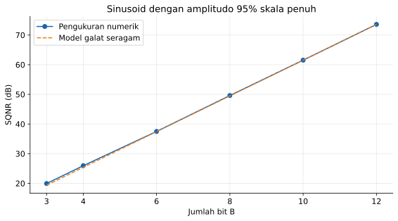

Program [09_sqnr.py](../Kode/pertemuan-02/09_sqnr.py) menggunakan banyak sampel dengan fase yang tersebar untuk mengurangi ketergantungan pada beberapa titik sinusoid saja. Selisih kecil dari garis teori adalah wajar karena model derau seragam bersifat pendekatan, terutama pada jumlah bit rendah.

### Pengkodean digital dan laju data

Kuantisasi menentukan tingkat amplitudo, sedangkan pengkodean memberi nama digital pada tingkat tersebut. Untuk kode biner alami dengan $B$ bit, indeks $k$ dinyatakan sebagai jumlah berbobot berikut.

```math
k=\sum_{r=0}^{B-1}c_r2^r,
\qquad c_r\in\{0,1\}.
```

Bit berbobot terbesar disebut MSB dan bit berbobot terkecil disebut LSB. Sebagai contoh, `101` menyatakan indeks $1\cdot4+0\cdot2+1\cdot1=5$, yang pada tabel kuantisasi tadi berarti $1.5\ \mathrm{V}$, bukan tegangan $5\ \mathrm{V}$.

Kode alami pada contoh rentang bipolar itu merupakan label berurutan dari tegangan paling rendah ke paling tinggi. Kode tersebut tidak sama dengan representasi bilangan bertanda komplemen dua, sehingga penerjemahan nilai ADC harus mengikuti format kode yang benar-benar digunakan.

Rangkaian sampling, kuantisasi, dan penyajian setiap sampel sebagai kata biner disebut *pulse-code modulation* atau PCM. Pengkodean pada pembahasan ini belum mencakup pemampatan data atau penambahan kode koreksi kesalahan transmisi.

Untuk satu kanal yang menghasilkan $B$ bit per sampel pada frekuensi $f_s$, laju data mentah adalah $R=Bf_s$. Jika ada $C$ kanal dengan parameter yang sama, laju total menjadi sebagai berikut.

```math
R=CBf_s\quad\text{bit per sekon}.
```

ADC satu kanal 12 bit pada $10\ \mathrm{kHz}$ menghasilkan $120{,}000$ bit per sekon atau $120\ \mathrm{kbit/s}$. Jika bit dikemas rapat, satu sekon membutuhkan $15{,}000$ byte, belum termasuk penanda waktu, header, atau metadata.

Jika setiap sampel 12 bit justru disimpan dalam wadah 16 bit, kebutuhan penyimpanannya menjadi $20{,}000$ byte per sekon. Dengan demikian, laju informasi dari ADC dan ukuran berkas implementasi dapat berbeda meskipun data pengukurannya sama.

Frekuensi sampling mengatur kerapatan pengamatan terhadap waktu, sedangkan jumlah bit mengatur kerapatan tingkat amplitudo. Menaikkan jumlah bit tidak menghilangkan aliasing, dan menaikkan frekuensi sampling saja tidak memperbaiki saturasi akibat rentang tegangan yang salah.

### Kuantisasi tidak seragam dan companding

Kuantisasi seragam memberikan ketelitian absolut yang sama pada seluruh rentang amplitudo. Untuk sinyal dengan banyak bagian beramplitudo kecil, tingkat yang lebih rapat di sekitar nol dapat memberikan ketelitian relatif yang lebih baik.

Salah satu caranya adalah *companding*, yaitu kompresi amplitudo sebelum kuantisasi dan ekspansi amplitudo sesudah penerjemahan kode. Kuantisator dapat tetap seragam pada domain terkompresi, tetapi interval ekuivalennya menjadi tidak seragam pada domain amplitudo asli.

Misalkan $u=x/A_{\mathrm{FS}}$ sehingga $-1\le u\le1$. Fungsi kompresi hukum $\mu$ didefinisikan sebagai berikut untuk $\mu>0$.

```math
F_\mu(u)=\operatorname{sgn}(u)
\frac{\ln(1+\mu|u|)}{\ln(1+\mu)}.
```

Parameter $\mu=255$ merupakan contoh yang sering digunakan dalam pembahasan PCM suara. Fungsi inversnya mengembalikan domain amplitudo setelah nilai terkompresi diterjemahkan, tetapi tidak dapat menghapus informasi yang sudah hilang karena kuantisasi.

```math
F_\mu^{-1}(v)=\operatorname{sgn}(v)
\frac{(1+\mu)^{|v|}-1}{\mu}.
```

Alternatifnya adalah hukum A dengan parameter $A>1$, yang memiliki bagian linear di dekat nol dan bagian logaritmik pada amplitudo lebih besar. Salah satu nilai contoh yang lazim adalah $A=87.6$.

```math
F_A(u)=\operatorname{sgn}(u)
\begin{cases}
\dfrac{A|u|}{1+\ln A},&0\le |u|\le 1/A,\\[6pt]
\dfrac{1+\ln(A|u|)}{1+\ln A},&1/A<|u|\le1.
\end{cases}
```

Di dekat nol, fungsi kompresi memperbesar perbedaan kecil sebelum nilai masuk ke kuantisator seragam. Setelah ekspansi, jarak tingkat ekuivalen di dekat nol menjadi kecil, tetapi jaraknya pada amplitudo besar menjadi lebih lebar.

Sebagai contoh, $u=0.01$ pada hukum $\mu$ dengan $\mu=255$ dipetakan menjadi sekitar $0.2285$. Perubahan skala ini memberi lebih banyak tingkat pada sinyal lemah, tetapi bukan berarti kompresi tanpa kuantisasi menciptakan informasi baru.

```python
import numpy as np
import matplotlib.pyplot as plt


def kompres_mu(x, mu=255.0):
    return np.sign(x) * np.log1p(mu * np.abs(x)) / np.log1p(mu)


def ekspansi_mu(v, mu=255.0):
    return np.sign(v) * np.expm1(np.abs(v) * np.log1p(mu)) / mu


def kompres_a(x, a=87.6):
    x = np.asarray(x, dtype=float)
    u = np.abs(x)
    hasil = a * u / (1 + np.log(a))
    besar = u > 1 / a
    hasil[besar] = (1 + np.log(a * u[besar])) / (1 + np.log(a))
    return np.sign(x) * hasil


def kuantisasi_normal(x, bit=8):
    delta = 2.0 / 2**bit
    kode = np.clip(np.floor((x + 1) / delta), 0, 2**bit - 1)
    return -1 + (kode + 0.5) * delta


def sqnr(x, y):
    return 10 * np.log10(np.mean(x**2) / np.mean((y - x)**2))


u = np.linspace(-1, 1, 2001)
assert np.allclose(ekspansi_mu(kompres_mu(u)), u)
n = np.arange(10000)
for amplitudo in [0.01, 0.1, 0.8]:
    x = amplitudo * np.sin(2 * np.pi * np.sqrt(2) * n / 100)
    seragam = kuantisasi_normal(x)
    compand = ekspansi_mu(kuantisasi_normal(kompres_mu(x)))
    print(f'A = {amplitudo}: seragam {sqnr(x, seragam):.2f} dB; '
          f'companding {sqnr(x, compand):.2f} dB')

np_plot = np.arange(120)
x_lemah = 0.01 * np.sin(2 * np.pi * np_plot / 80)
seragam = kuantisasi_normal(x_lemah)
compand = ekspansi_mu(kuantisasi_normal(kompres_mu(x_lemah)))
fig, axes = plt.subplots(2, 1, figsize=(8, 7))
axes[0].plot(u, u, '--', color='gray', label='Tanpa kompresi')
axes[0].plot(u, kompres_mu(u), label='Hukum mu, μ = 255')
axes[0].plot(u, kompres_a(u), ':', linewidth=2, label='Hukum A, A = 87.6')
axes[0].set(xlabel='Amplitudo ternormalisasi u', ylabel='Amplitudo terkompresi')
axes[1].plot(np_plot, x_lemah, color='black', label='Asli, amplitudo 0.01')
axes[1].step(np_plot, seragam, where='mid', label='Seragam 8 bit')
axes[1].plot(np_plot, compand, '--', label='Hukum mu, 8 bit, lalu ekspansi')
axes[1].set(xlabel='Indeks n', ylabel='Amplitudo',
            title='Perbandingan pada sinyal lemah')
for ax in axes:
    ax.grid(alpha=0.3)
    ax.legend(fontsize=8)
fig.tight_layout()
plt.show()
```

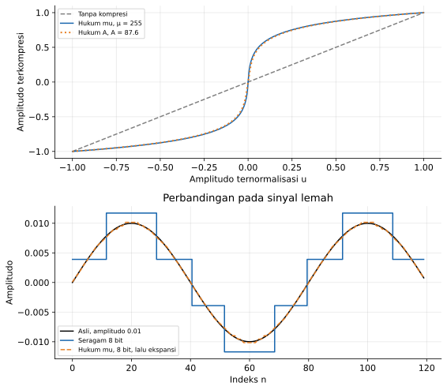

Program [10_companding.py](../Kode/pertemuan-02/10_companding.py) membandingkan kuantisasi seragam dengan kompresi hukum $\mu$, kuantisasi, dan ekspansi. Program ini merupakan model matematis companding, bukan implementasi pengemasan bit dari suatu standar telekomunikasi tertentu.

Companding tidak selalu meningkatkan kualitas untuk semua amplitudo dan semua tujuan pengukuran. Untuk instrumentasi yang memerlukan ketelitian absolut seragam, kuantisasi seragam dapat lebih sesuai, sedangkan kuantisasi tidak seragam berguna ketika ketelitian relatif pada sinyal lemah lebih penting.

---

## Menggabungkan konsep dalam satu sistem akuisisi

Sebagai penutup alur materi, tinjau pengukuran getaran yang menghasilkan tegangan $x_a(t)=0.5\cos(2\pi\cdot500t)+0.2\cos(2\pi\cdot1200t)\ \mathrm{V}$. Sinyal tersebut akan dicuplik, dikuantisasi, dikodekan, lalu dihaluskan menggunakan sistem rekursif.

### Memilih parameter konversi

Frekuensi tertinggi model sinyal adalah $1200\ \mathrm{Hz}$ dan amplitudo mutlaknya tidak melebihi $0.7\ \mathrm{V}$. Kita memilih $f_s=5000\ \mathrm{Hz}$ serta ADC 10 bit dengan rentang nominal $-1$ sampai $1\ \mathrm{V}$.

```math
T_s=\frac1{5000}=0.2\ \mathrm{ms},
\qquad
f_s/2=2500\ \mathrm{Hz},
\qquad
\Delta=\frac2{1024}=1.953125\ \mathrm{mV}.
```

Pilihan tersebut memenuhi syarat sampling untuk sinyal model dan menyediakan cadangan amplitudo sebelum saturasi. Filter analog tetap diperlukan untuk mengurangi komponen gangguan di luar pita, dengan daerah transisi yang mempertimbangkan batas antara pita sinyal dan frekuensi Nyquist.

Batas galat kuantisasi idealnya adalah $0.9765625\ \mathrm{mV}$, sedangkan laju data satu kanalnya $10\cdot5000=50{,}000\ \mathrm{bit/s}$. Angka-angka ini menilai aspek yang berbeda, yaitu resolusi amplitudo dan kebutuhan transmisi.

Pada $n=0$, masukan bernilai $0.7\ \mathrm{V}$, sehingga indeksnya adalah $\lfloor(0.7+1)/(2/1024)\rfloor=870$. Nilai perwakilan dan galat sampel pertamanya adalah sebagai berikut.

```math
x_q[0]=-1+\frac{870.5}{512}=0.7001953125\ \mathrm{V},
\qquad
e_q[0]=0.0001953125\ \mathrm{V}.
```

### Mengolah sampel dengan sistem rekursif

Gunakan aturan $y[n]=0.75y[n-1]+0.25x_q[n]$ dengan $y[-1]=0$. Keluaran pertama adalah $y[0]=0.175048828125\ \mathrm{V}$, sedangkan keluaran berikutnya memadukan sampel baru dan keadaan yang tersimpan.

Blok penghalus tersebut linear dalam keadaan awal nol, invarian waktu, kausal, memiliki memori, dan stabil karena faktor rekursinya bernilai $0.75$. Namun, keseluruhan rangkaian yang mencakup kuantisator tidak linear, sebab pembulatan amplitudo tidak memenuhi prinsip superposisi.

Pemilihan penghalus juga memengaruhi kemampuan mengikuti perubahan sinyal, sehingga koefisien tidak hanya dipilih berdasarkan kestabilan. Analisis lebih lanjut tentang respons terhadap berbagai frekuensi akan dikembangkan setelah pembahasan konvolusi dan representasi Fourier pada pertemuan berikutnya.

---

## Latihan hitungan tangan

Kerjakan sepuluh soal berikut dengan memperlihatkan langkah perhitungan dan alasan setiap kesimpulan. Gunakan konvensi kuantisator mid-rise pada catatan ini kecuali jika soal secara eksplisit menyatakan konvensi yang berbeda.

### 1. Linearitas dan invariansi waktu

Tinjau tiga sistem $y_1[n]=2x[n]-x[n-2]$, $y_2[n]=x^2[n]$, dan $y_3[n]=(n+1)x[n]$. Tentukan linearitas dan invariansi waktu masing-masing sistem dengan pembuktian aljabar atau contoh penyangkal, bukan hanya berdasarkan bentuk persamaannya.

### 2. Memori, kausalitas, dan invertibilitas

Tinjau $y_1[n]=3x[n]$, $y_2[n]=x[n-2]$, dan $y_3[n]=x[n]-x[n-1]$. Tentukan sifat memori dan kausalitas ketiganya, lalu tuliskan inversnya atau jelaskan informasi tambahan yang diperlukan agar invers dapat ditentukan.

Untuk sistem ketiga, diketahui $x[-1]=4$ dan keluaran pada $n=0,1,2,3$ adalah $[2,-1,0,3]$. Hitung kembali empat sampel masukannya dan jelaskan mengapa tanpa $x[-1]$ jawabannya tidak unik.

### 3. Stabilitas BIBO

Periksa kestabilan $y_1[n]=2x[n]+3x[n-1]$, $y_2[n]=x^2[n]$, dan $y_3[n]=\sum_{k=0}^{n}x[k]$ untuk $n\ge0$. Untuk sistem stabil, berikan batas keluaran dalam fungsi batas masukan $M_x$; untuk sistem tidak stabil, berikan satu masukan terbatas yang menghasilkan keluaran tak terbatas.

### 4. Diagram blok dan perhitungan maju

Gambarkan realisasi $y[n]=0.5y[n-1]+x[n]-0.25x[n-1]$ menggunakan penjumlah, pengali konstanta, dan unit delay. Dengan $x[-1]=0$, $y[-1]=2$, serta $x[0],\ldots,x[4]=[1,2,0,-1,0]$, hitung $y[0]$ sampai $y[4]$ dan tuliskan isi setiap penunda setelah setiap langkah.

### 5. Solusi homogen, partikular, dan kondisi awal

Selesaikan $y[n]-y[n-1]+0.25y[n-2]=1$ untuk $n\ge0$ dengan $y[-1]=y[-2]=0$. Tentukan akar karakteristik, bentuk solusi homogen, satu solusi partikular, dan konstanta solusi total, lalu cocokkan tiga keluaran pertama dengan iterasi langsung.

### 6. Sampling dan aliasing

Sinyal analog adalah $x_a(t)=2\cos(2\pi\cdot120t)+\sin(2\pi\cdot380t)$ dan disampling pada $f_s=500\ \mathrm{Hz}$. Hitung $T_s$, frekuensi Nyquist, frekuensi sudut diskret setiap komponen, serta frekuensi alias nonnegatifnya dengan memperhatikan perubahan tanda pada komponen sinus.

Tentukan pula laju Nyquist sinyal analog semula dan usulkan satu frekuensi sampling yang memenuhi syarat pita dasar. Jelaskan mengapa penyaringan digital setelah sampling tidak dapat mengembalikan identitas frekuensi yang sudah ambigu tanpa informasi tambahan.

### 7. Sample-and-hold

Sinyal $x_a(t)=2\sin(2\pi\cdot10t)$ disampling pada $f_s=80\ \mathrm{Hz}$. Hitung lima sampel pertama, gambarkan model penahanan orde nol sampai $t=5T_s$, dan tentukan nilai yang ditahan pada $t=18\ \mathrm{ms}$ serta $t=44\ \mathrm{ms}$.

### 8. Tingkat kuantisasi, galat, dan kode

Gunakan ADC mid-rise 3 bit dengan rentang $[-4,4)\ \mathrm{V}$ untuk mengkuantisasi $[-4,-3.2,-0.1,0,1.9,3.9,4.8]\ \mathrm{V}$. Buat tabel yang memuat indeks tingkat, nilai perwakilan, galat $x_q-x$, dan kode biner, lalu tandai sampel yang mengalami kelebihan rentang dan periksa batas $\Delta/2$.

### 9. Resolusi, SQNR, dan kebutuhan penyimpanan

Sebuah sistem menggunakan ADC 12 bit, rentang $[-5,5)\ \mathrm{V}$, dua kanal, dan frekuensi sampling $16\ \mathrm{kHz}$ per kanal. Hitung langkah kuantisasi, batas galat ideal, perkiraan SQNR sinusoid dengan amplitudo puncak $2.5\ \mathrm{V}$, dan kebutuhan penyimpanan selama 10 sekon jika bit dikemas rapat maupun jika setiap sampel disimpan dalam 16 bit.

### 10. Perancangan sederhana akuisisi dan penghalusan

Sensor menghasilkan tegangan dengan frekuensi tertinggi $1.5\ \mathrm{kHz}$ dan amplitudo pada rentang $[-2,2]\ \mathrm{V}$. Pilih $f_s$ dari $\{2,4,8\}\ \mathrm{kHz}$ serta jumlah bit dari $\{8,10,12\}$ untuk ADC rentang $[-2.5,2.5)\ \mathrm{V}$ agar syarat sampling terpenuhi dan galat kuantisasi ideal tidak melebihi $3\ \mathrm{mV}$, kemudian hitung laju data minimum di antara pilihan yang memenuhi syarat.

Setelah konversi, gunakan $y[n]=0.6y[n-1]+0.4x_q[n]$ dengan keadaan awal nol. Buktikan kestabilan blok penghalus tersebut dan jelaskan fungsi filter antialiasing yang tetap diperlukan sebelum sampling.

---

## Latihan pemrograman

Kerjakan paling banyak sepuluh tugas berikut menggunakan NumPy dan Matplotlib. Setiap jawaban perlu menyertakan program yang dapat dijalankan, grafik berlabel dan bersatuan jika relevan, serta penjelasan hasil dalam sedikitnya dua kalimat.

### 1. Penguji superposisi

Buat fungsi yang membandingkan $\mathcal{T}\{\alpha x_1+\beta x_2\}$ dengan $\alpha\mathcal{T}\{x_1\}+\beta\mathcal{T}\{x_2\}$ untuk sistem $2x[n]-x[n-1]$, $x^2[n]$, dan $x[n]+1$. Gunakan beberapa pasangan sinyal dengan pembangkit acak yang diberi seed, tampilkan galat maksimum, dan jelaskan mengapa hasil numerik yang mendukung linearitas belum merupakan pembuktian untuk semua masukan.

### 2. Penguji invariansi waktu

Bandingkan dua urutan operasi pergeseran dan pemrosesan untuk $y[n]=x[n]+x[n-2]$ serta $y[n]=\cos(0.2n)x[n]$. Gunakan fungsi sinyal yang terdefinisi untuk semua indeks pengujian, hindari pergeseran melingkar, dan tunjukkan hasil untuk sedikitnya tiga nilai pergeseran.

### 3. Eksperimen kausalitas dan memori

Buat dua masukan yang sama sampai indeks $n_0=10$ tetapi berbeda sesudahnya, lalu olah dengan rata-rata kausal tiga sampel dan rata-rata terpusat tiga sampel. Gambarkan masukan serta kedua pasangan keluaran, identifikasi indeks pertama terjadinya perbedaan keluaran, dan hubungkan hasilnya dengan definisi kausalitas serta memori.

### 4. Simulator persamaan selisih umum

Implementasikan fungsi yang menerima koefisien $a$, $b$, masukan, dan riwayat awal tanpa menggunakan fungsi filter siap pakai. Uji fungsi tersebut pada soal hitungan tangan nomor 4 dan 5, lalu tambahkan pemeriksaan bahwa $a_0$ tidak nol dan panjang riwayat sesuai dengan kebutuhan persamaan.

### 5. Kondisi awal dan solusi analitis

Untuk $y[n]=0.7y[n-1]+0.3x[n]$ dengan masukan tangga satuan, bandingkan keadaan awal $y[-1]\in\{0,2,-2\}$. Tampilkan respons masukan-nol, keadaan-nol, dan total, kemudian periksa dengan `np.allclose` bahwa hasil iterasi sama dengan rumus analitis pada seluruh sampel yang dihitung.

### 6. Galeri aliasing

Sampling kosinus dengan frekuensi $20$, $70$, $130$, dan $170\ \mathrm{Hz}$ pada $f_s=100\ \mathrm{Hz}$. Hitung frekuensi alias menggunakan rumus pelipatan, tampilkan kurva analog dan sampelnya, lalu kelompokkan sinyal yang menghasilkan deretan sampel identik untuk fase awal nol.

### 7. Sample-and-hold dan galat bentuk tangga

Bandingkan penahanan orde nol untuk sinusoid $5\ \mathrm{Hz}$ pada $f_s=20$, $40$, dan $100\ \mathrm{Hz}$. Hitung galat kuadrat rata-rata antara kurva tangga dan sinusoid pada kisi waktu rapat, serta jelaskan mengapa galat ini bukan galat kuantisasi dan tidak berarti teorema sampling gagal.

### 8. Kuantisator dan saturasi

Buat kuantisator mid-rise yang dapat diatur jumlah bit dan rentangnya, lalu uji untuk 2, 4, dan 8 bit. Periksa galat maksimum pada masukan dalam rentang, tambahkan masukan di luar rentang untuk menunjukkan saturasi, dan cetak kata biner dengan panjang tepat $B$ bit termasuk nol di depan.

### 9. Pengujian SQNR dan companding

Bandingkan kuantisasi seragam 8 bit dengan model companding hukum $\mu$ untuk sinusoid dengan amplitudo puncak $0.01$, $0.1$, dan $0.8$ pada rentang ternormalisasi $[-1,1)$. Ukur SQNR setelah ekspansi, gambarkan perbandingannya, dan jelaskan pertukaran ketelitian antara amplitudo kecil dan besar tanpa mengasumsikan bahwa companding selalu lebih baik.

### 10. Simulasi rantai akuisisi lengkap

Simulasikan studi kasus getaran pada bagian sebelumnya, mulai dari pembangkitan sampel, kuantisasi 10 bit, pengkodean biner, hingga penghalusan $y[n]=0.75y[n-1]+0.25x_q[n]$. Bandingkan pengolahan seluruh rekaman dengan pengolahan per blok sambil meneruskan keadaan terakhir, lalu tunjukkan bahwa hasilnya sama ketika riwayat tidak direset di setiap batas blok.

---

## Rangkuman

Sistem menyatakan aturan yang menghubungkan sinyal masukan dan keluaran, dan sifatnya perlu diuji satu per satu. Linearitas, invariansi waktu, memori, kausalitas, invertibilitas, serta stabilitas menjawab pertanyaan yang berbeda dan tidak dapat disimpulkan hanya dari satu label seperti linear atau rekursif.

Penjumlah, pengali, dan penunda membentuk realisasi dasar sistem waktu-diskret. Diagram blok dapat diterjemahkan menjadi persamaan selisih, tetapi keluaran baru terdefinisi secara lengkap setelah masukan, kondisi awal, dan konvensi indeks dinyatakan.

Persamaan selisih dapat diselesaikan melalui iterasi atau melalui gabungan solusi homogen dan partikular. Pemisahan tersebut perlu dibedakan dari respons masukan-nol dan keadaan-nol, karena solusi partikular belum tentu memenuhi keadaan awal nol.

Sampling membuat waktu menjadi diskret, kuantisasi membatasi kemungkinan amplitudo, dan pengkodean memberi label digital pada tingkat yang terpilih. Aliasing terkait dengan ketidakunikan informasi frekuensi setelah sampling, sedangkan galat kuantisasi terkait dengan kehilangan ketelitian amplitudo setelah pemetaan ke tingkat berhingga.

Perancangan sistem akuisisi memerlukan pemilihan bersama atas filter analog, frekuensi sampling, rentang tegangan, jumlah bit, dan aturan pengolahan digital. Pada pertemuan berikutnya, hubungan masukan-keluaran sistem LTI akan diperdalam melalui respons impuls, konvolusi, korelasi, dan interkoneksi sistem.

---

## Referensi

Urutan pokok materi mengikuti cuplikan buku yang disertakan untuk penyusunan catatan ini, khususnya bagian 2.1, 2.2, 3.1, 3.2, dan 3.3. Penjelasan, ilustrasi, serta program ditulis ulang sebagai bahan kuliah, dengan konvensi indeks dan kuantisasi dinyatakan secara eksplisit agar dapat diuji kembali.

1. D. Gunawan dan F. H. Juwono, *Dasar Pengolahan Sinyal Digital*, cuplikan Bab 2 dan Bab 3 pada berkas `bab-buku-02-03.pdf`; bagian 2.1 Pendahuluan, 2.2 Klasifikasi Sistem, 3.1 Komponen Dasar Sistem, 3.2 Persamaan Selisih, dan 3.3 Konversi Sinyal Analog ke Digital.
2. [Silabus pada README repositori signal-processing](https://github.com/artnugraha/signal-processing/blob/main/README.md), acuan cakupan pertemuan dan kesinambungan antarkuliah.
3. [Catatan Kuliah Pertemuan 1](https://github.com/artnugraha/signal-processing/blob/main/Catatan-Kuliah/pertemuan-01.md), acuan hierarki judul, penggunaan blok matematika, dan pola penyajian contoh serta latihan.
4. Walt Kester, [MT-001: Taking the Mystery out of the Infamous Formula, SNR = 6.02N + 1.76dB](https://www.analog.com/media/en/training-seminars/tutorials/MT-001.pdf), Analog Devices; rujukan tambahan untuk asumsi model derau kuantisasi dan batas penggunaan rumus SQNR.
5. Analog Devices, [Basics of Band-Limited Sampling and Aliasing](https://www.analog.com/en/resources/technical-articles/basics-of-bandlimited-sampling-and-aliasing.html); rujukan tambahan untuk hubungan sampling, salinan spektrum, dan sinyal pita lewat.

Seluruh contoh Python pada catatan ini menggunakan NumPy dan Matplotlib, tanpa ketergantungan pada SciPy. Berkas mandiri tersedia di direktori `Kode/pertemuan-02`, sedangkan setiap ilustrasi disertakan dalam format SVG dan PNG di direktori `Gambar/pertemuan-02`.
