# Kuliah 3: Konvolusi, Korelasi, dan Interkoneksi Sistem LTI

## Tujuan pembelajaran

Pada pertemuan sebelumnya, kita telah mengenali sifat sistem, komponen diagram blok, serta persamaan selisih. Pada pertemuan ini, seluruh gagasan tersebut dipertemukan melalui respons impuls, konvolusi, korelasi, dan interkoneksi sistem *linear time-invariant* (LTI).

Setelah mengikuti kuliah ini, mahasiswa diharapkan mampu menghubungkan bentuk matematis suatu operasi dengan makna fisis dan algoritma komputasinya. Kemampuan yang dituju dirangkum dalam daftar berikut.

- menjelaskan alasan respons impuls mencirikan sebuah sistem LTI;
- menurunkan penjumlahan konvolusi dari dekomposisi sinyal menjadi impuls tergeser;
- menghitung konvolusi linear secara aljabar dan secara grafis;
- menerapkan sifat komutatif, asosiatif, dan distributif pada konvolusi;
- membedakan konvolusi linear dan konvolusi siklik;
- menghitung korelasi silang, koefisien korelasi, dan autokorelasi;
- menjelaskan pengaruh *lag* dan efek akhir terhadap hasil korelasi;
- menggunakan korelasi untuk menaksir waktu tunda pada radar atau sonar;
- menyederhanakan interkoneksi LTI berbentuk seri, paralel, dan gabungan;
- mengenali notasi ringkas untuk operasi sinyal waktu-diskret;
- menghitung integral konvolusi sinyal waktu-kontinu; dan
- memeriksa hasil analitik dengan NumPy dan Matplotlib.

---

## Pentingnya sistem LTI

Sistem LTI penting karena dua sifatnya bekerja bersama. Linearitas memungkinkan suatu masukan diuraikan menjadi komponen-komponen sederhana, sedangkan invariansi waktu memungkinkan respons terhadap komponen yang digeser diperoleh dengan menggeser respons yang telah diketahui.

Sistem praktis tidak selalu linear dan invarian terhadap waktu secara sempurna. Namun, model LTI tetap berguna ketika penyimpangan dari kedua sifat tersebut cukup kecil dalam rentang operasi dan toleransi galat aplikasi.

Misalkan $h[n]$ adalah keluaran sistem ketika masukannya berupa impuls satuan $\delta[n]$. Sinyal $h[n]$ disebut **respons impuls**, dan hubungan dasarnya dinyatakan sebagai berikut.

```math
\delta[n]\;\longrightarrow\;h[n].
```

Karena sistem invarian terhadap waktu, penundaan impuls sebanyak $k$ sampel juga menunda respons sebanyak $k$ sampel. Hubungan ini merupakan jembatan pertama menuju konvolusi.

Linearitas melengkapi hubungan tersebut dengan aturan superposisi. Jika masukan merupakan $\sum_{i=M}^{N}x_i[n]$ dan respons terhadap $x_i[n]$ adalah $y_i[n]$, keluarannya adalah $\sum_{i=M}^{N}y_i[n]$.

| Masukan | Keluaran |
|---|---|
| $\delta[n]$ | $h[n]$ |
| $\delta[n-1]$ | $h[n-1]$ |
| $\delta[n-2]$ | $h[n-2]$ |
| $\delta[n-3]$ | $h[n-3]$ |
| $\delta[n-k]$ | $h[n-k]$ |

Setiap baris pada tabel menyatakan invariansi waktu, sedangkan penggabungan beberapa baris dengan bobot tertentu akan menggunakan linearitas.

Sebagai contoh, tinjau masukan yang hanya mempunyai lima sampel tak nol berikut. Berdasarkan homogenitas dan aditivitas, keluarannya dapat langsung ditulis sebagai kombinasi respons impuls yang bersesuaian.

```math
\begin{aligned}
x[n]={}&3{,}1\,\delta[n+2]+0{,}2\,\delta[n]
       +1{,}4\,\delta[n-3]\\
     &+0{,}9\,\delta[n-6]+1{,}1\,\delta[n-9],\\[2mm]
y[n]={}&3{,}1\,h[n+2]+0{,}2\,h[n]
       +1{,}4\,h[n-3]\\
     &+0{,}9\,h[n-6]+1{,}1\,h[n-9].
\end{aligned}
```

Contoh tersebut belum memerlukan bentuk numerik $h[n]$, tetapi menunjukkan bahwa sekali respons impuls diketahui, keluaran akibat setiap masukan dapat disusun dari respons-respons impuls yang diskalakan dan digeser.

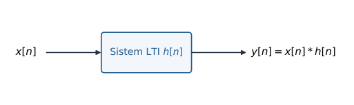

Diagram ini menunjukkan bahwa kotak sistem dapat berisi penjumlah, pengali, dan unit *delay*, tetapi hubungan masukan-keluarannya cukup diwakili oleh $h[n]$.

---

## Konvolusi waktu-diskret

### Dekomposisi impuls sebuah sinyal

Setiap sinyal waktu-diskret dapat ditulis sebagai penjumlahan impuls yang digeser dan diberi bobot. Bobot impuls pada lokasi $k$ tepat sama dengan nilai sampel $x[k]$.

```math
x[n]=\sum_{k=-\infty}^{\infty}x[k]\,\delta[n-k].
\tag{1}
```

Untuk memahami persamaan ini, tetapkan suatu indeks pengamatan $n=n_0$. Semua suku bernilai nol kecuali suku $k=n_0$, sehingga ruas kanan menjadi $x[n_0]\delta[0]=x[n_0]$.

Jika Persamaan (1) diberikan kepada sistem LTI, linearitas mengizinkan operator sistem bekerja pada setiap suku secara terpisah. Invariansi waktu kemudian mengubah $\delta[n-k]$ menjadi $h[n-k]$, sehingga keluaran menjadi penjumlahan konvolusi berikut.

```math
\begin{aligned}
y[n]
&=\mathcal{H}\{x[n]\}\\
&=\sum_{k=-\infty}^{\infty}x[k]h[n-k].
\end{aligned}
\tag{2}
```

Pada salah satu buku acuan (Gunawan-Juwono), konvolusi dilambangkan dengan simbol berbentuk lingkaran bersilang. Dalam catatan ini kita memakai tanda bintang $*$ karena notasi tersebut umum digunakan dalam literatur dan perangkat lunak.

```math
y[n]=x[n]*h[n].
\tag{3}
```

Impuls satuan bertindak sebagai unsur identitas konvolusi. Jika $x[n]=\delta[n]$, hanya suku $k=0$ yang bertahan pada Persamaan (2), sehingga diperoleh hubungan berikut.

```math
\delta[n]*h[n]=h[n].
\tag{4}
```

Hubungan tersebut menjelaskan mengapa $h[n]$ disebut respons impuls. Impuls tidak mengubah bentuk respons sistem melalui konvolusi, sehingga keluaran yang terlihat adalah karakteristik sistem itu sendiri.

### Langkah grafis konvolusi

Penjumlahan konvolusi dapat dibaca sebagai prosedur **lipat(cerminkan)–geser–kali–jumlah**. Variabel $k$ adalah indeks semu yang dijumlahkan, sedangkan $n$ adalah indeks keluaran yang sedang dihitung.

1. Substitusikan $n=k$ pada kedua sinyal sehingga diperoleh $x[k]$ dan $h[k]$.
2. Lipat $h[k]$ terhadap $k=0$ sehingga diperoleh $h[-k]$.
3. Geser hasil pelipatan sejauh $n$ untuk memperoleh $h[n-k]$.
4. Kalikan titik demi titik sehingga diperoleh $v_n[k]=x[k]h[n-k]$.
5. Jumlahkan seluruh nilai $v_n[k]$ untuk memperoleh $y[n]$.

Urutan tersebut penting karena pergeseran dilakukan sesudah pelipatan. Jika urutannya terbalik tanpa memperhatikan tanda, posisi $h[n-k]$ dapat salah dan keluaran yang diperoleh tidak lagi merupakan konvolusi yang dimaksud.

### Contoh 1: konvolusi dua barisan berhingga

Diberikan dua barisan yang indeks nolnya berada pada elemen pertama. Kita akan menghitung $y[n]=x[n]*h[n]$ secara langsung.

```math
x[n]=\{\underset{\uparrow n=0}{-2},0,1,-1,3\},
\qquad
h[n]=\{\underset{\uparrow n=0}{1},2,0,-1\}.
```

Karena $x[k]$ hanya tak nol pada $0\leq k\leq4$ dan $h[n]$ hanya tak nol pada $0\leq n\leq3$, keluaran hanya mungkin tak nol pada $0\leq n\leq7$. Setiap sampel keluaran dihitung dengan mempertahankan indeks $k$ pada $x[k]$ dan membaca indeks pasangan $n-k$ pada $h[n-k]$.

```math
\begin{aligned}
y[0]
&=x[0]h[0]+x[1]h[-1]+x[2]h[-2]+x[3]h[-3]+x[4]h[-4]\\
&=(-2)(1)+(0)(0)+(1)(0)+(-1)(0)+(3)(0)=-2,\\[1mm]
y[1]
&=x[0]h[1]+x[1]h[0]+x[2]h[-1]+x[3]h[-2]+x[4]h[-3]\\
&=(-2)(2)+(0)(1)+(1)(0)+(-1)(0)+(3)(0)=-4,\\[1mm]
y[2]
&=x[0]h[2]+x[1]h[1]+x[2]h[0]+x[3]h[-1]+x[4]h[-2]\\
&=(-2)(0)+(0)(2)+(1)(1)+(-1)(0)+(3)(0)=1,\\[1mm]
y[3]
&=x[0]h[3]+x[1]h[2]+x[2]h[1]+x[3]h[0]+x[4]h[-1]\\
&=(-2)(-1)+(0)(0)+(1)(2)+(-1)(1)+(3)(0)=3.
\end{aligned}
```

Empat sampel berikutnya dihitung dengan pola yang sama. Penulisan suku bernilai nol tetap dipertahankan agar hubungan pasangan indeks mudah diperiksa.

```math
\begin{aligned}
y[4]
&=(-2)(0)+(0)(-1)+(1)(0)+(-1)(2)+(3)(1)=1,\\
y[5]
&=(-2)(0)+(0)(0)+(1)(-1)+(-1)(0)+(3)(2)=5,\\
y[6]
&=(-2)(0)+(0)(0)+(1)(0)+(-1)(-1)+(3)(0)=1,\\
y[7]
&=(-2)(0)+(0)(0)+(1)(0)+(-1)(0)+(3)(-1)=-3.
\end{aligned}
```

Dengan demikian, hasil akhirnya adalah barisan berikut. Indeks nol tetap terletak pada elemen pertama.

```math
y[n]=\{\underset{\uparrow n=0}{-2},-4,1,3,1,5,1,-3\}.
```

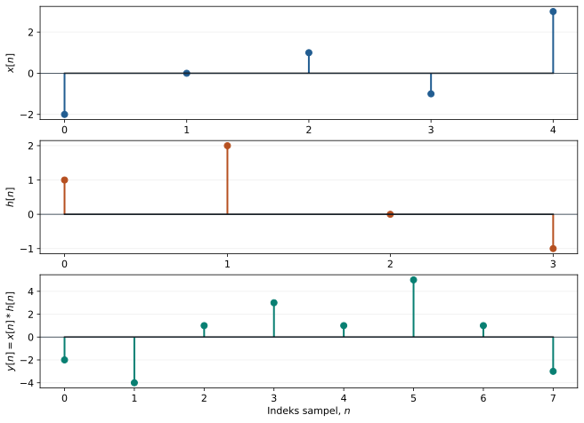

Grafik memperlihatkan bahwa dukungan keluaran lebih panjang daripada masing-masing masukan. Setiap nilai $y[n]$ merupakan jumlah produk sampel yang saling tumpang tindih pada posisi tersebut.

Program berikut memeriksa hitungan dengan `numpy.convolve`. Berkas lengkap yang sekaligus menghasilkan gambar tersedia pada [`01_konvolusi_diskret.py`](../Kode/pertemuan-03/01_konvolusi_diskret.py).

```python
import numpy as np

x = np.array([-2, 0, 1, -1, 3])
h = np.array([1, 2, 0, -1])
y = np.convolve(x, h)

print(y)
# [-2 -4  1  3  1  5  1 -3]
```

Jika panjang $x[n]$ adalah $N_1$ dan panjang $h[n]$ adalah $N_2$, panjang konvolusi linearnya adalah sebagai berikut. Rumus ini berlaku ketika kedua barisan berhingga dan sampel pertama serta terakhir yang dinyatakan memang termasuk dukungan sinyal.

```math
N=N_1+N_2-1.
\tag{5}
```

Pada contoh di atas, $N_1=5$ dan $N_2=4$. Karena itu, panjang keluarannya adalah $5+4-1=8$ sampel, sesuai dengan hasil perhitungan.

### Contoh 2: konvolusi dengan metode grafis

Tinjau dua barisan berikut. Barisan pertama memiliki panjang dua, sedangkan respons impuls memiliki satu nilai nol di antara sampel-sampel tak nolnya.

```math
x[n]=\{\underset{\uparrow n=0}{1},1\},
\qquad
h[n]=\{\underset{\uparrow n=0}{1},0,1,1\}.
```

Panjang hasilnya adalah $2+4-1=5$ sampel. Untuk setiap $n$, kita melipat $h[k]$, menggesernya menjadi $h[n-k]$, mengalikan dengan $x[k]$, lalu menjumlahkan hasil kali yang tak nol.

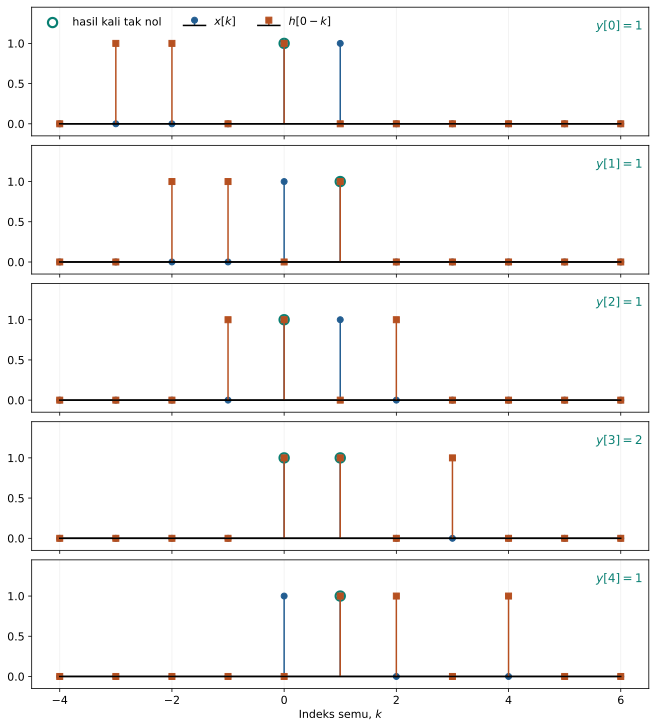

Lingkaran hijau menandai produk yang tak nol, sedangkan angka di kanan setiap panel adalah jumlah produk pada *lag* tersebut.

```math
\begin{aligned}
y[0]&=1,\\
y[1]&=1,\\
y[2]&=1,\\
y[3]&=2,\\
y[4]&=1.
\end{aligned}
```

Dengan demikian, $y[n]=\{\underset{\uparrow n=0}{1},1,1,2,1\}$. Kode lengkap untuk menghasilkan setiap posisi geser tersedia pada [`02_konvolusi_grafis.py`](../Kode/pertemuan-03/02_konvolusi_grafis.py).

### Sifat-sifat operasi konvolusi

Konvolusi mempunyai tiga sifat aljabar utama yang digunakan dalam analisis dan penyederhanaan interkoneksi sistem. Ketiga sifat berikut muncul dalam urutan yang sama dengan buku acuan.

**Komutatif.** Urutan kedua sinyal dapat dipertukarkan tanpa mengubah hasil, karena penggantian variabel penjumlahan mengubah satu bentuk menjadi bentuk lainnya.

```math
x_1[n]*x_2[n]=x_2[n]*x_1[n].
\tag{6}
```

**Asosiatif.** Jika tiga sinyal dikonvolusikan, pengelompokan dua operasi pertama tidak memengaruhi hasil akhir. Sifat ini memungkinkan beberapa sistem seri diganti oleh satu respons impuls ekuivalen.

```math
\bigl(x_1[n]*x_2[n]\bigr)*x_3[n]
=x_1[n]*\bigl(x_2[n]*x_3[n]\bigr).
\tag{7}
```

**Distributif.** Konvolusi terhadap penjumlahan dapat dipecah menjadi jumlah dua konvolusi. Sifat ini menjadi dasar penyederhanaan cabang-cabang sistem paralel.

```math
x_1[n]*\bigl(x_2[n]+x_3[n]\bigr)
=x_1[n]*x_2[n]+x_1[n]*x_3[n].
\tag{8}
```

Ketiga sifat ini bukan sekadar manipulasi simbol. Pada implementasi, kita dapat memilih urutan konvolusi yang lebih hemat komputasi atau menggabungkan blok sistem sebelum memproses sinyal masukan.

### Konvolusi siklik

Jika dua sinyal periodik dikonvolusikan, evaluasi dilakukan dalam satu periode dan indeks yang melewati batas periode dilipat kembali. Operasi ini disebut **konvolusi siklik** atau **konvolusi melingkar**.

Panjang dua barisan disamakan dengan penambahan nol sebelum melakukan operasi siklik. Jika panjang semula adalah $N_1$ dan $N_2$, pemilihan $N=N_1+N_2-1$ membuat konvolusi siklik identik dengan konvolusi linear yang tidak mengalami pelipatan waktu.

#### Contoh 3: konvolusi siklik

Diberikan satu periode dari dua sinyal $x[n]=\{1,2,3\}$ dan $h[n]=\{2,1\}$. Setelah penambahan nol, keduanya menjadi barisan panjang empat berikut.

```math
x[n]=\{\ldots,1,2,3,0,\ldots\},
\qquad
h[n]=\{\ldots,2,1,0,0,\ldots\}.
```

Pada setiap *lag*, indeks $h[n-k]$ dibaca secara modulo empat. Perhitungan satu periodenya mengikuti urutan contoh berikut.

```math
\begin{aligned}
y_c[0]&=(1)(2)+(2)(0)+(3)(0)+(0)(1)=2,\\
y_c[1]&=(1)(1)+(2)(2)+(3)(0)+(0)(0)=5,\\
y_c[2]&=(1)(0)+(2)(1)+(3)(2)+(0)(0)=8,\\
y_c[3]&=(1)(0)+(2)(0)+(3)(1)+(0)(2)=3.
\end{aligned}
```

Hasilnya adalah $y_c[n]=\{2,5,8,3\}$ dan berulang setiap empat sampel. Jadi, $y_c[4]=y_c[0]$, $y_c[5]=y_c[1]$, dan seterusnya.

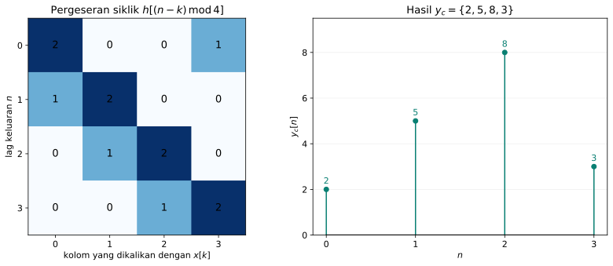

Panel kiri menunjukkan gagasan *window* dan pergeseran siklik, setiap baris adalah $h[(n-k)\bmod4]$. Sementara itu, panel kanan memperlihatkan hasil penjumlahannya.

Konvolusi siklik panjang $N$ dituliskan dengan simbol $\circledast_N$. Notasi dan bentuk penjumlahannya dinyatakan sebagai berikut.

```math
y_c[n]=h[n]\circledast_N x[n]
=\sum_{k=0}^{N-1}x[k]h[(n-k)\bmod N].
\tag{9}
```

Operasi tersebut dapat ditulis dalam bentuk matriks sirkulan. Setiap baris matriks merupakan pergeseran siklik satu sampel dari baris sebelumnya.

```math
\begin{bmatrix}
y_c[0]\\y_c[1]\\y_c[2]\\\vdots\\y_c[N-1]
\end{bmatrix}
=
\begin{bmatrix}
h[0] & h[N-1] & h[N-2] & \cdots & h[1]\\
h[1] & h[0] & h[N-1] & \cdots & h[2]\\
h[2] & h[1] & h[0] & \cdots & h[3]\\
\vdots & \vdots & \vdots & \ddots & \vdots\\
h[N-1] & h[N-2] & h[N-3] & \cdots & h[0]
\end{bmatrix}
\begin{bmatrix}
x[0]\\x[1]\\x[2]\\\vdots\\x[N-1]
\end{bmatrix}.
\tag{10}
```

Untuk contoh panjang empat, bentuk matriksnya menjadi sangat konkret. Perkalian matriks berikut menghasilkan nilai yang sama dengan pergeseran grafis.

```math
\begin{bmatrix}y_c[0]\\y_c[1]\\y_c[2]\\y_c[3]\end{bmatrix}
=
\begin{bmatrix}
2&0&0&1\\
1&2&0&0\\
0&1&2&0\\
0&0&1&2
\end{bmatrix}
\begin{bmatrix}1\\2\\3\\0\end{bmatrix}
=
\begin{bmatrix}2\\5\\8\\3\end{bmatrix}.
```

Penambahan nol hingga $N_1+N_2-1$ bukan syarat umum konvolusi siklik. Panjang itu dipilih ketika kita ingin hasil siklik sama dengan konvolusi linear; pada aplikasi lain, panjang $N$ dapat ditentukan oleh periode atau ukuran transformasi yang digunakan.

Program berikut membentuk matriks sirkulan tanpa fungsi konvolusi siap pakai. Kode lengkap yang menghasilkan gambarnya tersedia pada [`03_konvolusi_siklik.py`](../Kode/pertemuan-03/03_konvolusi_siklik.py).

```python
import numpy as np

x = np.array([1, 2, 3, 0])
h = np.array([2, 1, 0, 0])
N = len(x)

H = np.array([[h[(r-c) % N] for c in range(N)]
              for r in range(N)])
y_c = H @ x

print(H)
print(y_c)  # [2 5 8 3]
```

---
## Korelasi

Konvolusi menjumlahkan hasil kali antara satu sinyal dan versi terlipat serta tergeser dari sinyal lain. **Korelasi** memakai gagasan serupa untuk mengukur derajat kemiripan dua sinyal dan mengekstrak informasi tentang pergeserannya.

### Korelasi silang tanpa pergeseran

Untuk dua barisan real $x_1[n]$ dan $x_2[n]$ yang masing-masing mempunyai $N$ sampel, kita dapat mendefinisikan korelasi silang tanpa pergeseran sebagai rata-rata hasil kali pasangan sampel. Definisi awal tersebut diberikan oleh persamaan berikut.

```math
r_{12}=\frac{1}{N}\sum_{n=0}^{N-1}x_1[n]x_2[n].
\tag{11}
```

Nilai positif yang besar menunjukkan kecenderungan kedua sinyal mempunyai tanda dan pola yang sama pada indeks yang dibandingkan. Nilai negatif yang besar magnitudonya menunjukkan kecenderungan berlawanan tanda, sedangkan nilai dekat nol menunjukkan bahwa hasil kali positif dan negatif saling meniadakan.

#### Contoh 4: korelasi dua data

Tinjau sembilan sampel dari dua sinyal. Indeks dimulai dari 1, sehingga penjumlahan berikut menggunakan sembilan pasangan yang berada pada kolom yang sama.

| $n$ | 1 | 2 | 3 | 4 | 5 | 6 | 7 | 8 | 9 |
|---:|---:|---:|---:|---:|---:|---:|---:|---:|---:|
| $x_1[n]$ | 4 | 2 | -1 | 3 | -2 | -6 | -5 | 4 | 5 |
| $x_2[n]$ | -4 | 1 | 3 | 7 | 4 | -2 | -8 | -2 | 1 |

Substitusi seluruh sampel ke Persamaan (11) menghasilkan perhitungan berikut. Setiap suku mempertahankan pasangan kolom yang sama agar hasilnya dapat diperiksa langsung dari tabel.

```math
\begin{aligned}
r_{12}
&=\frac{1}{9}\bigl[(4)(-4)+(2)(1)+(-1)(3)+(3)(7)\\
&\qquad+(-2)(4)+(-6)(-2)+(-5)(-8)+(4)(-2)+(5)(1)\bigr]\\
&=\frac{45}{9}=5.
\end{aligned}
```

Satu nilai korelasi pada *lag* nol belum cukup untuk mengenali dua pola yang bentuknya sama tetapi posisinya berbeda. Dua rangkaian pulsa, misalnya, dapat saling identik setelah salah satunya digeser walaupun produk pada indeks yang sama kecil.

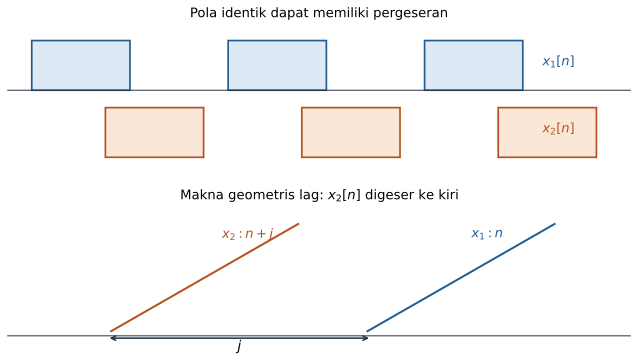

Jika $x_1[n]$ dipakai sebagai referensi, kenaikan *lag* $j$ membuat $x_2[n+j]$ tampak bergeser ke kiri terhadap $x_1[n]$.

### Korelasi sebagai fungsi lag

Untuk menguji berbagai kemungkinan pergeseran, korelasi dihitung sebagai fungsi *lag* $j$. 

```math
\begin{aligned}
r_{12}(j)
&=\frac{1}{N}\sum_{n=0}^{N-1}x_1[n]x_2[n+j]\\
&=r_{21}(-j)
=\frac{1}{N}\sum_{n=0}^{N-1}x_2[n]x_1[n-j].
\end{aligned}
\tag{12}
```

Nilai sampel di luar rekaman berhingga diperlakukan sebagai nol. Dengan konvensi ini, jumlah formal tetap berjalan dari $0$ sampai $N-1$, tetapi hanya pasangan indeks yang sama-sama berada di dalam rekaman yang memberi kontribusi.

Hubungan $r_{12}(j)=r_{21}(-j)$ menunjukkan bahwa pertukaran urutan sinyal membalik sumbu *lag*. Karena itu, tanda posisi puncak korelasi harus selalu ditafsirkan bersama definisi yang dipakai oleh buku atau perangkat lunak.

#### Contoh 5: korelasi pada lag tiga

Kita menggeser $x_2[n]$ ke kiri sebanyak tiga sampel. Enam pasangan yang masih bertumpang tindih ditunjukkan oleh tabel berikut.

| $n$ | 1 | 2 | 3 | 4 | 5 | 6 | 7 | 8 | 9 |
|---:|---:|---:|---:|---:|---:|---:|---:|---:|---:|
| $x_1[n]$ | 4 | 2 | -1 | 3 | -2 | -6 | -5 | 4 | 5 |
| $x_2[n+3]$ | 7 | 4 | -2 | -8 | -2 | 1 | 0 | 0 | 0 |

Dengan normalisasi tetap $1/N=1/9$, perhitungannya adalah sebagai berikut. Tiga pasangan terakhir tidak ditulis karena hasil kalinya dengan nol tidak mengubah jumlah.

```math
\begin{aligned}
r_{12}(3)
&=\frac{1}{9}\bigl[(4)(7)+(2)(4)+(-1)(-2)\\
&\qquad +(3)(-8)+(-2)(-2)+(-6)(1)\bigr]\\
&=\frac{28+8+2-24+4-6}{9}\\
&=\frac{12}{9}=1{,}333\ldots.
\end{aligned}
```

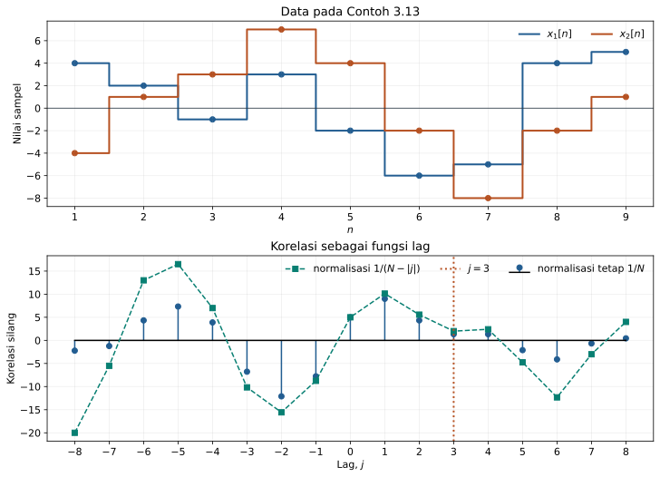

Panel atas menampilkan kembali dua barisan data seperti Contoh 3.13 buku referensi Gunawan-Juwono, sedangkan panel bawah membandingkan pembagi tetap $N$ dengan pembagi sesuai jumlah pasangan $N-|j|$. Garis vertikal menandai $j=3$, sehingga nilai hasil hitungan manual dapat diperiksa langsung terhadap kurva.

### Efek akhir dan faktor koreksi

Ketika $|j|$ membesar, jumlah pasangan sampel yang masih bertumpang tindih berkurang. Keadaan tersebut disebut **efek akhir** (*end effect*), dan penggunaan faktor normalisasi tetap $1/N$ membuat magnitudo korelasi cenderung mengecil walaupun pasangan yang tersisa masih serupa.

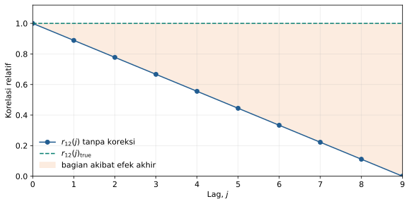

Gambar tersebut menunjukkan korelasi relatif terhadap *lag* dengan nilai yang dinormalisasi. Garis miring menyatakan penurunan akibat jumlah pasangan, sedangkan selisih terhadap garis putus-putus adalah bagian yang ingin dikompensasi.

Penurunan pada ilustrasi tersebut dapat dimodelkan sebagai garis lurus dari $r_{12}(0)$ pada $j=0$ menuju nol pada $j=N$. Berdasarkan geometri segitiga, hubungan yang dituliskan adalah sebagai berikut.

```math
\frac{r_{12}(j)_{\mathrm{true}}-r_{12}(j)}{j}
=\frac{r_{12}(0)}{N}.
\tag{13}
```

Penyusunan ulang Persamaan (13) menghasilkan bentuk faktor koreksi berikut. Suku tambahan $\frac{j}{N}r_{12}(0)$ dimaksudkan untuk mengompensasi penurunan linear pada ilustrasi.

```math
r_{12}(j)_{\mathrm{true}}
=r_{12}(j)+\frac{j}{N}r_{12}(0).
\tag{14}
```

Koreksi ini mengikuti model geometris yang kita tetapkan dan bukan identitas universal bagi setiap pasangan sinyal. Dalam estimasi statistik modern, pilihan yang lazim adalah normalisasi tetap $1/N$ yang sering disebut estimasi *biased*, atau pembagian dengan jumlah pasangan $N-|j|$ yang sering disebut estimasi *unbiased*.

### Koefisien korelasi

Nilai korelasi mentah bergantung pada skala amplitudo kedua sinyal. Agar derajat kemiripan dapat dibandingkan pada skala yang berbeda, kita menormalkan $r_{12}(j)$ dengan akar hasil kali energi rata-rata kedua sinyal.

```math
\rho_{12}(j)
=
\frac{r_{12}(j)}
{\displaystyle
\frac{1}{N}
\left[
\left(\sum_{n=0}^{N-1}x_1^2[n]\right)
\left(\sum_{n=0}^{N-1}x_2^2[n]\right)
\right]^{1/2}}.
\tag{15}
```

Untuk sinyal real dan normalisasi energi yang konsisten, koefisien korelasi berada pada rentang $-1\leq\rho_{12}(j)\leq1$. Nilai $1$ menandakan kesamaan arah sempurna, nilai $-1$ menandakan hubungan sempurna dengan tanda atau fase berlawanan, dan nilai $0$ menandakan tidak ada hubungan linear pada *lag* yang diuji.

Pernyataan “tidak berkorelasi” tidak selalu berarti “bebas secara statistik”. Kebebasan menyiratkan korelasi nol dalam banyak keadaan, tetapi korelasi nol hanya menguji hubungan linear orde dua dan belum membuktikan kebebasan penuh.

### Autokorelasi

Kasus khusus ketika kedua sinyal sama disebut **autokorelasi**. Fungsi autokorelasi dapat diberikan oleh persamaan berikut.

```math
r_{11}(j)
=\frac{1}{N}\sum_{n=0}^{N-1}x_1[n]x_1[n+j].
\tag{16}
```

Autokorelasi mempunyai nilai terbesar pada *lag* nol karena pada posisi itu setiap sampel dikalikan dengan dirinya sendiri. Untuk sinyal real berhingga dengan normalisasi, dua sifat yang disorot adalah sebagai berikut.

```math
r_{11}(0)=\frac{1}{N}\sum_{n=0}^{N-1}x_1^2[n]=S,
\tag{17}
```

```math
r_{11}(0)\geq r_{11}(j).
\tag{18}
```

Besaran $S$ pada Persamaan (17) adalah energi yang dinormalisasi terhadap banyak sampel, sehingga secara numerik berperan sebagai nilai kuadrat rata-rata. Untuk sinyal real, autokorelasi juga bersifat genap, yaitu $r_{11}(j)=r_{11}(-j)$, selama definisi dan batas penjumlahannya diterapkan secara simetris.

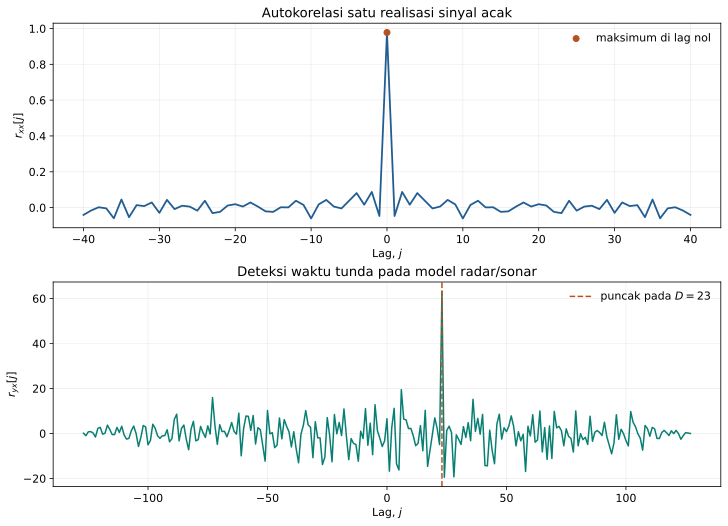

Panel atas menunjukkan puncak autokorelasi terjadi pada *lag* nol, sementara *lag* lain berfluktuasi di sekitar nilai yang lebih kecil. Panel bawah menunjukkan puncak korelasi silang yang menaksir waktu tunda pantulan.

### Korelasi siklik

Jika sinyal yang dikorelasikan periodik, indeks yang keluar dari satu periode dilipat kembali dengan modulo $N$. Panjang dua periode dapat disamakan dengan penambahan nol dan menggunakan $N=N_1+N_2-1$ pada contoh agar kedua barisan mempunyai panjang yang sama.

#### Contoh 6: korelasi siklik

Diberikan $a=\{4,3,1,6\}$ dan $b=\{5,2,3\}$. Setelah penambahan nol, kita memperoleh $a=\{4,3,1,6,0,0\}$ dan $b=\{5,2,3,0,0,0\}$ dengan periode enam.

| *Lag* $j$ | Barisan $b[(n+j)\bmod6]$ | $r_{ab}(j)$ |
|---:|---|---:|
| 0 | $\{5,2,3,0,0,0\}$ | 29 |
| 1 | $\{2,3,0,0,0,5\}$ | 17 |
| 2 | $\{3,0,0,0,5,2\}$ | 12 |
| 3 | $\{0,0,0,5,2,3\}$ | 30 |
| 4 | $\{0,0,5,2,3,0\}$ | 17 |
| 5 | $\{0,5,2,3,0,0\}$ | 35 |
| 6 | $\{5,2,3,0,0,0\}$ | 29, berulang |

Sebagai contoh cara membaca tabel, nilai pada *lag* tiga adalah $4(0)+3(0)+1(0)+6(5)+0(2)+0(3)=30$.

### Aplikasi korelasi pada radar dan sonar

Dalam radar dan sonar, $x[n]$ menyatakan sinyal yang dipancarkan dan $y[n]$ menyatakan sinyal yang diterima. Model sederhana menyatakan sinyal terima sebagai versi yang dilemahkan, ditunda, dan ditambah derau.

```math
y[n]=\alpha x[n-D]+w[n].
\tag{19}
```

Parameter $\alpha$ adalah faktor atenuasi, $D$ adalah waktu tunda dalam satuan sampel, dan $w[n]$ adalah derau. Korelasi silang antara $y[n]$ dan $x[n]$ akan mencapai puncak dekat *lag* $D$, sehingga keberadaan dan jarak target dapat ditaksir.

Jika periode sampling adalah $T_s$ dan kecepatan rambat gelombang adalah $v$, waktu tempuh pulang-pergi diperkirakan sebagai $DT_s$. Untuk radar atau sonar monostatik, jarak satu arah diperoleh dari $d=vDT_s/2$ karena gelombang menempuh lintasan pergi dan kembali.

Program berikut memperlihatkan inti perhitungan korelasi dan deteksi tunda. Kode lengkap yang menghasilkan dua panel pada gambar tersedia pada [`04_korelasi.py`](../Kode/pertemuan-03/04_korelasi.py) dan [`05_autokorelasi_dan_radar.py`](../Kode/pertemuan-03/05_autokorelasi_dan_radar.py).

```python
import numpy as np

rng = np.random.default_rng(17)
N = 128
x = rng.choice([-1.0, 1.0], size=N)
D = 23

y = np.zeros(N)
y[D:] = 0.65 * x[:-D]
y += 0.55 * rng.normal(size=N)

r_yx = np.correlate(y, x, mode="full")
lag = np.arange(-N + 1, N)
D_taksir = lag[np.argmax(r_yx)]

print(D_taksir)  # 23
```

Pada NumPy, urutan argumen `np.correlate(y, x)` menentukan tanda *lag* yang dihasilkan. Karena itu, definisi pustaka harus dicocokkan dengan Persamaan (12) sebelum tanda puncaknya diberi makna fisis.

---

## Interkoneksi sistem LTI

Sebuah sistem besar sering disusun dari beberapa subsistem yang lebih sederhana. Jika semua subsistem LTI, respons impuls ekuivalennya dapat dihitung menggunakan konvolusi dan penjumlahan.

### Hubungan seri

Dua sistem mempunyai hubungan seri atau *cascade* ketika keluaran sistem pertama menjadi masukan sistem kedua. Jika respons impuls kedua sistem berturut-turut adalah $h_1[n]$ dan $h_2[n]$, respons impuls totalnya adalah konvolusi kedua respons tersebut.

```math
h[n]=h_1[n]*h_2[n].
\tag{20}
```

Hasil ini dapat dilihat dengan menuliskan keluaran tahap pertama sebagai $v[n]=x[n]*h_1[n]$. Keluaran akhir adalah $y[n]=v[n]*h_2[n]=x[n]*(h_1[n]*h_2[n])$, dengan langkah terakhir menggunakan sifat asosiatif.

Hubungan seri juga dapat merepresentasikan invers suatu sistem. Jika dua respons impuls memenuhi hubungan berikut, sistem kedua membatalkan pengaruh sistem pertama dan sebaliknya.

```math
h_1[n]*h_2[n]=\delta[n].
\tag{21}
```

Dalam keadaan tersebut, $h_2[n]$ disebut respons impuls sistem invers dari $h_1[n]$. Keberadaan invers bergantung pada apakah informasi yang dihilangkan sistem pertama masih dapat dipulihkan.

### Hubungan paralel

Dua sistem mempunyai hubungan paralel ketika keduanya menerima masukan yang sama dan keluarannya dijumlahkan. Respons impuls total merupakan jumlah respons impuls setiap cabang.

```math
h[n]=h_1[n]+h_2[n].
\tag{22}
```

Persamaan ini mengikuti distributivitas konvolusi karena $y[n]=x[n]*h_1[n]+x[n]*h_2[n]$. Dengan mengeluarkan faktor konvolusi $x[n]$, diperoleh $y[n]=x[n]*(h_1[n]+h_2[n])$.

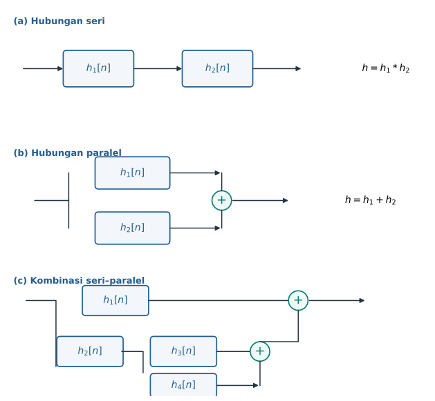

Panel pertama dan kedua menggambar ulang Gambar 3.25 dan Gambar 3.26. Panel ketiga menggambar ulang Gambar 3.27 yang memuat satu cabang langsung dan satu cabang gabungan seri–paralel.

### Contoh 7: sistem kombinasi seri–paralel

Pada struktur panel ketiga, $h_3[n]$ dan $h_4[n]$ berada dalam hubungan paralel. Respons impuls pengganti untuk pasangan tersebut adalah sebagai berikut.

```math
h'[n]=h_3[n]+h_4[n].
```

Blok $h_2[n]$ kemudian berada dalam hubungan seri dengan blok pengganti $h'[n]$. Respons cabang bawah menjadi bentuk berikut.

```math
\begin{aligned}
h''[n]
&=h_2[n]*h'[n]\\
&=h_2[n]*\bigl(h_3[n]+h_4[n]\bigr).
\end{aligned}
```

Terakhir, cabang $h_1[n]$ berada paralel dengan seluruh cabang bawah. Dengan sifat distributif, respons impuls total dapat ditulis dalam dua bentuk yang ekuivalen.

```math
\begin{aligned}
h[n]
&=h_1[n]+h''[n]\\
&=h_1[n]+h_2[n]*\bigl(h_3[n]+h_4[n]\bigr)\\
&=h_1[n]+h_2[n]*h_3[n]+h_2[n]*h_4[n].
\end{aligned}
\tag{23}
```

Sebagai pemeriksaan numerik, ambil $h_1=\{1,1\}$, $h_2=\{1,-1\}$, $h_3=\{1,2\}$, dan $h_4=\{0,1\}$. Setelah setiap cabang disamakan panjangnya, respons total dapat dihitung dengan kode berikut.

```python
import numpy as np

h1 = np.array([1, 1])
h2 = np.array([1, -1])
h3 = np.array([1, 2])
h4 = np.array([0, 1])

cabang_bawah = np.convolve(h2, h3 + h4)
h1_panjang = np.pad(h1, (0, len(cabang_bawah) - len(h1)))
h_total = h1_panjang + cabang_bawah

print(cabang_bawah)  # [ 1  2 -3]
print(h_total)       # [ 2  3 -3]
```

Penambahan nol pada $h_1$ tidak mengubah sinyal, tetapi menyamakan ukuran larik sebelum penjumlahan. Secara matematis, sampel di luar dukungan respons impuls memang bernilai nol.

---

## Rangkuman operasi sinyal dan notasinya

Pada tabel berikut, bentuk di kolom definisi menyatakan keluaran sebagai sinyal $z[n]$, sedangkan kolom notasi memberikan bentuk singkat yang lazim dipakai dalam penurunan.

| Operasi | Definisi | Notasi |
|---|---|---|
| Perkalian | $\{x[n]\}\{y[n]\}\triangleq\{z[n]:z[n]=x[n]y[n]\}$ | $x[n]y[n]$ |
| Penjumlahan | $\{x[n]\}+\{y[n]\}\triangleq\{z[n]:z[n]=x[n]+y[n]\}$ | $x[n]+y[n]$ |
| Perkalian skalar | $a\{x[n]\}\triangleq\{a x[n]\}$ | $a x[n]$ |
| Translasi | $\{x[n-n_0]\}\triangleq\{z[n]:z[n]=x[n-n_0]\}$ | $x[n-n_0]$ |
| Refleksi atau pelipatan | $\{x[-n]\}\triangleq\{z[n]:z[n]=x[-n]\}$ | $x[-n]$ |
| Konvolusi | $\{x[n]\}*\{y[n]\}\triangleq\left\{z[n]:z[n]=\sum_{k=-\infty}^{\infty}x[k]y[n-k]\right\}$ | $x[n]*y[n]$ |
| Penjumlahan tak berhingga | $\sum_{k=-\infty}^{\infty}x[k]\triangleq\left\{z[n]:z[n]=\sum_{k=-\infty}^{\infty}x[k]\right\}$ | $\sum_{k=-\infty}^{\infty}x[k]$ |
| Penjumlahan berhingga | $\sum_{k=k_0}^{k_1}\{x[k]\}\triangleq\sum_{k=k_0}^{k_1}x[k]$ | $\sum_{k=k_0}^{k_1}x[k]$ |
| Perbedaan mundur | $\nabla\{y[n]\}\triangleq\{z[n]:z[n]=y[n]-y[n-1]\}$ | $\nabla y[n]$ |
| Perbedaan maju | $\Delta\{y[n]\}\triangleq\{z[n]:z[n]=y[n+1]-y[n]\}$ | $\Delta y[n]$ |

Perkalian titik demi titik tidak sama dengan konvolusi. Pada perkalian, $z[n]$ hanya memakai dua sampel berindeks sama; pada konvolusi, $z[n]$ menjumlahkan semua pasangan indeks $k$ dan $n-k$.

Translasi dan refleksi juga perlu dibedakan dari perubahan amplitudo. Bentuk $x[n-n_0]$ menggeser lokasi sampel, sedangkan $x[-n]$ mencerminkan sumbu indeks tanpa mengubah nilai amplitudonya.

Perbedaan mundur dan maju sama-sama menaksir perubahan antarsampel, tetapi menggunakan pasangan waktu yang berbeda. Perbedaan mundur bersifat kausal jika dihitung pada waktu $n$, sedangkan perbedaan maju memerlukan sampel $y[n+1]$ yang masih berada di masa depan.

---

## Konvolusi sinyal kontinu

Penjumlahan konvolusi pada waktu-diskret mempunyai pasangan berupa integral konvolusi pada waktu-kontinu. Indeks penjumlahan $k$ diganti oleh variabel integrasi $\tau$, sedangkan penjumlahan seluruh hasil kali diganti oleh integral.

```math
y(t)=\int_{-\infty}^{\infty}x(\tau)h(t-\tau)\,d\tau.
\tag{24}
```

Variabel $\tau$ adalah variabel semu yang hilang setelah integrasi dilakukan. Variabel $t$ tetap menjadi waktu keluaran, sehingga untuk setiap nilai $t$ kita memperoleh satu nilai luas di bawah fungsi hasil kali.

Untuk memisahkan operasi perkalian dari integrasi, kita dapat mendefinisikan sinyal perantara (*intermediate signal*) berikut. Subskrip $t$ mengingatkan bahwa bentuk fungsi terhadap $\tau$ berubah ketika $t$ berubah.

```math
w_t(\tau)=x(\tau)h(t-\tau).
\tag{25}
```

Dengan definisi tersebut, integral konvolusi dapat ditulis sebagai luas total sinyal perantara. Bentuk ini sangat berguna dalam metode grafis.

```math
y(t)=\int_{-\infty}^{\infty}w_t(\tau)\,d\tau.
\tag{26}
```

### Prosedur grafis

Untuk dua sinyal kontinu berdurasi terbatas, proses grafis mengikuti urutan enam langkah berikut. Urutan ini merupakan versi kontinu dari prosedur lipat–geser–kali–jumlah.

1. Sketsakan $x(\tau)$ dan $h(t-\tau)$ sebagai fungsi $\tau$. Untuk memperoleh $h(t-\tau)$, cerminkan $h(\tau)$ terhadap $\tau=0$ menjadi $h(-\tau)$ lalu geser sejauh $t$.
2. Mulailah dengan nilai $t$ yang cukup negatif sehingga kedua sinyal belum bertumpang tindih. Keadaan ini memudahkan penentuan batas interval pertama.
3. Tuliskan representasi matematis $w_t(\tau)=x(\tau)h(t-\tau)$. Tentukan pula batas $\tau$ tempat produk tersebut tak nol.
4. Geser $h(t-\tau)$ ke kanan sampai bentuk atau batas $w_t(\tau)$ berubah. Nilai $t$ pada peristiwa itu menjadi akhir interval lama sekaligus awal interval baru.
5. Ulangi penentuan $w_t(\tau)$ untuk setiap interval nilai $t$. Setiap perubahan pola tumpang tindih biasanya menghasilkan rumus ruas yang berbeda.
6. Integralkan $w_t(\tau)$ terhadap $\tau$ pada setiap interval. Hasil setiap integral adalah rumus $y(t)$ untuk interval $t$ yang bersangkutan.

Pada praktiknya, titik perubahan terjadi ketika salah satu tepi sinyal yang digeser berimpit dengan tepi sinyal tetap. Dengan demikian, mencari titik-titik pertemuan batas dukungan adalah cara sistematis untuk menentukan interval integral.

### Contoh 8: konvolusi unit step dan eksponensial

Misalkan kita menghitung konvolusi $x(t)=u(t)$ dengan $h(t)=Ae^t$. Karena $u(\tau)=0$ untuk $\tau<0$, batas bawah integral dapat diubah dari $-\infty$ menjadi nol.

```math
\begin{aligned}
y(t)
&=\int_{-\infty}^{\infty}u(\tau)A e^{t-\tau}\,d\tau\\
&=A\int_0^{\infty}e^{t-\tau}\,d\tau\\
&=Ae^t\int_0^{\infty}e^{-\tau}\,d\tau\\
&=-Ae^t\left[e^{-\tau}\right]_0^{\infty}\\
&=Ae^t.
\end{aligned}
\tag{27}
```

Integral tersebut konvergen karena faktor $e^{-\tau}$ menuju nol ketika $\tau\to\infty$. Walaupun $h(t)=Ae^t$ tumbuh terhadap $t$, variabel integrasinya muncul sebagai $e^{t-\tau}$ dan berkurang terhadap $\tau$.

### Contoh 9: konvolusi dua pulsa persegi

Misalkan kita mengonvolusikan dua pulsa persegi satuan yang sama. Kita memakai definisi $\text{rect}(t/2a)=1$ untuk $|t|<a$ dan nol di luar interval tersebut; pilihan nilai tepat pada batas tidak memengaruhi integral.

```math
y(t)=\text{rect}\!\left(\frac{t}{2a}\right)
*\text{rect}\!\left(\frac{t}{2a}\right).
\tag{28}
```

Setelah pulsa kedua dilipat, bentuknya tidak berubah karena pulsa persegi tersebut genap. Pergeseran sebesar $t$ membuat dukungan $h(t-\tau)$ berada pada interval $t-a\leq\tau\leq t+a$, sedangkan dukungan $x(\tau)$ berada pada $-a\leq\tau\leq a$.

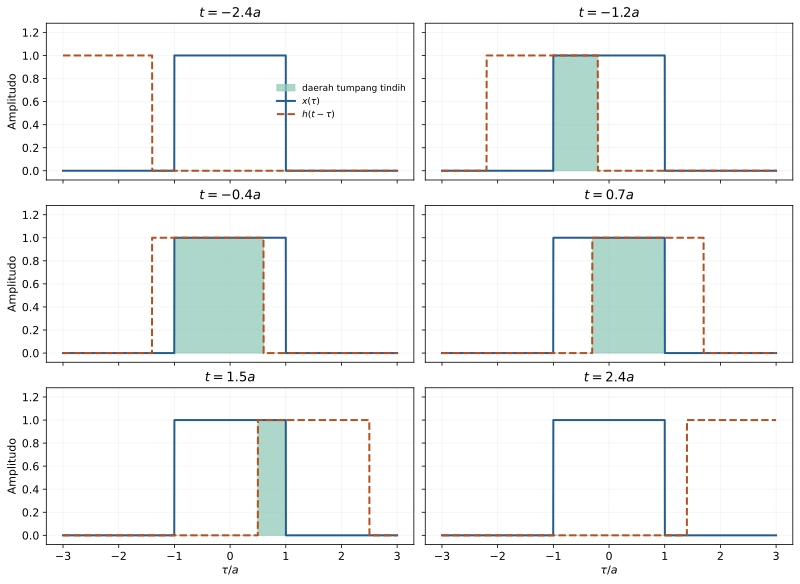

Enam panel menggambarkan beberapa keadaan berbeda. Daerah hijau adalah tempat kedua pulsa bernilai satu, sehingga luas daerah itu langsung sama dengan nilai integral konvolusi.

Untuk $t<-2a$, kedua interval belum bertumpang tindih dan luasnya nol. Ketika $-2a<t<0$, batas tumpang tindih adalah $-a\leq\tau\leq t+a$, sehingga panjang intervalnya bertambah secara linear.

```math
y(t)
=\int_{-a}^{t+a}1\,d\tau
=(t+a)-(-a)=t+2a
```
(untuk $-2a<t<0$).

Untuk $0<t<2a$, batas tumpang tindih berubah menjadi $t-a\leq\tau\leq a$. Panjang interval sekarang berkurang secara linear ketika pulsa bergeser menjauh.
```math
y(t) = \int_{t-a}^{a}1\,d\tau
     = a-(t-a)=2a-t
```
(untuk $0<t<2a$).

Setelah $t>2a$, kedua pulsa kembali tidak bertumpang tindih. Hasil lengkapnya adalah fungsi segitiga berikut.

```math
y(t)=
\begin{cases}
0, & t<-2a,\\
t+2a, & -2a<t<0,\\
2a-t, & 0<t<2a,\\
0, & t>2a.
\end{cases}
\tag{29}
```

Pada titik $t=0$, kedua rumus tengah memberikan nilai yang sama, yaitu $2a$. Pada $t=\pm2a$, panjang tumpang tindih adalah nol, sehingga penentuan nilai batas fungsi `rect` tidak mengubah hasil integral.

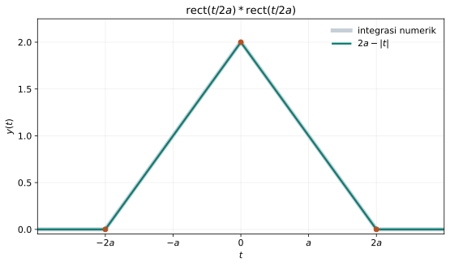

Gambar tersebut menunjukkan fungsi $2a - |t|$ dan menambahkan perbandingan dengan integrasi numerik. Tinggi maksimum $2a$ sama dengan luas satu pulsa ketika kedua pulsa saling berimpit sempurna.


Kode berikut menghitung hasil analitik dan hasil numerik untuk $a=1$. Kode lengkap tersedia pada [`06_konvolusi_kontinu.py`](../Kode/pertemuan-03/06_konvolusi_kontinu.py).

```python
import numpy as np
import matplotlib.pyplot as plt

a = 1.0
tau = np.linspace(-3*a, 3*a, 2401)
dt = tau[1] - tau[0]
x = (np.abs(tau) <= a).astype(float)

y_numerik = np.convolve(x, x, mode="full") * dt
t_numerik = np.linspace(2*tau[0], 2*tau[-1], len(y_numerik))

t = np.linspace(-3*a, 3*a, 1201)
y_analitik = np.maximum(0, 2*a - np.abs(t))

plt.plot(t_numerik, y_numerik, linewidth=4, label="numerik")
plt.plot(t, y_analitik, "--", label="analitik")
plt.xlabel("t")
plt.ylabel("y(t)")
plt.grid(alpha=0.25)
plt.legend()
plt.show()
```

Faktor `dt` wajib disertakan karena `np.convolve` menjumlahkan produk sampel, sedangkan integral Riemann memerlukan jumlah produk dikalikan lebar interval. Ketika `dt` diperkecil, hasil numerik mendekati fungsi segitiga analitik dengan galat diskretisasi yang semakin kecil.

---

## Menghubungkan alur pokok bahasan

Respons impuls menyederhanakan sebuah sistem LTI menjadi satu sinyal karakteristik. Konvolusi memakai karakteristik itu untuk menghitung keluaran, sedangkan interkoneksi menentukan cara beberapa karakteristik digabungkan menjadi satu respons impuls ekuivalen.

Korelasi menggunakan operasi perkalian dan pergeseran yang serupa, tetapi tujuannya bukan menghitung keluaran sistem. Tujuan korelasi adalah mengukur kemiripan atau menaksir pergeseran relatif, sehingga pelipatan implisit dan konvensi tanda *lag* perlu dibedakan dari konvolusi.

Hubungan antara operasi-operasi utama dapat diringkas sebagai berikut. Tabel ini juga menonjolkan pertanyaan yang dijawab oleh setiap operasi.

| Operasi | Bentuk inti | Pertanyaan yang dijawab |
|---|---|---|
| Konvolusi diskret | $\sum_k x[k]h[n-k]$ | Apa keluaran sistem LTI pada indeks $n$? |
| Korelasi silang | $\sum_n x_1[n]x_2[n+j]$ | Pada *lag* berapa dua sinyal paling mirip? |
| Interkoneksi seri | $h_1*h_2$ | Apa respons impuls gabungan dua tahap? |
| Interkoneksi paralel | $h_1+h_2$ | Apa respons impuls gabungan dua cabang? |
| Konvolusi kontinu | $\int x(\tau)h(t-\tau)d\tau$ | Apa keluaran sistem LTI waktu-kontinu pada waktu $t$? |

Kebiasaan menuliskan indeks dan batas dukungan sebelum berhitung mengurangi sebagian besar kesalahan. Cara tersebut membantu membedakan indeks keluaran, indeks semu penjumlahan atau integrasi, dan *lag* korelasi.

---

## Latihan hitungan tangan

### 1. Dekomposisi impuls dan respons LTI

Diberikan $x[n]=2\delta[n+1]-\delta[n]+3\delta[n-2]$ dan respons impuls $h[n]=\{1,2,-1\}$ dengan indeks nol pada elemen pertama. Tuliskan keluaran sebagai kombinasi respons impuls tergeser, lalu hitung seluruh sampel tak nol $y[n]$.

### 2. Konvolusi linear langsung

Hitung $y[n]=x[n]*h[n]$ untuk $x[n]=\{1,-2,3,1\}$ dan $h[n]=\{2,0,-1\}$, dengan indeks nol pada elemen pertama. Tunjukkan perhitungan setiap sampel dan periksa panjang keluarannya memakai $N=N_1+N_2-1$.

### 3. Konvolusi grafis

Diberikan $x[n]=u[n]-u[n-4]$ dan $h[n]=u[n]-u[n-3]$. Gunakan prosedur lipat–geser–kali–jumlah untuk memperoleh bentuk ruas $y[n]$, lalu buat sketsa hasilnya.

### 4. Sifat konvolusi dan interkoneksi

Misalkan $h_1[n]=\{1,1\}$, $h_2[n]=\{1,-1\}$, dan $h_3[n]=\{1,2\}$. Hitung $(h_1 \ast h_2)\ast h_3$ dan $h_1 \ast (h_2 \ast h_3)$ secara terpisah untuk memverifikasi sifat asosiatif.

### 5. Konvolusi siklik

Hitung konvolusi siklik panjang empat antara $x[n]=\{2,1,0,3\}$ dan $h[n]=\{1,-1,2,0\}$. Kerjakan dengan pergeseran siklik dan dengan matriks sirkulan, lalu bandingkan kedua hasilnya.

### 6. Korelasi silang dan koefisien korelasi

Diberikan $x_1[n]=\{1,2,-1,2\}$ dan $x_2[n]=\{2,4,-2,4\}$. Hitung $r_{12}(0)$ dan $\rho_{12}(0)$ menggunakan definisi pada catatan, lalu jelaskan makna nilai koefisien yang diperoleh.

### 7. Korelasi terhadap lag

Diberikan $x_1[n]=\{1,0,2,0,1\}$ dan $x_2[n]=\{0,1,0,2,0\}$. Hitung $r_{12}(j)$ untuk $-4\leq j\leq4$ dengan normalisasi tetap $1/N$, lalu tentukan *lag* puncaknya dan tafsirkan arah pergeserannya.

### 8. Autokorelasi

Hitung autokorelasi lengkap dari $x[n]=\{1,-1,2\}$ untuk semua *lag* yang mungkin. Verifikasi bahwa nilai maksimum terjadi pada *lag* nol dan bahwa hasilnya genap.

### 9. Sistem seri–paralel

Suatu sistem mempunyai $h[n]=h_1[n]+h_2[n]*(h_3[n]+h_4[n])$, dengan $h_1=\{1\}$, $h_2=\{1,1\}$, $h_3=\{1,-1\}$, dan $h_4=\{2\}$. Hitung respons impuls total, kemudian hitung keluaran untuk $x[n]=\{1,2\}$.

### 10. Konvolusi kontinu

Diberikan $x(t)=u(t)-u(t-2)$ dan $h(t)=u(t)-u(t-3)$. Tentukan titik perubahan tumpang tindih, turunkan $y(t)=x(t)*h(t)$ dalam bentuk fungsi ruas, dan buat sketsa hasilnya.

---

## Latihan pemrograman

### 1. Konvolusi manual tanpa `np.convolve`

Buat fungsi Python `konvolusi_linear(x, h)` yang menggunakan dua perulangan dan tidak memanggil `np.convolve`. Uji fungsi dengan data Contoh 1 dan pastikan hasilnya sama persis dengan `[-2, -4, 1, 3, 1, 5, 1, -3]`.

### 2. Animasi lipat–geser–kali–jumlah

Buat animasi Matplotlib yang memperlihatkan $h[n-k]$ bergerak terhadap $x[k]$ untuk data Contoh 2. Pada setiap bingkai, tampilkan produk titik demi titik dan nilai $y[n]$ yang sedang dihitung.

### 3. Panjang konvolusi dan penambahan nol

Bangkitkan pasangan barisan acak dengan beberapa panjang $N_1$ dan $N_2$, lalu verifikasi panjang `np.convolve` selalu $N_1+N_2-1$. Tampilkan satu kasus ketika penambahan nol terlalu pendek membuat konvolusi siklik mengalami *time aliasing*.

### 4. Matriks sirkulan

Buat fungsi yang membentuk matriks sirkulan dari suatu $h[n]$ dan menghitung konvolusi siklik melalui perkalian matriks. Bandingkan hasilnya dengan implementasi modulo menggunakan perulangan untuk sedikitnya lima pasangan sinyal acak.

### 5. Korelasi *biased* dan *unbiased*

Hitung korelasi silang data Contoh 4 untuk seluruh *lag* menggunakan pembagi $N$ dan pembagi $N-|j|$. Gambarkan kedua kurva pada sumbu yang sama dan jelaskan secara singkat perbedaannya di dekat ujung rentang *lag*.

### 6. Autokorelasi sinyal periodik dan acak

Bangkitkan satu sinusoid diskret serta satu sinyal acak dengan panjang yang sama, kemudian hitung autokorelasi keduanya. Bandingkan bentuk puncak berulang sinusoid dengan puncak tajam sinyal acak pada *lag* nol.

### 7. Penaksiran waktu tunda

Implementasikan model $y[n]=\alpha x[n-D]+w[n]$ untuk sedikitnya empat tingkat derau. Jalankan 100 percobaan pada setiap tingkat, lalu laporkan persentase percobaan yang menaksir $D$ dengan benar.

### 8. Penyederhanaan sistem gabungan

Pilih empat respons impuls berhingga dan implementasikan sistem pada Contoh 7 dengan dua cara: memproses setiap blok sesuai diagram dan mengonvolusikan masukan sekali dengan $h[n]$ ekuivalen. Verifikasi galat maksimum kedua keluaran berada dekat ketelitian numerik mesin.

### 9. Integral konvolusi numerik

Hitung konvolusi dua pulsa persegi dengan beberapa nilai langkah waktu $\Delta t$. Gambarkan galat maksimum terhadap $\Delta t$ pada skala logaritmik dan jelaskan kecenderungan konvergensinya.

### 10. Konvolusi dua eksponensial kausal

Gunakan pencuplikan rapat untuk mendekati konvolusi $x(t)=e^{-2t}u(t)$ dan $h(t)=e^{-3t}u(t)$. Bandingkan hasil numerik dengan hasil analitik $y(t)=(e^{-2t}-e^{-3t})u(t)$ serta tampilkan galat absolutnya.

---

## Rangkuman

Respons impuls $h[n]$ mencirikan sistem LTI karena setiap masukan dapat diuraikan menjadi impuls yang diskalakan dan digeser. Keluaran sistem kemudian diperoleh melalui penjumlahan konvolusi $y[n]=\sum_kx[k]h[n-k]$.

Konvolusi grafis mengikuti urutan lipat–geser–kali–jumlah, dan panjang konvolusi linear dua barisan berhingga adalah $N_1+N_2-1$. Konvolusi siklik memakai indeks modulo $N$ dan dapat dihitung melalui matriks sirkulan.

Korelasi mengukur kemiripan sebagai fungsi *lag*, sedangkan autokorelasi membandingkan sinyal dengan dirinya sendiri. Normalisasi dan konvensi tanda *lag* harus selalu disebutkan karena keduanya memengaruhi nilai serta interpretasi puncak.

Pada interkoneksi sistem LTI, hubungan seri mengonvolusikan respons impuls dan hubungan paralel menjumlahkannya. Sifat komutatif, asosiatif, dan distributif membuat diagram yang rumit dapat diganti oleh satu respons impuls ekuivalen.

Untuk sinyal waktu-kontinu, penjumlahan berubah menjadi integral konvolusi $y(t)=\int x(\tau)h(t-\tau)d\tau$. Nilai integral dapat dipahami sebagai luas tumpang tindih, seperti terlihat pada konvolusi dua pulsa persegi yang menghasilkan fungsi segitiga.

---

## Referensi

Gunawan, D., dan Juwono, F. H. *Dasar Pengolahan Sinyal Digital*. Materi utama catatan ini mengikuti Bab 3, khususnya Subbab 3.4 sampai 3.8, dengan gambar dan tabel yang digambar ulang serta contoh komputasi tambahan menggunakan Python.
