# Kuliah 4: Representasi Fourier: FS, FT, dan DTFT

## Tujuan pembelajaran

Pada pertemuan ketiga, kita menghitung keluaran sistem LTI menggunakan konvolusi dan mempelajari bagaimana beberapa sistem saling terhubung. Pada pertemuan ini, hubungan tersebut dilihat melalui frekuensi agar pengaruh sistem terhadap setiap komponen sinusoidal menjadi lebih mudah dipahami.

Setelah mengikuti kuliah ini, mahasiswa diharapkan dapat membaca sinyal melalui representasi waktu dan frekuensi. Kemampuan yang dituju meliputi hal-hal berikut.

- menjelaskan manfaat domain frekuensi dan makna sinusoid kompleks;
- menentukan koefisien Fourier Series (FS) dari sinyal periodik sederhana;
- menghitung Fourier Transform (FT) dari pulsa dan eksponensial kausal;
- menghitung Discrete-Time Fourier Transform (DTFT) dari barisan sederhana;
- membedakan frekuensi dalam Hz, rad/s, dan rad/sampel;
- membaca magnitudo, fase, serta periodisitas spektrum waktu-diskret;
- menerapkan linearitas, pergeseran waktu, dan modulasi;
- mengubah konvolusi menjadi perkalian dalam domain frekuensi;
- menghitung respons frekuensi sistem LTI dan keluaran sinusoidal; dan
- memeriksa hasil analitik melalui NumPy dan Matplotlib.

---

## Mengapa analisis domain frekuensi diperlukan?

Dalam domain waktu, kita mengamati kapan suatu kejadian berlangsung dan bagaimana amplitudo berubah. Dalam domain frekuensi, kita mengamati komponen osilasi yang menyusun sinyal serta amplitudo dan fase masing-masing komponen.

Contohnya, pengukuran getaran mesin mungkin mengandung osilasi lambat, harmonik, dan gangguan listrik. Kurva waktu memperlihatkan hasil penjumlahan semuanya, sedangkan representasi frekuensi membantu memisahkan komponen yang hendak dipertahankan dari gangguan yang hendak ditekan.

### Contoh 1: dua komponen frekuensi

Tinjau sinyal berikut dengan $t$ dalam sekon. Komponen pertama mempunyai frekuensi 3 Hz, sedangkan komponen kedua mempunyai frekuensi 12 Hz dan fase awal $\pi/3$.

$$
x(t)=\cos(2\pi\cdot3t)+0.4\cos(2\pi\cdot12t+\pi/3).
$$

Periode dasar gabungannya adalah $T_0=1/3$ s karena 12 Hz merupakan harmonik keempat dari 3 Hz. Dalam domain waktu, kedua komponen membentuk satu kurva, tetapi dalam representasi Fourier keduanya mempunyai lokasi frekuensi yang berbeda.

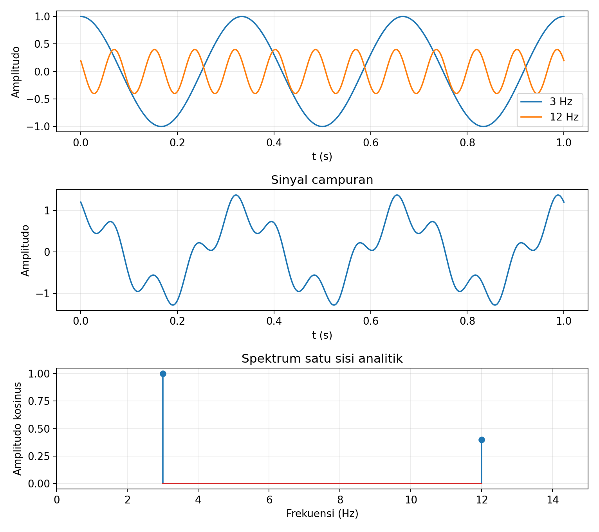

Panel atas memisahkan kedua komponen, sedangkan panel tengah memperlihatkan penjumlahannya. Panel bawah adalah spektrum amplitudo **satu sisi** untuk contoh ini, sehingga tinggi garis 1 dan 0.4 menyatakan amplitudo kosinus, bukan koefisien FS dua sisi.

Program gambar tersedia pada [`01_motivasi.py`](../Kode/pertemuan-04/01_motivasi.py). Potongan berikut memperlihatkan pembangkitan sinyal tanpa memerlukan FFT.

```python
import numpy as np

t = np.linspace(0, 1, 2001)
x1 = np.cos(2*np.pi*3*t)
x2 = 0.4*np.cos(2*np.pi*12*t + np.pi/3)
x = x1 + x2
```

Representasi Fourier yang lengkap mempertahankan informasi sinyal apabila syarat inversi yang sesuai dipenuhi. Grafik magnitudo saja umumnya kehilangan informasi karena fase tidak lagi disertakan.

---

## Sinusoid kompleks dan konvensi frekuensi

### Rumus Euler

Kita menggunakan $j=\sqrt{-1}$ agar simbol $i$ tidak tertukar dengan arus listrik. Rumus Euler menghubungkan eksponensial kompleks dengan sinusoid real melalui persamaan berikut.

$$
e^{j\theta}=\cos\theta+j\sin\theta,
\qquad
\cos\theta=\frac{e^{j\theta}+e^{-j\theta}}{2},
\qquad
\sin\theta=\frac{e^{j\theta}-e^{-j\theta}}{2j}.
$$

Magnitudo $e^{j\theta}$ selalu satu, sedangkan sudutnya adalah $\theta$ modulo $2\pi$. Karena itu, $e^{j\omega t}$ dapat dibayangkan sebagai titik yang berputar pada lingkaran satuan dengan kecepatan sudut $\omega$.

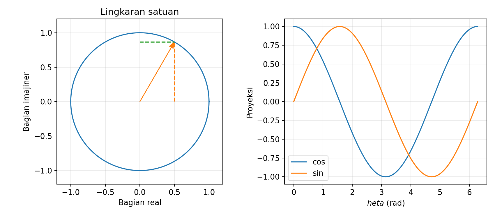

Proyeksi horizontal titik tersebut memberikan kosinus dan proyeksi vertikal memberikan sinus. Frekuensi negatif menyatakan arah putaran yang berlawanan, sehingga pasangan frekuensi positif dan negatif dapat menjumlah menjadi sinyal real.

### Amplitudo dan fase sebuah sinusoid

Kosinus real beramplitudo $A\geq0$ dapat diuraikan menjadi dua eksponensial kompleks. Masing-masing mempunyai magnitudo koefisien $A/2$, dengan fase yang saling berlawanan.

$$
A\cos(\omega_0t+\phi)
=\frac{A}{2}e^{j\phi}e^{j\omega_0t}
+\frac{A}{2}e^{-j\phi}e^{-j\omega_0t}.
$$

Sebagai contoh, $2\cos(\omega_0t+\pi/6)$ mempunyai koefisien $e^{j\pi/6}$ pada frekuensi positif dan $e^{-j\pi/6}$ pada frekuensi negatif. Besarnya masing-masing satu, walaupun amplitudo kosinus semula adalah dua.

### Frekuensi kontinu dan frekuensi diskret

Frekuensi biasa $f$ dihitung dalam Hz atau siklus per sekon, sedangkan frekuensi sudut kontinu $\omega$ dihitung dalam rad/s. Untuk sinyal waktu-diskret, kita memakai $\Omega$ dalam rad/sampel agar kedua jenis frekuensi tidak tertukar.

$$
\omega=2\pi f,
\qquad
\Omega=\omega T_s=2\pi\frac{f}{f_s},
\qquad
f_s=\frac{1}{T_s}.
$$

| Simbol | Makna | Satuan |
|---|---|---|
| $f$ | Frekuensi waktu-kontinu | Hz |
| $\omega$ | Frekuensi sudut waktu-kontinu | rad/s |
| $\Omega$ | Frekuensi sudut waktu-diskret | rad/sampel |
| $k$ | Nomor harmonik FS | Bilangan bulat |
| $\omega_0=2\pi/T_0$ | Frekuensi sudut dasar sinyal periodik kontinu | rad/s |

Jika $f_s=1000$ Hz dan $f=100$ Hz, frekuensi diskretnya adalah $\Omega=0.2\pi$ rad/sampel. Hubungan ini menjelaskan mengapa grafik digital berlabel $\Omega/\pi=0.2$ menunjuk 100 Hz hanya ketika frekuensi samplingnya diketahui.

Buku menggunakan notasi frekuensi sudut yang serupa pada beberapa transformasi. Catatan ini membedakan $\omega$ dan $\Omega$ secara eksplisit, tetapi mempertahankan tanda eksponensial negatif pada transformasi maju dan faktor $1/(2\pi)$ pada invers FT serta DTFT.

---

## Fourier Series: sinyal waktu-kontinu periodik

### Pasangan analisis dan sintesis

Sinyal periodik memenuhi $x(t+T_0)=x(t)$ dan mempunyai harmonik pada $k\omega_0$. Deret Fourier kompleks menyatakan sinyal sebagai penjumlahan harmonik tersebut dengan koefisien $C_k$.

$$
\boxed{x(t)=\sum_{k=-\infty}^{\infty}C_ke^{jk\omega_0t}},
\qquad \omega_0=\frac{2\pi}{T_0}.
$$

Rumus deret Fourier di atas disebut **sintesis** karena menyusun sinyal dari koefisiennya. Koefisien diperoleh melalui **analisis**, yaitu mengalikan sinyal dengan eksponensial kompleks yang sesuai lalu merata-ratakannya selama satu periode.

$$
\boxed{C_k=\frac{1}{T_0}\int_{t_a}^{t_a+T_0}x(t)e^{-jk\omega_0t}\,dt}.
$$

Batas awal $t_a$ boleh dipilih bebas karena integrannya periodik dengan periode $T_0$. Notasi $C_k$ dalam catatan ini setara dengan koefisien yang ditulis sebagai $X[k]$ pada bagian FS buku, tetapi $C_k$ membantu membedakannya dari DTFT.

### Mengapa koefisien dapat dipisahkan?

Eksponensial dengan nomor harmonik yang berbeda bersifat ortogonal selama satu periode. Hal tersebut berarti rata-rata hasil perkaliannya dengan pasangan konjugat bernilai nol, kecuali kedua nomor harmonik sama.

$$
\frac{1}{T_0}\int_{t_a}^{t_a+T_0}e^{j(k-m)\omega_0t}\,dt
=\begin{cases}1,&k=m,\\0,&k\ne m.\end{cases}
$$

Untuk $k\ne m$, integralnya proporsional terhadap selisih dua eksponensial yang terpisah sudut $2\pi(k-m)$, sehingga selisih itu nol. Dengan memasukkan deret sintesis Fourier ke dalam integral analisis koefisien, sifat ortogonalitas ini menyisakan tepat koefisien $C_k$.

Koefisien $C_0$ menyatakan nilai rata-rata atau komponen DC sinyal. Jika $x(t)$ real, berlaku $C_{-k}=C_k^*$, sehingga magnitudo koefisien genap terhadap $k$ dan fase pasangan harmonik berlawanan tanda modulo $2\pi$.

### Contoh 2: koefisien tiga komponen

Misalkan sinyal periodik berikut mempunyai $\omega_0>0$. Kita menentukan koefisiennya dengan menguraikan kosinus dan sinus menggunakan rumus Euler.

$$
x(t)=1+2\cos(\omega_0t)+\sin(2\omega_0t).
$$

$$
\begin{aligned}
x(t)
&=1+e^{j\omega_0t}+e^{-j\omega_0t}
+\frac{1}{2j}e^{j2\omega_0t}-\frac{1}{2j}e^{-j2\omega_0t},\\
C_0&=1,\quad C_1=C_{-1}=1,\\
C_2&=-\frac{j}{2},\quad C_{-2}=\frac{j}{2}.
\end{aligned}
$$

Semua koefisien lainnya nol, sehingga hanya lima garis diperlukan pada spektrum dua sisi. Fase $C_2$ adalah $-\pi/2$, sedangkan fase $C_{-2}$ adalah $+\pi/2$.

| $k$ | $-2$ | $-1$ | $0$ | $1$ | $2$ |
|---|---|---|---|---|---|
| $C_k$ | $j/2$ | $1$ | $1$ | $1$ | $-j/2$ |
| Magnitudo | $1/2$ | $1$ | $1$ | $1$ | $1/2$ |
| Fase | $\pi/2$ | $0$ | $0$ | $0$ | $-\pi/2$ |

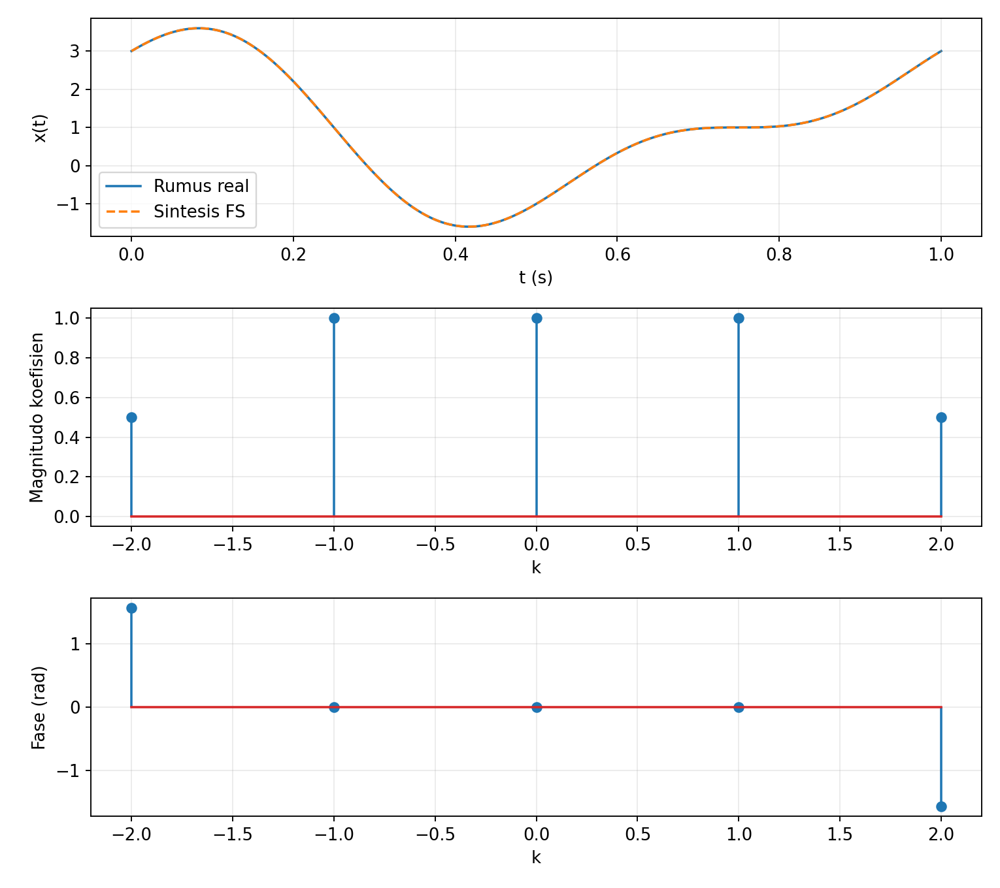

Gambar memperlihatkan bahwa harmonik sinus membutuhkan pasangan fase yang berbeda dari harmonik kosinus. Kode [`03_fs_sinusoid.py`](../Kode/pertemuan-04/03_fs_sinusoid.py) memeriksa rekonstruksi melalui penjumlahan eksponensial kompleks dan membandingkannya dengan rumus real semula.

### Contoh 3: pulsa persegi periodik

Tinjau pulsa dengan tinggi $A$ yang bernilai tak nol pada $-\tau/2<t<\tau/2$ dan berulang setiap $T_0$, dengan $0<\tau<T_0$. Fraksi $D=\tau/T_0$ disebut *duty cycle* dan menyatakan bagian periode yang ditempati pulsa.

Untuk $k\ne0$, integral hanya memerlukan bagian interval yang pulsanya tidak nol. Integrasi langsung memberikan hasil berikut.

$$
\begin{aligned}
C_k
&=\frac{A}{T_0}\int_{-\tau/2}^{\tau/2}e^{-jk\omega_0t}\,dt\\
&=\frac{2A}{T_0k\omega_0}\sin\left(\frac{k\omega_0\tau}{2}\right)\\
&=AD\,\text{sinc}(kD),
\end{aligned}
\qquad
\text{sinc}(v)=\frac{\sin(\pi v)}{\pi v},\quad\text{sinc}(0)=1.
$$

Untuk $k=0$, integral menjadi luas pulsa dibagi periode, sehingga $C_0=AD$. Rumus sinc juga memberikan nilai yang sama melalui limit pada nol, sehingga dapat dipakai untuk seluruh $k$.

Jika $A=1$ dan $D=1/2$, kita memperoleh $C_0=1/2$, $C_{\pm1}=1/\pi$, $C_{\pm2}=0$, dan $C_{\pm3}=-1/(3\pi)$. Nilai negatif koefisien adalah informasi tanda atau fase, sedangkan magnitudo spektrumnya tetap tidak negatif.

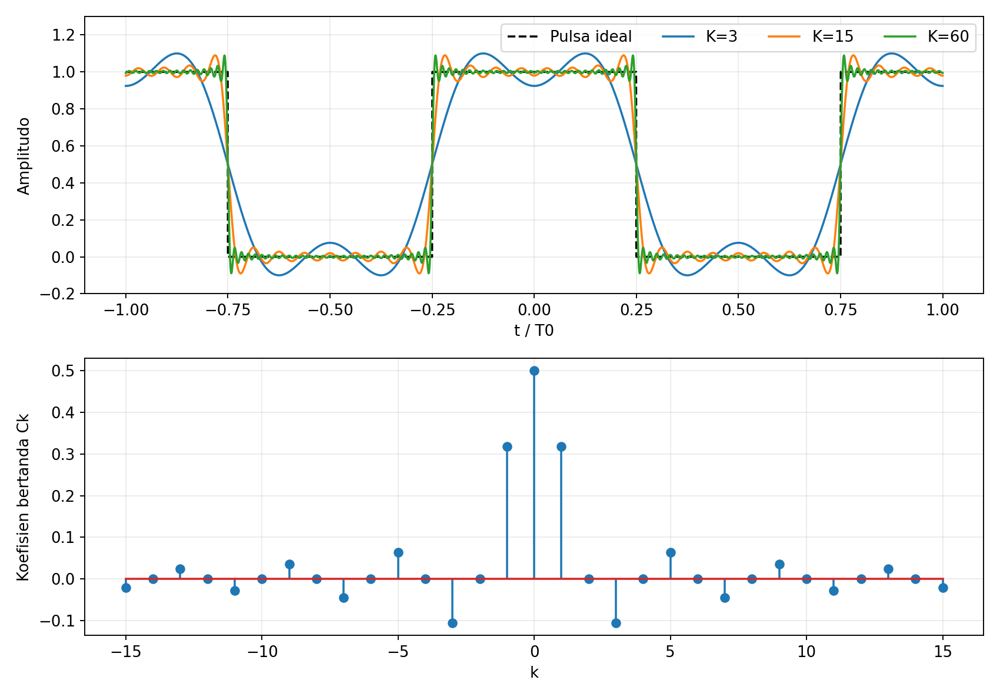

Program [`04_fs_pulsa.py`](../Kode/pertemuan-04/04_fs_pulsa.py) memperlihatkan sintesis dengan $K=3,15,60$, yaitu penjumlahan harmonik $-K\leq k\leq K$. Riak di dekat lompatan merupakan fenomena Gibbs: ketika $K$ bertambah, daerah riak menyempit tetapi tinggi relatif overshoot tidak menuju nol.

#### Konvergensi dan daya: pengayaan

Untuk sinyal periodik yang cukup teratur, misalnya bagian-bagiannya mulus dengan jumlah lompatan berhingga per periode, FS konvergen ke nilai sinyal di titik kontinu. Pada lompatan, deret konvergen ke rata-rata limit kiri dan kanan, sehingga pulsa tinggi satu direkonstruksi menjadi $1/2$ tepat di batas lompatan.

Sinyal periodik tak nol umumnya mempunyai energi total tak berhingga tetapi daya rata-rata berhingga. Dengan normalisasi koefisien FS yang menggunakan faktor $1/T_0$, hubungan Parseval untuk daya adalah sebagai berikut.

$$
P=\frac{1}{T_0}\int_{t_a}^{t_a+T_0}|x(t)|^2\,dt
=\sum_{k=-\infty}^{\infty}|C_k|^2.
$$

Untuk Contoh 2, daya adalah $1+1+1+1/4+1/4=3.5$. Hasil ini juga diperoleh dengan menjumlah daya DC, daya kosinus $2^2/2$, dan daya sinus $1^2/2$.

---

## Fourier Transform: spektrum frekuensi kontinu

### Dari harmonik terpisah menuju frekuensi kontinu

FS cocok untuk sinyal yang berulang, tetapi pulsa tunggal tidak mempunyai periode pengulangan. FT memperluas gagasan sintesis menjadi integral atas seluruh frekuensi sehingga tidak harus memakai kelipatan satu frekuensi dasar.

Secara intuitif, jika satu pulsa dibuat berulang dengan periode yang makin panjang, jarak harmonik $\Delta\omega=2\pi/T_0$ makin kecil. Untuk pulsa dasar $p(t)$ yang tidak bertumpang tindih dengan salinan periodiknya, koefisiennya memenuhi $C_k=P(k\omega_0)/T_0$, sehingga penjumlahan FS mendekati integral invers FT ketika $T_0$ membesar.

### Pasangan FT dan inversnya

Dengan frekuensi sudut $\omega$, transformasi maju dan invers menggunakan pasangan berikut. Tanda eksponensial dan faktor normalisasi wajib dipakai secara konsisten.

$$
\boxed{X(\omega)=\int_{-\infty}^{\infty}x(t)e^{-j\omega t}\,dt},
$$

$$
\boxed{x(t)=\frac{1}{2\pi}\int_{-\infty}^{\infty}X(\omega)e^{j\omega t}\,d\omega}.
$$

Kita menuliskan pasangan ini sebagai $x(t)\longleftrightarrow X(\omega)$. Apabila amplitudo $x(t)$ mempunyai satuan volt, $X(\omega)$ mempunyai satuan volt-sekon, sehingga nilainya tidak langsung sama dengan amplitudo sebuah kosinus.

Syarat $\int|x(t)|dt<\infty$ cukup untuk keberadaan FT sebagai fungsi biasa yang kontinu dan terbatas. Syarat ini bukan syarat perlu, dan sinyal berenergi berhingga juga dapat ditangani dalam pengertian kuadrat-terintegralkan.

### Contoh 4: pulsa persegi tunggal

Misalkan $x(t)=A$ untuk $-\tau/2<t<\tau/2$ dan nol di luar interval tersebut. Karena sinyal hanya tak nol pada interval itu, integral FT menjadi berikut.

$$
\begin{aligned}
X(\omega)
&=A\int_{-\tau/2}^{\tau/2}e^{-j\omega t}\,dt\\
&=\frac{2A\sin(\omega\tau/2)}{\omega}\\
&=A\tau\,\text{sinc}\left(\frac{\omega\tau}{2\pi}\right).
\end{aligned}
$$

Pada $\omega=0$, nilai limitnya adalah $X(0)=A\tau$, yaitu luas pulsa. Nol pertama terjadi pada $\omega=\pm2\pi/\tau$, sehingga pulsa yang lebih sempit mempunyai lobus utama spektrum yang lebih lebar.

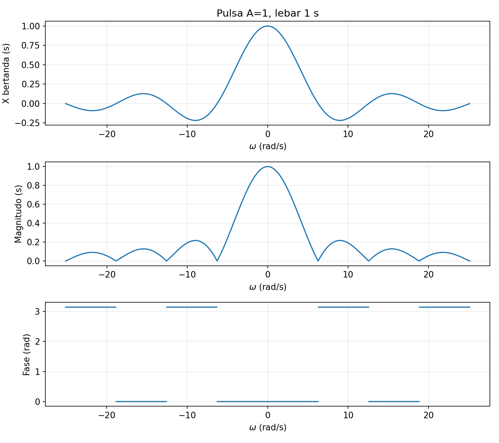

Pada interval yang $X(\omega)$ positif, fase dapat dipilih nol; pada interval yang negatif, fase bernilai $\pi$ modulo $2\pi$. Tepat pada nol spektrum, fase tidak terdefinisi, sehingga kode [`05_ft_pulsa.py`](../Kode/pertemuan-04/05_ft_pulsa.py) tidak menggambar fase di titik tersebut.

### Contoh 5: eksponensial kausal

Untuk $x(t)=e^{-at}u(t)$ dengan $a>0$, unit step membatasi integral menjadi $t\geq0$. Integrasi eksponensial kemudian memberikan pasangan sederhana berikut.

$$
\begin{aligned}
X(\omega)
&=\int_0^\infty e^{-(a+j\omega)t}\,dt\\
&=\left[-\frac{e^{-(a+j\omega)t}}{a+j\omega}\right]_0^\infty
=\frac{1}{a+j\omega}.
\end{aligned}
$$

Karena $a>0$, magnitudo dan fase dapat dibaca tanpa ambiguitas kuadran pada penyebut. Hasilnya adalah berikut.

$$
|X(\omega)|=\frac{1}{\sqrt{a^2+\omega^2}},
\qquad
\angle X(\omega)=-\arctan\left(\frac{\omega}{a}\right).
$$

Jika $a=2$ s$^{-1}$, nilai spektrum pada nol adalah $1/2$ s, sedangkan pada $\omega=2$ rad/s magnitudonya $1/(2\sqrt2)$ s dan fasenya $-\pi/4$. Magnitudo menurun ketika frekuensi meningkat karena eksponensial yang berubah secara halus memberi bobot lebih besar pada osilasi lambat.

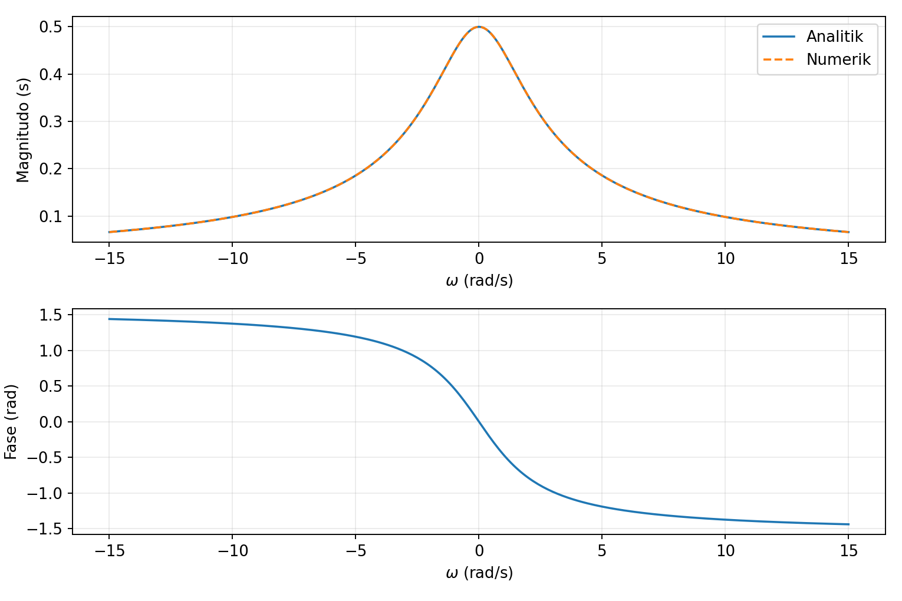

Program [`06_ft_eksponensial.py`](../Kode/pertemuan-04/06_ft_eksponensial.py) membandingkan rumus analitik dengan integral numerik pada $0\leq t\leq10$ s. Pendekatan numerik mempunyai galat pemotongan interval dan galat langkah integrasi, sehingga keduanya diperiksa ketika hasil dibandingkan.

### Spektrum sinusoid periodik: pengayaan

Sinusoid yang berlangsung sepanjang waktu tidak mutlak terintegralkan, sehingga FT-nya memerlukan impuls Dirac. Impuls tersebut merupakan distribusi dengan luas tertentu, bukan nilai fungsi yang tingginya berhingga.

$$
e^{j\omega_0t}\longleftrightarrow2\pi\delta(\omega-\omega_0),
\qquad
\cos(\omega_0t)\longleftrightarrow
\pi\bigl[\delta(\omega-\omega_0)+\delta(\omega+\omega_0)\bigr].
$$

Untuk sinyal periodik umum dengan koefisien $C_k$, FT dalam pengertian distribusi adalah $X(\omega)=2\pi\sum_k C_k\delta(\omega-k\omega_0)$. Jadi, spektrum garis FS dan FT impuls sinyal periodik berhubungan, tetapi label koefisien FS tidak boleh disamakan dengan tinggi impuls FT.

---

## Discrete-Time Fourier Transform

### Pasangan DTFT dan inversnya

Pada sinyal waktu-diskret, waktu menjadi indeks bulat $n$, tetapi frekuensi DTFT tetap berupa variabel kontinu. Karena itu, transformasi maju menggunakan penjumlahan terhadap $n$, sedangkan invers menggunakan integral terhadap $\Omega$.

$$
\boxed{X(e^{j\Omega})=\sum_{n=-\infty}^{\infty}x[n]e^{-j\Omega n}},
$$

$$
\boxed{x[n]=\frac{1}{2\pi}\int_{-\pi}^{\pi}X(e^{j\Omega})e^{j\Omega n}\,d\Omega}.
$$

Notasi $X(e^{j\Omega})$ lazim digunakan karena kelak DTFT dapat dihubungkan dengan transformasi Z pada lingkaran satuan. Dalam pertemuan ini, cukup membacanya sebagai fungsi kontinu dari frekuensi $\Omega$, tanpa memerlukan transformasi Z.

Syarat $\sum_n|x[n]|<\infty$ cukup untuk DTFT biasa yang kontinu dan terbatas. Barisan berhingga selalu memenuhi syarat ini, sedangkan sinusoid tak berhingga memerlukan interpretasi distribusi sebagaimana pada FT sinusoid kontinu.

### Mengapa spektrum DTFT periodik?

Karena $n$ bilangan bulat, faktor $e^{-j2\pi n}$ selalu satu. Substitusi langsung ke definisi menghasilkan identitas berikut untuk setiap bilangan bulat $m$.

$$
\begin{aligned}
X(e^{j(\Omega+2\pi m)})
&=\sum_n x[n]e^{-j\Omega n}e^{-j2\pi mn}\\
&=X(e^{j\Omega}).
\end{aligned}
$$

DTFT selalu periodik dengan periode $2\pi$; beberapa sinyal khusus dapat mempunyai periode lebih kecil. Satu interval sepanjang $2\pi$, misalnya $[-\pi,\pi)$ atau $[0,2\pi)$, sudah memuat seluruh informasi spektrumnya.

Identitas $e^{j(\Omega+2\pi m)n}=e^{j\Omega n}$ juga menjelaskan ketakterbedaan frekuensi diskret yang berbeda kelipatan $2\pi$. Setelah sampling, frekuensi analog yang berbeda kelipatan $f_s$ menghasilkan eksponensial diskret yang sama, sehingga periodisitas ini berkaitan langsung dengan aliasing.

### Contoh 6: dua sampel bernilai satu

Misalkan $x[n]=\delta[n]+\delta[n-1]$, sehingga sampel tak nolnya adalah $x[0]=x[1]=1$. Definisi DTFT langsung memberikan penjumlahan dua suku berikut.

$$
\begin{aligned}
X(e^{j\Omega})
&=1+e^{-j\Omega}\\
&=e^{-j\Omega/2}\left(e^{j\Omega/2}+e^{-j\Omega/2}\right)\\
&=2e^{-j\Omega/2}\cos(\Omega/2).
\end{aligned}
$$

Magnitudonya adalah $2|\cos(\Omega/2)|$, dengan maksimum dua pada $\Omega=0$ dan nol pada $\Omega=\pm\pi$. Pada interval terbuka $-\pi<\Omega<\pi$, kosinusnya positif sehingga fase dapat dipilih $-\Omega/2$.

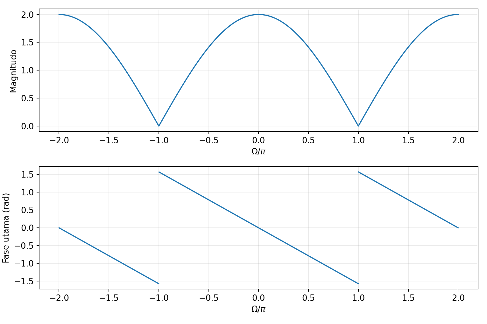

Di luar interval tersebut, tanda kosinus berubah dan fase utama harus dihitung dengan memperhitungkan perubahan tanda. Magnitudo dan bilangan kompleks DTFT tetap periodik, sedangkan fase yang telah di-*unwrap* dapat berbeda kelipatan $2\pi$ setelah melewati satu periode.

### Contoh 7: eksponensial waktu-diskret

Tinjau $x[n]=a^n u[n]$ dengan $0<a<1$. Deret geometri konvergen karena magnitudo rasionya adalah $a$, sehingga diperoleh hasil berikut.

$$
\begin{aligned}
X(e^{j\Omega})
&=\sum_{n=0}^\infty(ae^{-j\Omega})^n
=\frac{1}{1-ae^{-j\Omega}},\\
|X(e^{j\Omega})|
&=\frac{1}{\sqrt{1+a^2-2a\cos\Omega}},\\
\angle X(e^{j\Omega})
&=-\text{atan2}\bigl(a\sin\Omega,1-a\cos\Omega\bigr).
\end{aligned}
$$

Untuk $a=1/2$, magnitudo pada nol adalah $1/(1-1/2)=2$ dan pada $\pi$ adalah $1/(1+1/2)=2/3$. Spektrum ini periodik, berbeda dari FT eksponensial kontinu yang magnitudonya terus menurun menuju nol ketika $|\omega|$ membesar.

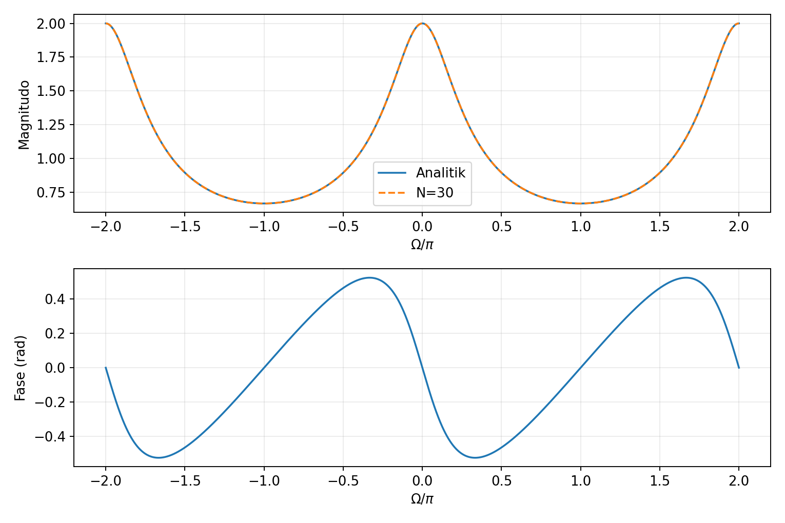

Untuk barisan yang dipotong pada $n=N-1$, galat spektrum memenuhi batas $a^N/(1-a)$ dari jumlah ekor deret. Kode [`08_dtft_eksponensial.py`](../Kode/pertemuan-04/08_dtft_eksponensial.py) menggunakan batas ini untuk memeriksa pendekatan numeriknya.

### Menghitung DTFT pada kisi frekuensi

Komputer mengevaluasi DTFT pada sejumlah frekuensi yang dipilih pengguna. Kisi evaluasi yang berhingga tidak mengubah definisi DTFT menjadi transformasi dengan variabel frekuensi diskret.

```python
import numpy as np

n = np.arange(2)
x = np.array([1.0, 1.0])
Omega = np.linspace(-2*np.pi, 2*np.pi, 1601)
X = np.exp(-1j*np.outer(Omega, n)) @ x
magnitude = np.abs(X)
phase = np.angle(X)
phase[magnitude < 1e-10] = np.nan
```

Program lengkap [`07_dtft_dua_sampel.py`](../Kode/pertemuan-04/07_dtft_dua_sampel.py) menghasilkan gambar Contoh 6. Elemen matriks pada baris frekuensi $r$ dan kolom waktu $n$ adalah $e^{-j\Omega_r n}$, sehingga perkalian matriks melakukan penjumlahan pada definisi DTFT.

### FS, FT, DTFT, dan batas cakupan pertemuan ini

Pemilihan representasi bergantung pada jenis waktu dan pengulangan sinyal. Tabel berikut menghindari anggapan bahwa waktu-diskret selalu berarti spektrum diskret.

| Jenis sinyal | Representasi | Variabel frekuensi | Struktur spektrum |
|---|---|---|---|
| Kontinu periodik | FS | $k\omega_0$, $k$ bulat | Garis pada harmonik |
| Kontinu nonperiodik | FT | $\omega$ kontinu | Umumnya fungsi kontinu |
| Diskret nonperiodik | DTFT | $\Omega$ kontinu | Periodik dengan $2\pi$ |
| Diskret periodik | DTFS | $k$, modulo periode $N$ | Koefisien diskret periodik |

DTFS menggunakan sejumlah harmonik unik yang berhingga untuk merepresentasikan satu periode barisan. DFT dan FFT akan dibahas pada pertemuan berikutnya, termasuk hubungan DFT dengan sampel DTFT suatu rekaman berhingga dan interpretasi perpanjangan periodiknya.

---

## Magnitudo dan fase

### Representasi polar

Spektrum kompleks dapat ditulis dalam bentuk polar. Magnitudo menyatakan besar koefisien atau bobot frekuensi, sedangkan fase menyatakan sudut relatif terhadap eksponensial acuan yang dipakai pada transformasi.

$$
X=|X|e^{j\phi},
\qquad
|X|=\sqrt{(\text{Re}X)^2+(\text{Im}X)^2},
\qquad
\phi=\text{atan2}(\text{Im}X,\text{Re}X).
$$

Fungsi `atan2` mempertahankan informasi kuadran yang dapat hilang jika hanya memakai $\arctan(\text{Im}X/\text{Re}X)$. Di titik spektrum nol, fase tidak terdefinisi walaupun perangkat lunak mungkin mengembalikan angka tertentu.

Fase utama biasanya dipilih pada rentang $(-\pi,\pi]$, sedangkan *unwrapping* menambahkan kelipatan $2\pi$ untuk mengurangi lompatan representasi. Proses tersebut tidak menentukan fase pada nol spektrum dan tidak membuat seluruh lompatan fase fisik menjadi hilang.

### Simetri untuk sinyal real

Untuk sinyal real, konjugasi definisi FT atau DTFT menunjukkan bahwa spektrum pada frekuensi negatif adalah konjugat spektrum pada frekuensi positif. Hubungannya ditulis sebagai berikut.

$$
X(-\omega)=X^*(\omega),
\qquad
X(e^{-j\Omega})=X^*(e^{j\Omega}).
$$

Karena itu, magnitudo genap dan fase berlawanan tanda modulo $2\pi$ pada frekuensi yang magnitudonya tidak nol. Sifat ini berlaku untuk sinyal real, sehingga tidak boleh langsung diterapkan pada sembarang sinyal kompleks.

---

## Linearitas, pergeseran, dan modulasi

### Linearitas

Integral dan penjumlahan dalam definisi transformasi bersifat linear. Jika pasangan transformasi $x_1$ dan $x_2$ diketahui, transformasi kombinasi linear keduanya dapat dihitung tanpa mengulang integrasi.

$$
\alpha x_1(t)+\beta x_2(t)
\longleftrightarrow\alpha X_1(\omega)+\beta X_2(\omega),
$$

$$
\alpha x_1[n]+\beta x_2[n]
\longleftrightarrow\alpha X_1(e^{j\Omega})+\beta X_2(e^{j\Omega}).
$$

Sifat yang sama berlaku pada koefisien FS jika kedua sinyal dinyatakan dengan periode acuan bersama. Misalnya, FT $3e^{-2t}u(t)-e^{-4t}u(t)$ adalah $3/(2+j\omega)-1/(4+j\omega)$.

### Pergeseran waktu

Untuk $y(t)=x(t-t_0)$, lakukan substitusi $v=t-t_0$ di integral FT. Faktor yang tidak bergantung pada $v$ dapat dikeluarkan dari integral, sehingga muncul faktor fase berikut.

$$
\begin{aligned}
Y(\omega)
&=\int x(v)e^{-j\omega(v+t_0)}\,dv\\
&=e^{-j\omega t_0}X(\omega).
\end{aligned}
$$

Pada waktu-diskret, perubahan indeks $m=n-n_0$ memberikan hasil yang serupa. Pergeseran sebanyak $n_0$ sampel harus menggunakan $n_0$ bilangan bulat.

$$
x[n-n_0]\longleftrightarrow e^{-j\Omega n_0}X(e^{j\Omega}).
$$

Penundaan tidak mengubah magnitudo karena faktor eksponensial mempunyai magnitudo satu. Fase memperoleh tambahan $-\omega t_0$ atau $-\Omega n_0$, sehingga informasi waktu tunda tersimpan dalam fase.

Untuk FS, penundaan mengubah koefisien menjadi $C_ke^{-jk\omega_0t_0}$. Sinyal asli dan versi tertundanya dapat memiliki magnitudo spektrum yang identik walaupun lokasi pulsanya berbeda dalam domain waktu.

### Contoh 8: pulsa yang tertunda tiga sampel

Ambil $x[n]=\delta[n]+\delta[n-1]$ dari Contoh 6 dan $y[n]=x[n-3]$. Transformasi keluarannya mengikuti sifat penundaan berikut.

$$
Y(e^{j\Omega})=e^{-j3\Omega}(1+e^{-j\Omega}),
\qquad
|Y|=|X|.
$$

Pada $\Omega=\pi/4$, fase $X$ adalah $-\pi/8$ dan tambahan fase penundaan adalah $-3\pi/4$. Jadi, fase $Y$ pada frekuensi tersebut adalah $-7\pi/8$ modulo $2\pi$.

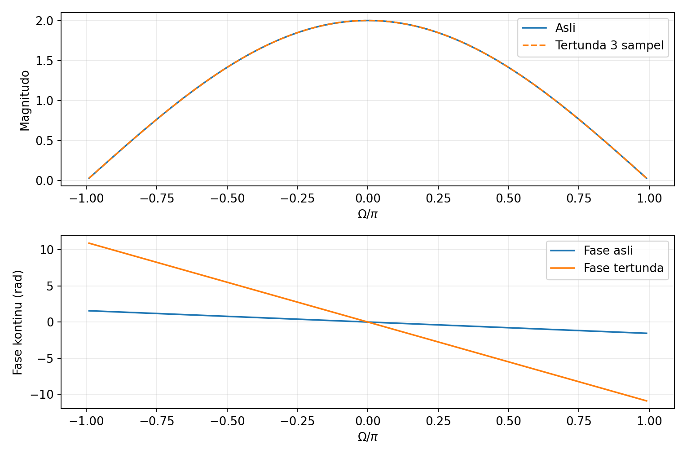

Program [`09_pergeseran.py`](../Kode/pertemuan-04/09_pergeseran.py) menghitung DTFT langsung dari indeks 3 dan 4, lalu memeriksanya terhadap perkalian faktor fase. Dua kurva magnitudo berhimpit, tetapi kurva fase mempunyai kemiringan berbeda.

### Modulasi atau pergeseran frekuensi

Perkalian sinyal dengan eksponensial kompleks menggeser spektrumnya. Sifat ini mengikuti penggabungan eksponensial modulasi dengan eksponensial pada definisi transformasi.

$$
x(t)e^{j\omega_ct}\longleftrightarrow X(\omega-\omega_c),
$$

$$
x[n]e^{j\Omega_cn}\longleftrightarrow X(e^{j(\Omega-\Omega_c)}).
$$

Jika pengalinya adalah kosinus real, rumus Euler memberi dua salinan spektrum dengan bobot setengah. Pada waktu-kontinu, pasangan modulasinya adalah berikut.

$$
x(t)\cos(\omega_ct)
\longleftrightarrow
\frac{1}{2}\bigl[X(\omega-\omega_c)+X(\omega+\omega_c)\bigr].
$$

Pada waktu-diskret, rumus yang sama berlaku dengan mengganti $\omega$ oleh $\Omega$ dan membaca semua pergeseran modulo $2\pi$. Untuk modulasi FS oleh $e^{jm\omega_0t}$, koefisien bergeser menjadi $D_k=C_{k-m}$ ketika $m$ bulat.

### Contoh 9: eksponensial diskret termodulasi

Gunakan $x[n]=(0.8)^n u[n]$ dan pembawa kompleks dengan $\Omega_c=\pi/2$. Spektrum termodulasi diperoleh tanpa menghitung ulang deret geometri.

$$
y[n]=(0.8)^ne^{j\pi n/2}u[n],
\qquad
Y(e^{j\Omega})=\frac{1}{1-0.8e^{-j(\Omega-\pi/2)}}.
$$

Puncak magnitudo bergeser dari $\Omega=0$ ke $\Omega=\pi/2$ modulo $2\pi$. Jika pembawanya diganti dengan $\cos(\pi n/2)$, hasilnya adalah jumlah dua salinan **kompleks** spektrum, bukan jumlah magnitudo masing-masing salinan.

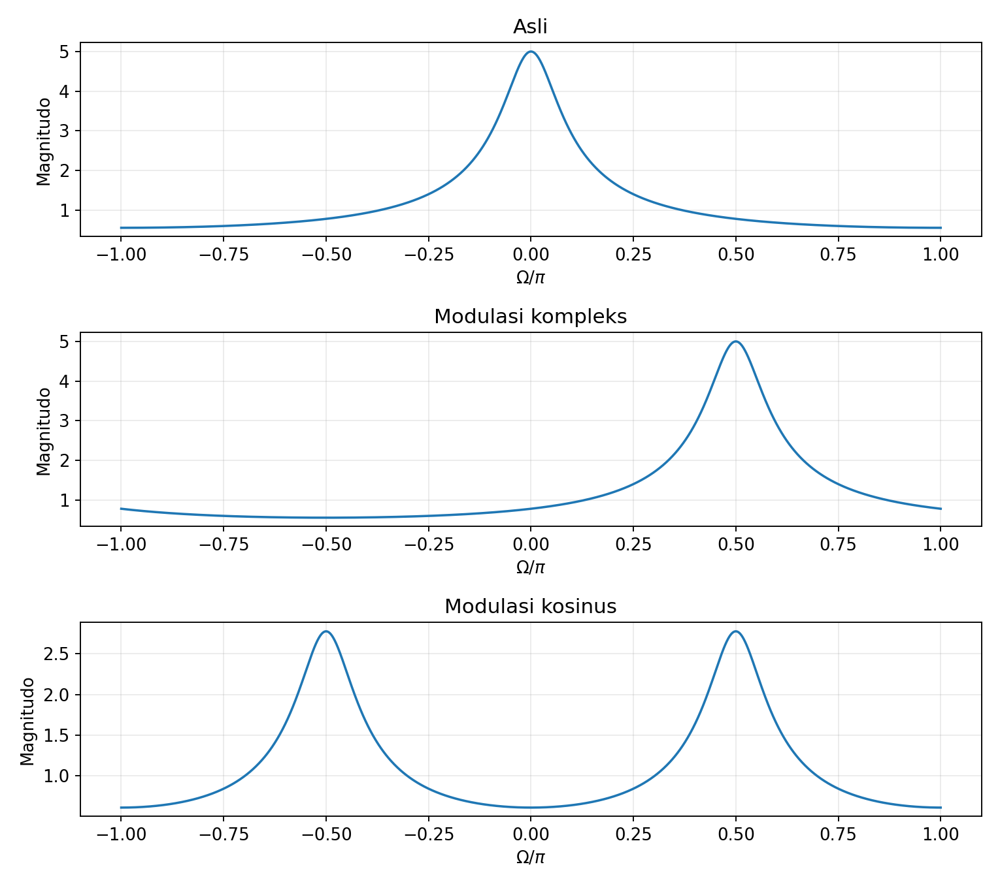

Program [`10_modulasi.py`](../Kode/pertemuan-04/10_modulasi.py) memperlihatkan ketiga kasus dan memverifikasi sifat modulasi menggunakan penjumlahan langsung. Pada modulasi real, fase relatif kedua salinan turut menentukan besar spektrum ketika salinannya bertumpang tindih.

---

## Konvolusi dalam domain frekuensi

### Teorema konvolusi

Pada pertemuan sebelumnya, keluaran LTI dinyatakan sebagai konvolusi masukan dengan respons impuls. Fourier mengubah operasi ini menjadi perkalian pada setiap frekuensi.

$$
y(t)=x(t)*h(t)\longleftrightarrow Y(\omega)=X(\omega)H(\omega),
$$

$$
y[n]=x[n]*h[n]\longleftrightarrow
Y(e^{j\Omega})=X(e^{j\Omega})H(e^{j\Omega}).
$$

Untuk melihat asal rumus waktu-diskret, masukkan definisi konvolusi ke DTFT dan tetapkan $m=n-k$. Jika penjumlahan dapat dipertukarkan, misalnya ketika kedua barisan mutlak terjumlahkan, hasilnya terpisah menjadi dua faktor berikut.

$$
\begin{aligned}
Y(e^{j\Omega})
&=\sum_n\sum_k x[k]h[n-k]e^{-j\Omega n}\\
&=\sum_k\sum_m x[k]h[m]e^{-j\Omega(k+m)}\\
&=\left(\sum_kx[k]e^{-j\Omega k}\right)
\left(\sum_mh[m]e^{-j\Omega m}\right).
\end{aligned}
$$

Bukti waktu-kontinu mengikuti langkah yang sama dengan integral dan substitusi $v=t-\tau$. Jadi, perkalian spektrum berasal dari struktur konvolusi, bukan aturan terpisah yang harus dihafal tanpa alasan.

### Contoh 10: memeriksa konvolusi tiga sampel

Ambil $x[n]=\{1,2\}$ dan $h[n]=\{1,-1\}$, dengan indeks nol pada elemen pertama. Hitungan waktu menghasilkan $y[0]=1$, $y[1]=2-1=1$, dan $y[2]=-2$.

$$
\begin{aligned}
X(e^{j\Omega})&=1+2e^{-j\Omega},\\
H(e^{j\Omega})&=1-e^{-j\Omega},\\
Y(e^{j\Omega})&=(1+2e^{-j\Omega})(1-e^{-j\Omega})\\
&=1+e^{-j\Omega}-2e^{-j2\Omega}.
\end{aligned}
$$

Koefisien pada pangkat eksponensial tepat sama dengan sampel $y[n]=\{1,1,-2\}$. Contoh ini menunjukkan kesetaraan hitungan waktu dan frekuensi tanpa memerlukan DFT atau FFT.

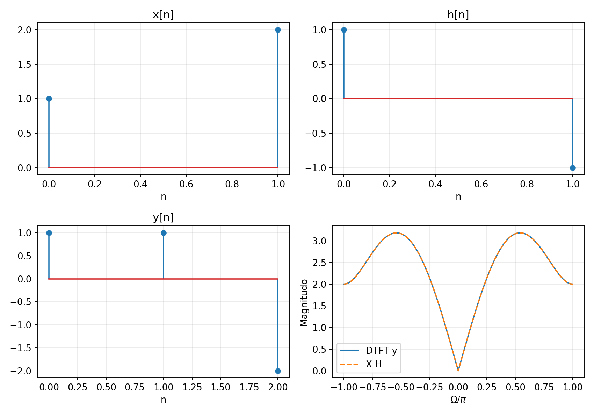

Program [`11_konvolusi.py`](../Kode/pertemuan-04/11_konvolusi.py) menghitung konvolusi di waktu lalu membandingkan DTFT hasilnya dengan $XH$. Pemeriksaan dilakukan terhadap bilangan kompleks, sehingga kesamaan fase juga tercakup.

### Perkalian waktu dan konvolusi frekuensi: pengayaan

Pasangan kebalikan teorema konvolusi menyatakan bahwa perkalian dua sinyal dalam waktu menjadi konvolusi spektrumnya. Dengan konvensi frekuensi sudut yang dipakai di sini, faktor $1/(2\pi)$ harus disertakan.

$$
x(t)g(t)\longleftrightarrow
\frac{1}{2\pi}\int_{-\infty}^{\infty}X(\nu)G(\omega-\nu)\,d\nu.
$$

Untuk DTFT, konvolusi dilakukan secara periodik pada frekuensi dalam satu interval sepanjang $2\pi$. Bentuknya adalah berikut, dengan argumen spektrum dipahami modulo $2\pi$.

$$
x[n]g[n]\longleftrightarrow
\frac{1}{2\pi}\int_{-\pi}^{\pi}X(e^{j\theta})G(e^{j(\Omega-\theta)})\,d\theta.
$$

Modulasi merupakan contoh perkalian waktu ketika salah satu faktor adalah sinusoid. Dengan spektrum sinusoid yang berupa impuls, konvolusi frekuensi menyederhana menjadi salinan spektrum tergeser seperti rumus modulasi kosinus pada bagian sebelumnya.

---

## Respons frekuensi sistem LTI

### Sinusoid kompleks sebagai masukan khusus

Tinjau sistem LTI dengan respons impuls $h[n]$ dan masukan $x[n]=e^{j\Omega_0n}$ yang berlaku sepanjang waktu. Substitusi ke konvolusi memberikan hasil berikut jika jumlah yang mendefinisikan respons frekuensinya konvergen.

$$
\begin{aligned}
y[n]
&=\sum_kh[k]e^{j\Omega_0(n-k)}\\
&=e^{j\Omega_0n}\sum_kh[k]e^{-j\Omega_0k}\\
&=H(e^{j\Omega_0})e^{j\Omega_0n}.
\end{aligned}
$$

Eksponensial kompleks disebut **fungsi eigen sistem LTI** karena bentuk frekuensinya dipertahankan dan hanya dikalikan bilangan kompleks $H(e^{j\Omega_0})$. Sistem LTI stabil BIBO mempunyai $\sum_k|h[k]|<\infty$, sehingga respons frekuensi biasa terdefinisi pada seluruh frekuensi.

Pada waktu-kontinu, hubungan yang bersesuaian adalah $e^{j\omega_0t}\mapsto H(\omega_0)e^{j\omega_0t}$, dengan $H(\omega)$ merupakan FT respons impuls. Hasil ini menjelaskan mengapa representasi sinusoidal sangat berguna dalam analisis sistem.

Jika sistem memiliki respons impuls real dan masukannya $A\cos(\Omega_0n+\phi)$, keluaran sinusoidal sepanjang waktu adalah berikut. Dua eksponensial pasangan konjugat digabungkan kembali menjadi satu kosinus real.

$$
y[n]=A|H(e^{j\Omega_0})|
\cos\bigl(\Omega_0n+\phi+\angle H(e^{j\Omega_0})\bigr).
$$

Untuk sinusoid yang baru dinyalakan pada $n=0$ dalam sistem kausal dengan kondisi awal nol, keluaran juga dapat memuat transien. Rumus keluaran kosinus di atas menyatakan respons sinusoidal yang telah berlangsung sepanjang waktu atau respons keadaan tunak setelah transien mereda pada sistem stabil.

### Contoh 11: filter rata-rata dua sampel

Tinjau $y[n]=(x[n]+x[n-1])/2$ dengan respons impuls $h[n]=(\delta[n]+\delta[n-1])/2$. DTFT respons impulsnya adalah berikut.

$$
H(e^{j\Omega})=\frac{1+e^{-j\Omega}}{2}
=e^{-j\Omega/2}\cos(\Omega/2).
$$

Pada interval $-\pi<\Omega<\pi$, magnitudonya adalah $\cos(\Omega/2)$ dan fasenya $-\Omega/2$. Frekuensi nol dipertahankan dengan penguatan satu, sedangkan frekuensi $\pi$ ditekan menjadi nol.

Untuk masukan $x[n]=2\cos(\pi n/2)$ yang berlaku sepanjang waktu, magnitudo respons adalah $1/\sqrt2$ dan fase tambahannya $-\pi/4$. Karena itu, keluaran tepatnya adalah berikut.

$$
y[n]=\sqrt2\cos\left(\frac{\pi n}{2}-\frac{\pi}{4}\right).
$$

Sebagai pemeriksaan, masukan pada $n=-1$ bernilai nol dan pada $n=0$ bernilai dua, sehingga $y[0]=1$. Rumus frekuensi juga memberi $\sqrt2\cos(-\pi/4)=1$.

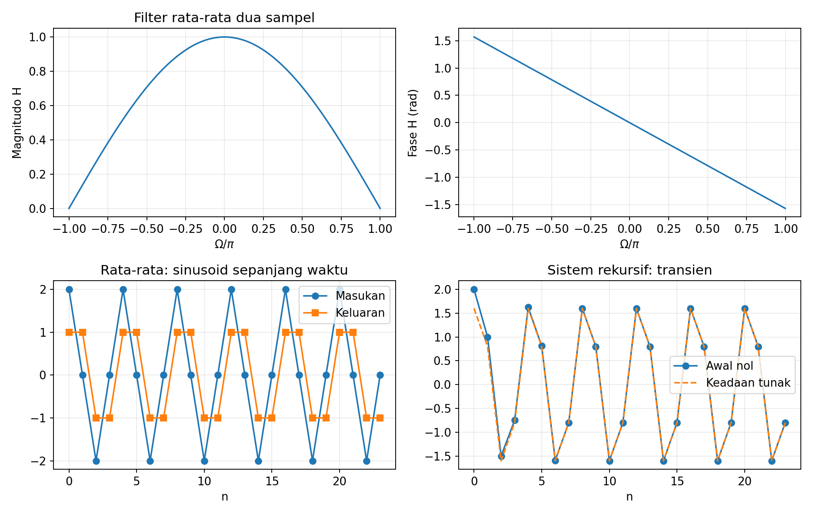

Program [`12_lti.py`](../Kode/pertemuan-04/12_lti.py) memeriksa rumus sinusoidal dengan menghitung sampel masukan yang diperlukan pada $n=-1$. Dengan cara ini, awal grafik tidak secara keliru diperlakukan sebagai awal sinyal yang bernilai nol pada seluruh waktu sebelumnya. Panel kanan bawah membandingkan respons awal nol dan respons keadaan tunak sistem rekursif $y[n]=0.5y[n-1]+x[n]$, yang dibahas sesudah contoh ini.

#### Makna fase linear

Pada interval tanpa nol spektrum, fase $-\Omega/2$ mempunyai kemiringan konstan. Waktu tunda kelompok atau *group delay* didefinisikan sebagai $-d\angle H/d\Omega$, sehingga nilainya $1/2$ sampel pada interval tersebut.

Nilai setengah sampel ini menyatakan kemiringan fase respons filter dan pusat simetri respons impuls. Filter dua sampel tetap menghitung rata-rata dua sampel berindeks bulat, sehingga istilah ini tidak mengharuskan adanya sampel masukan pada indeks pecahan.

### Respons frekuensi dari persamaan selisih

Pertemuan kedua membahas persamaan selisih sistem rekursif dan nonrekursif. Untuk sistem LTI dengan kondisi awal nol dan respons frekuensi yang ada, sifat pergeseran memberikan rumus berikut.

$$
\sum_{r=0}^{N}a_ry[n-r]=\sum_{m=0}^{M}b_mx[n-m]
\quad\Longrightarrow\quad
H(e^{j\Omega})=
\frac{\sum_{m=0}^{M}b_me^{-j\Omega m}}
{\sum_{r=0}^{N}a_re^{-j\Omega r}}.
$$

Pembagian berlaku pada frekuensi dengan penyebut tak nol, dan interpretasi respons frekuensi biasa memerlukan keberadaan DTFT respons impuls. Kondisi awal tidak nol dapat memberi respons tambahan, sehingga hubungan $Y=HX$ tidak menyatakan seluruh keluaran untuk sembarang kondisi awal yang dipertahankan.

Sebagai contoh, sistem kausal $y[n]=0.5y[n-1]+x[n]$ dengan kondisi awal nol mempunyai $h[n]=(0.5)^nu[n]$. Respons frekuensinya adalah $H(e^{j\Omega})=1/(1-0.5e^{-j\Omega})$, sesuai dengan DTFT eksponensial waktu-diskret untuk $a=0.5$, sehingga penguatan DC dua dan penguatan pada $\pi$ adalah $2/3$.

### Interkoneksi dalam frekuensi

Sistem seri mempunyai respons impuls total $h_1*h_2$, sehingga respons frekuensinya $H_1H_2$. Sistem paralel menjumlahkan respons impuls dan mempunyai respons frekuensi $H_1+H_2$.

| Interkoneksi | Respons impuls | Respons frekuensi |
|---|---|---|
| Seri | $h=h_1*h_2$ | $H=H_1H_2$ |
| Paralel | $h=h_1+h_2$ | $H=H_1+H_2$ |

Dalam seri, magnitudo penguatan dikalikan dan fase dijumlahkan modulo $2\pi$. Dalam paralel, penjumlahan dilakukan pada bilangan kompleks, sehingga dua cabang dengan magnitudo sama dapat saling menguatkan atau meniadakan bergantung pada fasenya.

---

## Rangkuman pasangan dan sifat transformasi

Tabel berikut menggunakan konvensi yang sama dengan seluruh contoh di atas. Tanda $*$ pada kolom waktu berarti konvolusi linear, sedangkan $n_0$ pada barisan diskret adalah bilangan bulat.

| Operasi | Waktu-kontinu | FT |
|---|---|---|
| Linearitas | $\alpha x_1(t)+\beta x_2(t)$ | $\alpha X_1(\omega)+\beta X_2(\omega)$ |
| Penundaan | $x(t-t_0)$ | $e^{-j\omega t_0}X(\omega)$ |
| Modulasi kompleks | $e^{j\omega_ct}x(t)$ | $X(\omega-\omega_c)$ |
| Modulasi kosinus | $x(t)\cos(\omega_ct)$ | $[X(\omega-\omega_c)+X(\omega+\omega_c)]/2$ |
| Konvolusi | $x(t)*h(t)$ | $X(\omega)H(\omega)$ |

| Operasi | Waktu-diskret | DTFT |
|---|---|---|
| Linearitas | $\alpha x_1[n]+\beta x_2[n]$ | $\alpha X_1(e^{j\Omega})+\beta X_2(e^{j\Omega})$ |
| Penundaan | $x[n-n_0]$ | $e^{-j\Omega n_0}X(e^{j\Omega})$ |
| Modulasi kompleks | $e^{j\Omega_cn}x[n]$ | $X(e^{j(\Omega-\Omega_c)})$ |
| Konvolusi | $x[n]*h[n]$ | $X(e^{j\Omega})H(e^{j\Omega})$ |
| Periodisitas spektrum | Barisan berindeks bulat | $X(e^{j(\Omega+2\pi)})=X(e^{j\Omega})$ |

Magnitudo spektrum dua sisi kosinus tidak langsung sama dengan amplitudo kosinus dalam waktu. Koefisien FS menggunakan amplitudo setengah pada masing-masing frekuensi pasangan, FT sinusoid menggunakan bobot impuls, dan DTFT barisan berhingga berupa fungsi periodik yang kontinu terhadap frekuensi.

---

## Cek pemahaman

Gunakan pertanyaan berikut pada lima menit terakhir untuk memeriksa hubungan antarkonsep. Jawaban sebaiknya disertai satu alasan matematis atau satu contoh sederhana.

- Mengapa satu kosinus real membutuhkan frekuensi positif dan negatif?
- Apakah FT pulsa tunggal berbentuk garis harmonik atau fungsi frekuensi kontinu?
- Apakah waktu-diskret menyebabkan frekuensi DTFT menjadi diskret?
- Mengapa $x[n]$ dan $x[n-3]$ memiliki magnitudo DTFT yang sama?
- Bagaimana menentukan keluaran sinusoidal jika $H(e^{j\Omega_0})$ diketahui?

---

## Latihan hitungan tangan

### 1. Sinusoid kompleks dan frekuensi sampling

Uraikan $4\cos(200\pi t+\pi/4)$ menjadi dua eksponensial kompleks dan tentukan frekuensinya dalam Hz. Jika $f_s=800$ Hz, tentukan frekuensi diskretnya serta satu frekuensi analog berbeda yang menghasilkan sampel kosinus identik dengan fase awal yang sama.

### 2. Koefisien FS sinusoid

Tentukan seluruh koefisien FS tak nol untuk $x(t)=2+3\cos(\omega_0t)-2\sin(2\omega_0t)$. Tuliskan magnitudo dan fase setiap koefisien serta hitung daya rata-ratanya menggunakan Parseval.

### 3. FS pulsa periodik

Pulsa tinggi dua berulang dengan periode $T_0=4$ s dan bernilai tak nol pada $-0.5<t<0.5$ dalam setiap periode. Turunkan $C_k$, hitung $C_0,C_1,C_2,C_4$, dan tentukan nilai rekonstruksi FS tepat pada titik lompatan.

### 4. FT pulsa tertunda

Sinyal $x(t)$ bernilai tiga pada $1<t<3$ dan nol di luar interval tersebut. Nyatakan sinyal sebagai pulsa berpusat di nol yang ditunda, lalu tentukan FT, magnitudo, fase pada lobus utama, serta lokasi nol pertama.

### 5. FT eksponensial

Hitung FT $x(t)=2e^{-3t}u(t)$ langsung dari integral. Tentukan magnitudo dan fase pada $\omega=0$ serta $\omega=3$ rad/s, kemudian periksa simetri konjugatnya.

### 6. DTFT barisan berhingga

Diberikan $x[n]=\{1,2,1\}$ dengan indeks nol pada elemen pertama. Turunkan DTFT dalam bentuk $4e^{-j\Omega}\cos^2(\Omega/2)$, lalu tentukan magnitudo dan fase pada $\Omega=0,\pi/2,\pi$ dengan memperhatikan fase pada nol spektrum.

### 7. DTFT eksponensial dan periodisitas

Tentukan DTFT $x[n]=(0.5)^nu[n]$ serta nilainya pada $\Omega=0$ dan $\Omega=\pi$. Tunjukkan bahwa nilainya pada $\Omega=\pi/3$ sama dengan nilainya pada $\Omega=7\pi/3$.

### 8. Pergeseran dan modulasi

Diberikan $x[n]=\delta[n]+\delta[n-1]$ dan $y[n]=e^{j\pi n/2}x[n-2]$. Tentukan DTFT $y[n]$ dengan sifat transformasi, lalu verifikasi hasilnya menggunakan dua sampel tak nol secara langsung.

### 9. Konvolusi dalam domain frekuensi

Ambil $x[n]=\{1,-1\}$ dan $h[n]=\{1,2,1\}$, dengan indeks nol pada elemen pertama. Kalikan DTFT keduanya untuk memperoleh $Y(e^{j\Omega})$, lalu baca koefisiennya untuk mendapatkan semua sampel keluaran dan periksa dengan konvolusi manual.

### 10. Respons frekuensi LTI

Sistem kausal stabil memenuhi $y[n]=0.5y[n-1]+x[n]$ dengan kondisi awal nol. Tentukan respons frekuensi serta respons keadaan tunak terhadap $x[n]=2\cos(\pi n/2)$ yang dinyalakan pada $n=0$, lalu jelaskan mengapa respons awal dapat berbeda dari rumus keadaan tunak.

---

## Latihan pemrograman

### 1. Sintesis sinusoid kompleks

Bangkitkan sinyal pada latihan hitungan 2 melalui bentuk real dan penjumlahan eksponensial kompleks. Gambarkan kedua hasilnya, laporkan galat maksimum, serta periksa bahwa bagian imajiner hasil sintesis mendekati nol.

### 2. Koefisien FS melalui integrasi numerik

Hitung koefisien pulsa pada latihan hitungan 3 menggunakan integrasi numerik untuk $-20\leq k\leq20$. Bandingkan hasilnya dengan rumus sinc dan ulangi menggunakan kisi waktu lebih rapat untuk melihat perubahan galat.

### 3. Konvergensi FS dan Gibbs

Rekonstruksi pulsa periodik dengan $K=5,15,50,150$ dan gambarkan daerah sekitar lompatan pada skala yang sama. Ukur tinggi overshoot relatif terhadap tinggi lompatan serta lebar daerah riak, kemudian jelaskan perbedaan kecenderungan kedua besaran tersebut.

### 4. FT numerik eksponensial

Hitung integral FT $e^{-2t}u(t)$ pada $-20\leq\omega\leq20$ rad/s tanpa menggunakan FFT. Variasikan batas atas waktu dan langkah integrasi secara terpisah, lalu bandingkan hasil kompleksnya dengan $1/(2+j\omega)$.

### 5. Lebar pulsa dan spektrum

Gambarkan FT analitik pulsa tinggi satu dengan lebar $\tau=0.5,1,2$ s. Tandai nol pertama pada masing-masing grafik dan jelaskan hubungan lebar waktu dengan lebar lobus utama frekuensi.

### 6. DTFT langsung dan invers numerik

Buat fungsi DTFT untuk barisan berhingga beserta indeks waktunya, sehingga barisan tidak harus dimulai pada nol. Uji invers menggunakan kisi seragam pada $[-\pi,\pi)$ dan rumus jumlah Riemann untuk barisan pada latihan hitungan 6 serta versi yang digeser tiga sampel.

### 7. Periodisitas dan aliasing

Gambarkan DTFT barisan $x[n]=\{1,2,-1,3\}$ pada $-3\pi\leq\Omega\leq3\pi$ dan periksa identitas periodisitas kompleksnya. Bangkitkan dua kosinus analog berfrekuensi 100 dan 1100 Hz pada $f_s=1000$ Hz dengan fase sama, lalu verifikasi bahwa sampelnya identik.

### 8. Penundaan dan fase

Hitung DTFT $x[n]=\{1,1\}$ dan $x[n-4]$, lalu bandingkan magnitudo serta fasenya. Hindari titik nol spektrum ketika menghitung fase dan jelaskan perbedaan fase utama dengan fase yang di-*unwrap*.

### 9. Modulasi dan konvolusi

Verifikasi sifat modulasi kompleks serta kosinus untuk $x[n]=(0.8)^nu[n]$ yang dipotong pada 80 sampel. Selanjutnya, pilih dua barisan berhingga dan periksa teorema konvolusi dengan membandingkan DTFT konvolusi terhadap perkalian DTFT kedua barisan.

### 10. Respons LTI dan transien

Simulasikan $y[n]=0.5y[n-1]+2\cos(\pi n/2)$ untuk $n\geq0$ dengan $y[-1]=0$. Bandingkan dengan respons keadaan tunak dari $H(e^{j\pi/2})$, gambarkan selisihnya, dan periksa bahwa selisih tersebut memenuhi persamaan homogen setelah masukan kedua perhitungan sama.

---

## Rangkuman

Representasi Fourier menyatakan sinyal melalui sinusoid kompleks yang mempunyai frekuensi, bobot, dan fase tertentu. FS memakai harmonik diskret untuk sinyal kontinu periodik, sedangkan FT memakai variabel frekuensi kontinu untuk sinyal kontinu yang lebih umum.

DTFT memakai penjumlahan atas waktu diskret dan menghasilkan fungsi frekuensi kontinu yang periodik dengan $2\pi$. Frekuensi $\Omega$ mempunyai satuan rad/sampel dan dihubungkan ke frekuensi analog oleh $\Omega=2\pi f/f_s$.

Penundaan mengubah fase tanpa mengubah magnitudo, sedangkan modulasi menggeser spektrum. Konvolusi waktu menjadi perkalian spektrum, sehingga keluaran LTI dapat dihitung melalui $Y=HX$ ketika asumsi respons keadaan-nol dan keberadaan transformasinya terpenuhi.

Respons frekuensi adalah transformasi Fourier respons impuls dan menentukan penguatan serta perubahan fase tiap sinusoid. Untuk masukan yang baru dinyalakan, transien harus dibedakan dari respons sinusoidal keadaan tunak.

---

## Referensi

1. Gunawan, D., dan Juwono, F. H. *Dasar Pengolahan Sinyal Digital*, Bab 4, terutama pembahasan FS, FT, dan DTFT. Bagian DFT/FFT dilanjutkan pada pertemuan berikutnya.

2. Oppenheim, A. V. [MIT OpenCourseWare: Signals and Systems, catatan kuliah 7–11](https://ocw.mit.edu/courses/res-6-007-signals-and-systems-spring-2011/pages/lecture-notes/). 

3. Oppenheim, A. V. [Fourier Transform Properties](https://ocw.mit.edu/courses/res-6-007-signals-and-systems-spring-2011/resources/lecture-9-fourier-transform-properties/). 

4. Oppenheim, A. V. [Discrete-Time Fourier Transform, catatan kuliah 11](https://ocw.mit.edu/courses/res-6-007-signals-and-systems-spring-2011/9434f9bde960fd3b2b81de3ad442f902_MITRES_6_007S11_lec11.pdf). 

Catatan: Notasi dasar dalam catatan kita ini mengacu pada Bab 4 buku Gunawan-Juwono, dengan pemisahan $\omega$ dan $\Omega$ untuk membantu pembacaan satuan.
