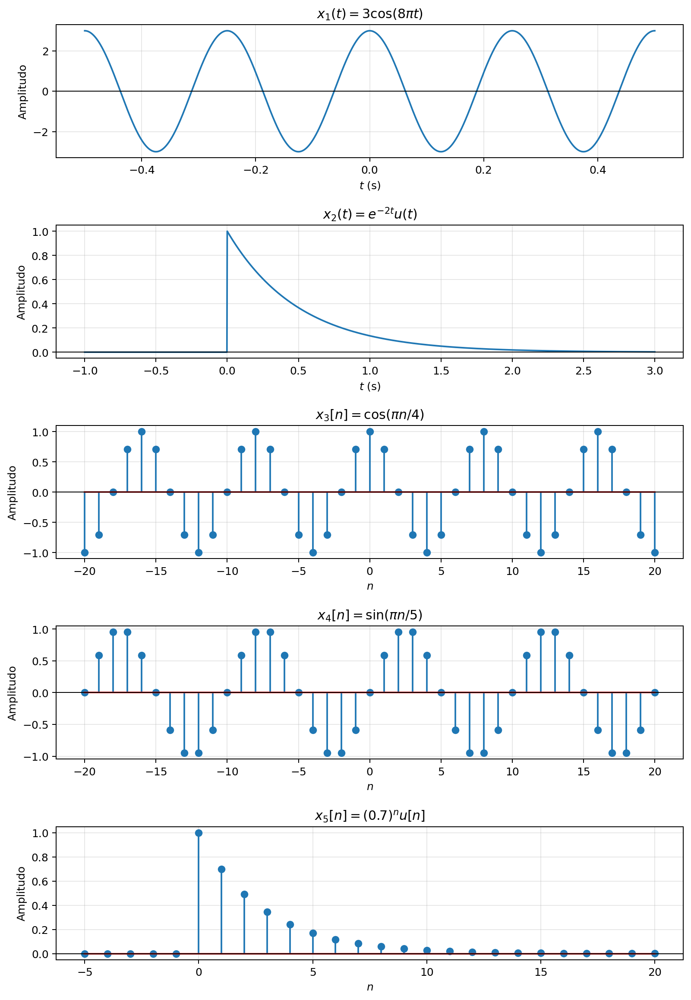
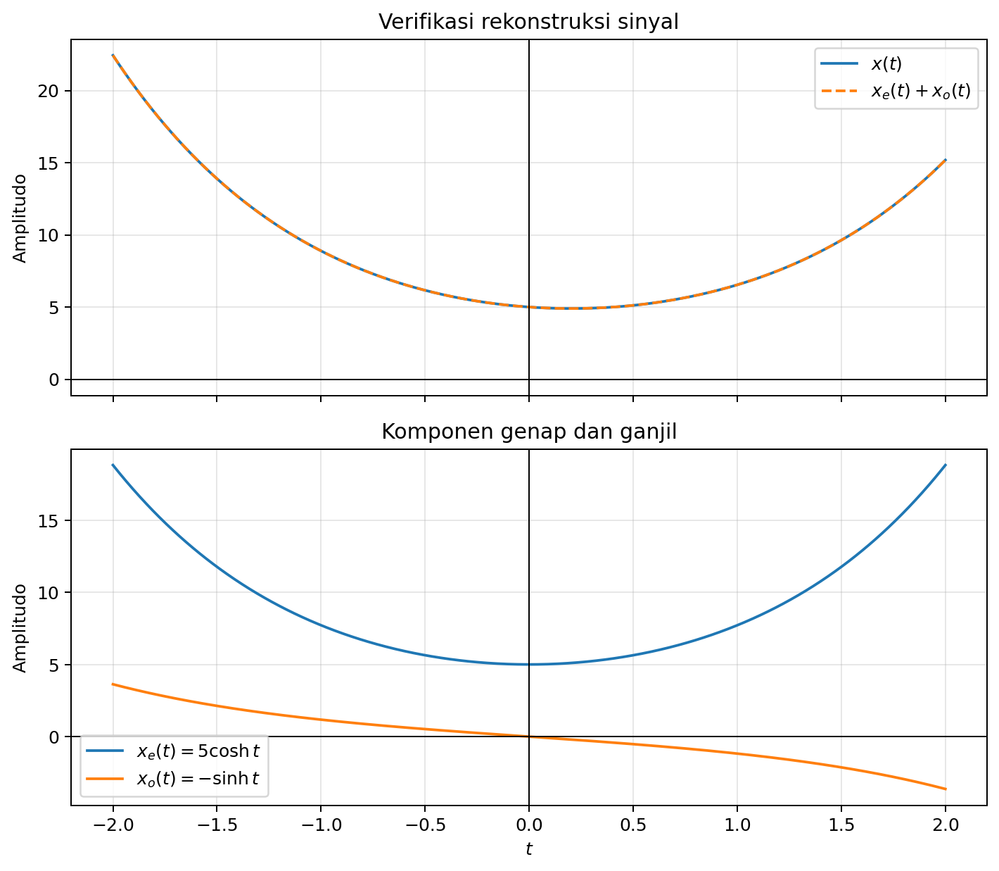
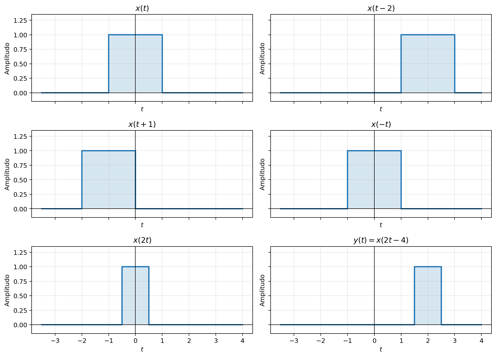

# Solusi Latihan Hitungan Tangan Kuliah 1

---

## 1. Klasifikasi sinyal

Klasifikasikan masing-masing sinyal berikut sebagai kontinu/diskret, periodik/aperiodik, dan genap/ganjil.

```math
x_1(t)=3\cos(8\pi t),
```

```math
x_2(t)=e^{-2t}u(t),
```

```math
x_3[n]=\cos\left(\frac{\pi n}{4}\right),
```

```math
x_4[n]=\sin\left(\frac{\pi n}{5}\right),
```

```math
x_5[n]=(0.7)^n u[n].
```

---

Sinyal waktu-kontinu ditulis sebagai fungsi variabel kontinu $t$, sedangkan sinyal waktu-diskret ditulis sebagai deret dengan indeks bilangan bulat $n$. Sinyal periodik memenuhi $x(t+T)=x(t)$ untuk suatu $T>0$ pada waktu kontinu, atau $x[n+N]=x[n]$ untuk suatu bilangan bulat positif $N$ pada waktu diskret.

Sinyal genap memenuhi $x(-t)=x(t)$ atau $x[-n]=x[n]$, sedangkan sinyal ganjil memenuhi $x(-t)=-x(t)$ atau $x[-n]=-x[n]$. Sinyal yang tidak memenuhi salah satu dari kedua hubungan tersebut diklasifikasikan sebagai tidak genap dan tidak ganjil.

### a. Sinyal $x_1(t)=3\cos(8\pi t)$

Variabel bebasnya adalah $t$, sehingga $x_1(t)$ merupakan sinyal waktu-kontinu. Frekuensi sudutnya adalah $\omega_0=8\pi\ \mathrm{rad/s}$, sehingga periode fundamentalnya diperoleh dari

```math
T_0=\frac{2\pi}{\omega_0}
=\frac{2\pi}{8\pi}
=\frac14\ \mathrm{s}.
```

Sifat genap diperiksa dengan mengganti $t$ menjadi $-t$. Karena kosinus merupakan fungsi genap, diperoleh

```math
x_1(-t)=3\cos(-8\pi t)
=3\cos(8\pi t)
=x_1(t).
```

Jadi, $x_1(t)$ adalah sinyal **waktu-kontinu, periodik dengan periode fundamental $T_0=1/4\ \mathrm{s}$, dan genap**. Faktor amplitudo tiga tidak mengubah periodisitas ataupun sifat genapnya.

### b. Sinyal $x_2(t)=e^{-2t}u(t)$

Sinyal ini bergantung pada variabel kontinu $t$, sehingga termasuk sinyal waktu-kontinu. Dengan definisi $u(t)=0$ untuk $t<0$ dan $u(t)=1$ untuk $t\ge0$, bentuknya dapat ditulis sebagai

```math
x_2(t)=
\begin{cases}
e^{-2t}, & t\ge0,\\
0, & t<0.
\end{cases}
```

Amplitudonya meluruh secara eksponensial dan tidak mengulang setelah selang waktu tetap, sehingga sinyal ini aperiodik. Sebagai contoh, untuk $t>0$ dan $T>0$ berlaku $e^{-2(t+T)}=e^{-2T}e^{-2t}\ne e^{-2t}$.

Untuk $t>0$, $x_2(t)=e^{-2t}$ sedangkan $x_2(-t)=0$. Kedua nilai tersebut tidak sama dan juga tidak saling berlawanan tanda, sehingga sinyal ini tidak genap dan tidak ganjil.

Jadi, $x_2(t)$ adalah sinyal **waktu-kontinu, aperiodik, serta tidak genap dan tidak ganjil**. Nilai yang dipilih untuk $u(0)$ tidak mengubah kesimpulan tersebut karena kegagalan simetri sudah terjadi untuk semua $t>0$.

### c. Sinyal $x_3[n]=\cos(\left(\pi n/4\right))$

Indeks $n$ hanya mengambil nilai bilangan bulat, sehingga $x_3[n]$ merupakan sinyal waktu-diskret. Periodisitas sinusoid diskret mensyaratkan adanya bilangan bulat positif $N$ dan bilangan bulat $k$ yang memenuhi

```math
\frac{\pi}{4}N=2\pi k.
```

Persamaan tersebut menyederhana menjadi $N=8k$. Nilai positif terkecil diperoleh untuk $k=1$, sehingga periode fundamentalnya adalah $N_0=8$.

Sifat simetrinya diperoleh dari sifat genap kosinus. Secara langsung,

```math
x_3[-n]=\cos\left(-\frac{\pi n}{4}\right)
=\cos\left(\frac{\pi n}{4}\right)
=x_3[n].
```

Jadi, $x_3[n]$ adalah sinyal **waktu-diskret, periodik dengan periode fundamental $N_0=8$, dan genap**. Delapan sampel membentuk satu pengulangan lengkap deret tersebut.

### d. Sinyal $x_4[n]=\sin(\left(\pi n/5\right))$

Sinyal ini merupakan sinyal waktu-diskret karena variabel bebasnya adalah indeks bilangan bulat $n$. Syarat periodisitasnya adalah

```math
\frac{\pi}{5}N=2\pi k,
```

sehingga $N=10k$. Bilangan bulat positif terkecil diperoleh untuk $k=1$, jadi periode fundamentalnya adalah $N_0=10$.

Karena sinus merupakan fungsi ganjil, perubahan $n$ menjadi $-n$ memberikan

```math
x_4[-n]=\sin\left(-\frac{\pi n}{5}\right)
=-\sin\left(\frac{\pi n}{5}\right)
=-x_4[n].
```

Jadi, $x_4[n]$ adalah sinyal **waktu-diskret, periodik dengan periode fundamental $N_0=10$, dan ganjil**. Nilai $x_4[0]=0$ juga konsisten dengan syarat bahwa sinyal ganjil harus bernilai nol di titik asal.

### e. Sinyal $x_5[n]=(0.7)^n u[n]$

Variabel bebasnya adalah $n$, sehingga sinyal ini merupakan sinyal waktu-diskret. Fungsi unit step membuat sinyal bernilai nol untuk $n<0$ dan meluruh secara eksponensial untuk $n\ge0$.

Sinyal tidak mungkin berulang dengan periode bilangan bulat positif karena untuk $n\ge0$ berlaku

```math
\frac{x_5[n+N]}{x_5[n]}=(0.7)^N\ne1
```

untuk setiap $N>0$. Oleh karena itu, $x_5[n]$ bersifat aperiodik.

Untuk $n>0$, $x_5[n]=(0.7)^n$ sedangkan $x_5[-n]=0$. Hubungan tersebut tidak memenuhi syarat genap ataupun ganjil, sehingga sinyalnya tidak memiliki kedua simetri itu.

Jadi, $x_5[n]$ adalah sinyal **waktu-diskret, aperiodik, serta tidak genap dan tidak ganjil**. Seperti pada sinyal eksponensial kontinu, pemotongan oleh unit step menghilangkan simetri terhadap titik asal.

### Ringkasan klasifikasi

| Sinyal | Jenis waktu | Periodisitas | Simetri |
|---|---|---|---|
| $x_1(t)=3\cos(8\pi t)$ | Kontinu | Periodik, $T_0=1/4\ \mathrm{s}$ | Genap |
| $x_2(t)=e^{-2t}u(t)$ | Kontinu | Aperiodik | Tidak genap dan tidak ganjil |
| $x_3[n]=\cos(\pi n/4)$ | Diskret | Periodik, $N_0=8$ | Genap |
| $x_4[n]=\sin(\pi n/5)$ | Diskret | Periodik, $N_0=10$ | Ganjil |
| $x_5[n]=(0.7)^n u[n]$ | Diskret | Aperiodik | Tidak genap dan tidak ganjil |



Grafik memperlihatkan pengulangan pada ketiga sinusoid dan peluruhan satu sisi pada kedua sinyal yang memuat unit step. Untuk sinyal diskret, batang hanya menunjukkan nilai pada indeks bilangan bulat dan garis di antara batang tidak menjadi bagian dari sinyal.

### Kode Python untuk grafik klasifikasi

```python
import numpy as np
import matplotlib.pyplot as plt


# Sinyal waktu-kontinu
t_periodik = np.linspace(-0.5, 0.5, 2001)
t_kausal = np.linspace(-1.0, 3.0, 2001)
x1 = 3 * np.cos(8 * np.pi * t_periodik)
x2 = np.where(t_kausal >= 0, np.exp(-2 * t_kausal), 0.0)

# Sinyal waktu-diskret
n_periodik = np.arange(-20, 21)
n_kausal = np.arange(-5, 21)
x3 = np.cos(np.pi * n_periodik / 4)
x4 = np.sin(np.pi * n_periodik / 5)
x5 = np.where(n_kausal >= 0, 0.7**n_kausal, 0.0)

fig, axes = plt.subplots(5, 1, figsize=(9, 13))

axes[0].plot(t_periodik, x1)
axes[0].set_title(r'$x_1(t)=3\cos(8\pi t)$')
axes[0].set_xlabel(r'$t$ (s)')

axes[1].plot(t_kausal, x2)
axes[1].set_title(r'$x_2(t)=e^{-2t}u(t)$')
axes[1].set_xlabel(r'$t$ (s)')

axes[2].stem(n_periodik, x3)
axes[2].set_title(r'$x_3[n]=\cos(\pi n/4)$')
axes[2].set_xlabel(r'$n$')

axes[3].stem(n_periodik, x4)
axes[3].set_title(r'$x_4[n]=\sin(\pi n/5)$')
axes[3].set_xlabel(r'$n$')

axes[4].stem(n_kausal, x5)
axes[4].set_title(r'$x_5[n]=(0.7)^n u[n]$')
axes[4].set_xlabel(r'$n$')

for ax in axes:
    ax.set_ylabel('Amplitudo')
    ax.axhline(0, color='black', linewidth=0.8)
    ax.grid(alpha=0.3)

fig.tight_layout()
fig.savefig('../Gambar/01-klasifikasi-sinyal.png', dpi=180,
            bbox_inches='tight')
plt.show()
```

Kode yang sama tersedia sebagai [01_klasifikasi_sinyal.py](Kode/01_klasifikasi_sinyal.py). Berkas mandiri tersebut dapat dijalankan kembali jika rentang waktu atau indeks pada grafik ingin diubah.

---

## 2. Periode fundamental

Tentukan periode fundamental sinyal

```math
x(t)
=
\cos(10\pi t)
+
2\sin(20\pi t).
```

---

Sinyal yang diberikan merupakan jumlah dua sinusoid waktu-kontinu. Periode jumlahnya adalah kelipatan persekutuan terkecil dari periode kedua komponen, jika perbandingan periodenya rasional.

Komponen pertama mempunyai frekuensi sudut $\omega_1=10\pi\ \mathrm{rad/s}$. Periode fundamental komponen ini adalah

```math
T_1=\frac{2\pi}{10\pi}=\frac15\ \mathrm{s}=0.2\ \mathrm{s}.
```

Komponen kedua mempunyai frekuensi sudut $\omega_2=20\pi\ \mathrm{rad/s}$. Periode fundamentalnya adalah

```math
T_2=\frac{2\pi}{20\pi}=\frac1{10}\ \mathrm{s}=0.1\ \mathrm{s}.
```

Kita mencari bilangan positif terkecil $T_0$ yang merupakan kelipatan bulat dari $T_1$ dan $T_2$. Karena $T_1=2T_2$, pilihan terkecilnya adalah

```math
\boxed{T_0=T_1=0.2\ \mathrm{s}.}
```

Verifikasinya dapat dilakukan dengan memperhatikan perubahan fase selama $T_0$. Komponen pertama berubah fase sebesar $10\pi(0.2)=2\pi$, sedangkan komponen kedua berubah fase sebesar $20\pi(0.2)=4\pi$, sehingga keduanya kembali ke nilai semula.

---

## 3. Periodisitas sinusoid diskret

Tentukan apakah sinyal berikut periodik. Jika periodik, tentukan periode fundamentalnya.

```math
x_1[n]
=
\cos\left(\frac{\pi n}{6}\right),
```

```math
x_2[n]
=
\sin\left(\frac{3\pi n}{5}\right),
```

```math
x_3[n]
=
\cos(\sqrt{2}\,n).
```

---

Sinusoid waktu-diskret dengan frekuensi sudut $\omega_0$ bersifat periodik jika terdapat bilangan bulat positif $N$ dan bilangan bulat $k$ yang memenuhi $\omega_0N=2\pi k$. Syarat yang setara adalah bahwa rasio $\omega_0/(2\pi)$ harus berupa bilangan rasional.

### a. $x_1[n]=\cos(\left(\pi n/6\right))$

Untuk sinyal pertama, syarat periodisitasnya adalah

```math
\frac{\pi}{6}N=2\pi k
\quad\Longrightarrow\quad
N=12k.
```

Bilangan bulat positif terkecil diperoleh dari $k=1$. Jadi, sinyal bersifat periodik dengan

```math
\boxed{N_0=12.}
```

### b. $x_2[n]=\sin(\left(3\pi n/5\right))$

Syarat periodisitas sinyal kedua menghasilkan

```math
\frac{3\pi}{5}N=2\pi k
\quad\Longrightarrow\quad
3N=10k.
```

Karena 3 dan 10 relatif prima, nilai $N$ terkecil yang membuat ruas kiri kelipatan 10 adalah $N=10$. Nilai tersebut bersesuaian dengan $k=3$, sehingga

```math
\boxed{N_0=10.}
```

Periode fundamental tidak diperoleh dengan langsung menghitung $2\pi/\omega_0=10/3$, karena periode sinyal diskret harus berupa bilangan bulat. Tiga siklus sinusoid berlangsung selama sepuluh interval sampel.

### c. $x_3[n]=\cos(\left(\sqrt{2}\,n\right))$

Rasio frekuensi sudut terhadap $2\pi$ adalah

```math
\frac{\omega_0}{2\pi}
=\frac{\sqrt{2}}{2\pi}.
```

Rasio tersebut bukan bilangan rasional, sehingga tidak ada bilangan bulat positif $N$ dan bilangan bulat $k$ yang memenuhi $\sqrt{2}N=2\pi k$. Oleh sebab itu, sinyal ini **aperiodik** dan tidak mempunyai periode fundamental.

Hasil ini memperlihatkan perbedaan penting antara sinusoid kontinu dan diskret. Setiap sinusoid waktu-kontinu dengan frekuensi bukan nol bersifat periodik, sedangkan sinusoid diskret hanya periodik jika frekuensi ternormalisasinya rasional.

---

## 4. Dekomposisi genap-ganjil

Tentukan komponen genap dan ganjil dari
```math
x(t)
=
2e^t+3e^{-t}.
```
Verifikasi bahwa
```math
x(t)
=
x_e(t)+x_o(t).
```

---

Setiap sinyal dapat diuraikan menjadi komponen genap dan komponen ganjil melalui hubungan

```math
x_e(t)=\frac{x(t)+x(-t)}{2},
\qquad
x_o(t)=\frac{x(t)-x(-t)}{2}.
```

Untuk $x(t)=2e^t+3e^{-t}$, sinyal yang dicerminkan terhadap titik asal adalah

```math
x(-t)=2e^{-t}+3e^t.
```

Komponen genapnya diperoleh dengan menjumlahkan kedua bentuk tersebut dan membaginya dengan dua. Langkah aljabarnya adalah

```math
\begin{aligned}
x_e(t)
&=\frac{(2e^t+3e^{-t})+(2e^{-t}+3e^t)}{2}\\
&=\frac{5e^t+5e^{-t}}{2}\\
&=5\frac{e^t+e^{-t}}{2}\\
&=\boxed{5\cosh t}.
\end{aligned}
```

Komponen ganjilnya diperoleh dengan mengambil selisih $x(t)-x(-t)$. Perhitungannya memberikan

```math
\begin{aligned}
x_o(t)
&=\frac{(2e^t+3e^{-t})-(2e^{-t}+3e^t)}{2}\\
&=\frac{-e^t+e^{-t}}{2}\\
&=-\frac{e^t-e^{-t}}{2}\\
&=\boxed{-\sinh t}.
\end{aligned}
```

Sifat simetrinya dapat diperiksa dari $\cosh(-t)=\cosh t$ dan $\sinh(-t)=-\sinh t$. Dengan demikian, $x_e(t)$ memang genap dan $x_o(t)$ memang ganjil.

Rekonstruksi sinyal awal dilakukan dengan menjumlahkan kedua komponen. Hasilnya adalah

```math
\begin{aligned}
x_e(t)+x_o(t)
&=5\cosh t-\sinh t\\
&=\frac52(e^t+e^{-t})-\frac12(e^t-e^{-t})\\
&=2e^t+3e^{-t}\\
&=x(t).
\end{aligned}
```

Jadi, dekomposisi yang diminta adalah

```math
\boxed{x_e(t)=5\cosh t,\qquad x_o(t)=-\sinh t.}
```



Panel pertama memperlihatkan bahwa kurva $x_e(t)+x_o(t)$ berhimpit dengan $x(t)$. Panel kedua memperlihatkan simetri $x_e(t)$ terhadap sumbu vertikal dan antisimetri $x_o(t)$ terhadap titik asal.

### Kode Python untuk dekomposisi genap-ganjil

```python
import numpy as np
import matplotlib.pyplot as plt


t = np.linspace(-2, 2, 1001)
x = 2 * np.exp(t) + 3 * np.exp(-t)
x_genap = 5 * np.cosh(t)
x_ganjil = -np.sinh(t)

# Verifikasi numerik x = x_genap + x_ganjil.
galat = np.max(np.abs(x - (x_genap + x_ganjil)))
print(f'Galat maksimum rekonstruksi = {galat:.3e}')

fig, axes = plt.subplots(2, 1, figsize=(8, 7), sharex=True)
axes[0].plot(t, x, label=r'$x(t)$')
axes[0].plot(t, x_genap + x_ganjil, '--',
             label=r'$x_e(t)+x_o(t)$')
axes[0].set_title('Verifikasi rekonstruksi sinyal')

axes[1].plot(t, x_genap, label=r'$x_e(t)=5\cosh t$')
axes[1].plot(t, x_ganjil, label=r'$x_o(t)=-\sinh t$')
axes[1].set_title('Komponen genap dan ganjil')
axes[1].set_xlabel(r'$t$')

for ax in axes:
    ax.set_ylabel('Amplitudo')
    ax.axhline(0, color='black', linewidth=0.8)
    ax.axvline(0, color='black', linewidth=0.8)
    ax.grid(alpha=0.3)
    ax.legend()

fig.tight_layout()
fig.savefig('../Gambar/04-dekomposisi-genap-ganjil.png', dpi=180,
            bbox_inches='tight')
plt.show()
```

Kode yang sama tersedia sebagai [02_dekomposisi_genap_ganjil.py](Kode/02_dekomposisi_genap_ganjil.py). Program juga mencetak galat rekonstruksi maksimum sebagai pemeriksaan numerik identitas $x=x_e+x_o$.

---

## 5. Dekomposisi sinyal polinomial

Untuk
```math
x(t)
=
3+2t+t^2-t^3,
```
tentukan $x_e(t)$ (fungsi dekomposisi genap) dan $x_o(t)$ (fungsi dekomposisi ganjil).

---

Gunakan definisi komponen genap dan ganjil yang sama seperti pada soal sebelumnya. Untuk

```math
x(t)=3+2t+t^2-t^3,
```

pergantian $t$ dengan $-t$ memberikan

```math
\begin{aligned}
x(-t)
&=3+2(-t)+(-t)^2-(-t)^3\\
&=3-2t+t^2+t^3.
\end{aligned}
```

Komponen genap diperoleh dengan menjumlahkan $x(t)$ dan $x(-t)$. Suku dengan pangkat ganjil saling menghilangkan, sehingga

```math
\begin{aligned}
x_e(t)
&=\frac{x(t)+x(-t)}{2}\\
&=\frac{(3+2t+t^2-t^3)+(3-2t+t^2+t^3)}{2}\\
&=\frac{6+2t^2}{2}\\
&=\boxed{3+t^2}.
\end{aligned}
```

Komponen ganjil diperoleh dengan mengurangkan $x(-t)$ dari $x(t)$. Suku konstan dan suku berpangkat genap saling menghilangkan, sehingga

```math
\begin{aligned}
x_o(t)
&=\frac{x(t)-x(-t)}{2}\\
&=\frac{(3+2t+t^2-t^3)-(3-2t+t^2+t^3)}{2}\\
&=\frac{4t-2t^3}{2}\\
&=\boxed{2t-t^3}.
\end{aligned}
```

Penjumlahannya langsung menghasilkan $(3+t^2)+(2t-t^3)=3+2t+t^2-t^3=x(t)$. Hasil ini juga sesuai dengan aturan sederhana bahwa suku berpangkat genap membentuk komponen genap, sedangkan suku berpangkat ganjil membentuk komponen ganjil.

---

## 6. Energi eksponensial

Tentukan energi
```math
x[n]
=
\left(\frac{1}{2}\right)^n u[n].
```

---

Energi sinyal waktu-diskret didefinisikan sebagai jumlah kuadrat magnitudo semua sampelnya. Untuk sinyal real, definisinya adalah

```math
E_x=\sum_{n=-\infty}^{\infty}|x[n]|^2.
```

Fungsi unit step membuat $x[n]=0$ untuk $n<0$, sehingga batas bawah penjumlahan dapat diganti menjadi nol. Dengan $x[n]=(1/2)^n$ untuk $n\ge0$, energinya menjadi

```math
\begin{aligned}
E_x
&=\sum_{n=0}^{\infty}\left|\left(\frac12\right)^n\right|^2\\
&=\sum_{n=0}^{\infty}\left(\frac14\right)^n.
\end{aligned}
```

Deret tersebut merupakan deret geometri tak berhingga dengan suku pertama satu dan rasio $r=1/4$. Karena $|r|<1$, jumlahnya konvergen dan dapat dihitung melalui

```math
E_x=\frac{1}{1-r}
=\frac{1}{1-1/4}
=\frac{1}{3/4}
=\boxed{\frac43}.
```

Jadi, sinyal tersebut mempunyai energi berhingga sebesar $4/3$. Karena energinya positif dan berhingga, sinyal ini termasuk sinyal energi dan daya rata-rata jangka panjangnya sama dengan nol.

---

## 7. Daya sinusoid

Tentukan daya rata-rata
```math
x(t)
=
5\cos(100\pi t+\pi/3).
```
Apakah daya bergantung pada fase awal?

---

Daya rata-rata sinyal waktu-kontinu periodik dapat dihitung pada satu periode. Jika periode fundamentalnya $T_0$, definisinya adalah

```math
P_x=\frac{1}{T_0}\int_{t_0}^{t_0+T_0}|x(t)|^2\,dt.
```

Untuk $x(t)=5\cos(100\pi t+\pi/3)$, amplitudonya adalah $A=5$ dan frekuensi sudutnya $\omega_0=100\pi\ \mathrm{rad/s}$. Periode fundamentalnya adalah

```math
T_0=\frac{2\pi}{100\pi}=\frac1{50}\ \mathrm{s}.
```

Kuadrat sinyal dapat ditulis menggunakan identitas $\cos^2\theta=(1+\cos 2\theta)/2$. Dengan memilih sembarang interval sepanjang satu periode, diperoleh

```math
\begin{aligned}
P_x
&=\frac{1}{T_0}\int_{t_0}^{t_0+T_0}
25\cos^2\left(100\pi t+\frac\pi3\right)dt\\
&=\frac{25}{2T_0}\int_{t_0}^{t_0+T_0}
\left[1+\cos\left(200\pi t+\frac{2\pi}{3}\right)\right]dt.
\end{aligned}
```

Integral suku pertama sama dengan $T_0$, sedangkan integral suku kosinus selama satu periode sama dengan nol. Oleh sebab itu,

```math
P_x=\frac{25}{2T_0}(T_0+0)
=\boxed{\frac{25}{2}=12.5}.
```

Daya rata-rata tidak bergantung pada fase awal $\pi/3$. Perubahan fase hanya menggeser sinusoid sepanjang sumbu waktu, sedangkan rata-rata $\cos^2$ selama satu periode tetap $1/2$.

Secara umum, sinusoid $A\cos(\omega_0t+\phi)$ mempunyai daya $A^2/2$ untuk $\omega_0\ne0$. Kesimpulan ini berlaku selama rata-rata diambil pada satu periode lengkap atau melalui limit waktu tak berhingga.

---

## 8. Pergeseran sinyal

Diberikan
```math
x(t)
=
\begin{cases}
1, & -1\le t\le 1,\\
0, & \text{lainnya}.
\end{cases}
```
Buatlah sketsa

```math
x(t-2),
```

```math
x(t+1),
```

```math
x(-t),
```

dan

```math
x(2t).
```

---

Sinyal asal bernilai satu pada interval $-1\le t\le1$ dan nol di luar interval tersebut. Cara yang aman untuk mentransformasikannya adalah menerapkan syarat $-1\le$ argumen $\le1$, kemudian menyelesaikan pertidaksamaan terhadap $t$.

### a. Sinyal $x(t-2)$

Masukkan argumen $t-2$ ke dalam batas aktif sinyal asal. Syarat nilai tak nolnya adalah

```math
-1\le t-2\le1.
```

Dengan menambahkan dua pada ketiga bagian pertidaksamaan, diperoleh

```math
1\le t\le3.
```

Jadi, pulsa bergeser dua satuan ke kanan tanpa perubahan lebar dan amplitudo. Bentuk potongan sinyalnya adalah

```math
x(t-2)=
\begin{cases}
1, & 1\le t\le3,\\
0, & \text{lainnya}.
\end{cases}
```

### b. Sinyal $x(t+1)$

Syarat argumen berada di dalam interval aktif adalah

```math
-1\le t+1\le1.
```

Dengan mengurangkan satu dari ketiga bagiannya, diperoleh $-2\le t\le0$. Pulsa bergeser satu satuan ke kiri, sehingga

```math
x(t+1)=
\begin{cases}
1, & -2\le t\le0,\\
0, & \text{lainnya}.
\end{cases}
```

### c. Sinyal $x(-t)$

Pembalikan waktu mengganti argumen dengan $-t$. Syarat nilai tak nolnya adalah

```math
-1\le -t\le1.
```

Setelah seluruh bagian dikalikan dengan $-1$, arah kedua tanda pertidaksamaan harus dibalik. Hasilnya dapat diurutkan menjadi $-1\le t\le1$, sehingga

```math
x(-t)=
\begin{cases}
1, & -1\le t\le1,\\
0, & \text{lainnya}.
\end{cases}
```

Sinyal hasilnya sama dengan sinyal asal karena pulsa persegi tersebut simetris terhadap $t=0$. Dengan kata lain, sinyal asal merupakan fungsi genap.

### d. Sinyal $x(2t)$

Syarat argumen berada pada interval aktif adalah

```math
-1\le2t\le1.
```

Pembagian seluruh bagian dengan dua memberikan $-1/2\le t\le1/2$. Jadi, pulsa mengalami pemampatan waktu dengan faktor dua dan bentuknya adalah

```math
x(2t)=
\begin{cases}
1, & -\dfrac12\le t\le\dfrac12,\\
0, & \text{lainnya}.
\end{cases}
```

Lebar pulsa asal adalah $2$, sedangkan lebar pulsa hasil adalah $1$. Amplitudonya tetap satu karena transformasi argumen hanya mengubah waktu dan tidak mengalikan nilai fungsi.

### Ringkasan transformasi

| Sinyal | Interval bernilai satu | Efek terhadap sinyal asal |
|---|---|---|
| $x(t-2)$ | $1\le t\le3$ | Geser 2 ke kanan |
| $x(t+1)$ | $-2\le t\le0$ | Geser 1 ke kiri |
| $x(-t)$ | $-1\le t\le1$ | Balik waktu, tetapi bentuk tidak berubah |
| $x(2t)$ | $-1/2\le t\le1/2$ | Mampatkan waktu dengan faktor 2 |

---

## 9. Transformasi gabungan

Untuk sinyal pada soal sebelumnya, buatlah sketsa
```math
y(t)
=
x(2t-4).
```
Tentukan terlebih dahulu lokasi batas kiri dan kanan dari sinyal hasil transformasi.

---

Untuk $y(t)=x(2t-4)$, argumen dalam fungsi $x$ adalah $2t-4$. Sinyal hasil bernilai satu jika argumen tersebut berada pada interval aktif sinyal asal, sehingga

```math
-1\le2t-4\le1.
```

Tambahkan empat pada ketiga bagian pertidaksamaan. Langkah ini memberikan

```math
3\le2t\le5.
```

Bagilah ketiga bagian dengan dua. Batas kiri dan kanan sinyal hasil menjadi

```math
\boxed{\frac32\le t\le\frac52.}
```

Jadi, bentuk lengkap sinyal hasil adalah

```math
\boxed{
y(t)=x(2t-4)=
\begin{cases}
1, & \dfrac32\le t\le\dfrac52,\\
0, & \text{lainnya}.
\end{cases}}
```

Argumennya dapat difaktorkan menjadi $2t-4=2(t-2)$. Bentuk ini menunjukkan pemampatan dengan faktor dua terhadap pusat sinyal, lalu posisi pusatnya berada di $t=2$.

Lebar pulsa hasil adalah $5/2-3/2=1$, yaitu setengah dari lebar pulsa asal. Pusat intervalnya adalah $[(3/2)+(5/2)]/2=2$, sesuai dengan interpretasi dari bentuk $x(2(t-2))$.



Grafik menampilkan sinyal asal bersama seluruh hasil transformasi waktu pada soal 8 dan 9. Titik ujung interval pada gambar kontinu sulit dibedakan secara visual, sehingga batas analitis tetap menjadi acuan utama.

### Kode Python untuk transformasi waktu

```python
import numpy as np
import matplotlib.pyplot as plt


def rectangular(z):
    """Bernilai satu untuk -1 <= z <= 1 dan nol di luar interval."""
    z = np.asarray(z)
    return ((z >= -1) & (z <= 1)).astype(float)


t = np.linspace(-3.5, 4.0, 3001)
sinyal = [
    (rectangular(t), r'$x(t)$'),
    (rectangular(t - 2), r'$x(t-2)$'),
    (rectangular(t + 1), r'$x(t+1)$'),
    (rectangular(-t), r'$x(-t)$'),
    (rectangular(2 * t), r'$x(2t)$'),
    (rectangular(2 * t - 4), r'$y(t)=x(2t-4)$'),
]

fig, axes = plt.subplots(3, 2, figsize=(11, 8), sharex=True, sharey=True)
for ax, (nilai, judul) in zip(axes.flat, sinyal):
    ax.step(t, nilai, where='post', linewidth=2)
    ax.fill_between(t, 0, nilai, step='post', alpha=0.18)
    ax.set_title(judul)
    ax.set_ylim(-0.15, 1.35)
    ax.set_ylabel('Amplitudo')
    ax.set_xlabel(r'$t$')
    ax.axhline(0, color='black', linewidth=0.8)
    ax.axvline(0, color='black', linewidth=0.8)
    ax.grid(alpha=0.3)

fig.tight_layout()
fig.savefig('../Gambar/08-09-transformasi-waktu.png', dpi=180,
            bbox_inches='tight')
plt.show()
```

Kode yang sama tersedia sebagai [03_transformasi_waktu.py](Kode/03_transformasi_waktu.py). Fungsi `rectangular` mengevaluasi sinyal asal pada argumen yang sudah ditransformasikan, sama seperti cara analitis yang digunakan dalam penyelesaian pertidaksamaan.

---

## 10. Unit step

Nyatakan sinyal rectangular
```math
x(t)
=
\begin{cases}
3, & -2\le t<1,\\
0, & \text{lainnya},
\end{cases}
```
menggunakan fungsi unit step.

---

Sinyal persegi mulai bernilai tiga pada $t=-2$ dan kembali menjadi nol pada $t=1$. Fungsi $u(t+2)$ mengaktifkan sinyal pada $t=-2$, sedangkan fungsi $u(t-1)$ mengaktifkan pengurangan pada $t=1$.

Selisih kedua unit step bernilai satu di antara kedua batas tersebut. Setelah dikalikan dengan amplitudo tiga, diperoleh

```math
\boxed{x(t)=3\left[u(t+2)-u(t-1)\right].}
```

Dengan konvensi $u(t)=0$ untuk $t<0$ dan $u(t)=1$ untuk $t\ge0$, bentuk tersebut menghasilkan nilai yang tepat pada kedua batas. Pemeriksaan pada tiga daerah memberikan hasil berikut.

| Daerah waktu | $u(t+2)$ | $u(t-1)$ | $x(t)$ |
|---|---:|---:|---:|
| $t<-2$ | 0 | 0 | 0 |
| $-2\le t<1$ | 1 | 0 | 3 |
| $t\ge1$ | 1 | 1 | 0 |

Pada $t=-2$, $u(t+2)=u(0)=1$ sehingga titik batas kiri termasuk dalam pulsa. Pada $t=1$, kedua unit step bernilai satu dan saling menghilangkan, sehingga titik batas kanan tidak termasuk dalam pulsa seperti yang diminta.

---

## Ringkasan jawaban

Tabel berikut merangkum hasil akhir agar dapat digunakan untuk memeriksa perhitungan. Langkah penyelesaiannya tetap perlu dipahami karena hasil akhir saja tidak menunjukkan alasan matematisnya.

| Soal | Hasil utama |
|---:|---|
| 1 | $x_1$: kontinu, periodik $T_0=1/4$, genap; $x_2$: kontinu, aperiodik, tidak genap/ganjil; $x_3$: diskret, periodik $N_0=8$, genap; $x_4$: diskret, periodik $N_0=10$, ganjil; $x_5$: diskret, aperiodik, tidak genap/ganjil |
| 2 | $T_0=0.2\ \mathrm{s}$ |
| 3 | $N_{01}=12$, $N_{02}=10$, sedangkan $x_3[n]$ aperiodik |
| 4 | $x_e(t)=5\cosh t$ dan $x_o(t)=-\sinh t$ |
| 5 | $x_e(t)=3+t^2$ dan $x_o(t)=2t-t^3$ |
| 6 | $E_x=4/3$ |
| 7 | $P_x=25/2=12.5$, tidak bergantung pada fase awal |
| 8 | Interval aktif: $[1,3]$, $[-2,0]$, $[-1,1]$, dan $[-1/2,1/2]$ |
| 9 | Interval aktif $[3/2,5/2]$ |
| 10 | $x(t)=3[u(t+2)-u(t-1)]$ dengan $u(0)=1$ |
