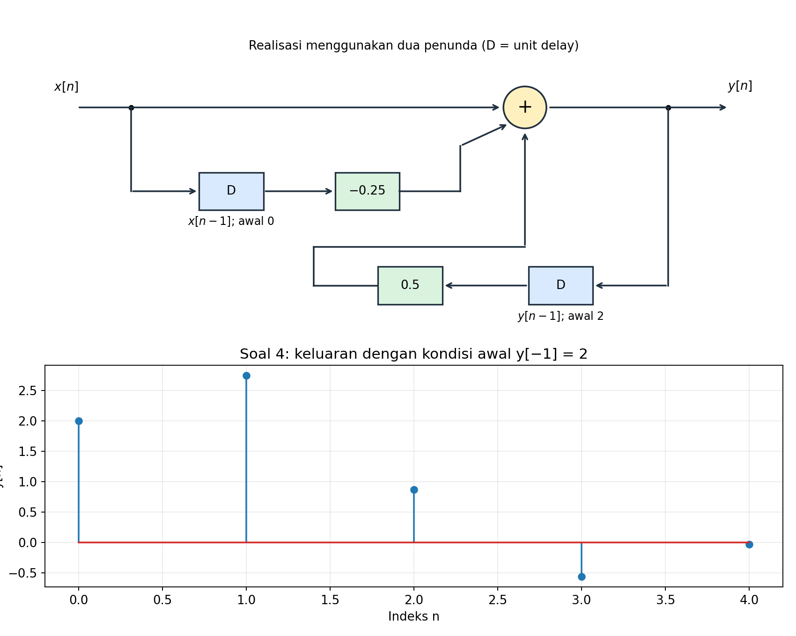
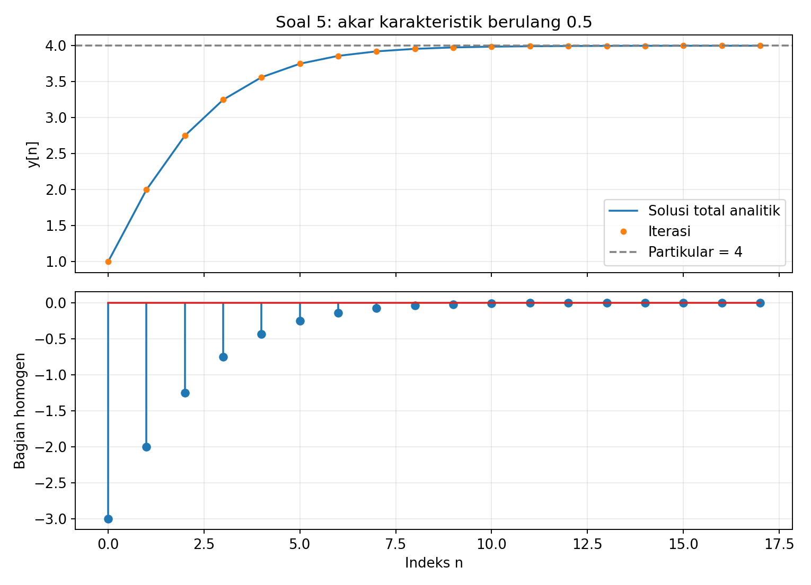
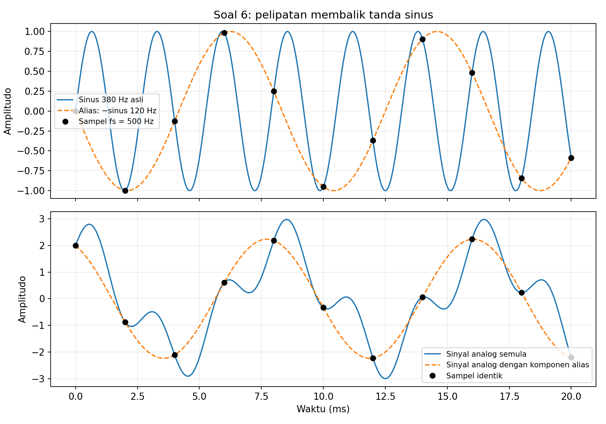
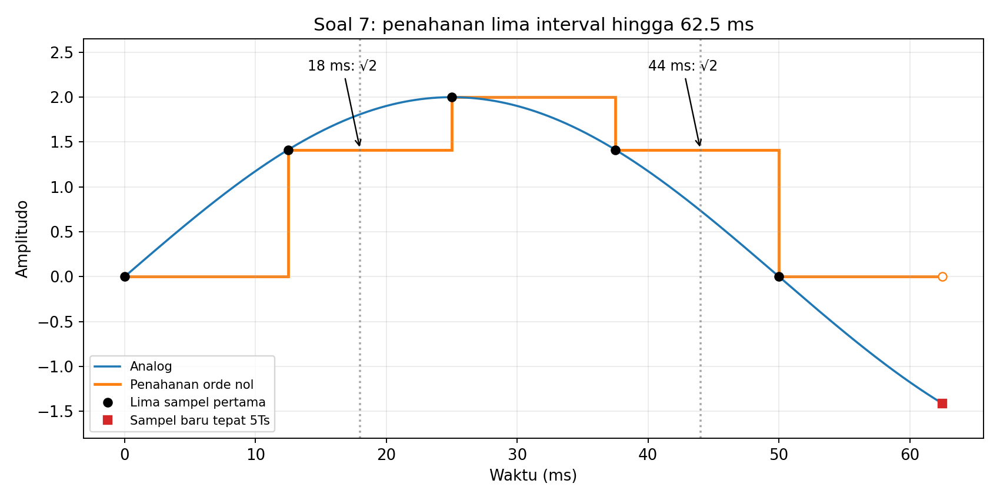
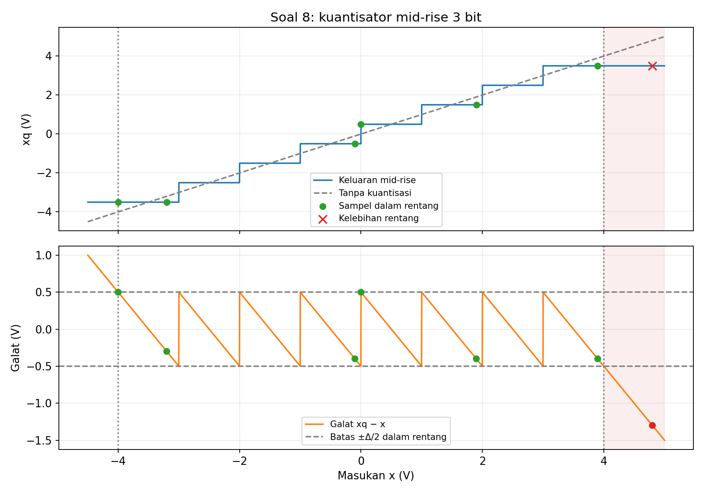
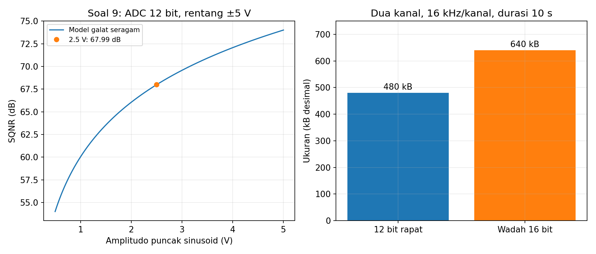
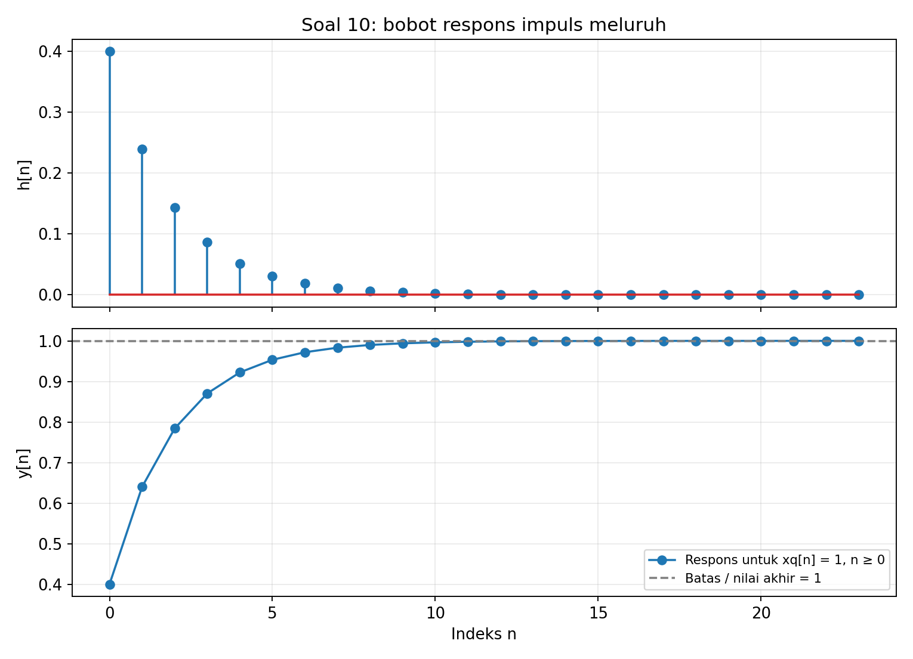

# Solusi Latihan Hitungan Tangan Kuliah 2

## Konvensi

Sinyal waktu-diskret menggunakan indeks bulat $n$, sedangkan frekuensi sudut diskret $\Omega$ dinyatakan dalam rad/sampel. Untuk kuantisasi, digunakan model mid-rise, interval tertutup di kiri dan terbuka di kanan, nilai perwakilan di titik tengah, serta saturasi pada tingkat ujung bagi masukan di luar rentang.

Galat kuantisasi didefinisikan sebagai $e_q=x_q-x$. Satuan kB menggunakan 1000 byte dan KiB menggunakan 1024 byte, sedangkan perhitungan laju data mengabaikan overhead kecuali disebutkan lain.

---

## 1. Linearitas dan invariansi waktu

### Soal

Tinjau tiga sistem $y_1[n]=2x[n]-x[n-2]$, $y_2[n]=x^2[n]$, dan $y_3[n]=(n+1)x[n]$. Tentukan linearitas dan invariansi waktu masing-masing sistem dengan pembuktian aljabar atau contoh penyangkal, bukan hanya berdasarkan bentuk persamaannya.

### Solusi

#### Langkah 1: menuliskan kriteria pengujian

Misalkan $\mathcal{H}$ menyatakan operator sistem. Sistem linear harus memenuhi superposisi untuk semua masukan dan konstanta, bukan hanya untuk satu pasangan contoh.

$$
\mathcal{H}\{a x_1+b x_2\}[n]
=a\mathcal{H}\{x_1\}[n]+b\mathcal{H}\{x_2\}[n].
$$

Untuk invariansi waktu, bandingkan keluaran akibat masukan yang digeser dengan keluaran asli yang digeser. Keduanya harus sama untuk setiap masukan dan setiap pergeseran bulat $n_0$.

$$
\mathcal{H}\{x[n-n_0]\}[n]=y[n-n_0].
$$

#### Langkah 2: sistem $y_1[n]=2x[n]-x[n-2]$

Masukkan kombinasi linear $a x_1[n]+b x_2[n]$ ke aturan sistem. Pengelompokan suku menghasilkan:

$$
\begin{aligned}
\mathcal{H}_1\{a x_1+b x_2\}[n]
&=2(a x_1[n]+b x_2[n])-(a x_1[n-2]+b x_2[n-2])\\
&=a(2x_1[n]-x_1[n-2])+b(2x_2[n]-x_2[n-2]).
\end{aligned}
$$

Hasil tersebut tepat memenuhi superposisi, sehingga sistem linear. Sekarang, gunakan masukan tergeser $x_s[n]=x[n-n_0]$.

$$
\begin{aligned}
y_s[n]&=2x[n-n_0]-x[n-n_0-2],\\
y_1[n-n_0]&=2x[n-n_0]-x[n-n_0-2].
\end{aligned}
$$

Kedua hasil identik untuk semua $n_0$. Dengan demikian, sistem pertama linear dan invarian terhadap waktu, atau LTI.

#### Langkah 3: sistem $y_2[n]=x^2[n]$

Untuk menunjukkan ketidaklinearan, cukup menemukan satu contoh yang melanggar superposisi. Pilih $x_1[n]=x_2[n]=1$ pada semua indeks dan $a=b=1$.

$$
\mathcal{H}_2\{x_1+x_2\}[n]=(1+1)^2=4,
\qquad
\mathcal{H}_2\{x_1\}[n]+\mathcal{H}_2\{x_2\}[n]=1+1=2.
$$

Karena $4\ne2$, sistem tidak linear. Untuk invariansi waktu, perbandingannya memberikan:

$$
y_s[n]=(x[n-n_0])^2=y_2[n-n_0].
$$

Identitas tersebut berlaku untuk setiap masukan dan pergeseran. Jadi, sistem kedua nonlinear tetapi invarian terhadap waktu.

#### Langkah 4: sistem $y_3[n]=(n+1)x[n]$

Perkalian dengan fungsi indeks waktu tetap mempertahankan superposisi terhadap amplitudo masukan. Pembuktiannya adalah:

$$
\mathcal{H}_3\{a x_1+b x_2\}[n]
=(n+1)(a x_1[n]+b x_2[n])
=a y_{3,1}[n]+b y_{3,2}[n].
$$

Untuk pengujian pergeseran, faktor pengali harus dievaluasi sesuai lokasi operasi sistem. Keluaran dari masukan tergeser dan keluaran asli tergeser adalah:

$$
y_s[n]=(n+1)x[n-n_0],
\qquad
y_3[n-n_0]=(n-n_0+1)x[n-n_0].
$$

Selisihnya adalah $n_0x[n-n_0]$, yang tidak selalu nol. Misalnya, untuk $x[n]=1$ dan $n_0=1$, hasil pertama $n+1$ sedangkan hasil kedua $n$.

| Sistem | Linearitas | Invariansi waktu |
|---|---|---|
| $2x[n]-x[n-2]$ | Linear | Invarian terhadap waktu |
| $x^2[n]$ | Nonlinear | Invarian terhadap waktu |
| $(n+1)x[n]$ | Linear | Berubah terhadap waktu |

Linearitas dan invariansi waktu merupakan dua sifat yang perlu diuji secara terpisah. Sistem nonlinear dapat invarian terhadap waktu, dan sistem linear dapat berubah terhadap waktu.

---

## 2. Memori, kausalitas, dan invertibilitas

### Soal

Tinjau $y_1[n]=3x[n]$, $y_2[n]=x[n-2]$, dan $y_3[n]=x[n]-x[n-1]$. Tentukan sifat memori dan kausalitas ketiganya, lalu tuliskan inversnya atau jelaskan informasi tambahan yang diperlukan agar invers dapat ditentukan.

Untuk sistem ketiga, diketahui $x[-1]=4$ dan keluaran pada $n=0,1,2,3$ adalah $[2,-1,0,3]$. Hitung kembali empat sampel masukannya dan jelaskan mengapa tanpa $x[-1]$ jawabannya tidak unik.

### Solusi

#### Langkah 1: memori dan kausalitas

Sistem tanpa memori hanya menggunakan masukan pada indeks yang sama dengan keluaran. Sistem kausal boleh menggunakan masukan sekarang dan masa lalu, tetapi tidak memerlukan masukan masa depan.

| Sistem | Memori | Kausalitas | Alasan |
|---|---|---|---|
| $y_1[n]=3x[n]$ | Tanpa memori | Kausal | Hanya memakai $x[n]$ |
| $y_2[n]=x[n-2]$ | Memiliki memori | Kausal | Memakai masukan dua sampel sebelumnya |
| $y_3[n]=x[n]-x[n-1]$ | Memiliki memori | Kausal | Memakai masukan sekarang dan satu sampel sebelumnya |

#### Langkah 2: invers sistem pengali

Karena faktor pengali tiga tidak nol, masukan dapat diperoleh kembali secara unik. Aturan inversnya adalah:

$$
\boxed{x[n]=\frac{y_1[n]}{3}}.
$$

Invers ini juga kausal dan tanpa memori. Setiap sampel masukan diperoleh dari satu sampel keluaran pada indeks yang sama.

#### Langkah 3: invers sistem penundaan

Ganti indeks pada hubungan $y_2[n]=x[n-2]$ dengan $n+2$. Kita memperoleh:

$$
y_2[n+2]=x[n],
\qquad
\boxed{x[n]=y_2[n+2]}.
$$

Sistem penundaan invertibel jika seluruh barisan keluaran tersedia, tetapi inversnya memerlukan keluaran dua sampel di masa depan. Jadi, invertibilitas tidak berarti invers harus kausal; pada rekaman berhingga, sampel di tepi yang belum tersedia juga perlu diperhatikan.

#### Langkah 4: invers operasi selisih

Susun ulang hubungan keluaran untuk memperoleh masukan sekarang dari masukan sebelumnya. Aturannya menjadi:

$$
x[n]=y_3[n]+x[n-1].
$$

Untuk menghitung masukan secara berurutan, kita memerlukan satu nilai awal. Dengan nilai $x[-1]$ yang diketahui, rumusnya untuk $n\geq0$ adalah:

$$
\boxed{x[n]=x[-1]+\sum_{k=0}^{n}y_3[k]}.
$$

#### Langkah 5: merekonstruksi empat sampel

Gunakan $x[-1]=4$ dan $y_3[0],\ldots,y_3[3]=[2,-1,0,3]$. Setiap langkah memakai masukan yang baru saja diperoleh pada langkah sebelumnya.

$$
\begin{aligned}
x[0]&=x[-1]+y_3[0]=4+2=6,\\
x[1]&=x[0]+y_3[1]=6-1=5,\\
x[2]&=x[1]+y_3[2]=5+0=5,\\
x[3]&=x[2]+y_3[3]=5+3=8.
\end{aligned}
$$

Hasilnya adalah $\boxed{[x[0],x[1],x[2],x[3]]=[6,5,5,8]}$. Pemeriksaan maju memberikan $6-4=2$, $5-6=-1$, $5-5=0$, dan $8-5=3$, sesuai data keluaran.

#### Mengapa tanpa nilai awal jawabannya tidak unik?

Jika $x[-1]=c$, masukan yang direkonstruksi menjadi $[c+2,c+1,c+1,c+4]$. Semua pilihan $c$ menghasilkan deret selisih yang sama, sehingga nilai mutlak masukan belum ditentukan.

Secara umum, penambahan konstanta $C$ pada seluruh masukan tidak mengubah keluarannya. Hubungan ini menunjukkan informasi yang hilang dalam operasi selisih:

$$
(x[n]+C)-(x[n-1]+C)=x[n]-x[n-1].
$$

Karena itu, sistem ketiga tidak invertibel pada himpunan semua barisan tanpa pembatasan tambahan. Invers dapat ditentukan setelah satu nilai awal atau informasi acuan yang setara diberikan.

---

## 3. Stabilitas BIBO

### Soal

Periksa kestabilan $y_1[n]=2x[n]+3x[n-1]$, $y_2[n]=x^2[n]$, dan $y_3[n]=\sum_{k=0}^{n}x[k]$ untuk $n\ge0$. Untuk sistem stabil, berikan batas keluaran dalam fungsi batas masukan $M_x$; untuk sistem tidak stabil, berikan satu masukan terbatas yang menghasilkan keluaran tak terbatas.

### Solusi

#### Langkah 1: definisi stabilitas BIBO

Stabilitas BIBO berarti setiap masukan terbatas menghasilkan keluaran terbatas. Jika $|x[n]|\leq M_x<\infty$, kita harus dapat menemukan batas keluaran yang tidak meningkat tanpa batas terhadap $n$.

#### Langkah 2: sistem $y_1[n]=2x[n]+3x[n-1]$

Gunakan ketaksamaan segitiga untuk membatasi besar keluaran. Karena kedua sampel masukan dibatasi oleh $M_x$, diperoleh:

$$
\begin{aligned}
|y_1[n]|
&\leq2|x[n]|+3|x[n-1]|\\
&\leq2M_x+3M_x=5M_x.
\end{aligned}
$$

Batas $5M_x$ berhingga dan berlaku untuk semua indeks. Jadi, sistem pertama stabil BIBO.

#### Langkah 3: sistem $y_2[n]=x^2[n]$

Walaupun sistem ini nonlinear, besar keluarannya tetap dapat dibatasi. Untuk masukan real atau kompleks yang magnitudonya terbatas, berlaku:

$$
|y_2[n]|=|x[n]|^2\leq M_x^2.
$$

Dengan demikian, sistem kedua stabil BIBO dengan batas $M_x^2$. Ketidaklinearan sendiri tidak menentukan apakah suatu sistem stabil.

#### Langkah 4: sistem penjumlah akumulatif

Pilih masukan $x[n]=1$ untuk seluruh $n\geq0$, yang memiliki batas $M_x=1$. Keluaran sistem ketiga adalah:

$$
y_3[n]=\sum_{k=0}^{n}1=n+1.
$$

Masukannya terbatas, tetapi keluarannya meningkat tanpa batas ketika $n$ membesar. Satu contoh penyangkal ini cukup untuk menyimpulkan bahwa sistem ketiga tidak stabil BIBO.

| Sistem | Kesimpulan | Batas atau contoh penyangkal |
|---|---|---|
| $2x[n]+3x[n-1]$ | Stabil | $|y[n]|\leq5M_x$ |
| $x^2[n]$ | Stabil | $|y[n]|\leq M_x^2$ |
| $\sum_{k=0}^{n}x[k]$ | Tidak stabil | $x[n]=1$ memberi $y[n]=n+1$ |

Sistem ketiga menyimpan seluruh kontribusi sebelumnya tanpa faktor peluruhan. Hal itu berbeda dari penghalus rekursif pada soal 10, yang mengurangi pengaruh sampel lama dengan faktor yang magnitudonya kurang dari satu.

---

## 4. Diagram blok dan perhitungan maju

### Soal

Gambarkan realisasi $y[n]=0.5y[n-1]+x[n]-0.25x[n-1]$ menggunakan penjumlah, pengali konstanta, dan unit delay. Dengan $x[-1]=0$, $y[-1]=2$, serta $x[0],\ldots,x[4]=[1,2,0,-1,0]$, hitung $y[0]$ sampai $y[4]$ dan tuliskan isi setiap penunda setelah setiap langkah.

### Solusi

#### Langkah 1: memisahkan tiga cabang

Persamaan sistem dapat dibaca sebagai jumlah tiga kontribusi. Kontribusi pertama adalah masukan sekarang, kontribusi kedua adalah masukan tertunda dengan penguatan negatif, dan kontribusi ketiga adalah keluaran tertunda melalui umpan balik.

$$
y[n]=x[n]+(-0.25)x[n-1]+0.5y[n-1].
$$

Diperlukan satu penunda untuk menyimpan $x[n-1]$ dan satu penunda untuk menyimpan $y[n-1]$. Pengali $-0.25$ sudah memasukkan tanda pengurangan, sehingga ketiga cabang dapat masuk ke satu penjumlah bertanda positif.



Simbol $D$ pada gambar berarti unit delay dengan aturan keluaran sama dengan masukan satu sampel sebelumnya. Jalur umpan balik melewati penunda, sehingga keluaran sekarang tidak dipakai kembali secara langsung pada langkah yang sama.

#### Langkah 2: menetapkan arti isi penunda

Pada awal langkah $n$, penunda masukan berisi $x[n-1]$ dan penunda keluaran berisi $y[n-1]$. Hitung keluaran menggunakan nilai lama tersebut sebelum memperbarui kedua penunda menjadi $x[n]$ dan $y[n]$.

Keadaan awalnya adalah $x[-1]=0$ dan $y[-1]=2$. Ini berarti penunda keluaran tidak dimulai dari nol, sehingga respons kondisi awal harus ikut dalam perhitungan.

#### Langkah 3: menghitung lima keluaran

Gunakan masukan $[1,2,0,-1,0]$ secara berurutan. Perhitungan setiap indeks adalah:

$$
\begin{aligned}
y[0]&=0.5(2)+1-0.25(0)=2,\\
y[1]&=0.5(2)+2-0.25(1)=2.75,\\
y[2]&=0.5(2.75)+0-0.25(2)=0.875,\\
y[3]&=0.5(0.875)-1-0.25(0)=-0.5625,\\
y[4]&=0.5(-0.5625)+0-0.25(-1)=-0.03125.
\end{aligned}
$$

Dengan demikian, hasil akhirnya adalah $\boxed{[2,2.75,0.875,-0.5625,-0.03125]}$. Seluruh nilai diperoleh dari keadaan lama, sehingga urutan pembaruan penunda tidak boleh dibalik.

#### Langkah 4: mencatat keadaan setelah setiap langkah

Tabel berikut memisahkan keadaan yang dipakai saat perhitungan dari keadaan yang disimpan sesudahnya. Sesudah langkah $n$ selesai, isi penunda tersebut menjadi masukan bagi langkah $n+1$.

| $n$ | $x[n]$ | Isi penunda sebelum: $x[n-1]$ | Isi penunda sebelum: $y[n-1]$ | $y[n]$ | Penunda masukan sesudah | Penunda keluaran sesudah |
|---:|---:|---:|---:|---:|---:|---:|
| 0 | 1 | 0 | 2 | 2 | 1 | 2 |
| 1 | 2 | 1 | 2 | 2.75 | 2 | 2.75 |
| 2 | 0 | 2 | 2.75 | 0.875 | 0 | 0.875 |
| 3 | −1 | 0 | 0.875 | −0.5625 | −1 | −0.5625 |
| 4 | 0 | −1 | −0.5625 | −0.03125 | 0 | −0.03125 |

Sistem ini rekursif karena keluaran sekarang menggunakan keluaran sebelumnya. Program pendamping menghitung nilai yang sama dan menggambar diagram blok serta grafik sampelnya.

---

## 5. Solusi homogen, partikular, dan kondisi awal

### Soal

Selesaikan $y[n]-y[n-1]+0.25y[n-2]=1$ untuk $n\ge0$ dengan $y[-1]=y[-2]=0$. Tentukan akar karakteristik, bentuk solusi homogen, satu solusi partikular, dan konstanta solusi total, lalu cocokkan tiga keluaran pertama dengan iterasi langsung.

### Solusi

#### Langkah 1: menyelesaikan persamaan homogen

Hilangkan suku masukan konstan pada ruas kanan untuk memperoleh persamaan homogen. Gunakan dugaan $y_h[n]=r^n$ untuk mencari akar karakteristik.

$$
y_h[n]-y_h[n-1]+0.25y_h[n-2]=0.
$$

$$
r^2-r+0.25=0
\quad\Longleftrightarrow\quad
(r-0.5)^2=0.
$$

Akar $r=0.5$ muncul dua kali, sehingga satu suku $C(0.5)^n$ saja belum mencakup dua konstanta yang diperlukan. Solusi homogen untuk akar berulang adalah:

$$
\boxed{y_h[n]=(C_1+C_2n)(0.5)^n}.
$$

#### Langkah 2: mencari satu solusi partikular

Karena ruas kanan bernilai satu, coba solusi partikular konstan $y_p[n]=K$. Substitusi memberikan:

$$
K-K+0.25K=1
\quad\Longrightarrow\quad
\boxed{K=4}.
$$

Solusi partikular ini memenuhi persamaan dengan masukan konstan, tetapi belum memenuhi kondisi awal nol. Kondisi awal baru diterapkan pada jumlah solusi homogen dan partikular.

#### Langkah 3: menentukan konstanta solusi total

Solusi total mempunyai bentuk berikut. Kita menentukan $C_1$ dan $C_2$ menggunakan dua keluaran pertama yang diwajibkan oleh persamaan dan kondisi awal.

$$
y[n]=4+(C_1+C_2n)2^{-n}.
$$

Pada $n=0$, kondisi $y[-1]=y[-2]=0$ menghasilkan $y[0]=1$. Pada $n=1$, persamaan menghasilkan $y[1]=1+y[0]-0.25y[-1]=2$.

$$
\begin{aligned}
1&=4+C_1\quad\Longrightarrow\quad C_1=-3,\\
2&=4+\frac{C_1+C_2}{2}
\quad\Longrightarrow\quad C_1+C_2=-4
\quad\Longrightarrow\quad C_2=-1.
\end{aligned}
$$

Kedua konstanta kini telah ditentukan oleh kondisi awal. Substitusinya memberikan solusi berikut untuk $n\geq0$.

$$
\boxed{y[n]=4-(n+3)2^{-n}}.
$$

Untuk pengecekan aljabar, perpanjangan rumus tersebut ke dua indeks awal memberikan $y[-1]=4-2(2)=0$ dan $y[-2]=4-1(4)=0$. Artinya, konstanta yang ditemukan juga konsisten dengan kedua nilai awal yang diberikan.

#### Langkah 4: membandingkan dengan iterasi langsung

Persamaan maju dapat ditulis sebagai $y[n]=1+y[n-1]-0.25y[n-2]$. Tiga keluaran pertama diperoleh dengan iterasi berikut.

$$
\begin{aligned}
y[0]&=1+0-0=1,\\
y[1]&=1+1-0=2,\\
y[2]&=1+2-0.25(1)=2.75.
\end{aligned}
$$

| $n$ | Rumus $4-(n+3)2^{-n}$ | Hasil |
|---:|---|---:|
| 0 | $4-3$ | 1 |
| 1 | $4-4/2$ | 2 |
| 2 | $4-5/4$ | 2.75 |

Ketiga hasil identik dengan iterasi langsung. Untuk $n$ besar, $(n+3)2^{-n}$ menuju nol sehingga keluaran mendekati nilai partikular empat.



Grafik membandingkan solusi total dengan hasil iterasi dan memperlihatkan peluruhan bagian homogen. Bagian partikular bernilai empat sepanjang waktu, sedangkan bagian homogen membuat jumlahnya memenuhi keadaan awal.

---

## 6. Sampling dan aliasing

### Soal

Sinyal analog adalah $x_a(t)=2\cos(2\pi\cdot120t)+\sin(2\pi\cdot380t)$ dan disampling pada $f_s=500\ \mathrm{Hz}$. Hitung $T_s$, frekuensi Nyquist, frekuensi sudut diskret setiap komponen, serta frekuensi alias nonnegatifnya dengan memperhatikan perubahan tanda pada komponen sinus.

Tentukan pula laju Nyquist sinyal analog semula dan usulkan satu frekuensi sampling yang memenuhi syarat pita dasar. Jelaskan mengapa penyaringan digital setelah sampling tidak dapat mengembalikan identitas frekuensi yang sudah ambigu tanpa informasi tambahan.

### Solusi

#### Langkah 1: periode sampling dan frekuensi Nyquist

Frekuensi sampling adalah $500$ Hz, sehingga periode sampling diperoleh sebagai kebalikannya. Frekuensi Nyquist akuisisi adalah setengah frekuensi sampling.

$$
\boxed{T_s=\frac{1}{500}=0.002\ \text{s}=2\ \text{ms}},
\qquad
\boxed{f_N=\frac{f_s}{2}=250\ \text{Hz}}.
$$

#### Langkah 2: frekuensi sudut diskret

Hubungan frekuensi analog $f$ dengan frekuensi sudut diskret adalah $\Omega=2\pi f/f_s$. Substitusi kedua frekuensi memberikan:

$$
\begin{aligned}
\Omega_1&=2\pi\frac{120}{500}=0.48\pi\ \text{rad/sampel},\\
\Omega_2&=2\pi\frac{380}{500}=1.52\pi\ \text{rad/sampel}.
\end{aligned}
$$

Komponen 120 Hz berada di bawah 250 Hz, tetapi komponen 380 Hz berada di atasnya. Komponen kedua perlu dilipat ke rentang frekuensi diskret utama untuk membaca aliasnya.

#### Langkah 3: memperhatikan tanda sinus

Pada indeks $n$ bulat, frekuensi diskret yang berbeda $2\pi$ memberikan eksponensial kompleks yang sama. Frekuensi kedua setara dengan frekuensi negatif berikut.

$$
1.52\pi-2\pi=-0.48\pi.
$$

Untuk sinus, tanda negatif pada frekuensi membalik tanda amplitudonya. Oleh karena itu, hubungan sampelnya adalah:

$$
\begin{aligned}
\sin(1.52\pi n)
&=\sin\bigl((2\pi-0.48\pi)n\bigr)\\
&=\sin(-0.48\pi n)\\
&=-\sin(0.48\pi n).
\end{aligned}
$$

Frekuensi alias nonnegatif kedua komponen sama-sama 120 Hz, tetapi komponen sinus mempunyai tanda minus setelah dilipat. Sinyal digital yang diperoleh adalah:

$$
\boxed{x[n]=2\cos(0.48\pi n)-\sin(0.48\pi n)}.
$$

| Komponen analog | $\Omega$ sebelum pelipatan/pencerminan | Frekuensi bertanda setelah pelipatan | Alias nonnegatif | Bentuk sampel |
|---|---|---|---|---|
| $2\cos(2\pi\cdot120t)$ | $0.48\pi$ | $+120$ Hz | 120 Hz | $2\cos(0.48\pi n)$ |
| $\sin(2\pi\cdot380t)$ | $1.52\pi$ | $-120$ Hz | 120 Hz | $-\sin(0.48\pi n)$ |

#### Langkah 4: laju Nyquist sinyal semula

Frekuensi tertinggi analog adalah 380 Hz, sehingga laju Nyquist sinyal adalah dua kalinya. Ini berbeda dari frekuensi Nyquist akuisisi 250 Hz yang dihitung dari $f_s$ saat ini.

$$
\boxed{f_{\text{laju Nyquist}}=2(380)=760\ \text{Hz}}.
$$

Untuk sampling pita dasar yang menghindari ambiguitas pada batas, pilih $f_s>760$ Hz. Salah satu pilihan adalah $f_s=1000$ Hz, sehingga batas Nyquistnya 500 Hz dan kedua komponen berada di bawah batas tersebut.

#### Langkah 5: mengapa filter digital tidak dapat memulihkan identitas frekuensi?

Tinjau sinyal analog lain $\widetilde{x}_a(t)=2\cos(2\pi\cdot120t)-\sin(2\pi\cdot120t)$. Sinyal ini berbeda dari sinyal semula pada waktu kontinu, tetapi menghasilkan sampel yang tepat sama pada $f_s=500$ Hz.

$$
x_a(n/500)=\widetilde{x}_a(n/500).
$$

Filter digital menerima deret yang sama untuk kedua kemungkinan masukan tersebut. Tanpa informasi tambahan tentang sinyal sebelum sampling, filter tidak dapat menentukan apakah komponen sinus semula berada pada 380 Hz atau sudah berada pada 120 Hz dengan tanda negatif.



Panel pertama membandingkan komponen sinus 380 Hz dengan alias bertandanya, sedangkan panel kedua membandingkan sinyal gabungan. Titik sampling berimpit, walaupun kurva di antara titik-titiknya berbeda.

---

## 7. Sample-and-hold

### Soal

Sinyal $x_a(t)=2\sin(2\pi\cdot10t)$ disampling pada $f_s=80\ \mathrm{Hz}$. Hitung lima sampel pertama, gambarkan model penahanan orde nol sampai $t=5T_s$, dan tentukan nilai yang ditahan pada $t=18\ \mathrm{ms}$ serta $t=44\ \mathrm{ms}$.

### Solusi

#### Langkah 1: menghitung periode sampling

Dengan $f_s=80$ Hz, periode samplingnya adalah $T_s=1/80$ s. Sudut sinus bertambah $\pi/4$ pada setiap sampel.

$$
T_s=0.0125\ \text{s}=12.5\ \text{ms},
\qquad
x[n]=2\sin\left(2\pi\frac{10}{80}n\right)
=2\sin\left(\frac{\pi n}{4}\right).
$$

#### Langkah 2: menghitung lima sampel pertama

Lima sampel pertama berarti $n=0,1,2,3,4$. Nilainya diperoleh dari sudut-sudut sinus berikut.

| $n$ | Waktu (ms) | Sudut | Nilai $x[n]$ |
|---:|---:|---|---|
| 0 | 0 | $0$ | $0$ |
| 1 | 12.5 | $\pi/4$ | $\sqrt2\approx1.4142$ |
| 2 | 25 | $\pi/2$ | $2$ |
| 3 | 37.5 | $3\pi/4$ | $\sqrt2\approx1.4142$ |
| 4 | 50 | $\pi$ | $0$ |

#### Langkah 3: model penahanan orde nol

Model penahanan orde nol mempertahankan sampel $x[n]$ selama $nT_s\leq t<(n+1)T_s$. Nilainya tidak mengikuti sinusoid analog di dalam interval penahanan.

```math
x_h(t)=
\begin{cases}
0, & 0\leq t<12.5\ \text{ms},\\
\sqrt2, & 12.5\leq t<25\ \text{ms},\\
2, & 25\leq t<37.5\ \text{ms},\\
\sqrt2, & 37.5\leq t<50\ \text{ms},\\
0, & 50\leq t<62.5\ \text{ms}.
\end{cases}
```

Kelima interval tersebut mencakup $0\leq t<5T_s$, dengan $5T_s=62.5$ ms. Tepat pada $t=5T_s$, jika proses sampling berlanjut, sampel baru $x[5]=2\sin(5\pi/4)=-\sqrt2$ mulai ditahan; limit kiri pada titik itu tetap nol.



Grafik membedakan sinusoid analog, sampel, dan nilai yang ditahan. Titik ujung 62.5 ms menampilkan sampel berikutnya agar konvensi pergantian nilai pada batas interval jelas.

#### Langkah 4: nilai pada 18 ms

Waktu 18 ms berada di dalam interval 12.5–25 ms, sehingga sampel yang ditahan adalah sampel pertama setelah indeks nol. Pemeriksaan indeks menggunakan pembulatan ke bawah memberikan:

$$
n=\left\lfloor\frac{18}{12.5}\right\rfloor=1,
\qquad
\boxed{x_h(18\ \text{ms})=x[1]=\sqrt2}.
$$

#### Langkah 5: nilai pada 44 ms

Waktu 44 ms berada di dalam interval 37.5–50 ms, sehingga nilai yang ditahan adalah sampel berindeks tiga. Hasilnya adalah:

$$
n=\left\lfloor\frac{44}{12.5}\right\rfloor=3,
\qquad
\boxed{x_h(44\ \text{ms})=x[3]=\sqrt2}.
$$

Dua waktu tersebut mempunyai nilai penahanan yang sama karena sampel pertama dan ketiga sama. Nilai analog pada kedua waktu itu tidak harus sama dengan nilai yang ditahan.

---

## 8. Tingkat kuantisasi, galat, dan kode

### Soal

Gunakan ADC mid-rise 3 bit dengan rentang $[-4,4)\ \mathrm{V}$ untuk mengkuantisasi $[-4,-3.2,-0.1,0,1.9,3.9,4.8]\ \mathrm{V}$. Buat tabel yang memuat indeks tingkat, nilai perwakilan, galat $x_q-x$, dan kode biner, lalu tandai sampel yang mengalami kelebihan rentang dan periksa batas $\Delta/2$.

### Solusi

#### Langkah 1: jumlah tingkat dan langkah kuantisasi

ADC mempunyai tiga bit, sehingga jumlah tingkatnya $L=2^3=8$. Rentang nominalnya selebar delapan volt, sehingga langkah kuantisasi adalah satu volt.

$$
L=8,
\qquad
\Delta=\frac{4-(-4)}{8}=1\ \text{V},
\qquad
\frac{\Delta}{2}=0.5\ \text{V}.
$$

#### Langkah 2: aturan mid-rise dan batas interval

Gunakan interval tertutup di kiri dan terbuka di kanan, sesuai catatan kuliah. Indeks sebelum saturasi adalah $k_{\text{mentah}}=\lfloor(x+4)/1\rfloor$, kemudian indeks dibatasi ke 0–7.

$$
x_q=-4+\left(k+\frac12\right),
\qquad
e_q=x_q-x.
$$

| Interval nominal (V) | Indeks $k$ | Nilai perwakilan (V) | Kode |
|---|---:|---:|---|
| $[-4,-3)$ | 0 | −3.5 | `000` |
| $[-3,-2)$ | 1 | −2.5 | `001` |
| $[-2,-1)$ | 2 | −1.5 | `010` |
| $[-1,0)$ | 3 | −0.5 | `011` |
| $[0,1)$ | 4 | 0.5 | `100` |
| $[1,2)$ | 5 | 1.5 | `101` |
| $[2,3)$ | 6 | 2.5 | `110` |
| $[3,4)$ | 7 | 3.5 | `111` |

#### Langkah 3: contoh pemetaan satu per satu

Untuk $x=-0.1$ V, indeksnya adalah $\lfloor3.9\rfloor=3$, sehingga $x_q=-0.5$ V dan $e_q=-0.4$ V. Untuk $x=0$ V, titik batas tersebut masuk interval $[0,1)$, sehingga indeksnya empat dan keluaran kuantisator $+0.5$ V.

Masukan $4.8$ V menghasilkan indeks mentah delapan yang berada di luar indeks yang sah. Karena itu, indeks disaturasi ke tujuh dan nilai perwakilannya menjadi 3.5 V.

#### Langkah 4: tabel lengkap

Tabel berikut menggunakan kode biner alami tiga bit yang memberi label berurutan dari tingkat terendah ke tertinggi. Kode tersebut menyatakan indeks, bukan langsung nilai tegangan atau bilangan bertanda komplemen dua.

| Masukan $x$ (V) | Indeks mentah | Indeks akhir $k$ | $x_q$ (V) | Galat $x_q-x$ (V) | Kode | Kelebihan rentang? |
|---:|---:|---:|---:|---:|---|---|
| −4 | 0 | 0 | −3.5 | +0.5 | `000` | Tidak |
| −3.2 | 0 | 0 | −3.5 | −0.3 | `000` | Tidak |
| −0.1 | 3 | 3 | −0.5 | −0.4 | `011` | Tidak |
| 0 | 4 | 4 | 0.5 | +0.5 | `100` | Tidak |
| 1.9 | 5 | 5 | 1.5 | −0.4 | `101` | Tidak |
| 3.9 | 7 | 7 | 3.5 | −0.4 | `111` | Tidak |
| 4.8 | 8 | 7 | 3.5 | −1.3 | `111` | Ya |

Masukan $-4$ V termasuk rentang karena batas bawahnya tertutup. Jika masukan tepat 4 V, nilai tersebut berada di luar rentang nominal $[-4,4)$, walaupun tetap dipetakan ke kode tujuh oleh aturan saturasi.

#### Langkah 5: memeriksa batas galat

Untuk enam sampel yang berada di dalam rentang, seluruh magnitudo galat tidak melebihi 0.5 V. Sampel di batas bawah atau tepat nol dapat mencapai batas tersebut karena berada pada batas interval kuantisasi.

$$
|e_q|\leq\frac{\Delta}{2}=0.5\ \text{V}
\quad\text{untuk sampel dalam rentang}.
$$

Untuk $x=4.8$ V, magnitudo galatnya $1.3$ V, sehingga melampaui batas ideal dalam rentang. Hal ini merupakan akibat kelebihan rentang dan tidak dapat diperbaiki hanya dengan menggunakan rumus galat ideal.



Gambar memperlihatkan pemetaan bertangga dan garis batas galat $\pm0.5$ V. Sampel 4.8 V ditandai berbeda karena mengalami saturasi dan tidak memenuhi batas galat dalam rentang.

---

## 9. Resolusi, SQNR, dan kebutuhan penyimpanan

### Soal

Sebuah sistem menggunakan ADC 12 bit, rentang $[-5,5)\ \mathrm{V}$, dua kanal, dan frekuensi sampling $16\ \mathrm{kHz}$ per kanal. Hitung langkah kuantisasi, batas galat ideal, perkiraan SQNR sinusoid dengan amplitudo puncak $2.5\ \mathrm{V}$, dan kebutuhan penyimpanan selama 10 sekon jika bit dikemas rapat maupun jika setiap sampel disimpan dalam 16 bit.

### Solusi

#### Langkah 1: langkah kuantisasi dan batas galat

Lebar rentang ADC adalah $5-(-5)=10$ V, dengan $L=2^{12}=4096$ tingkat. Dengan konvensi mid-rise, langkah dan batas galat idealnya adalah:

$$
\boxed{\Delta=\frac{10}{4096}\ \text{V}
=2.44140625\ \text{mV}},
$$

$$
\boxed{|e_q|\leq\frac{\Delta}{2}
=1.220703125\ \text{mV}}.
$$

Batas ini berlaku pada kuantisasi ideal selama masukan berada dalam rentang nominal. Galat ADC nyata seperti offset, ketidaklinieran, dan derau tambahan tidak termasuk dalam perhitungan ini.

#### Langkah 2: daya sinusoid dan model daya galat

Amplitudo puncak sinusoid adalah $A_s=2.5$ V, sehingga rata-rata kuadrat amplitudonya $P_x=A_s^2/2$. Untuk perkiraan SQNR, gunakan model galat kuantisasi seragam dengan rata-rata nol dan daya $P_q=\Delta^2/12$.

$$
P_x=\frac{2.5^2}{2}=3.125\ \text{V}^2,
\qquad
P_q=\frac{(10/4096)^2}{12}
\approx4.96705\times10^{-7}\ \text{V}^2.
$$

#### Langkah 3: menghitung SQNR

SQNR membandingkan daya sinyal dengan daya galat, sehingga faktor desibelnya sepuluh. Substitusi memberikan:

$$
\begin{aligned}
\mathrm{SQNR}
&\approx10\log_{10}\left(\frac{3.125}{4.96705\times10^{-7}}\right)\\
&=\boxed{67.9875\ \text{dB}\approx67.99\ \text{dB}}.
\end{aligned}
$$

Pemeriksaan kedua menggunakan amplitudo batas skala penuh $A_{\mathrm{FS}}=5$ V. Amplitudo sinyal hanya setengah skala penuh, sehingga koreksinya adalah $20\log_{10}(0.5)$.

$$
\begin{aligned}
\mathrm{SQNR}
&\approx6.0206(12)+1.7609+20\log_{10}(2.5/5)\\
&\approx74.01-6.02=67.99\ \text{dB}.
\end{aligned}
$$

Angka sekitar 74.01 dB adalah perkiraan untuk sinusoid skala penuh, sehingga tidak tepat langsung digunakan untuk amplitudo 2.5 V. Hasil 67.99 dB juga merupakan pendekatan model galat, bukan jaminan SQNR setiap rekaman sinusoid yang dikuantisasi.

#### Langkah 4: menghitung jumlah sampel

Frekuensi sampling diberikan per kanal, sehingga dua kanal menghasilkan dua kali jumlah sampel satu kanal. Selama 10 sekon, jumlah seluruh sampel adalah:

$$
N_{\text{per kanal}}=16000(10)=160000,
\qquad
N_{\text{total}}=2(160000)=320000.
$$

#### Langkah 5: penyimpanan dengan bit dikemas rapat

Setiap sampel memakai 12 bit tanpa padding. Laju data dan ukuran selama 10 sekon adalah:

$$
R_{12}=2(16000)(12)=384000\ \text{bit/s},
$$

$$
S_{12}=320000(12)=3840000\ \text{bit}
=\boxed{480000\ \text{byte}}.
$$

Ukuran tersebut sama dengan 480 kB desimal atau 468.75 KiB biner. Dalam pengemasan ini, dua sampel 12 bit dapat disimpan menggunakan tiga byte.

#### Langkah 6: penyimpanan dalam wadah 16 bit

Jika setiap sampel memakai wadah 16 bit, empat bit per sampel menjadi padding atau bagian wadah yang tidak menambah resolusi ADC. Kebutuhan penyimpanannya adalah:

$$
R_{16}=2(16000)(16)=512000\ \text{bit/s},
$$

$$
S_{16}=320000(16)=5120000\ \text{bit}
=\boxed{640000\ \text{byte}}.
$$

Ukuran tersebut sama dengan 640 kB desimal atau 625 KiB biner. Kedua hasil mengabaikan header, penanda waktu, metadata, dan mekanisme pemampatan.

| Cara penyimpanan | Laju data | Ukuran 10 s | Dalam kB | Dalam KiB |
|---|---:|---:|---:|---:|
| 12 bit dikemas rapat | 384 kbit/s | 480000 byte | 480 | 468.75 |
| Wadah 16 bit | 512 kbit/s | 640000 byte | 640 | 625 |

Penyimpanan dalam 16 bit memerlukan tambahan 160000 byte, atau sekitar 33.33% dibanding pengemasan rapat. Grafik pendamping memperlihatkan koreksi SQNR akibat amplitudo dan perbandingan ukuran penyimpanan.



---

## 10. Perancangan sederhana akuisisi dan penghalusan

### Soal

Sensor menghasilkan tegangan dengan frekuensi tertinggi $1.5\ \mathrm{kHz}$ dan amplitudo pada rentang $[-2,2]\ \mathrm{V}$. Pilih $f_s$ dari $\{2,4,8\}\ \mathrm{kHz}$ serta jumlah bit dari $\{8,10,12\}$ untuk ADC rentang $[-2.5,2.5)\ \mathrm{V}$ agar syarat sampling terpenuhi dan galat kuantisasi ideal tidak melebihi $3\ \mathrm{mV}$, kemudian hitung laju data minimum di antara pilihan yang memenuhi syarat.

Setelah konversi, gunakan $y[n]=0.6y[n-1]+0.4x_q[n]$ dengan keadaan awal nol. Buktikan kestabilan blok penghalus tersebut dan jelaskan fungsi filter antialiasing yang tetap diperlukan sebelum sampling.

### Solusi

#### Langkah 1: memilih frekuensi sampling

Frekuensi tertinggi sinyal adalah 1.5 kHz, sehingga syarat sampling pita dasar yang digunakan adalah $f_s>2(1.5)=3$ kHz. Periksa setiap pilihan terhadap syarat tersebut.

| Pilihan $f_s$ | Frekuensi Nyquist $f_s/2$ | Memenuhi syarat? |
|---|---|---|
| 2 kHz | 1 kHz | Tidak |
| 4 kHz | 2 kHz | Ya |
| 8 kHz | 4 kHz | Ya |

Pilihan paling rendah yang memenuhi syarat adalah 4 kHz. Nilai 8 kHz juga sah dan menyediakan ruang transisi filter analog lebih besar, tetapi menghasilkan laju data lebih tinggi untuk jumlah bit yang sama.

#### Langkah 2: memilih jumlah bit

Rentang ADC selebar $2.5-(-2.5)=5$ V, sedangkan amplitudo sensor $[-2,2]$ V berada di dalamnya. Batas galat ideal yang diminta adalah 3 mV atau 0.003 V.

$$
\frac{\Delta}{2}=\frac{5}{2^{B+1}}\leq0.003
\quad\Longrightarrow\quad
2^B\geq\frac{5}{0.006}\approx833.333.
$$

Dengan demikian, $B\geq\lceil\log_2(833.333)\rceil=10$. Hasil pemeriksaan tiga pilihan adalah:

| $B$ | Jumlah tingkat | $\Delta$ (mV) | Batas galat $\Delta/2$ (mV) | Memenuhi 3 mV? |
|---:|---:|---:|---:|---|
| 8 | 256 | 19.53125 | 9.765625 | Tidak |
| 10 | 1024 | 4.8828125 | 2.44140625 | Ya |
| 12 | 4096 | 1.220703125 | 0.6103515625 | Ya |

#### Langkah 3: laju data minimum

Soal menyebut satu sensor tanpa jumlah kanal tambahan, sehingga hitungan menggunakan satu kanal. Laju data mentah dengan bit dikemas rapat adalah $R=Bf_s$.

| $f_s$ | $B$ | Laju data | Semua syarat terpenuhi? |
|---|---:|---:|---|
| 4 kHz | 10 | 40 kbit/s | Ya |
| 4 kHz | 12 | 48 kbit/s | Ya |
| 8 kHz | 10 | 80 kbit/s | Ya |
| 8 kHz | 12 | 96 kbit/s | Ya |

Jadi, pilihan minimum adalah pasangan berikut. Pasangan tersebut menggunakan frekuensi sampling dan jumlah bit paling rendah di antara pilihan yang sah.

$$
\boxed{f_s=4\ \text{kHz},\quad B=10,\quad
R_{\min}=40000\ \text{bit/s}=40\ \text{kbit/s}}.
$$

Jika dikemas rapat, laju ini setara dengan 5000 byte/s tanpa metadata. Jika implementasi memakai wadah yang lebih lebar, laju penyimpanan perlu dihitung ulang memakai lebar wadah tersebut.

#### Langkah 4: membuktikan kestabilan penghalus

Misalkan $|x_q[n]|\leq M_q$ dan $y[-1]=0$. Uraikan persamaan rekursif untuk memperoleh jumlah kontribusi masukan yang diberi bobot meluruh.

$$
\begin{aligned}
y[0]&=0.4x_q[0],\\
y[1]&=0.4x_q[1]+0.4(0.6)x_q[0],\\
y[n]&=0.4\sum_{k=0}^{n}(0.6)^{n-k}x_q[k].
\end{aligned}
$$

Gunakan ketaksamaan segitiga dan jumlah geometri. Karena $0.6$ memiliki magnitudo kurang dari satu, diperoleh:

$$
\begin{aligned}
|y[n]|
&\leq0.4M_q\sum_{r=0}^{n}(0.6)^r\\
&=0.4M_q\frac{1-(0.6)^{n+1}}{1-0.6}\\
&=M_q\bigl[1-(0.6)^{n+1}\bigr]\leq M_q.
\end{aligned}
$$

Batas keluaran berhingga dan tidak bertambah tanpa batas terhadap waktu, sehingga blok penghalus stabil BIBO. Pembuktian memakai batas masukan kuantisasi, bukan hanya kesimpulan berdasarkan bentuk koefisiennya.

Sebagai pemeriksaan tambahan, respons impulsnya adalah $h[n]=0.4(0.6)^nu[n]$. Jumlah magnitudo respons impuls adalah $0.4/(1-0.6)=1$, yang juga menjamin stabilitas LTI.

#### Langkah 5: fungsi filter antialiasing

Untuk $f_s=4$ kHz, frekuensi Nyquist akuisisi adalah 2 kHz. Filter analog perlu mempertahankan pita sinyal hingga 1.5 kHz sambil cukup menekan komponen gangguan di luar pita yang dapat terlipat ke pita pengukuran.

Dalam rancangan lolos-rendah praktis, selisih antara 1.5 dan 2 kHz memberi ruang transisi sekitar 0.5 kHz. Tingkat redaman yang diperlukan bergantung pada besar gangguan dan toleransi galat, sehingga batas frekuensi saja belum menentukan spesifikasi filter lengkap.

Penghalus digital bekerja sesudah sampling dan tidak dapat membedakan komponen asli dari komponen alias yang sudah menghasilkan sampel sama. Karena itu, filter antialias analog tetap diperlukan sebelum sampling, walaupun blok penghalus digitalnya stabil.



Pada masukan konstan $x_q[n]=1$ untuk $n\geq0$, responsnya $y[n]=1-(0.6)^{n+1}$ dan tidak melampaui satu. Grafik menunjukkan bobot impuls yang meluruh serta keluaran yang mendekati nilai masukan secara bertahap.

---

## Program Python

Program berikut membuat ulang tujuh ilustrasi dan memeriksa hasil numerik pada soal 2 serta soal 4–10. Berkas mandirinya tersedia pada [buat_gambar_solusi_02.py](Kode/buat_gambar_solusi_02.py).


Bagian `assert` memeriksa hasil terhadap nilai hitungan manual, kesamaan solusi analitik dengan iterasi, dan identitas aliasing pada waktu sampling. Grafik SQNR menggunakan model galat seragam, sedangkan grafik penahanan tidak dianggap sebagai rekonstruksi ideal sinyal analog.

```python
"""Hitungan numerik dan tujuh gambar untuk solusi kuliah Pengolahan Sinyal 2.
Jalankan: python Kode/buat_gambar_solusi_02.py
Memerlukan Python 3, NumPy, dan Matplotlib. Semua PNG disimpan di ../Gambar.
"""
from pathlib import Path
import numpy as np
import matplotlib
matplotlib.use('Agg')
import matplotlib.pyplot as plt
from matplotlib.patches import Rectangle, Circle

OUT = Path(__file__).resolve().parents[1] / 'Gambar'
OUT.mkdir(parents=True, exist_ok=True)
plt.rcParams.update({'font.size': 11, 'axes.grid': True, 'grid.alpha': 0.25})


def simpan(fig, nama):
    fig.tight_layout()
    fig.savefig(OUT / nama, dpi=170)
    plt.close(fig)


def kuantisasi_midrise(x, bit, vmin, vmax):
    """Batas bawah termasuk interval; indeks di luar rentang disaturasi."""
    x = np.asarray(x, dtype=float)
    delta = (vmax - vmin) / 2**bit
    mentah = np.floor((x - vmin) / delta).astype(int)
    kode = np.clip(mentah, 0, 2**bit - 1)
    xq = vmin + (kode + 0.5)*delta
    return mentah, kode, xq, delta


def kotak(ax, x, y, teks, warna):
    ax.add_patch(Rectangle((x-.45, y-.27), .9, .54,
                           facecolor=warna, edgecolor='#203040', lw=1.4))
    ax.text(x, y, teks, ha='center', va='center')


def panah(ax, titik):
    for a, b in zip(titik[:-2], titik[1:-1]):
        ax.plot([a[0], b[0]], [a[1], b[1]], color='#203040', lw=1.5)
    ax.annotate('', xy=titik[-1], xytext=titik[-2],
                arrowprops={'arrowstyle': '->', 'lw': 1.5, 'color': '#203040'})


# Soal 2: rekonstruksi dengan nilai awal yang diketahui.
y_selisih = np.array([2, -1, 0, 3])
x_rekonstruksi = 4 + np.cumsum(y_selisih)
assert np.array_equal(x_rekonstruksi, [6, 5, 5, 8])
print('Soal 2, masukan:', x_rekonstruksi)

# Soal 4: hitung menggunakan keadaan lama, baru perbarui penunda.
x = np.array([1, 2, 0, -1, 0], dtype=float)
y = np.zeros(len(x))
x_lama, y_lama = 0.0, 2.0
print('\nSoal 4: n, x, y, penunda x sesudah, penunda y sesudah')
for n, nilai in enumerate(x):
    y[n] = .5*y_lama + nilai - .25*x_lama
    x_lama, y_lama = nilai, y[n]
    print(n, nilai, y[n], x_lama, y_lama)
assert np.allclose(y, [2, 2.75, .875, -.5625, -.03125])

fig, ax = plt.subplots(2, 1, figsize=(10, 8),
                        gridspec_kw={'height_ratios': [1.45, 1]})
a = ax[0]
a.set(xlim=(0, 10.3), ylim=(0, 4.6))
a.axis('off')
a.text(.3, 3.45, r'$x[n]$', ha='center', va='bottom')
a.text(9.7, 3.45, r'$y[n]$', ha='center', va='bottom')
a.add_patch(Circle((6.7, 3.25), .3, facecolor='#fff1bf',
                   edgecolor='#203040', lw=1.5))
a.text(6.7, 3.25, '+', ha='center', va='center', fontsize=17)
panah(a, [(.45, 3.25), (6.38, 3.25)])
panah(a, [(7.02, 3.25), (9.55, 3.25)])
a.plot(1.2, 3.25, 'ko', ms=4)
panah(a, [(1.2, 3.25), (1.2, 2.05), (2.15, 2.05)])
kotak(a, 2.6, 2.05, 'D', '#d9eaff')
panah(a, [(3.05, 2.05), (4.05, 2.05)])
kotak(a, 4.5, 2.05, '−0.25', '#daf3df')
panah(a, [(4.95, 2.05), (5.8, 2.05), (5.8, 2.7), (6.48, 3.02)])
a.plot(8.7, 3.25, 'ko', ms=4)
panah(a, [(8.7, 3.25), (8.7, .7), (7.65, .7)])
kotak(a, 7.2, .7, 'D', '#d9eaff')
panah(a, [(6.75, .7), (5.55, .7)])
kotak(a, 5.1, .7, '0.5', '#daf3df')
panah(a, [(4.65, .7), (3.75, .7), (3.75, 1.25),
          (6.7, 1.25), (6.7, 2.92)])
a.text(2.6, 1.57, r'$x[n-1]$; awal 0', ha='center', fontsize=10)
a.text(7.2, .21, r'$y[n-1]$; awal 2', ha='center', fontsize=10)
a.text(5.15, 4.08, 'Realisasi menggunakan dua penunda (D = unit delay)', ha='center')
ax[1].stem(np.arange(len(y)), y)
ax[1].set(xlabel='Indeks n', ylabel='y[n]', title='Soal 4: keluaran dengan kondisi awal y[−1] = 2')
simpan(fig, 'soal-04-diagram-dan-respons.png')

# Soal 5: perbandingan iterasi dan solusi analitik.
n = np.arange(18)
y_iter = np.zeros(len(n))
y_satu = y_dua = 0.0
for i in n:
    nilai = 1 + y_satu - .25*y_dua
    y_iter[i] = nilai
    y_dua, y_satu = y_satu, nilai
homogen = -(n+3)*2.0**(-n)
y_analitik = 4 + homogen
assert np.allclose(y_iter, y_analitik, atol=1e-13)
assert np.allclose(y_iter[:3], [1, 2, 2.75])
print('\nSoal 5, tiga keluaran:', y_iter[:3])
fig, ax = plt.subplots(2, 1, figsize=(9, 6.5), sharex=True)
ax[0].plot(n, y_analitik, label='Solusi total analitik')
ax[0].plot(n, y_iter, 'o', ms=4, label='Iterasi')
ax[0].axhline(4, color='gray', ls='--', label='Partikular = 4')
ax[0].set(ylabel='y[n]', title='Soal 5: akar karakteristik berulang 0.5')
ax[0].legend()
ax[1].stem(n, homogen)
ax[1].set(xlabel='Indeks n', ylabel='Bagian homogen')
simpan(fig, 'soal-05-solusi-analitik.png')

# Soal 6: dua bentuk analog berbeda memberikan sampel yang sama.
fs = 500.0
t = np.linspace(0, .02, 5001)
ts = np.arange(11)/fs
asli = lambda z: 2*np.cos(2*np.pi*120*z) + np.sin(2*np.pi*380*z)
alias = lambda z: 2*np.cos(2*np.pi*120*z) - np.sin(2*np.pi*120*z)
assert np.allclose(asli(ts), alias(ts), atol=1e-13)
fig, ax = plt.subplots(2, 1, figsize=(10, 7), sharex=True)
ax[0].plot(1000*t, np.sin(2*np.pi*380*t), label='Sinus 380 Hz asli')
ax[0].plot(1000*t, -np.sin(2*np.pi*120*t), '--', label='Alias: −sinus 120 Hz')
ax[0].plot(1000*ts, np.sin(2*np.pi*380*ts), 'ko', label='Sampel fs = 500 Hz')
ax[0].set(ylabel='Amplitudo', title='Soal 6: pelipatan membalik tanda sinus')
ax[1].plot(1000*t, asli(t), label='Sinyal analog semula')
ax[1].plot(1000*t, alias(t), '--', label='Sinyal analog dengan komponen alias')
ax[1].plot(1000*ts, asli(ts), 'ko', label='Sampel identik')
ax[1].set(xlabel='Waktu (ms)', ylabel='Amplitudo')
for a in ax: a.legend(fontsize=9)
simpan(fig, 'soal-06-aliasing.png')
print('\nSoal 6, galat identitas alias:', np.max(np.abs(asli(ts)-alias(ts))))

# Soal 7: lima interval penahanan dan sampel berikutnya di titik ujung.
fs = 80.0
Ts = 1/fs
ns = np.arange(6)
tsample = ns*Ts
sampel = 2*np.sin(np.pi*ns/4)
sampel[np.abs(sampel) < 1e-14] = 0
pengamatan = np.array([.018, .044])
indeks = np.floor(pengamatan/Ts).astype(int)
assert np.array_equal(indeks, [1, 3])
assert np.allclose(sampel[indeks], np.sqrt(2))
fig, ax = plt.subplots(figsize=(10, 5))
t = np.linspace(0, 5*Ts, 2001)
ax.plot(t*1000, 2*np.sin(2*np.pi*10*t), label='Analog')
ax.stairs(sampel[:5], tsample*1000, baseline=None, lw=2, label='Penahanan orde nol')
ax.plot(tsample[:5]*1000, sampel[:5], 'ko', label='Lima sampel pertama')
ax.plot(tsample[5]*1000, sampel[5], 's', color='tab:red', label='Sampel baru tepat 5Ts')
ax.plot([62.5], [0], 'o', mfc='white', mec='tab:orange')
for tm, nilai in zip(pengamatan*1000, sampel[indeks]):
    ax.axvline(tm, color='gray', ls=':', alpha=.7)
    ax.annotate(f'{tm:g} ms: √2', (tm, nilai), xytext=(tm-4, 2.3),
                arrowprops={'arrowstyle': '->'}, fontsize=10)
ax.set(xlabel='Waktu (ms)', ylabel='Amplitudo', ylim=(-1.8, 2.65),
       title='Soal 7: penahanan lima interval hingga 62.5 ms')
ax.legend(loc='lower left', fontsize=9)
simpan(fig, 'soal-07-sample-hold.png')
print('\nSoal 7, lima sampel:', sampel[:5], 'nilai pengamatan:', sampel[indeks])

# Soal 8: tabel sampel, karakteristik, dan galat saturasi.
x8 = np.array([-4, -3.2, -.1, 0, 1.9, 3.9, 4.8])
mentah, kode, xq8, delta8 = kuantisasi_midrise(x8, 3, -4, 4)
e8 = xq8-x8
assert np.array_equal(kode, [0, 0, 3, 4, 5, 7, 7])
assert np.allclose(e8, [.5, -.3, -.4, .5, -.4, -.4, -1.3])
dalam = (x8 >= -4) & (x8 < 4)
assert np.all(np.abs(e8[dalam]) <= delta8/2 + 1e-14)
assert np.abs(e8[-1]) > delta8/2
print('\nSoal 8: x, indeks mentah, kode, xq, galat, biner')
for a, b, c, d, e in zip(x8, mentah, kode, xq8, e8):
    print(a, b, c, d, f'{e:.1f}', format(c, '03b'))
v = np.linspace(-4.5, 5, 4001)
_, _, qv, _ = kuantisasi_midrise(v, 3, -4, 4)
fig, ax = plt.subplots(2, 1, figsize=(10, 7), sharex=True)
ax[0].plot(v, qv, label='Keluaran mid-rise')
ax[0].plot(v, v, '--', color='gray', label='Tanpa kuantisasi')
ax[0].scatter(x8[dalam], xq8[dalam], color='tab:green', zorder=3, label='Sampel dalam rentang')
ax[0].scatter(x8[~dalam], xq8[~dalam], color='tab:red', marker='x', s=70, zorder=4, label='Kelebihan rentang')
ax[0].set(ylabel='xq (V)', title='Soal 8: kuantisator mid-rise 3 bit')
ax[1].plot(v, qv-v, color='tab:orange', label='Galat xq − x')
ax[1].scatter(x8, e8, color=np.where(dalam, 'tab:green', 'tab:red'), zorder=3)
ax[1].axhline(.5, color='gray', ls='--', label='Batas ±Δ/2 dalam rentang')
ax[1].axhline(-.5, color='gray', ls='--')
ax[1].set(xlabel='Masukan x (V)', ylabel='Galat (V)')
for a in ax:
    a.axvspan(4, 5, color='tab:red', alpha=.08)
    a.axvline(-4, color='gray', ls=':')
    a.axvline(4, color='gray', ls=':')
    a.legend(fontsize=9)
simpan(fig, 'soal-08-kuantisasi.png')

# Soal 9: SQNR model galat seragam dan dua cara penyimpanan.
delta9 = 10/4096
Pq = delta9**2/12
SQNR = 10*np.log10((2.5**2/2)/Pq)
jumlah_sampel = 2*16000*10
byte12 = jumlah_sampel*12//8
byte16 = jumlah_sampel*16//8
assert np.isclose(SQNR, 67.98751163663268)
assert (byte12, byte16) == (480000, 640000)
print('\nSoal 9: Δ (mV), batas galat (mV), SQNR (dB), byte12, byte16')
print(delta9*1000, delta9*500, SQNR, byte12, byte16)
A = np.linspace(.5, 5, 300)
model = 10*np.log10((A**2/2)/Pq)
fig, ax = plt.subplots(1, 2, figsize=(11, 4.7))
ax[0].plot(A, model, label='Model galat seragam')
ax[0].plot([2.5], [SQNR], 'o', label=f'2.5 V: {SQNR:.2f} dB')
ax[0].set(xlabel='Amplitudo puncak sinusoid (V)', ylabel='SQNR (dB)',
          title='Soal 9: ADC 12 bit, rentang ±5 V')
ax[0].legend(fontsize=9)
bars = ax[1].bar(['12 bit rapat', 'Wadah 16 bit'], [byte12/1000, byte16/1000],
                 color=['tab:blue', 'tab:orange'])
for b in bars:
    ax[1].text(b.get_x()+b.get_width()/2, b.get_height()+12,
               f'{b.get_height():.0f} kB', ha='center')
ax[1].set(ylabel='Ukuran (kB desimal)', ylim=(0, 750),
          title='Dua kanal, 16 kHz/kanal, durasi 10 s')
simpan(fig, 'soal-09-sqnr-penyimpanan.png')

# Soal 10: pilih semua pasangan sah dan periksa respons penghalus.
opsi = []
for fs in [2000, 4000, 8000]:
    for bit in [8, 10, 12]:
        if fs > 2*1500 and 5/(2**bit)/2 <= .003:
            opsi.append((fs*bit, fs, bit))
minimum = min(opsi)
assert minimum == (40000, 4000, 10)
print('\nSoal 10, laju minimum, fs, bit:', minimum)
n = np.arange(24)
h = .4*.6**n
ystep = 1-.6**(n+1)
y_iter = np.zeros(len(n))
lama = 0.0
for i in n:
    lama = .6*lama + .4
    y_iter[i] = lama
assert np.allclose(y_iter, ystep)
assert np.all(ystep <= 1)
fig, ax = plt.subplots(2, 1, figsize=(9, 6.5), sharex=True)
ax[0].stem(n, h)
ax[0].set(ylabel='h[n]', title='Soal 10: bobot respons impuls meluruh')
ax[1].plot(n, ystep, 'o-', label='Respons untuk xq[n] = 1, n ≥ 0')
ax[1].axhline(1, color='gray', ls='--', label='Batas / nilai akhir = 1')
ax[1].set(xlabel='Indeks n', ylabel='y[n]')
ax[1].legend(fontsize=9)
simpan(fig, 'soal-10-penghalus-stabil.png')
print('\nSemua pemeriksaan numerik selesai. Tujuh PNG disimpan di:', OUT)
```
