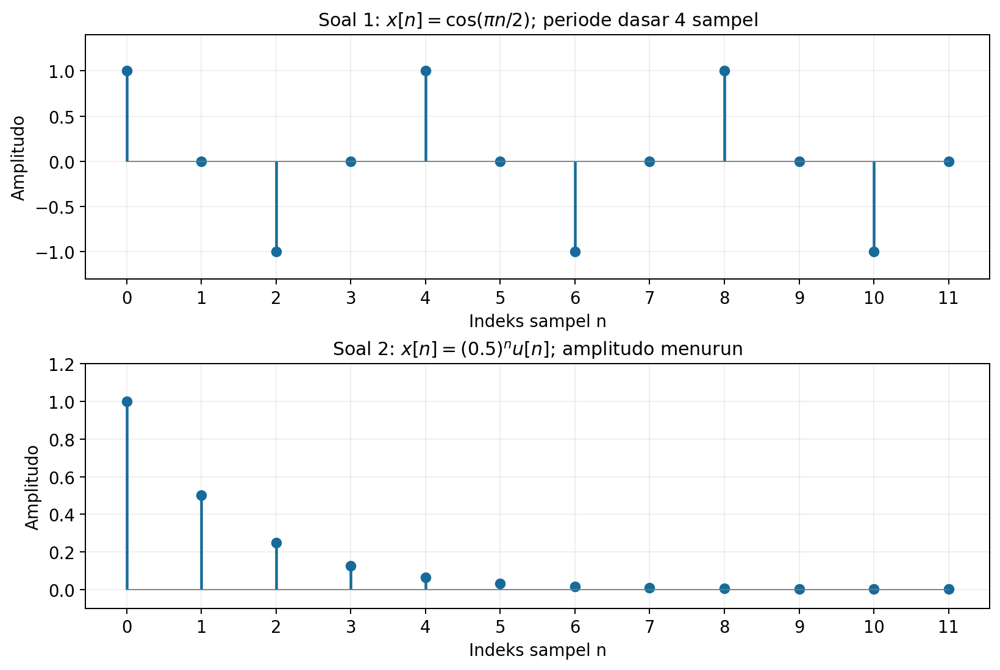
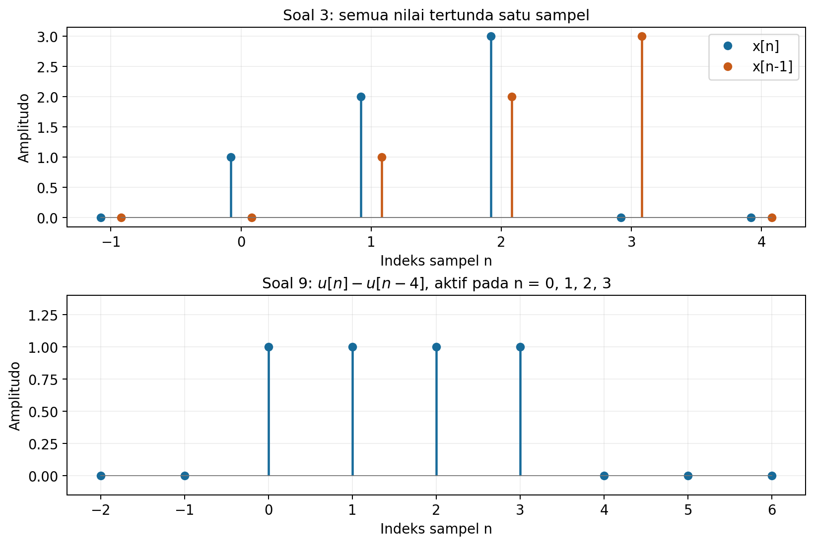
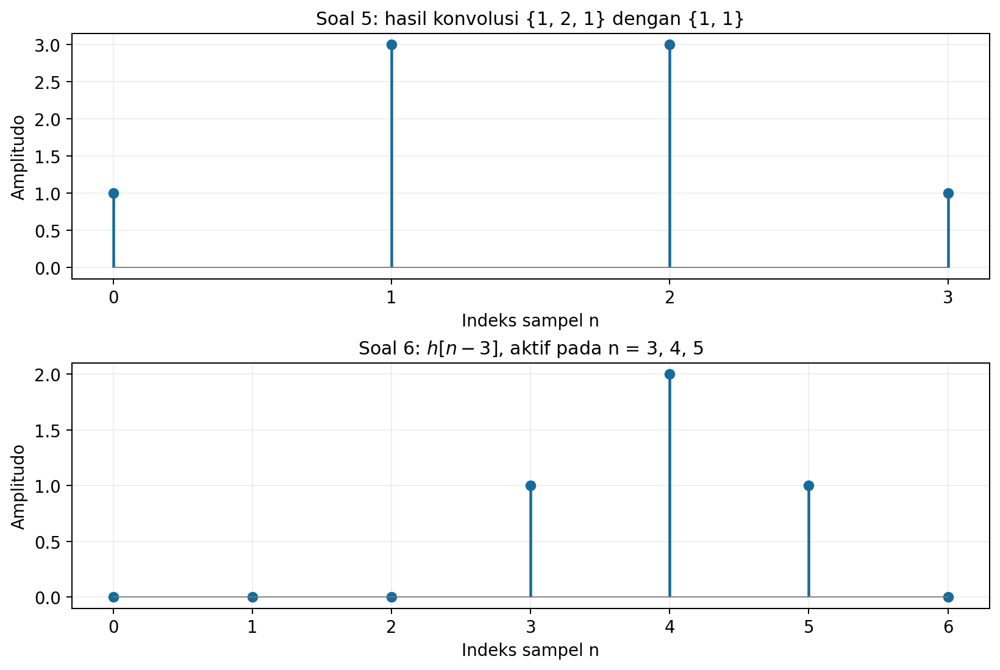
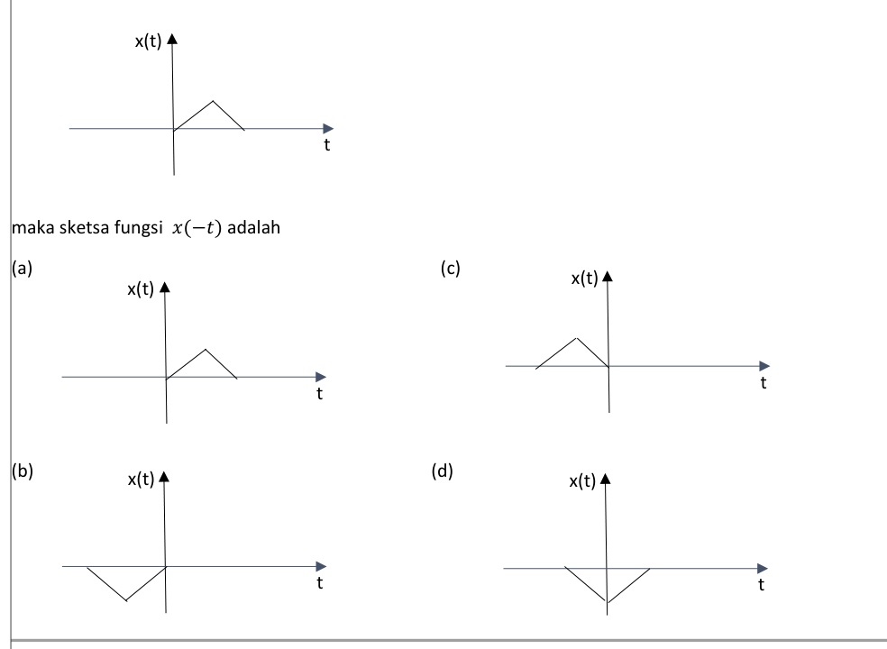
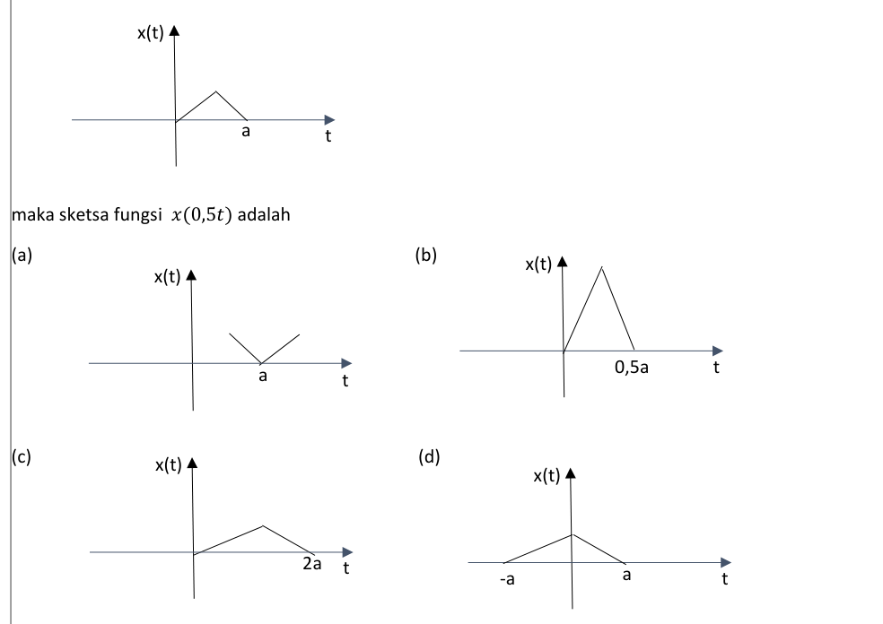
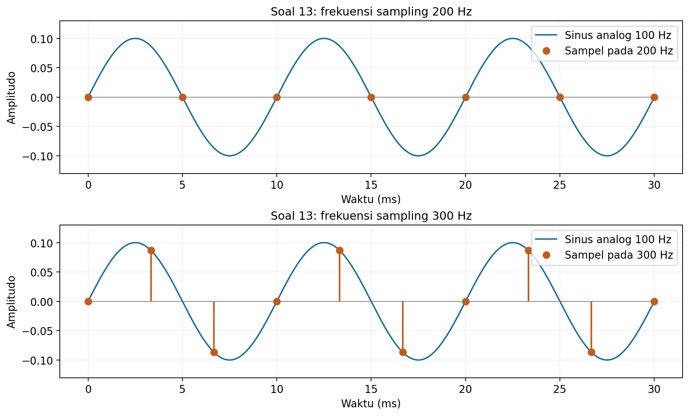
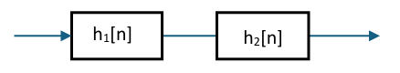
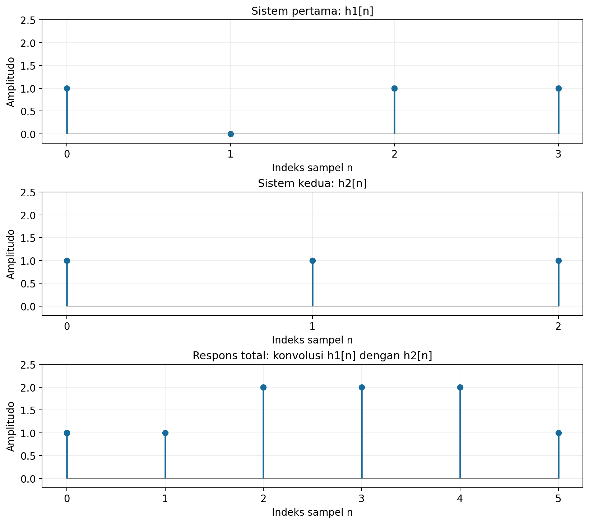
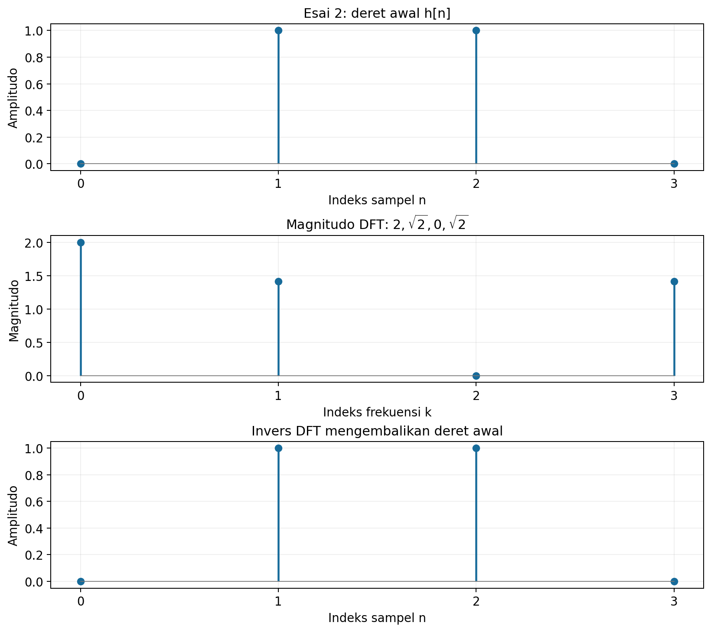

# Latihan UTS Pengolahan Sinyal

## Konvensi

- $n$ adalah indeks waktu diskret, sedangkan $t$ adalah waktu kontinu.
- Untuk deret berhingga yang tidak diberi penanda asal, elemen pertama diasumsikan berada pada $n=0$; nilainya nol di luar indeks yang ditulis. Asumsi ini terutama diperlukan untuk esai 1.
- $u[n]=1$ untuk $n\geq0$ dan $u[n]=0$ untuk $n<0$. Impuls satuan memenuhi $\delta[0]=1$ dan $\delta[n]=0$ untuk $n\neq0$.
- Simbol $\ast$ menyatakan konvolusi. Bilangan $j$ memenuhi $j^2=-1$.
- *Discrete Fourier Transform* (DFT) menggunakan eksponen negatif tanpa faktor normalisasi. *Inverse DFT* (IDFT) menggunakan eksponen positif dengan faktor $1/N$.
- Ada persoalan batas sampling pada **pilihan ganda 13**. Pembahasannya membedakan laju Nyquist yang biasanya dimaksud dalam soal dari pilihan sampling yang benar-benar mempertahankan informasi sinus yang diberikan.

## Ringkasan jawaban pilihan ganda

| Nomor | Jawaban | Hasil atau alasan utama |
|:---:|:---:|---|
| 1 | B | Periode dasar $N_0=4$ sampel. |
| 2 | A | Sinyal energi, dengan $E=4/3$ dan $P=0$. |
| 3 | B | Bergeser ke kanan satu sampel. |
| 4 | A | Sinyal genap. |
| 5 | B | $\{1,3,3,1\}$. |
| 6 | B | $h[n-3]$. |
| 7 | C | Dicerminkan terhadap sumbu vertikal, amplitudo tetap positif. |
| 8 | C | Durasi melebar dari $a$ menjadi $2a$. |
| 9 | C | Pulsa kotak sepanjang empat sampel. |
| 10 | B | Pilihan yang dimaksud adalah distribusi energi terhadap frekuensi; rapat spektral energinya terkait $|X|^2$. |
| 11 | B | $72$ merupakan periode bersama. |
| 12 | B | DTFS untuk sinyal waktu diskret periodik. |
| 13 | **B, dengan catatan** | $300$ Hz adalah pilihan terkecil yang aman untuk sinus ini. **C ($200$ Hz)** adalah laju Nyquist dan kemungkinan jawaban yang dimaksud pembuat soal; pada batas itu seluruh sampel sinus ini nol. |
| 14 | C | Koefisien komponen DC; faktor normalisasi bergantung pada bentuk deret. |
| 15 | B | Sistem tidak berubah terhadap waktu (*time-invariant*). |

## A. Solusi soal pilihan ganda

### 1. Periodisitas sinusoid waktu diskret

#### Soal

Sinyal $x[n]=\cos(\pi n/2)$ termasuk jenis sinyal:

- A. Periodik dengan periode dasar 2.
- B. Periodik dengan periode dasar 4.
- C. Tidak periodik.
- D. Sinyal acak.

#### Solusi

**Langkah 1: gunakan syarat periodik.** Suatu sinyal waktu diskret periodik apabila ada bilangan bulat positif $N$ sehingga $x[n+N]=x[n]$ untuk semua $n$.

Untuk sinusoid ini, penambahan fase sebanyak kelipatan $2\pi$ menghasilkan nilai yang sama:

$$
\frac{\pi}{2}N=2\pi m
\quad\Longrightarrow\quad N=4m,
$$

dengan $m$ bilangan bulat. Nilai positif terkecil adalah $m=1$, sehingga $N_0=4$.

**Langkah 2: periksa sampelnya.**

| $n$ | 0 | 1 | 2 | 3 | 4 | 5 | 6 | 7 |
|---|---|---|---|---|---|---|---|---|
| $x[n]$ | 1 | 0 | $-1$ | 0 | 1 | 0 | $-1$ | 0 |

Pola empat sampel berulang. Periode 2 tidak memenuhi syarat karena $x[0]=1$, sedangkan $x[2]=-1$.

**Jawaban: B, periodik dengan periode dasar 4 sampel.**



*Panel atas menunjukkan pengulangan setiap empat sampel. Panel bawah digunakan pada soal 2.*

### 2. Sinyal energi atau sinyal daya

#### Soal

Sinyal $x[n]=(0.5)^n u[n]$ termasuk dalam kategori:

- A. Sinyal energi.
- B. Sinyal daya.
- C. Sinyal periodik.
- D. Sinyal acak.

#### Solusi

**Langkah 1: tentukan sampel yang tidak nol.** Karena dikalikan $u[n]$, sinyal hanya aktif pada $n\geq0$:

$$
x[0]=1,\quad x[1]=\frac12,\quad x[2]=\frac14,\quad x[3]=\frac18,\ldots
$$

**Langkah 2: hitung energi total.**

$$
E=\sum_{n=-\infty}^{\infty}|x[n]|^2
=\sum_{n=0}^{\infty}\left(\frac14\right)^n.
$$

Ini adalah deret geometri dengan rasio $r=1/4$. Karena $|r|<1$, jumlahnya berhingga:

$$
E=\frac{1}{1-r}=\frac{1}{1-1/4}=\frac43.
$$

**Langkah 3: periksa daya rata-rata.**

$$
P=\lim_{M\to\infty}\frac{1}{2M+1}
\sum_{n=-M}^{M}|x[n]|^2=0.
$$

Alasannya, jumlah energi dalam pembilang tidak melebihi $4/3$, sedangkan penyebut terus membesar. Dengan $0<E<\infty$ dan $P=0$, sinyal ini termasuk sinyal energi. Istilah *sinyal daya* biasanya digunakan ketika $0<P<\infty$.

**Jawaban: A, sinyal energi.**

### 3. Pergeseran waktu diskret

#### Soal

Jika $x[n]=\{1,2,3\}$ dan $y[n]=x[n-1]$, maka operasi yang terjadi adalah:

- A. Penskalaan waktu.
- B. Pergeseran ke kanan satu sampel.
- C. Pergeseran ke kiri satu sampel.
- D. Pembalikan waktu.

#### Solusi

**Langkah 1: cari indeks tempat setiap nilai muncul.** Dengan elemen pertama pada $n=0$, nilai $x[0]=1$ muncul pada keluaran ketika $n-1=0$, yaitu pada $n=1$.

Dengan cara yang sama, $x[1]=2$ muncul pada $n=2$ dan $x[2]=3$ muncul pada $n=3$.

| $n$ | 0 | 1 | 2 | 3 |
|---|---|---|---|---|
| $x[n]$ | 1 | 2 | 3 | 0 |
| $y[n]=x[n-1]$ | 0 | 1 | 2 | 3 |

**Langkah 2: baca arah pergeseran.** Semua nilai muncul satu sampel lebih lambat, sehingga grafik bergeser ke kanan. Amplitudonya tetap.

Secara umum, $x[n-n_0]$ bergeser ke kanan sebanyak $n_0$ sampel ketika $n_0>0$.

**Jawaban: B, pergeseran ke kanan satu sampel.**



*Panel atas memperlihatkan posisi sampel sebelum dan sesudah pergeseran. Panel bawah berkaitan dengan soal 9.*

### 4. Simetri genap

#### Soal

Sinyal yang memenuhi $x[n]=x[-n]$ disebut sebagai sinyal:

- A. Genap.
- B. Ganjil.
- C. Periodik.
- D. Kausal.

#### Solusi

**Langkah 1: bandingkan dengan definisi simetri.** Sinyal genap memenuhi $x[n]=x[-n]$. Artinya, sampel pada indeks $n$ dan $-n$ memiliki nilai yang sama. Grafiknya simetris terhadap sumbu vertikal.

Contohnya adalah $x[n]=\cos(\pi n/2)$, karena:

$$
x[-n]=\cos\left(-\frac{\pi n}{2}\right)
=\cos\left(\frac{\pi n}{2}\right)=x[n].
$$

**Langkah 2: bedakan dengan pilihan lain.** Sinyal ganjil memenuhi $x[-n]=-x[n]$. Sifat periodik berkaitan dengan pengulangan, sedangkan kausal pada sebuah sinyal berkaitan dengan nilai nol untuk indeks negatif. Keduanya tidak ditentukan hanya oleh persamaan simetri dalam soal.

**Jawaban: A, sinyal genap.**

### 5. Konvolusi dua deret berhingga

#### Soal

Diketahui $x[n]=\{1,2,1\}$ dan $h[n]=\{1,1\}$. Hasil konvolusi $y[n]=x[n]\ast h[n]$ adalah:

- A. $\{1,3,3\}$.
- B. $\{1,3,3,1\}$.
- C. $\{1,2,2,1\}$.
- D. $\{1,2,1\}$.

#### Solusi

**Langkah 1: tentukan panjang keluaran.** Panjang konvolusi linear dua deret dengan panjang $L_x$ dan $L_h$ adalah paling banyak $L_x+L_h-1$. Di sini kedua ujungnya tidak nol, sehingga panjangnya tepat:

$$
L_y=3+2-1=4.
$$

Keluaran aktif pada $n=0,1,2,3$.

**Langkah 2: gunakan definisi konvolusi.**

$$
y[n]=\sum_{k=-\infty}^{\infty}x[k]h[n-k].
$$

Karena $h[0]=h[1]=1$ dan sampel lain nol, rumusnya menjadi:

$$
y[n]=x[n]+x[n-1].
$$

**Langkah 3: hitung setiap sampel.**

| $n$ | $x[n]$ | $x[n-1]$ | $y[n]$ |
|:---:|:---:|:---:|:---:|
| 0 | 1 | 0 | 1 |
| 1 | 2 | 1 | 3 |
| 2 | 1 | 2 | 3 |
| 3 | 0 | 1 | 1 |

Dengan demikian:

$$
y[n]=\{1,3,3,1\}.
$$

Sebagai pemeriksaan, jumlah sampel keluaran harus sama dengan hasil kali jumlah sampel kedua masukan: $1+3+3+1=(1+2+1)(1+1)=8$.

**Jawaban: B.**



### 6. Konvolusi dengan impuls yang bergeser

#### Soal

Jika $x[n]=\delta[n-3]$ dan $h[n]=\{1,2,1\}$, maka hasil konvolusi $y[n]$ adalah:

- A. $h[n+3]$.
- B. $h[n-3]$.
- C. $3h[n]$.
- D. $x[n-3]$.

#### Solusi

**Langkah 1: masukkan sinyal ke definisi konvolusi.**

$$
y[n]=\sum_{k=-\infty}^{\infty}\delta[k-3]h[n-k].
$$

**Langkah 2: gunakan sifat pemilih impuls.** Faktor $\delta[k-3]$ hanya bernilai 1 ketika $k=3$. Semua suku lainnya nol, sehingga:

$$
y[n]=h[n-3].
$$

**Langkah 3: tentukan lokasi sampelnya.** Jika $h[0]=1$, $h[1]=2$, dan $h[2]=1$, maka $y[3]=1$, $y[4]=2$, dan $y[5]=1$. Bentuk dan amplitudo $h[n]$ tetap; posisinya tertunda tiga sampel.

Angka 3 dalam $\delta[n-3]$ adalah penundaan, sehingga tidak menjadi pengali amplitudo.

**Jawaban: B, $h[n-3]$.**

### 7. Pembalikan waktu kontinu

#### Soal

Jika suatu fungsi digambarkan seperti di bawah, maka sketsa fungsi $x(-t)$ adalah pilihan yang mana?



Pilihan dalam gambar dapat dibaca sebagai berikut:

- A. Pulsa segitiga positif pada sisi kanan, seperti sinyal semula.
- B. Pulsa segitiga negatif pada sisi kiri.
- C. Pulsa segitiga positif pada sisi kiri.
- D. Pulsa segitiga negatif yang melintasi kedua sisi sumbu vertikal.

#### Solusi

**Langkah 1: pahami perubahan argumen.** Misalkan suatu titik pada sinyal awal berada pada $(t_1,x(t_1))$. Pada $y(t)=x(-t)$, nilai yang sama muncul ketika $-t=t_1$, yaitu $t=-t_1$.

Jadi, titik itu berpindah menjadi $(-t_1,x(t_1))$. Koordinat waktunya berubah tanda, sedangkan amplitudonya tetap.

**Langkah 2: terapkan pada segitiga.** Pulsa awal berada di sisi kanan sumbu vertikal dan mempunyai amplitudo positif. Setelah pembalikan, pulsa berada di sisi kiri dengan amplitudo positif. Puncak dan sisi-sisinya juga tercermin terhadap sumbu vertikal.

Sebagai contoh, jika rentang awal adalah $0\leq t\leq b$ untuk suatu $b>0$, rentang hasil memenuhi $0\leq-t\leq b$, yaitu $-b\leq t\leq0$.

**Langkah 3: cocokkan dengan opsi.** Hanya gambar C yang memperlihatkan pencerminan tersebut. Amplitudo negatif akan memerlukan operasi tambahan $-x(-t)$.

**Jawaban: C.**

### 8. Penskalaan waktu kontinu

#### Soal

Jika suatu fungsi digambarkan seperti di bawah, maka sketsa fungsi $x(0{,}5t)$ adalah pilihan yang mana?



- A. Sketsa berbentuk huruf V dengan titik minimum pada $t=a$.
- B. Pulsa segitiga pada sisi kanan yang berakhir pada $t=0{,}5a$.
- C. Pulsa segitiga pada sisi kanan yang berakhir pada $t=2a$.
- D. Pulsa segitiga yang membentang dari $-a$ sampai $a$.

#### Solusi

**Langkah 1: tentukan rentang waktu hasil.** Pada gambar, sinyal semula aktif antara $t=0$ dan $t=a$, dengan $a>0$. Agar $y(t)=x(0{,}5t)$ aktif, argumennya harus berada pada rentang yang sama:

$$
0\leq0{,}5t\leq a
\quad\Longrightarrow\quad 0\leq t\leq2a.
$$

**Langkah 2: tentukan perubahan titik-titik khas.** Titik awal $0$ tetap di $0$, titik akhir $a$ berpindah ke $2a$, dan waktu puncak $t_p$ berpindah ke $2t_p$. Amplitudo puncak tetap.

**Langkah 3: tafsirkan faktor skala.** Pada $x(bt)$, setiap waktu pada sinyal awal dibagi oleh $b$. Untuk $b=0{,}5$, durasi menjadi dua kali semula. Dengan demikian, grafik melebar.

**Jawaban: C.** Bentuk sketsa opsi cukup dibaca sebagai ilustrasi; operasi ini tidak menurunkan tinggi puncak.

### 9. Selisih dua unit step

#### Soal

Sinyal $x[n]=u[n]-u[n-4]$ adalah sinyal:

- A. Impuls.
- B. Ramp.
- C. Kotak berdurasi 4.
- D. Eksponensial.

#### Solusi

**Langkah 1: pisahkan rentang indeks.**

| Rentang $n$ | $u[n]$ | $u[n-4]$ | Selisih |
|---|:---:|:---:|:---:|
| $n<0$ | 0 | 0 | 0 |
| $0\leq n<4$ | 1 | 0 | 1 |
| $n\geq4$ | 1 | 1 | 0 |

**Langkah 2: hitung banyak sampel aktif.** Nilai 1 muncul pada $n=0,1,2,3$, sehingga terdapat empat sampel aktif. Pada $n=4$, kedua step sudah bernilai 1 dan saling menghilangkan.

Jadi, sinyal berbentuk pulsa kotak dengan tinggi 1 dan panjang empat sampel. Apabila selang samplingnya $T_s$, panjang jendelanya adalah $4T_s$. Jarak antara sampel aktif pertama dan terakhir adalah $3T_s$; ini berbeda dari banyaknya sampel dalam jendela.

**Jawaban: C.**

### 10. Makna fisik spektrum Fourier

#### Soal

Dalam konteks fisik, spektrum hasil Transformasi Fourier menunjukkan:

- A. Distribusi waktu sinyal.
- B. Distribusi energi sinyal terhadap frekuensi.
- C. Besarnya fase sinyal terhadap waktu.
- D. Propagasi gelombang dalam ruang.

#### Solusi

**Langkah 1: pahami perubahan representasi.** Sinyal $x(t)$ menunjukkan perubahan nilai terhadap waktu. Transformasi Fourier $X(\omega)$ menunjukkan komponen frekuensi yang menyusun sinyal, termasuk magnitudo dan fasenya.

Sebagai gambaran, dua sinusoid pada frekuensi berbeda akan menghasilkan komponen spektrum pada frekuensi masing-masing. Dengan membaca spektrum, kita dapat melihat komponen frekuensi mana yang dominan.

**Langkah 2: hubungkan dengan energi secara tepat.** Untuk sinyal energi dan konvensi:

$$
X(\omega)=\int_{-\infty}^{\infty}x(t)e^{-j\omega t}dt,
$$

teorema Parseval memberikan:

$$
E=\int_{-\infty}^{\infty}|x(t)|^2dt
=\frac{1}{2\pi}\int_{-\infty}^{\infty}|X(\omega)|^2d\omega.
$$

Dengan demikian, $|X(\omega)|^2/(2\pi)$ dapat dibaca sebagai rapat energi terhadap frekuensi sudut. Transformasi kompleks $X(\omega)$ sendiri memuat amplitudo dan fase, sehingga tidak sama langsung dengan energi.

Untuk sinyal periodik yang energinya tak berhingga, pembahasan yang tepat menggunakan daya dan spektrum daya. Catatan ini diperlukan agar interpretasi pilihan B tidak diterapkan tanpa melihat jenis sinyal.

**Jawaban yang dimaksud: B.** Di antara pilihan yang tersedia, inilah interpretasi domain frekuensi yang paling sesuai, dengan penjelasan energi di atas.

### 11. Periode penjumlahan dua sinyal

#### Soal

Jika $x[n]$ periodik dengan periode 24 dan $y[n]$ periodik dengan periode 36, maka $g[n]=x[n]+y[n]$ juga periodik dengan periode:

- A. 60.
- B. 72.
- C. 54.
- D. 36.

#### Solusi

**Langkah 1: cari periode yang berlaku untuk kedua sinyal.** Kita memerlukan suatu $N$ yang merupakan kelipatan 24 sekaligus kelipatan 36. Kelipatan bersama terkecil diperoleh dari KPK:

$$
24=2^3\cdot3,\qquad36=2^2\cdot3^2,
$$

$$
N=\text{KPK}(24,36)=2^3\cdot3^2=72.
$$

**Langkah 2: buktikan untuk penjumlahannya.** Karena $72=3\cdot24=2\cdot36$:

$$
g[n+72]=x[n+72]+y[n+72]=x[n]+y[n]=g[n].
$$

Maka 72 pasti merupakan salah satu periode $g[n]$.

**Catatan tentang periode dasar:** soal menyebut “periode”, sehingga hasil ini cukup. Tanpa mengetahui bentuk $x[n]$ dan $y[n]$, kita tidak boleh menyimpulkan bahwa 72 pasti merupakan periode dasar penjumlahannya. Komponen tertentu bisa saling menghilangkan sehingga periode dasar lebih pendek, atau penjumlahannya bisa menjadi sinyal nol. Demikian pula, periode 24 dan 36 dalam soal belum tentu dinyatakan sebagai periode dasar.

**Jawaban: B, 72 sampel.**

### 12. Sinyal yang direpresentasikan dengan DTFS

#### Soal

Transformasi Fourier diskrit periodik (DTFS) digunakan untuk:

- A. Sinyal aperiodik tak terbatas.
- B. Sinyal diskrit periodik.
- C. Sinyal kontinu periodik.
- D. Sinyal acak.

#### Solusi

**Langkah 1: pahami istilahnya.** DTFS adalah *Discrete-Time Fourier Series*, yaitu deret Fourier waktu diskret. Kata *series* berarti representasi sebagai penjumlahan komponen harmonik. Untuk sinyal berperiode $N$, cukup digunakan $N$ koefisien berbeda.

**Langkah 2: tuliskan hubungan analisis dan sintesis.** Salah satu konvensinya adalah:

$$
c[k]=\frac1N\sum_{n=0}^{N-1}x[n]e^{-j2\pi kn/N},
\qquad k=0,1,\ldots,N-1,
$$

$$
x[n]=\sum_{k=0}^{N-1}c[k]e^{j2\pi kn/N}.
$$

Setiap komponen memiliki periode yang membagi $N$, sehingga hasil penjumlahannya berulang dengan periode $N$.

**Langkah 3: bedakan representasi lain.** Deret Fourier waktu kontinu digunakan untuk sinyal kontinu periodik. DTFT biasanya digunakan untuk representasi spektrum sinyal waktu diskret secara umum, dengan frekuensi kontinu dan periodik $2\pi$. DFT digunakan pada blok berhingga, dengan sifat periodik pada representasi diskretnya.

Dengan konvensi di atas, DFT satu periode memenuhi $X[k]=Nc[k]$. Jadi, DTFS dan DFT berkaitan erat, tetapi faktor normalisasinya perlu diperhatikan.

**Jawaban: B.**

### 13. Frekuensi sampling dan batas Nyquist

#### Soal

Suatu sinyal sinus $x(t)=0{,}1\sin(200\pi t)$. Bila sinyal itu akan disampling, agar tidak terjadi aliasing, frekuensi samplingnya paling sedikit:

- A. 100 Hz.
- B. 300 Hz.
- C. 200 Hz.
- D. 400 Hz.

#### Solusi

**Langkah 1: temukan frekuensi sinyal.** Bentuk umum sinusoid adalah $A\sin(2\pi f_0t+\phi)$. Membandingkan dengan soal:

$$
2\pi f_0=200\pi
\quad\Longrightarrow\quad f_0=100\text{ Hz}.
$$

Amplitudo $0{,}1$ tidak memengaruhi penentuan laju sampling minimum.

**Langkah 2: hitung laju Nyquist.**

$$
f_{\text{Nyquist}}=2f_{\max}=2(100)=200\text{ Hz}.
$$

Apabila soal hanya menanyakan **laju Nyquist**, jawabannya adalah **C, 200 Hz**. Ini kemungkinan hasil yang dimaksud pembuat soal.

**Langkah 3: periksa apa yang benar-benar terjadi pada batas itu.** Dengan $f_s=200$ Hz, $T_s=1/200$ s. Sampelnya menjadi:

$$
x[n]=x(nT_s)=0{,}1\sin\left(200\pi\frac{n}{200}\right)
=0{,}1\sin(\pi n)=0
$$

untuk setiap indeks bulat $n$. Semua titik sampling jatuh pada perpotongan sinus dengan nol. Deret ini sama dengan sampel dari sinyal yang identik nol, sehingga informasi sinus semula tidak dapat diperoleh kembali secara unik.

Dalam domain frekuensi diskret, komponen $+100$ Hz dan $-100$ Hz menjadi $\Omega=\pi$ dan $\Omega=-\pi$. Kedua frekuensi diskret itu ekuivalen karena spektrum waktu diskret periodik $2\pi$. Untuk fase sinus pada soal, kontribusinya saling menghilangkan.

**Langkah 4: pilih laju yang berada di atas batas.** Untuk mempertahankan sinus ini tanpa masalah batas, gunakan:

$$
f_s>2f_0=200\text{ Hz}.
$$

Dari opsi yang tersedia, laju terkecil yang memenuhi adalah **300 Hz**, yaitu pilihan **B**. Misalnya:

$$
x[n]=0{,}1\sin\left(\frac{2\pi n}{3}\right),
$$

yang mempunyai pola $0$, $0{,}1\sqrt3/2$, $-0{,}1\sqrt3/2$, lalu berulang.

**Kesimpulan jawaban:** secara ketat untuk sinus yang tertulis, **B, 300 Hz** adalah pilihan sampling terkecil yang aman. **C, 200 Hz** benar sebagai *laju Nyquist*, tetapi berada tepat pada batas dan menghasilkan sampel nol pada sinyal ini. Soal sebaiknya diperjelas menjadi “hitung laju Nyquist” jika kunci yang diinginkan adalah C.

Perlu dibedakan pula: laju Nyquist suatu sinyal adalah $2f_{\max}$, sedangkan frekuensi Nyquist sebuah sampler adalah $f_s/2$.



*Pada 200 Hz, semua sampel sinus ini nol. Pada 300 Hz, sampel mempertahankan informasi osilasinya. Garis kontinu menunjukkan sinyal analog yang sama pada kedua panel.*

### 14. Koefisien DC pada deret Fourier kontinu

#### Soal

Dalam konteks deret Fourier kontinu, koefisien $a_0$ menunjukkan:

- A. Komponen harmonik ke-1.
- B. Frekuensi fundamental.
- C. Komponen DC atau rata-rata sinyal.
- D. Fase dasar sinyal.

#### Solusi

**Langkah 1: tulis salah satu konvensi deret Fourier.**

$$
x(t)=a_0+\sum_{k=1}^{\infty}
\left[a_k\cos(k\omega_0t)+b_k\sin(k\omega_0t)\right].
$$

Suku $a_0$ tidak berubah terhadap waktu. Komponen konstan ini disebut komponen DC.

**Langkah 2: hitung rata-rata satu periode.** Dengan $\omega_0=2\pi/T_0$:

$$
\overline{x}=\frac1{T_0}\int_{t_a}^{t_a+T_0}x(t)dt.
$$

Integral sinus dan kosinus harmonik selama satu periode bernilai nol. Karena itu:

$$
\overline{x}=a_0.
$$

Sebagai contoh, untuk $x(t)=3+2\cos(\omega_0t)$, rata-ratanya 3 dan komponen DC-nya 3.

**Catatan normalisasi:** sebagian buku menulis suku awal sebagai $a_0/2$. Dalam konvensi tersebut, rata-rata sinyal adalah $a_0/2$ dan nilai koefisien $a_0$ adalah dua kali rata-rata. Pada deret Fourier kompleks, koefisien indeks nol langsung sama dengan rata-rata jika bentuk sintesisnya $x(t)=\sum_k c_k e^{jk\omega_0t}$. Dalam semua konvensi tersebut, koefisien indeks nol terkait komponen DC.

**Jawaban: C.**

### 15. Sifat tidak berubah terhadap waktu

#### Soal

Jika $y(t)$ adalah keluaran suatu sistem untuk masukan $x(t)$, dan $y_2(t)=y(t-t_0)$, sedangkan keluaran untuk masukan $x(t-t_0)$ adalah $y_2(t)$, maka sistem dinamakan:

- A. Sistem linear.
- B. Sistem *time-invariant*.
- C. Sistem nonlinear.
- D. Sistem dengan memori.

#### Solusi

**Langkah 1: bandingkan dua cara menggeser waktu.**

1. Proses $x(t)$ melalui sistem, kemudian geser keluarannya sebanyak $t_0$: hasilnya $y(t-t_0)$.
2. Geser dahulu masukan menjadi $x(t-t_0)$, kemudian proses melalui sistem.

Soal menyatakan bahwa kedua cara menghasilkan keluaran yang sama. Jika sifat ini berlaku untuk semua masukan dan semua pergeseran waktu yang diperbolehkan, sistem tersebut tidak berubah terhadap waktu.

**Langkah 2: tuliskan definisinya.** Dengan $\mathcal{T}$ sebagai operator sistem:

$$
\mathcal{T}\{x(t-t_0)\}=y(t-t_0),
\qquad y(t)=\mathcal{T}\{x(t)\}.
$$

**Langkah 3: bedakan dari linearitas.** Linearitas mengharuskan superposisi, yaitu penjumlahan dan penskalaan masukan menghasilkan penjumlahan dan penskalaan keluaran. Sifat itu belum diberikan dalam soal.

Contohnya, sistem $y(t)=x^2(t)$ tidak linear, tetapi tetap *time-invariant*: masukan tertunda menghasilkan $[x(t-t_0)]^2=y(t-t_0)$. Jadi, tidak berubah terhadap waktu tidak otomatis berarti linear.

**Jawaban: B.**

## B. Solusi soal esai

### Esai 1. Dua sistem LTI yang tersusun seri

#### Soal

Diketahui suatu sistem dengan susunan sebagai berikut:



Respons impuls masing-masing sistem adalah:

$$
h_1[n]=\{1,0,1,1\},\qquad h_2[n]=\{1,1,1\}.
$$

1. **(a)** Tentukan respons impuls total sistem tersebut.
2. **(b)** Jika $H_1[k]$ dan $H_2[k]$ masing-masing merupakan hasil transformasi Fourier dari $h_1[n]$ dan $h_2[n]$, jelaskan bagaimana mendapatkan respons impuls total dari $H_1[k]$ dan $H_2[k]$.

#### Solusi (a): respons impuls total

**Langkah 1: identifikasi interkoneksi.** Diagram menunjukkan bahwa keluaran sistem pertama masuk ke sistem kedua. Untuk dua sistem LTI yang tersusun seri, respons impuls total adalah konvolusi:

$$
h_{\text{total}}[n]=h_1[n]\ast h_2[n].
$$

Penjelasannya, masukan impuls $\delta[n]$ menghasilkan $h_1[n]$ pada sistem pertama. Sistem kedua kemudian memproses sinyal itu, sehingga keluaran akhirnya adalah $h_1[n]\ast h_2[n]$.

**Langkah 2: tentukan indeks dan panjang keluaran.** Kita mengasumsikan elemen pertama masing-masing deret pada $n=0$:

| $n$ | 0 | 1 | 2 | 3 |
|---|---|---|---|---|
| $h_1[n]$ | 1 | 0 | 1 | 1 |
| $h_2[n]$ | 1 | 1 | 1 | 0 |

Panjang respons total adalah $4+3-1=6$ sampel, dengan indeks $n=0,1,2,3,4,5$.

**Langkah 3: sederhanakan rumus konvolusi.** Karena $h_2$ hanya berisi tiga nilai 1:

$$
h_{\text{total}}[n]
=h_1[n]+h_1[n-1]+h_1[n-2].
$$

Jadi, setiap keluaran merupakan jumlah tiga sampel bertetangga dari $h_1$. Nilai di luar rentang $0\leq n\leq3$ dianggap nol.

**Langkah 4: hitung seluruh sampel.**

| $n$ | $h_1[n]$ | $h_1[n-1]$ | $h_1[n-2]$ | $h_{\text{total}}[n]$ |
|:---:|:---:|:---:|:---:|:---:|
| 0 | 1 | 0 | 0 | 1 |
| 1 | 0 | 1 | 0 | 1 |
| 2 | 1 | 0 | 1 | 2 |
| 3 | 1 | 1 | 0 | 2 |
| 4 | 0 | 1 | 1 | 2 |
| 5 | 0 | 0 | 1 | 1 |

Maka:

$$
\boxed{h_{\text{total}}[n]=\{1,1,2,2,2,1\}.}
$$

Elemen pertama berada pada $n=0$ dan respons bernilai nol di luar $n=0,\ldots,5$.

**Langkah 5: periksa hasil.** Jumlah sampel respons total adalah $1+1+2+2+2+1=9$. Hasil kali jumlah sampel kedua respons adalah $(1+0+1+1)(1+1+1)=3\cdot3=9$. Keduanya sesuai.



#### Solusi (b): perhitungan melalui domain frekuensi

**Langkah 1: gunakan sifat konvolusi Fourier.** Konvolusi pada domain waktu menjadi perkalian pada domain frekuensi. Untuk DTFT:

$$
H_{\text{total}}(e^{j\Omega})
=H_1(e^{j\Omega})H_2(e^{j\Omega}).
$$

Karena notasi soal menggunakan indeks $k$, kita juga akan menjelaskan versi DFT, termasuk syarat panjang transformasinya.

**Langkah 2: tulis DTFT masing-masing respons.** Definisi DTFT adalah:

$$
H(e^{j\Omega})=\sum_{n=-\infty}^{\infty}h[n]e^{-j\Omega n}.
$$

Substitusi sampelnya menghasilkan:

$$
H_1(e^{j\Omega})=1+e^{-j2\Omega}+e^{-j3\Omega},
$$

$$
H_2(e^{j\Omega})=1+e^{-j\Omega}+e^{-j2\Omega}.
$$

**Langkah 3: kalikan dan kelompokkan pangkat yang sama.** Agar ringkas, misalkan $q=e^{-j\Omega}$. Maka:

$$
\begin{aligned}
H_{\text{total}}
&=(1+q^2+q^3)(1+q+q^2)\\
&=(1+q+q^2)+(q^2+q^3+q^4)+(q^3+q^4+q^5)\\
&=1+q+2q^2+2q^3+2q^4+q^5.
\end{aligned}
$$

Dengan mengembalikan $q$:

$$
H_{\text{total}}(e^{j\Omega})
=1+e^{-j\Omega}+2e^{-j2\Omega}+2e^{-j3\Omega}
+2e^{-j4\Omega}+e^{-j5\Omega}.
$$

Koefisien di depan $e^{-j\Omega n}$ langsung menunjukkan sampel $h_{\text{total}}[n]$. Hasilnya kembali $\{1,1,2,2,2,1\}$.

Secara umum, respons total dapat dipulihkan dengan invers DTFT:

$$
h_{\text{total}}[n]=\frac1{2\pi}\int_{-\pi}^{\pi}
H_{\text{total}}(e^{j\Omega})e^{j\Omega n}d\Omega.
$$

**Langkah 4: jika yang digunakan adalah DFT, samakan panjangnya dan tambahkan nol.** Pilih panjang transformasi:

$$
N\geq L_{h_1}+L_{h_2}-1=6.
$$

Untuk pilihan paling kecil, $N=6$, masukan DFT adalah:

$$
h_{1,6}=\{1,0,1,1,0,0\},\qquad
h_{2,6}=\{1,1,1,0,0,0\}.
$$

Tambahan nol disebut *zero padding*. Setelah dihitung dengan panjang yang sama:

$$
H_1[k]=\sum_{n=0}^{5}h_{1,6}[n]e^{-j2\pi kn/6},
\qquad
H_2[k]=\sum_{n=0}^{5}h_{2,6}[n]e^{-j2\pi kn/6},
$$

$$
H_{\text{total}}[k]=H_1[k]H_2[k],\qquad k=0,\ldots,5.
$$

Terakhir, lakukan IDFT:

$$
h_{\text{total}}[n]=\frac16\sum_{k=0}^{5}
H_1[k]H_2[k]e^{j2\pi kn/6},\qquad n=0,\ldots,5.
$$

**Mengapa harus sedikitnya enam titik?** Perkalian dua DFT menghasilkan konvolusi sirkular sepanjang $N$. Jika $N\geq6$, seluruh enam sampel konvolusi linear muat dan tidak terlipat. Jika dipakai $N=4$, dua sampel terakhir melipat ke awal:

$$
\{1+2,\ 1+1,\ 2,\ 2\}=\{3,2,2,2\}.
$$

Itu bukan respons impuls total pada bagian (a). Mengalikan DFT 4 titik dari $h_1$ dengan DFT 3 titik dari $h_2$ juga tidak tepat karena kisi frekuensinya berbeda.

**Jawaban bagian (b):** kalikan spektrum kedua sistem, kemudian lakukan transformasi balik. Untuk DFT, gunakan panjang bersama sekurang-kurangnya enam titik agar hasilnya adalah konvolusi linear.

### Esai 2. DFT dan invers DFT empat titik

#### Soal

Diketahui $h[n]=\{0,1,1,0\}$, dengan elemen pertama untuk $n=0$.

1. **(a)** Tentukan DFT dari $h[n]$.
2. **(b)** Lakukan invers DFT terhadap $H[k]$, yaitu hasil dari bagian (a).

#### Solusi (a): DFT

**Langkah 1: tentukan panjang dan definisinya.** Deret mempunyai empat sampel, sehingga $N=4$:

$$
H[k]=\sum_{n=0}^{3}h[n]e^{-j2\pi kn/4},\qquad k=0,1,2,3.
$$

Karena $h[0]=h[3]=0$, hanya ada dua suku:

$$
H[k]=e^{-j\pi k/2}+e^{-j\pi k}.
$$

**Langkah 2: gunakan nilai eksponensial kompleks pada kelipatan $\pi/2$.**

$$
e^{-j0}=1,\quad e^{-j\pi/2}=-j,\quad
e^{-j\pi}=-1,\quad e^{-j3\pi/2}=j,\quad e^{-j2\pi}=1.
$$

**Langkah 3: hitung satu per satu.**

- Untuk $k=0$: $H[0]=1+1=2$.
- Untuk $k=1$: $H[1]=-j+(-1)=-1-j$.
- Untuk $k=2$: $H[2]=-1+1=0$.
- Untuk $k=3$: $H[3]=j+(-1)=-1+j$.

Dengan demikian:

$$
\boxed{H[k]=\{2,-1-j,0,-1+j\}.}
$$

**Langkah 4: periksa komponen DC dan simetri.** Komponen $H[0]$ sama dengan jumlah semua sampel: $0+1+1+0=2$. Karena $h[n]$ real, DFT mempunyai simetri konjugat. Di sini $H[3]=H^{\ast}[1]=-1+j$, sesuai hasil di atas.

Magnitudo dan fase utamanya adalah:

| $k$ | $H[k]$ | $|H[k]|$ | Fase utama |
|:---:|:---:|:---:|:---:|
| 0 | $2$ | 2 | $0$ |
| 1 | $-1-j$ | $\sqrt2$ | $-3\pi/4$ |
| 2 | $0$ | 0 | Tidak terdefinisi |
| 3 | $-1+j$ | $\sqrt2$ | $3\pi/4$ |

Fase pada magnitudo nol tidak mempunyai makna, walaupun program tertentu menampilkannya sebagai nol.

#### Solusi (b): invers DFT

**Langkah 1: gunakan tanda eksponen dan faktor yang benar.**

$$
h[n]=\frac14\sum_{k=0}^{3}H[k]e^{j2\pi kn/4},
\qquad n=0,1,2,3.
$$

Substitusi hasil bagian (a) dan abaikan suku $H[2]=0$:

$$
h[n]=\frac14\left[2+(-1-j)e^{j\pi n/2}
+(-1+j)e^{j3\pi n/2}\right].
$$

**Langkah 2: hitung $n=0$.** Semua eksponensial bernilai 1:

$$
h[0]=\frac14[2+(-1-j)+(-1+j)]=0.
$$

**Langkah 3: hitung $n=1$.** Gunakan $e^{j\pi/2}=j$ dan $e^{j3\pi/2}=-j$:

$$
(-1-j)j=1-j,\qquad(-1+j)(-j)=1+j.
$$

$$
h[1]=\frac14[2+(1-j)+(1+j)]=1.
$$

**Langkah 4: hitung $n=2$.** Gunakan $e^{j\pi}=-1$ dan $e^{j3\pi}=-1$:

$$
h[2]=\frac14[2+(1+j)+(1-j)]=1.
$$

**Langkah 5: hitung $n=3$.** Gunakan $e^{j3\pi/2}=-j$ dan $e^{j9\pi/2}=j$:

$$
(-1-j)(-j)=-1+j,\qquad(-1+j)j=-1-j.
$$

$$
h[3]=\frac14[2+(-1+j)+(-1-j)]=0.
$$

Jadi, invers DFT mengembalikan deret awal:

$$
\boxed{h[n]=\{0,1,1,0\}.}
$$

**Pemeriksaan tambahan melalui Parseval DFT:**

$$
\sum_{n=0}^{3}|h[n]|^2=0+1+1+0=2,
$$

$$
\frac14\sum_{k=0}^{3}|H[k]|^2
=\frac14(4+2+0+2)=2.
$$

Hasil yang sama menguatkan bahwa nilai DFT dan faktor normalisasinya konsisten.



## C. Verifikasi dan ilustrasi dengan Python

Python digunakan untuk memeriksa hasil hitungan tangan dan menggambar ilustrasi. Fungsi `dft_langsung` dan `idft_langsung` di bawah menerapkan rumus penjumlahan secara langsung, sehingga alurnya dapat dibandingkan dengan penyelesaian esai 2. Fungsi `np.fft.fft` dan `np.fft.ifft` digunakan sebagai pembanding dan untuk verifikasi konvolusi esai 1.

### Menjalankan program

Struktur paket lengkap:

```text
latihan-UTS/
    latihan-UTS.md
    kode/
        verifikasi_uts.py
    gambar/
        ...berkas PNG...
```

Dari folder `latihan-UTS`, pasang pustaka yang diperlukan dan jalankan:

```bash
python -m pip install numpy matplotlib
python kode/verifikasi_uts.py
```

Program akan memeriksa hasil numerik, mencetak jawaban perhitungan utama, dan menghasilkan enam grafik konsep pada folder `gambar`. Perbedaan numerik sangat kecil, misalnya bagian imajiner sekitar $10^{-16}$, merupakan akibat pembulatan komputasi.

Tiga gambar yang berlabel `asli` adalah cuplikan dari PDF sumber. Jika ingin mengekstrak ulang cuplikan tersebut, pasang PyMuPDF dan jalankan program dengan lokasi PDF:

```bash
python -m pip install pymupdf
python kode/verifikasi_uts.py --source-pdf "/lokasi/uts pengolahan sinyal TF_2025-2026__c.pdf"
```

Cuplikan asli bukan sketsa numerik baru. Grafik lain dihasilkan seluruhnya oleh kode berikut. Jalankan kode lengkap ini sebagai berkas `kode/verifikasi_uts.py` agar direktori keluaran sesuai dengan tautan gambar dalam Markdown.

### Kode Python lengkap

```python
"""Verifikasi solusi UTS dan pembuatan seluruh grafik konsep.

Jalankan dari direktori mana pun:
    python kode/verifikasi_uts.py

Opsional, untuk mengekstrak tiga cuplikan dari PDF sumber:
    python kode/verifikasi_uts.py --source-pdf "/lokasi/soal.pdf"

Pustaka wajib: numpy, matplotlib.
Pustaka opsional: pymupdf (hanya untuk --source-pdf).
"""

import argparse
from pathlib import Path

import matplotlib
matplotlib.use("Agg")
import matplotlib.pyplot as plt
import numpy as np

ROOT = Path(__file__).resolve().parents[1]
FIGURES = ROOT / "gambar"
BLUE = "#176b9a"
ORANGE = "#c75a17"


def dft_langsung(x):
    """DFT tanpa normalisasi, menggunakan eksponen negatif."""
    x = np.asarray(x, dtype=complex)
    N = len(x)
    k = np.arange(N)[:, None]
    n = np.arange(N)[None, :]
    return np.exp(-2j * np.pi * k * n / N) @ x


def idft_langsung(X):
    """IDFT dengan normalisasi 1/N dan eksponen positif."""
    X = np.asarray(X, dtype=complex)
    N = len(X)
    n = np.arange(N)[:, None]
    k = np.arange(N)[None, :]
    return (np.exp(2j * np.pi * n * k / N) @ X) / N


def stem(ax, n, x, color=BLUE, label=None, offset=0):
    """Gambar sampel diskret; offset hanya membedakan seri yang bertumpuk."""
    marker, lines, baseline = ax.stem(np.asarray(n) + offset, x)
    plt.setp(marker, color=color, markersize=6)
    plt.setp(lines, color=color, linewidth=1.8)
    plt.setp(baseline, color="#777777", linewidth=0.7)
    if label:
        marker.set_label(label)
    ax.set_xlabel("Indeks sampel n")
    ax.set_ylabel("Amplitudo")
    ax.grid(alpha=0.2)
    ax.set_xticks(n)


def save(fig, filename):
    fig.savefig(FIGURES / filename, dpi=180, bbox_inches="tight")
    plt.close(fig)


def verifikasi():
    """Pemeriksaan matematis, termasuk efek konvolusi sirkular."""
    n = np.arange(16)
    x = np.cos(np.pi * n / 2)
    np.testing.assert_allclose(x[4:], x[:-4], atol=1e-12)
    assert not np.allclose(x[2:], x[:-2])

    energi = np.sum((0.5 ** np.arange(100)) ** 2)
    np.testing.assert_allclose(energi, 4 / 3)
    y = np.convolve([1, 2, 1], [1, 1])
    np.testing.assert_array_equal(y, [1, 3, 3, 1])

    # Impuls pada indeks 3 harus menggeser respons tiga sampel.
    impuls = [0, 0, 0, 1]
    np.testing.assert_array_equal(
        np.convolve(impuls, [1, 2, 1]), [0, 0, 0, 1, 2, 1]
    )
    kotak_n = np.arange(-2, 7)
    kotak = (kotak_n >= 0).astype(int) - (kotak_n >= 4).astype(int)
    np.testing.assert_array_equal(kotak, [0, 0, 1, 1, 1, 1, 0, 0, 0])

    batas = 0.1 * np.sin(200 * np.pi * np.arange(12) / 200)
    np.testing.assert_allclose(batas, 0, atol=1e-12)
    aman = 0.1 * np.sin(200 * np.pi * np.arange(3) / 300)
    np.testing.assert_allclose(aman, [0, 0.1 * np.sqrt(3) / 2,
                                    -0.1 * np.sqrt(3) / 2], atol=1e-12)

    h1 = np.array([1, 0, 1, 1])
    h2 = np.array([1, 1, 1])
    linear = np.convolve(h1, h2)
    np.testing.assert_array_equal(linear, [1, 1, 2, 2, 2, 1])
    frekuensi = np.fft.ifft(np.fft.fft(h1, 6) * np.fft.fft(h2, 6))
    np.testing.assert_allclose(frekuensi, linear, atol=1e-12)
    sirkular = np.fft.ifft(np.fft.fft(h1, 4) * np.fft.fft(h2, 4))
    np.testing.assert_allclose(sirkular, [3, 2, 2, 2], atol=1e-12)

    h = np.array([0, 1, 1, 0])
    H = dft_langsung(h)
    balik = idft_langsung(H)
    np.testing.assert_allclose(H, [2, -1 - 1j, 0, -1 + 1j], atol=1e-12)
    np.testing.assert_allclose(H, np.fft.fft(h), atol=1e-12)
    np.testing.assert_allclose(balik, h, atol=1e-12)
    np.testing.assert_allclose(np.sum(abs(h) ** 2),
                               np.sum(abs(H) ** 2) / 4, atol=1e-12)

    print("Semua pemeriksaan numerik berhasil.")
    print("Soal 2, energi =", energi)
    print("Soal 5, konvolusi =", y.tolist())
    print("Soal 11, periode bersama =", np.lcm(24, 36))
    print("Soal 13, sampel pada 200 Hz =", np.round(batas, 10))
    print("Esai 1, konvolusi linear =", linear.tolist())
    print("Esai 1, hasil DFT 6 titik =", np.round(frekuensi.real, 10))
    print("Esai 1, hasil DFT 4 titik (sirkular) =", np.round(sirkular.real, 10))
    print("Esai 2, DFT =", np.round(H, 10))
    print("Esai 2, IDFT =", np.round(balik.real, 10))


def buat_grafik():
    plt.rcParams.update({"font.size": 11, "axes.titlesize": 12})

    fig, ax = plt.subplots(2, 1, figsize=(9, 6), layout="constrained")
    n = np.arange(12)
    stem(ax[0], n, np.cos(np.pi * n / 2))
    ax[0].set_title(r"Soal 1: $x[n]=\cos(\pi n/2)$; periode dasar 4 sampel")
    ax[0].set_ylim(-1.3, 1.4)
    stem(ax[1], n, 0.5 ** n)
    ax[1].set_title(r"Soal 2: $x[n]=(0.5)^n u[n]$; amplitudo menurun")
    ax[1].set_ylim(-0.1, 1.2)
    save(fig, "01-periodik-energi.png")

    fig, ax = plt.subplots(2, 1, figsize=(9, 6), layout="constrained")
    n = np.arange(-1, 5)
    stem(ax[0], n, [0, 1, 2, 3, 0, 0], BLUE, "x[n]", -0.08)
    stem(ax[0], n, [0, 0, 1, 2, 3, 0], ORANGE, "x[n-1]", 0.08)
    ax[0].legend()
    ax[0].set_title("Soal 3: semua nilai tertunda satu sampel")
    n = np.arange(-2, 7)
    stem(ax[1], n, (n >= 0).astype(int) - (n >= 4).astype(int))
    ax[1].set_ylim(-0.15, 1.4)
    ax[1].set_title(r"Soal 9: $u[n]-u[n-4]$, aktif pada n = 0, 1, 2, 3")
    save(fig, "02-pergeseran-kotak.png")

    fig, ax = plt.subplots(2, 1, figsize=(9, 6), layout="constrained")
    stem(ax[0], np.arange(4), np.convolve([1, 2, 1], [1, 1]))
    ax[0].set_title("Soal 5: hasil konvolusi {1, 2, 1} dengan {1, 1}")
    stem(ax[1], np.arange(7), [0, 0, 0, 1, 2, 1, 0])
    ax[1].set_title(r"Soal 6: $h[n-3]$, aktif pada n = 3, 4, 5")
    save(fig, "03-konvolusi.png")

    fig, ax = plt.subplots(2, 1, figsize=(10, 6), layout="constrained")
    t = np.linspace(0, 0.03, 1501)
    for panel, fs in zip(ax, [200, 300]):
        ts = np.arange(int(round(0.03 * fs)) + 1) / fs
        samples = 0.1 * np.sin(200 * np.pi * ts)
        panel.plot(t * 1000, 0.1 * np.sin(200 * np.pi * t),
                   color=BLUE, label="Sinus analog 100 Hz")
        marker, lines, baseline = panel.stem(ts * 1000, samples)
        plt.setp(marker, color=ORANGE, markersize=7)
        plt.setp(lines, color=ORANGE, linewidth=1.7)
        plt.setp(baseline, color="#777777", linewidth=0.7)
        marker.set_label(f"Sampel pada {fs} Hz")
        panel.set(title=f"Soal 13: frekuensi sampling {fs} Hz",
                  xlabel="Waktu (ms)", ylabel="Amplitudo", ylim=(-0.13, 0.13))
        panel.grid(alpha=0.2)
        panel.legend(loc="upper right")
    save(fig, "04-batas-sampling.png")

    fig, ax = plt.subplots(3, 1, figsize=(9, 8), layout="constrained")
    for panel, values, title in zip(
        ax, [[1, 0, 1, 1], [1, 1, 1], [1, 1, 2, 2, 2, 1]],
        ["Sistem pertama: h1[n]", "Sistem kedua: h2[n]",
         "Respons total: konvolusi h1[n] dengan h2[n]"]
    ):
        stem(panel, np.arange(len(values)), values)
        panel.set_title(title)
        panel.set_ylim(-0.2, 2.5)
    save(fig, "05-esai-konvolusi.png")

    h = np.array([0, 1, 1, 0])
    H = dft_langsung(h)
    fig, ax = plt.subplots(3, 1, figsize=(9, 8), layout="constrained")
    stem(ax[0], np.arange(4), h)
    ax[0].set_title("Esai 2: deret awal h[n]")
    stem(ax[1], np.arange(4), np.abs(H))
    ax[1].set_title(r"Magnitudo DFT: $2,\sqrt{2},0,\sqrt{2}$")
    ax[1].set_xlabel("Indeks frekuensi k")
    ax[1].set_ylabel("Magnitudo")
    stem(ax[2], np.arange(4), idft_langsung(H).real)
    ax[2].set_title("Invers DFT mengembalikan deret awal")
    save(fig, "06-esai-dft.png")


def cuplikan_pdf(source_pdf):
    """Koordinat cuplikan khusus PDF soal yang menyertai latihan ini."""
    try:
        import fitz
    except ImportError as exc:
        raise SystemExit("Pasang pymupdf untuk menggunakan --source-pdf.") from exc

    # Nomor halaman berbasis nol; koordinat dalam point (1/72 inci).
    crops = [
        (2, (48, 369, 540, 729), "soal-07-asli.png"),
        (3, (48, 75, 540, 423), "soal-08-asli.png"),
        (5, (75, 99, 294, 139), "esai-01-diagram-asli.png"),
    ]
    with fitz.open(source_pdf) as doc:
        for page_index, rect, filename in crops:
            pix = doc[page_index].get_pixmap(
                matrix=fitz.Matrix(2, 2), clip=fitz.Rect(rect), alpha=False
            )
            pix.save(FIGURES / filename)


def main():
    parser = argparse.ArgumentParser(description=__doc__)
    parser.add_argument("--source-pdf", type=Path, help="Lokasi PDF soal asli")
    args = parser.parse_args()
    FIGURES.mkdir(parents=True, exist_ok=True)
    verifikasi()
    buat_grafik()
    if args.source_pdf:
        cuplikan_pdf(args.source_pdf)
    print("Grafik disimpan pada:", FIGURES)


if __name__ == "__main__":
    main()
```

