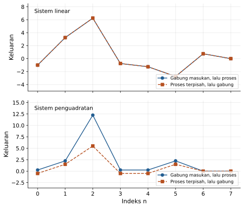
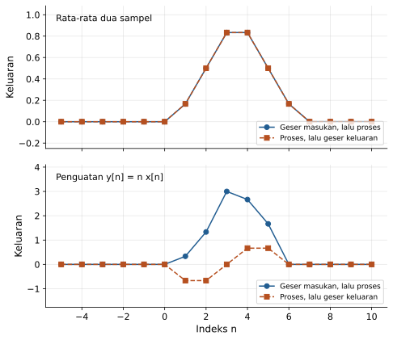
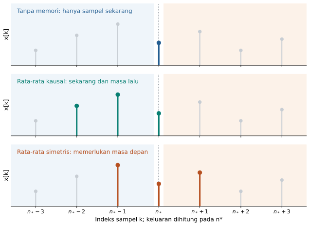
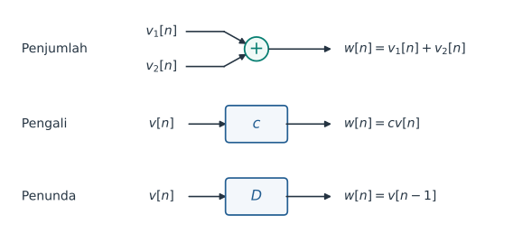
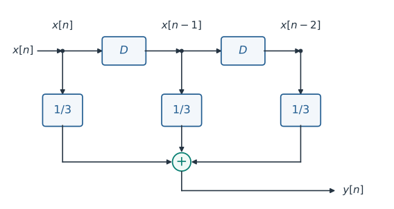
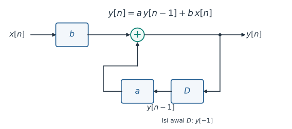
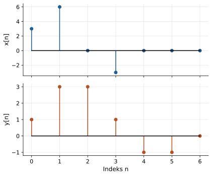
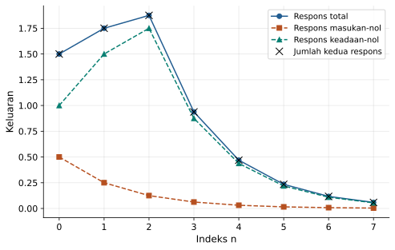
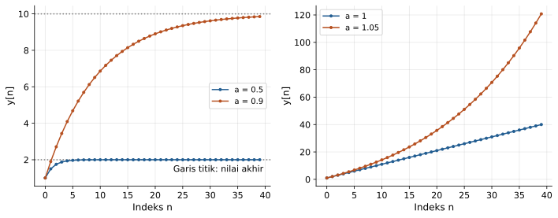
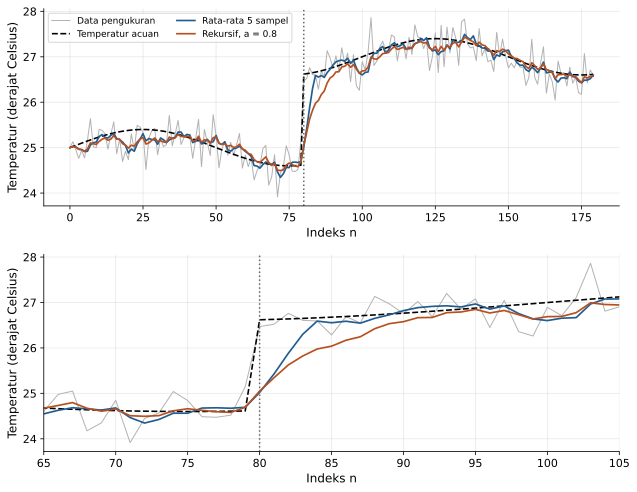

# Kuliah 2: Sistem, Sistem LTI Waktu-Diskret, dan Persamaan Selisih

## Tujuan pembelajaran

Pada kuliah pertama, kita mempelajari cara menyatakan besaran fisis sebagai sinyal dan melakukan operasi dasar terhadap sinyal tersebut. Pada kuliah ini, kita menggunakan pengetahuan itu untuk memahami sistem yang mengubah sinyal masukan menjadi sinyal keluaran.

Setelah mengikuti kuliah ini, mahasiswa diharapkan mampu menghubungkan model matematis sistem dengan cara kerjanya dalam pengukuran. Kemampuan yang dituju dirangkum dalam daftar berikut.

- menjelaskan sistem sebagai pemetaan dari masukan menuju keluaran;
- membedakan sistem waktu-kontinu dan waktu-diskret;
- menguji linearitas melalui homogenitas, aditivitas, dan superposisi;
- menguji invariansi waktu dengan membandingkan dua urutan operasi;
- menentukan memori, kausalitas, invertibilitas, dan stabilitas BIBO;
- mengenali sistem *linear time-invariant* (LTI) dan batas penggunaan istilah tersebut;
- membaca serta menyusun diagram blok dengan penjumlah, pengali, dan penunda satu sampel;
- mengubah persamaan selisih menjadi algoritma komputasi;
- membedakan sistem rekursif dan nonrekursif;
- menghitung pengaruh kondisi awal serta memisahkan respons masukan-nol dan respons keadaan-nol;
- mengimplementasikan sistem waktu-diskret menggunakan NumPy dan Matplotlib;
- menilai hubungan antara penghalusan sinyal, keterlambatan respons, dan kebutuhan penyimpanan data.

---

## Dari sinyal pengukuran menuju sistem

Misalkan sebuah sensor temperatur menghasilkan satu data setiap detik. Deretan data tersebut merupakan sinyal waktu-diskret, tetapi pembacaan sesaat dapat berfluktuasi akibat derau pengukuran.

Jika tampilan temperatur langsung mengikuti setiap sampel, angka pada layar dapat berubah terlalu cepat. Kita dapat menghaluskan tampilannya dengan merata-ratakan beberapa pembacaan terakhir, tetapi tindakan ini juga membuat tampilan lebih lambat mengikuti perubahan temperatur yang sesungguhnya.

Persoalan tersebut memperlihatkan bahwa pengolahan sinyal selalu melibatkan suatu aturan. Aturan itu menerima sinyal masukan, menggunakan informasi yang tersedia, lalu menentukan sinyal keluaran.

Sebagai contoh awal, misalkan masukan pada tiga waktu berturut-turut adalah $24$, $27$, dan $24$ dalam satuan derajat Celsius. Pada waktu pembacaan ketiga, rata-rata tiga sampel tersebut dihitung sebagai berikut.

```math
y[2]=\frac{x[2]+x[1]+x[0]}{3}
=\frac{24+27+24}{3}=25.
```

Nilai keluaran $25$ lebih dekat ke pembacaan di sekitar lonjakan daripada nilai $27$ yang muncul sesaat. Namun, hanya dari tiga angka ini kita belum dapat memastikan apakah lonjakan tersebut merupakan derau atau perubahan temperatur yang perlu dipertahankan.

Karena itu, kita perlu memahami sifat aturan pengolahan sebelum menggunakannya. Pertanyaan yang akan kita jawab adalah bagaimana keluaran berubah ketika masukan diperbesar, digeser waktunya, atau diberikan kepada sistem yang masih menyimpan pengaruh pengukuran sebelumnya.

---

## Sistem sebagai pemetaan masukan dan keluaran

Sebuah **sistem** adalah aturan yang memetakan sinyal masukan menjadi sinyal keluaran. Aturan ini dapat diwujudkan oleh perangkat fisis, rangkaian elektronik, atau algoritma pada komputer.

Kita menggunakan lambang $\mathcal{T}$ untuk menyatakan aturan tersebut. Notasi masukan-keluarannya diberikan oleh hubungan berikut.

```math
y(t)=\mathcal{T}\{x\}(t)
\qquad\text{atau}\qquad
y[n]=\mathcal{T}\{x\}[n].
```

Tanda kurung kurawal menegaskan bahwa sistem bekerja pada suatu sinyal, yang dapat mencakup nilai pada beberapa waktu. Oleh sebab itu, keluaran pada indeks $n$ tidak harus ditentukan hanya oleh $x[n]$.

### Sistem waktu-kontinu

Pada sistem waktu-kontinu, masukan dan keluaran didefinisikan terhadap variabel waktu kontinu. Penguat ideal memberikan contoh sederhana karena keluaran setiap saat langsung sebanding dengan masukannya.

```math
y(t)=Kx(t).
```

Jika $x(t)$ dan $y(t)$ sama-sama tegangan, penguatan $K$ tidak memiliki satuan. Untuk $K=4$ dan masukan $0.2\ \mathrm{V}$, keluarannya adalah $0.8\ \mathrm{V}$.

Sistem fisis juga dapat menyimpan pengaruh masa lalu. Contohnya adalah model sensor orde satu dengan masukan $x(t)$ dan keluaran $y(t)$ dalam satuan yang sama.

```math
\tau\frac{dy(t)}{dt}+y(t)=x(t),
\qquad \tau>0.
```

Parameter $\tau$ mempunyai satuan waktu dan mengatur kecepatan respons sensor. Untuk menentukan keluaran model ini, kita memerlukan masukan dan nilai awal keluaran pada waktu mulai pengamatan.

### Sistem waktu-diskret

Pada sistem waktu-diskret, aturan bekerja pada indeks bilangan bulat. Jika data berasal dari pencuplikan dengan periode $T_s$, selisih satu indeks berhubungan dengan selang waktu $T_s$.

Beberapa aturan yang akan kita gunakan sepanjang kuliah ini dirangkum dalam tabel berikut. Nama sistem menggambarkan operasi matematisnya, sedangkan sifat lengkapnya masih perlu diuji.

| Sistem | Aturan | Makna operasi |
|---|---|---|
| Penguat | $y[n]=2x[n]$ | Mengalikan amplitudo dengan dua |
| Penunda | $y[n]=x[n-1]$ | Mengeluarkan sampel satu waktu sebelumnya |
| Rata-rata dua sampel | $y[n]=(x[n]+x[n-1])/2$ | Menggabungkan sampel sekarang dan sebelumnya |
| Selisih pertama | $y[n]=x[n]-x[n-1]$ | Menonjolkan perubahan antarsampel |
| Penghalus rekursif | $y[n]=0.8y[n-1]+0.2x[n]$ | Menggabungkan keluaran sebelumnya dan masukan sekarang |

### Domain sinyal dan riwayat yang digunakan

Ketika menguji sifat sistem secara matematis, kita umumnya menganggap sinyal terdefinisi untuk seluruh indeks $n\in\mathbb{Z}$. Sebuah rekaman komputer hanya memuat sebagian indeks tersebut, sehingga nilai di luar rekaman harus dinyatakan sebagai asumsi tambahan.

Dalam banyak contoh perhitungan, pemrosesan dimulai pada $n=0$ dan masukan sebelum itu dianggap nol. Asumsi $x[n]=0$ untuk $n<0$ harus dibedakan dari kondisi awal keluaran, sebab sistem yang menyimpan energi atau data masih dapat menghasilkan keluaran walaupun masukan sebelumnya dinyatakan nol.

---

## Linearitas, homogenitas, dan superposisi

Kita sering menghadapi masukan yang merupakan penjumlahan beberapa komponen, misalnya sinyal pengukuran dan derau. Jika sistem linear, pengaruh setiap komponen dapat dihitung terpisah lalu dijumlahkan untuk memperoleh keluaran total.

Sifat tersebut berlaku terhadap aturan sistem, bukan terhadap bentuk grafik sinyal masukannya. Sebuah sinusoid dapat menjadi masukan sistem linear maupun nonlinear, bergantung pada aturan yang memprosesnya.

### Homogenitas dan aditivitas

**Homogenitas** berarti penskalaan masukan menghasilkan penskalaan keluaran dengan faktor yang sama. Jika $\mathcal{T}\{x\}=y$, syarat homogenitas dinyatakan oleh hubungan berikut.

```math
\mathcal{T}\{\alpha x\}=\alpha\mathcal{T}\{x\}
=\alpha y.
```

**Aditivitas** berarti keluaran akibat penjumlahan masukan sama dengan penjumlahan keluaran masing-masing masukan. Untuk dua sinyal $x_1$ dan $x_2$, syaratnya dinyatakan sebagai berikut.

```math
\mathcal{T}\{x_1+x_2\}
=\mathcal{T}\{x_1\}+\mathcal{T}\{x_2\}.
```

Sistem disebut **linear** jika memenuhi kedua syarat tersebut untuk semua masukan yang diizinkan dan semua faktor skala pada ruang sinyal yang digunakan. Untuk sinyal real, faktor skala dapat berupa bilangan real; untuk linearitas pada ruang sinyal kompleks, faktor skalanya juga boleh kompleks.

### Prinsip superposisi

Homogenitas dan aditivitas dapat digabungkan menjadi satu pengujian. Bentuk gabungannya disebut prinsip superposisi.

```math
\boxed{
\mathcal{T}\{\alpha x_1+\beta x_2\}
=\alpha\mathcal{T}\{x_1\}
+\beta\mathcal{T}\{x_2\}
}.
```

Untuk membuktikan linearitas, kesamaan tersebut harus berlaku bagi masukan dan faktor skala yang umum. Untuk membuktikan ketidaklinearan, cukup ditemukan satu pilihan masukan atau faktor skala yang melanggarnya.

#### Contoh: sistem linear dengan penundaan

Tinjau sistem $y[n]=2x[n]-\tfrac12x[n-1]$. Kita akan membandingkan pemrosesan masukan gabungan dengan penggabungan keluaran yang dihitung terpisah.

```math
\begin{aligned}
\mathcal{T}\{\alpha x_1+\beta x_2\}[n]
&=2\bigl(\alpha x_1[n]+\beta x_2[n]\bigr)
-\frac12\bigl(\alpha x_1[n-1]+\beta x_2[n-1]\bigr)\\
&=\alpha\left(2x_1[n]-\frac12x_1[n-1]\right)
+\beta\left(2x_2[n]-\frac12x_2[n-1]\right)\\
&=\alpha\mathcal{T}\{x_1\}[n]
+\beta\mathcal{T}\{x_2\}[n].
\end{aligned}
```

Kesamaan ini tidak memerlukan bentuk khusus untuk $x_1$ dan $x_2$. Dengan demikian, sistem tersebut linear meskipun keluarannya menggunakan sampel masa lalu.

Sebagai pemeriksaan angka pada suatu indeks, ambil $x_1[n]=3$, $x_1[n-1]=1$, $x_2[n]=2$, dan $x_2[n-1]=-2$. Untuk $\alpha=2$ dan $\beta=-1$, kedua jalur perhitungan memberikan hasil berikut.

```math
\begin{aligned}
y_1[n]&=2(3)-\tfrac12(1)=5.5,\\
y_2[n]&=2(2)-\tfrac12(-2)=5,\\
2y_1[n]-y_2[n]&=6,\\
\mathcal{T}\{2x_1-x_2\}[n]
&=2(2\cdot3-2)-\tfrac12(2\cdot1-(-2))=6.
\end{aligned}
```

#### Contoh: penguadratan merupakan operasi nonlinear

Sekarang tinjau $y[n]=x^2[n]$ untuk sinyal real. Penggandaan masukan menghasilkan empat kali keluaran, sehingga homogenitas tidak terpenuhi.

```math
\mathcal{T}\{2x\}[n]=4x^2[n]
\ne 2x^2[n]=2\mathcal{T}\{x\}[n].
```

Aditivitas juga gagal karena kuadrat jumlah menghasilkan suku silang. Sebagai contoh, pada satu indeks dengan $x_1=1$ dan $x_2=2$, kedua jalur menghasilkan angka yang berbeda.

```math
\mathcal{T}\{x_1+x_2\}=3^2=9,
\qquad
\mathcal{T}\{x_1\}+\mathcal{T}\{x_2\}=1^2+2^2=5.
```

#### Contoh: penguatan dengan offset

Hubungan kalibrasi $y[n]=2x[n]+3$ berbentuk garis lurus terhadap amplitudo masukan. Namun, pemetaan ini bersifat **afin** dan tidak memenuhi definisi sistem linear karena terdapat tambahan tetap yang tidak mengikuti penskalaan masukan.

```math
\mathcal{T}\{0\}[n]=3\ne0.
```

Setiap sistem linear harus memetakan masukan nol menjadi keluaran nol ketika keadaan awalnya juga nol. Kondisi ini merupakan syarat perlu, tetapi belum cukup, sebab sistem penguadratan juga memetakan nol menjadi nol.

Dalam pengukuran, offset sering dapat dikurangi dengan mendefinisikan keluaran relatif terhadap titik kerja. Setelah pengurangan offset, pemetaan $\widetilde y[n]=y[n]-3=2x[n]$ menjadi linear terhadap $x[n]$.

### Eksperimen Python: memeriksa superposisi

Program berikut membandingkan kedua ruas syarat superposisi pada sistem linear dan sistem penguadratan. Semua data sebelum $n=0$ dianggap nol, dan angka galat yang dicetak adalah selisih maksimum kedua jalur untuk sampel yang dihitung.

```python
import numpy as np
import matplotlib.pyplot as plt


def sistem_linear(x):
    x_lama = np.zeros(len(x))
    x_lama[1:] = x[:-1]
    return 2.0 * x - 0.5 * x_lama


def sistem_kuadrat(x):
    return x**2


n = np.arange(8)
x1 = np.array([0, 1, 2, 1, 0, -1, 0, 0], dtype=float)
x2 = np.array([1, 0, -1, 2, 1, 0, 0, 0], dtype=float)
alpha = 1.5
beta = -0.5

fig, axes = plt.subplots(2, 1, figsize=(7, 6), sharex=True)

for ax, sistem, nama in zip(
    axes,
    [sistem_linear, sistem_kuadrat],
    ["Sistem linear", "Sistem penguadratan"],
):
    langsung = sistem(alpha * x1 + beta * x2)
    terpisah = alpha * sistem(x1) + beta * sistem(x2)
    galat = np.max(np.abs(langsung - terpisah))
    print(f"{nama}: galat maksimum = {galat:.3e}")

    ax.plot(n, langsung, "o-", label="Gabung masukan, lalu proses")
    ax.plot(n, terpisah, "s--", label="Proses terpisah, lalu gabung")
    ax.set_ylabel("Keluaran")
    ax.text(0.03, 0.94, nama, transform=ax.transAxes, va="top")
    ax.margins(y=0.25)
    ax.grid(True, alpha=0.3)
    ax.legend(loc="lower right", fontsize=9)

axes[-1].set_xlabel("Indeks n")
fig.tight_layout()
plt.show()
```

Versi skrip terpisah tersedia di [01_superposisi.py](../Kode/pertemuan-02/01_superposisi.py). Galat sistem linear berada pada tingkat pembulatan komputer, sedangkan sistem penguadratan menghasilkan galat yang jelas berbeda dari nol.



Pada panel pertama, kurva kedua jalur berhimpit karena aturan memenuhi superposisi. Pada panel kedua, perbedaan kurva memperlihatkan kegagalan superposisi untuk contoh masukan yang dipilih.

Pemeriksaan numerik membantu menemukan kesalahan implementasi atau contoh penyangkal. Namun, keberhasilan pada sejumlah data belum membuktikan linearitas untuk seluruh kemungkinan masukan, sehingga pembuktian aljabar tetap diperlukan.

---

## Invariansi waktu

Linearitas menjelaskan respons terhadap penggabungan dan penskalaan masukan. Kita sekarang mengajukan pertanyaan berbeda, yaitu apakah aturan sistem tetap sama ketika percobaan dijalankan lebih awal atau lebih lambat.

Sistem disebut **invarian terhadap waktu** atau *time-invariant* jika pergeseran masukan hanya menggeser keluaran dengan jumlah yang sama. Jika syarat ini gagal, sistem disebut *time-varying* atau berubah terhadap waktu.

### Membandingkan dua urutan operasi

Misalkan keluaran untuk masukan $x[n]$ adalah $y[n]$. Kita memilih pergeseran bilangan bulat $n_0$ dan membentuk masukan baru $x_s[n]=x[n-n_0]$.

Pengujian dilakukan dengan menghitung dua keluaran berikut. Jalur pertama menggeser masukan sebelum pemrosesan, sedangkan jalur kedua memproses masukan asli sebelum menggeser keluarannya.

```math
\begin{aligned}
y_A[n]&=\mathcal{T}\{x_s\}[n],\\
y_B[n]&=y[n-n_0].
\end{aligned}
```

Sistem invarian terhadap waktu jika $y_A[n]=y_B[n]$ untuk semua masukan, semua indeks, dan semua pergeseran yang diizinkan. Pada sistem waktu-kontinu, bentuk pengujiannya sama dengan mengganti indeks $n$ dan pergeseran $n_0$ menjadi waktu $t$ dan pergeseran $t_0$.

#### Contoh: rata-rata dua sampel

Tinjau sistem $y[n]=(x[n]+x[n-1])/2$. Setelah masukan digeser, keluaran jalur pertama diperoleh sebagai berikut.

```math
y_A[n]=\frac{x[n-n_0]+x[n-1-n_0]}{2}.
```

Pada jalur kedua, kita mengganti setiap indeks keluaran dengan $n-n_0$. Hasilnya diberikan oleh hubungan berikut.

```math
y_B[n]=y[n-n_0]
=\frac{x[n-n_0]+x[n-n_0-1]}{2}.
```

Kedua hasil sama karena $n-1-n_0=n-n_0-1$. Sistem ini invarian terhadap waktu, meskipun nilai keluarannya dapat berubah dari sampel ke sampel.

#### Contoh: penguatan yang berubah terhadap indeks

Tinjau sistem $y[n]=nx[n]$. Pada jalur pertama, indeks $n$ dalam aturan penguatan tetap merupakan waktu operasi sistem, sehingga hanya argumen masukan yang digeser.

```math
y_A[n]=n\,x[n-n_0].
```

Pada jalur kedua, yang digeser adalah seluruh ekspresi keluaran. Faktor yang mengalikan masukan ikut berubah menjadi $n-n_0$.

```math
y_B[n]=(n-n_0)x[n-n_0].
```

Selisih kedua jalur adalah $n_0x[n-n_0]$, yang secara umum tidak nol. Karena itu, sistem tersebut berubah terhadap waktu, walaupun tetap linear terhadap masukannya.

#### Contoh: sistem nonlinear yang invarian terhadap waktu

Sistem penguadratan $y[n]=x^2[n]$ memberikan $y_A[n]=x^2[n-n_0]$ dan $y_B[n]=x^2[n-n_0]$. Jadi, ketidaklinearan tidak menghalangi sebuah sistem untuk memiliki invariansi waktu.

Pengujian ini juga memperjelas bahwa *time-invariant* tidak berarti keluarannya konstan. Istilah tersebut berarti aturan masukan-keluarannya tidak bergantung pada pemilihan titik asal waktu.

### Eksperimen Python: pergeseran sebelum dan sesudah sistem

Program berikut menggunakan sinyal yang didefinisikan langsung sebagai fungsi indeks. Cara ini memungkinkan perhitungan $x[n-n_0]$ pada indeks negatif tanpa mencampurkan batas larik dengan definisi matematis sinyal.

```python
import numpy as np
import matplotlib.pyplot as plt


def x(n):
    return np.maximum(1.0 - np.abs(n) / 3.0, 0.0)


def rata_dua(sinyal, n):
    return 0.5 * (sinyal(n) + sinyal(n - 1))


def penguat_berubah(sinyal, n):
    return n * sinyal(n)


n = np.arange(-5, 11)
n0 = 3


def x_geser(n):
    return x(n - n0)


fig, axes = plt.subplots(2, 1, figsize=(7, 6), sharex=True)

for ax, sistem, nama in zip(
    axes,
    [rata_dua, penguat_berubah],
    ["Rata-rata dua sampel", "Penguatan y[n] = n x[n]"],
):
    jalur_a = sistem(x_geser, n)
    jalur_b = sistem(x, n - n0)
    galat = np.max(np.abs(jalur_a - jalur_b))
    print(f"{nama}: galat maksimum = {galat:.3e}")

    ax.plot(n, jalur_a, "o-", label="Geser masukan, lalu proses")
    ax.plot(n, jalur_b, "s--", label="Proses, lalu geser keluaran")
    ax.set_ylabel("Keluaran")
    ax.text(0.03, 0.94, nama, transform=ax.transAxes, va="top")
    ax.margins(y=0.3)
    ax.grid(True, alpha=0.3)
    ax.legend(loc="lower right", fontsize=9)

axes[-1].set_xlabel("Indeks n")
fig.tight_layout()
plt.show()
```

Versi skrip terpisah tersedia di [02_invariansi_waktu.py](../Kode/pertemuan-02/02_invariansi_waktu.py). Kedua jalur berhimpit untuk rata-rata dua sampel, tetapi berbeda untuk penguatan yang sebanding dengan indeks.



Pergeseran pada contoh ini tidak dilakukan dengan `np.roll`. Menurut [dokumentasi NumPy](https://numpy.org/doc/stable/reference/generated/numpy.roll.html), fungsi tersebut memindahkan elemen yang melewati ujung larik kembali ke ujung lainnya, sehingga operasinya merupakan pergeseran melingkar.

Untuk penundaan biasa pada rekaman berhingga, nilai pada bagian yang baru terbuka harus ditentukan dari riwayat sinyal atau asumsi pengisian yang dinyatakan. Menggunakan pergeseran melingkar tanpa alasan fisis dapat membuat sampel akhir rekaman muncul sebagai masa lalu pada awal rekaman.

---

## Memori dan kausalitas

Pengujian sebelumnya belum menjelaskan sampel mana yang diperlukan untuk menghitung sebuah keluaran. Informasi ini menentukan kebutuhan penyimpanan dan apakah sistem dapat bekerja ketika data datang secara bertahap.

### Sistem tanpa memori dan dengan memori

Sistem **tanpa memori** menentukan keluaran pada waktu tertentu hanya dari nilai masukan pada waktu yang sama. Sebagai contoh, $y[n]=3x[n]$ dan $y[n]=x^2[n]$ sama-sama tanpa memori, meskipun sifat linearitasnya berbeda.

Sistem **dengan memori** memerlukan masukan pada waktu lain atau keadaan yang menyimpan pengaruh masa lalu. Penunda $y[n]=x[n-1]$ memiliki memori karena keluaran sekarang memerlukan satu sampel sebelumnya.

Rata-rata tiga sampel $y[n]=(x[n]+x[n-1]+x[n-2])/3$ memerlukan dua sampel masa lalu. Dalam implementasi langsung, dua sampel itu dapat disimpan lalu diperbarui setiap kali masukan baru diterima.

Penghalus $y[n]=0.8y[n-1]+0.2x[n]$ juga memiliki memori. Meskipun hanya satu keluaran lama yang disimpan, nilai itu dapat merangkum pengaruh banyak masukan sebelumnya.

### Sistem kausal dan nonkausal

Sistem **kausal** tidak memerlukan masukan masa depan untuk menentukan keluaran sekarang. Keluaran pada indeks $n_*$ boleh bergantung pada masukan dengan indeks $n\le n_*$ serta keadaan awal yang telah diketahui.

Definisi yang lebih teliti menggunakan dua masukan yang sama hingga waktu tertentu. Jika $x_1[n]=x_2[n]$ untuk seluruh $n\le n_*$, maka sistem kausal dengan kondisi awal yang sama harus menghasilkan $y_1[n_*]=y_2[n_*]$.

Sistem $y[n]=x[n+1]$ bersifat **nonkausal** karena memerlukan sampel berikutnya. Jika dua masukan sama hingga indeks $n_*$ tetapi berbeda pada $n_*+1$, keluaran keduanya pada $n_*$ dapat berbeda.

| Aturan | Memori | Kausalitas | Alasan |
|---|---|---|---|
| $y[n]=2x[n]$ | Tanpa memori | Kausal | Hanya memakai masukan sekarang |
| $y[n]=x^2[n]$ | Tanpa memori | Kausal | Operasi nonlinear tidak memerlukan masa depan |
| $y[n]=x[n-2]$ | Dengan memori | Kausal | Memerlukan dua sampel sebelumnya |
| $y[n]=x[n+1]$ | Dengan memori | Nonkausal | Memerlukan satu sampel berikutnya |
| $y[n]=(x[n-1]+x[n]+x[n+1])/3$ | Dengan memori | Nonkausal | Memakai sampel masa lalu dan masa depan |



Titik berwarna pada gambar menunjukkan sampel yang diperlukan untuk menghitung keluaran pada $n_*$. Akses ke sisi kanan $n_*$ menunjukkan kebutuhan data masa depan terhadap waktu keluaran tersebut.

### Pengolahan langsung dan pengolahan rekaman

Sistem nonkausal tetap dapat digunakan untuk menganalisis rekaman yang seluruh datanya sudah tersedia. Keterbatasannya muncul ketika keluaran diminta segera pada saat sampel terkait baru diterima.

Misalkan sebuah rata-rata simetris didefinisikan sebagai $v[n]=(x[n-1]+x[n]+x[n+1])/3$. Nilai $v[n]$ baru dapat dihitung setelah $x[n+1]$ datang, sehingga penerapan langsungnya memerlukan waktu tunggu satu sampel.

Jika kita menerima penundaan keluaran satu sampel dan mendefinisikan $y[n]=v[n-1]$, hubungan masukan-keluarannya berubah menjadi kausal. Pergantian indeks memberikan hubungan berikut.

```math
y[n]=v[n-1]
=\frac{x[n-2]+x[n-1]+x[n]}{3}.
```

Dalam sistem yang baru, keluaran pada $n$ merepresentasikan rata-rata yang berpusat pada $n-1$. Jadi, perubahan ini menyertakan keterlambatan pada informasi yang ditampilkan.

---

## Invertibilitas

Setelah mengetahui data yang diperlukan sistem, kita dapat menanyakan apakah masukan dapat ditemukan kembali dari keluarannya. Pertanyaan ini berkaitan dengan **invertibilitas**, yaitu ada atau tidaknya pemetaan balik yang menghasilkan masukan secara unik.

Sistem invertibel pada suatu kelas masukan jika dua masukan berbeda dalam kelas tersebut tidak pernah menghasilkan keluaran yang sama. Jika inversnya dinyatakan dengan $\mathcal{T}^{-1}$, hubungan yang diinginkan dinyatakan sebagai berikut.

```math
\mathcal{T}^{-1}\{\mathcal{T}\{x\}\}=x.
```

### Contoh sistem invertibel

Untuk $y[n]=Kx[n]$ dengan $K\ne0$, masukan diperoleh kembali dengan membagi keluaran oleh $K$. Sebagai contoh, penguat dengan $K=4$ mempunyai invers $x[n]=y[n]/4$.

Penundaan $y[n]=x[n-1]$ juga invertibel jika seluruh deretan masukan dan keluaran tersedia. Inversnya adalah $x[n]=y[n+1]$, sehingga invers tersebut nonkausal terhadap waktu keluaran yang sedang digunakan.

Contoh ini menunjukkan bahwa invertibel tidak otomatis berarti mempunyai invers yang kausal. Pada rekaman berhingga, kita juga perlu mengetahui sampel keluaran tambahan di batas akhir agar sampel masukan terakhir dapat dipulihkan.

### Contoh hilangnya informasi

Sistem $y[n]=x^2[n]$ tidak invertibel pada kelas seluruh sinyal real. Masukan $x_1[n]=1$ dan $x_2[n]=-1$ memberikan keluaran yang sama, sehingga informasi tanda hilang.

Jika kelas masukan dibatasi menjadi $x[n]\ge0$ untuk semua $n$, akar nonnegatif memberikan invers yang unik. Dengan demikian, pernyataan invertibilitas perlu menyebutkan kelas masukan yang digunakan.

### Contoh: selisih pertama dan nilai awal

Untuk $y[n]=x[n]-x[n-1]$, penambahan konstanta yang sama ke seluruh masukan tidak mengubah keluaran. Pada deretan dua sisi tanpa informasi tambahan, sistem ini tidak invertibel karena tingkat dasar masukan hilang.

Apabila pemrosesan dimulai pada $n=0$ dan nilai $x[-1]$ diketahui, masukan dapat dipulihkan secara berurutan. Kita memperoleh hubungan balik berikut.

```math
\begin{aligned}
x[0]&=y[0]+x[-1],\\
x[1]&=y[1]+x[0],\\
x[n]&=x[-1]+\sum_{k=0}^{n}y[k].
\end{aligned}
```

Misalkan $x[-1]=10$ dan keluaran yang diterima adalah $y[0]=2$, $y[1]=-1$, serta $y[2]=3$. Rekonstruksi memberikan $x[0]=12$, $x[1]=11$, dan $x[2]=14$.

Jika nilai awal diganti menjadi $x[-1]=20$, keluaran selisih yang sama menghasilkan masukan $22$, $21$, dan $24$. Karena itu, nilai awal merupakan bagian informasi yang diperlukan untuk menjadikan rekonstruksi unik.

---

## Stabilitas BIBO

Sistem pengukuran sering menerima masukan yang amplitudonya dibatasi oleh rentang operasi. Kita ingin mengetahui apakah keluaran sistem juga tetap terbatas untuk setiap masukan semacam itu.

Sifat ini disebut **stabilitas BIBO**, singkatan dari *bounded-input bounded-output*. Definisi ini berlaku untuk sistem linear maupun nonlinear, dan tidak mensyaratkan keluaran harus mengecil atau mencapai sebuah konstanta.

### Definisi masukan terbatas dan keluaran terbatas

Masukan disebut terbatas jika terdapat konstanta berhingga $M_x$ yang membatasi magnitudonya pada semua waktu yang ditinjau. Dalam notasi diskret, syaratnya ditulis sebagai berikut.

```math
|x[n]|\le M_x<\infty.
```

Sistem stabil BIBO jika setiap masukan terbatas menghasilkan keluaran dengan batas berhingga yang tidak bertambah tanpa batas ketika waktu pengamatan diperpanjang. Dengan kata lain, harus ada $M_y<\infty$ yang memenuhi pertidaksamaan berikut.

```math
|y[n]|\le M_y
\qquad\text{untuk seluruh indeks yang ditinjau}.
```

Ketika membahas sistem dinamis sebagai pemetaan dari masukan menuju keluaran, pengujian BIBO lazim dilakukan dengan keadaan awal nol. Pengaruh keadaan awal tak nol perlu diperiksa pula dalam penerapan, dan akan dihitung secara terpisah setelah persamaan selisih diperkenalkan.

### Membuktikan stabilitas dengan batas amplitudo

Untuk sistem $y[n]=3x[n]$, batas masukan langsung memberikan batas keluaran. Dengan menggunakan magnitudo, kita memperoleh batas berikut.

```math
|y[n]|=3|x[n]|\le3M_x.
```

Rata-rata dua sampel juga stabil karena pertidaksamaan segitiga membatasi jumlahnya. Perhitungannya dituliskan sebagai berikut.

```math
|y[n]|
=\left|\frac{x[n]+x[n-1]}{2}\right|
\le\frac{|x[n]|+|x[n-1]|}{2}
\le M_x.
```

Sistem nonlinear $y[n]=x^2[n]$ tetap stabil BIBO pada sinyal real. Batasnya adalah $|y[n]|\le M_x^2$, yang berhingga untuk setiap $M_x$ berhingga.

Contoh terakhir memperlihatkan bahwa stabilitas dan linearitas merupakan sifat yang berbeda. Penguatan amplitudo yang besar juga belum berarti tidak stabil, selama penguatan tersebut tetap berhingga dan tidak menghasilkan keluaran tanpa batas dari masukan terbatas.

### Membuktikan ketidakstabilan dengan satu masukan

Sistem $y[n]=nx[n]$ tidak stabil BIBO pada rentang waktu yang tidak dibatasi. Masukan $x[n]=u[n]$ mempunyai magnitudo paling besar satu, tetapi menghasilkan $y[n]=nu[n]$ yang terus bertambah.

Contoh lain adalah akumulator yang dimulai dari keadaan nol. Aturan akumulasinya menjumlahkan seluruh masukan yang diterima sejak $n=0$.

```math
y[n]=\sum_{k=0}^{n}x[k],
\qquad n\ge0.
```

Untuk masukan $x[n]=u[n]$, terdapat $n+1$ buah suku bernilai satu dalam penjumlahan. Keluarannya diberikan oleh persamaan berikut.

```math
y[n]=n+1,
\qquad n\ge0,
```

Akumulator ini tidak stabil BIBO karena satu masukan terbatas telah menghasilkan keluaran tidak terbatas. Fakta bahwa keluaran pada 10 atau 100 sampel pertama masih dapat disimpan komputer tidak mengubah kesimpulan matematis untuk waktu yang terus bertambah.

### Stabilitas dan ketelitian pengukuran

Stabil BIBO tidak berarti keluaran selalu mendekati sinyal yang ingin diukur. Sebuah penguat yang stabil masih dapat memperbesar derau, dan penghalus yang stabil dapat memperlambat perubahan yang justru ingin diamati.

Demikian pula, pembulatan, batas angka, dan saturasi perangkat merupakan persoalan implementasi yang perlu dibedakan dari model ideal. Penilaian kegunaan sistem harus mempertimbangkan stabilitas sekaligus tujuan pengolahannya.

---

## Sistem linear time-invariant

Sebuah sistem disebut **linear time-invariant**, disingkat **LTI**, jika linear dan invarian terhadap waktu. Kedua sifat ini harus diuji secara terpisah karena salah satunya tidak menjamin yang lain.

Sebagai contoh, $y[n]=2x[n]-\tfrac12x[n-1]$ adalah sistem LTI. Penguadratan bersifat invarian terhadap waktu tetapi nonlinear, sedangkan $y[n]=nx[n]$ linear tetapi berubah terhadap waktu.

### Membandingkan beberapa sistem

Tabel berikut menggunakan sinyal yang terdefinisi untuk seluruh indeks bilangan bulat. Pernyataan invertibilitas pada tabel berlaku untuk seluruh deretan real tanpa informasi batas tambahan.

| Sistem | Linear | Invarian waktu | Tanpa memori | Kausal | Stabil BIBO | Invertibel |
|---|:---:|:---:|:---:|:---:|:---:|:---:|
| $2x[n]$ | Ya | Ya | Ya | Ya | Ya | Ya |
| $2x[n]+3$ | Tidak | Ya | Ya | Ya | Ya | Ya |
| $x^2[n]$ | Tidak | Ya | Ya | Ya | Ya | Tidak |
| $nx[n]$ | Ya | Tidak | Ya | Ya | Tidak | Tidak |
| $x[n-1]$ | Ya | Ya | Tidak | Ya | Ya | Ya |
| $x[n+1]$ | Ya | Ya | Tidak | Tidak | Ya | Ya |
| $x[n]-x[n-1]$ | Ya | Ya | Tidak | Ya | Ya | Tidak |

Sistem $nx[n]$ tidak invertibel pada domain tersebut karena nilai $x[0]$ selalu dikalikan nol. Sistem selisih pertama kehilangan komponen konstan, sesuai pembahasan tentang perlunya informasi nilai awal.

Tabel ini juga menunjukkan bahwa LTI tidak berarti otomatis kausal. Sebagai contoh, pemaju satu sampel $x[n+1]$ adalah LTI dan stabil BIBO, tetapi memerlukan masukan masa depan.

### Mengapa sistem LTI berguna?

Superposisi memungkinkan masukan yang rumit diuraikan menjadi komponen sederhana. Invariansi waktu memastikan bahwa respons terhadap komponen yang digeser dapat diperoleh dengan menggeser respons yang sudah diketahui.

Gabungan kedua sifat tersebut menjadi dasar pembahasan respons impuls dan konvolusi pada pertemuan ketiga. Pada pertemuan ini, kita terlebih dahulu mempelajari bagaimana aturan sistem diwujudkan sebagai rangkaian operasi dan perhitungan berurutan.

---

## Diagram blok sistem waktu-diskret

Persamaan matematis menunjukkan hubungan antara masukan dan keluaran. Diagram blok menampilkan operasi yang perlu dilakukan serta data yang harus disimpan agar hubungan tersebut dapat dihitung.

### Penjumlah, pengali, dan penunda satu sampel

Tiga komponen dasar yang akan kita gunakan adalah penjumlah, pengali konstanta, dan penunda satu sampel. Cabang pada garis sinyal menyatakan penyalinan nilai ke beberapa jalur, bukan pembagian nilai sinyal.

| Komponen | Hubungan masukan-keluaran | Fungsi dalam implementasi |
|---|---|---|
| Penjumlah | $w[n]=v_1[n]+v_2[n]$ | Menjumlahkan dua nilai pada indeks yang sama |
| Pengali $c$ | $w[n]=cv[n]$ | Mengalikan nilai dengan koefisien |
| Penunda satu sampel $D$ | $w[n]=v[n-1]$ | Menyimpan satu nilai hingga sampel berikutnya |



Simbol $D$ pada gambar hanya menyatakan penundaan satu sampel. Notasi $z^{-1}$ sering dipakai untuk operasi yang sama, tetapi hubungan dengan transformasi Z akan dipelajari pada pertemuan ketujuh.

#### Keadaan internal sebuah penunda

Pada saat penghitungan sampel ke-$n$, keluaran penunda berisi nilai masukan penunda dari sampel ke-$(n-1)$. Setelah nilai lama digunakan, isi penyimpanan diperbarui dengan masukan penunda yang sekarang.

Urutan pembaruan ini menentukan ketepatan hasil perhitungan. Jika nilai lama ditimpa sebelum digunakan, operasi yang dimaksudkan sebagai penundaan dapat berubah menjadi penggunaan sampel sekarang.

### Diagram sistem nonrekursif

Tinjau rata-rata tiga sampel berikut dengan asumsi nilai riwayat masukan tersedia. Ketiga kontribusi dapat dihitung menggunakan dua penunda dan tiga pengali bernilai $1/3$.

```math
y[n]=\frac13x[n]+\frac13x[n-1]+\frac13x[n-2].
```



Setiap penunda menambah satu sampel keterlambatan pada jalur yang melewatinya. Ketiga nilai hasil perkalian dijumlahkan untuk menghasilkan keluaran pada indeks yang sama.

Diagram ini tidak mengembalikan keluaran ke masukan operasi sebelumnya. Karena hanya menggunakan masukan sekarang dan masukan lama, bentuk implementasinya disebut **nonrekursif**.

### Diagram sistem rekursif

Sekarang tinjau sistem yang menggunakan keluaran sebelumnya. Untuk koefisien konstan $a$ dan $b$, hubungan rekursifnya dituliskan sebagai berikut.

```math
y[n]=a\,y[n-1]+b\,x[n].
```



Cabang umpan balik membawa keluaran melewati penunda sebelum digunakan lagi. Dengan demikian, pada waktu menghitung $y[n]$, nilai $y[n-1]$ sudah diketahui dan tidak perlu diperoleh dengan menebak keluaran sekarang.

Nilai awal isi penunda adalah $y[-1]$ jika penghitungan dimulai pada $n=0$. Tanpa nilai itu, persamaan rekursif belum menentukan keluaran pertama secara unik.

---

## Persamaan selisih

Diagram blok sebelumnya dapat ditulis sebagai hubungan aljabar antara nilai sinyal pada indeks-indeks berbeda. Hubungan semacam ini disebut **persamaan selisih** atau *difference equation*.

Istilah tersebut tidak berarti setiap persamaan harus hanya berupa pengurangan dua sampel. Persamaan selisih merupakan padanan diskret dari hubungan dinamis yang pada sistem waktu-kontinu sering dinyatakan dengan persamaan diferensial.

### Bentuk linear dengan koefisien konstan

Bentuk yang banyak digunakan dalam pengolahan sinyal adalah persamaan selisih linear berkoefisien konstan. Dengan $a_0\ne0$, bentuk umumnya diberikan oleh persamaan berikut.

```math
\sum_{k=0}^{N}a_k y[n-k]
=\sum_{k=0}^{M}b_k x[n-k].
```

Koefisien $a_k$ dan $b_k$ tidak bergantung pada indeks $n$. Parameter $N$ menunjukkan keterlambatan keluaran terbesar dalam bentuk persamaan tersebut, sedangkan $M$ menunjukkan keterlambatan masukan terbesar.

Untuk memperoleh bentuk yang siap dihitung, pisahkan suku $a_0y[n]$ dari keluaran-keluaran lama. Setelah membagi dengan $a_0$, kita mendapatkan bentuk berikut.

```math
\boxed{
y[n]=\frac{1}{a_0}
\left(
\sum_{k=0}^{M}b_kx[n-k]
-\sum_{k=1}^{N}a_ky[n-k]
\right)
}.
```

Tanda minus pada penjumlahan keluaran lama berasal dari pemindahan ruas. Karena itu, jika persamaan awal ditulis sebagai $y[n]-0.5y[n-1]=x[n]$, larik koefisien keluaran adalah $a=[1,-0.5]$ dan bentuk rekursifnya memuat $+0.5y[n-1]$.

### Rekursif dan nonrekursif

Jika keluaran sekarang dihitung hanya dari masukan sekarang dan masukan lama, implementasinya nonrekursif. Bentuk penjumlahannya diberikan oleh persamaan berikut.

```math
y[n]=\sum_{k=0}^{M}b_kx[n-k],
```

Jika perhitungan menggunakan keluaran lama, implementasinya rekursif. Sebagai contoh, $y[n]=0.6y[n-1]+0.4x[n]$ hanya menyimpan satu keluaran lama tetapi dapat mempertahankan pengaruh masukan selama banyak sampel.

Sistem nonrekursif dengan penjumlahan berhingga di atas memiliki respons impuls berhingga dan akan termasuk pembahasan FIR. Sistem rekursif sering memiliki respons impuls tak berhingga dan muncul dalam pembahasan IIR, tetapi istilah rekursif menjelaskan cara menghitung sehingga tidak selalu identik dengan respons impuls tak berhingga.

Sebagai contoh, rata-rata $L$ sampel dapat diperbarui menggunakan bentuk rekursif berikut. Hubungan ini tetap menghitung rata-rata berhingga jika keadaan awalnya konsisten dengan definisi penjumlahan langsung.

```math
y[n]=y[n-1]+\frac{x[n]-x[n-L]}{L}.
```

Untuk melihat asalnya, kurangi jumlah $L$ sampel pada indeks $n-1$ dari jumlah pada indeks $n$. Semua suku di tengah saling menghapus, sehingga hanya sampel baru $x[n]$ dan sampel yang keluar dari jendela, $x[n-L]$, yang tersisa.

Kesalahan awal pada $y[n-1]$ tidak otomatis hilang dalam bentuk pembaruan tersebut. Contoh ini memperlihatkan mengapa persamaan, keadaan awal, dan makna keluaran perlu diperiksa bersama.

### Kapan persamaan ini menentukan sistem LTI?

Persamaan linear berkoefisien konstan memiliki aturan yang tidak berubah terhadap waktu. Untuk memperoleh pemetaan masukan-keluaran LTI, kita juga harus menetapkan aturan pemilihan solusi yang sesuai, misalnya realisasi kausal dengan keadaan awal diam sebelum masukan mulai bekerja.

Koefisien konstan saja belum cukup untuk mengabaikan kondisi awal. Jika sebuah keadaan awal tak nol ditetapkan sama pada setiap percobaan, keluaran memuat kontribusi tambahan yang tidak mengikuti penskalaan masukan.

---

## Menghitung sistem nonrekursif

Kita mulai dari rata-rata tiga sampel agar hubungan antara persamaan, tabel hitungan, dan program terlihat langsung. Masukan sebelum $n=0$ dianggap nol, sehingga kedua penunda mula-mula berisi nol.

### Contoh hitungan: rata-rata tiga sampel

Gunakan masukan $x[0]=3$, $x[1]=6$, $x[2]=0$, dan $x[3]=-3$. Semua sampel masukan lain dianggap nol, termasuk sampel dengan indeks negatif.

```math
y[n]=\frac{x[n]+x[n-1]+x[n-2]}{3}.
```

Dua keluaran pertama belum memuat tiga sampel masukan yang tidak nol. Dengan menggunakan riwayat nol yang telah ditetapkan, kita memperoleh hasil berikut.

```math
\begin{aligned}
y[0]&=\frac{3+0+0}{3}=1,\\
y[1]&=\frac{6+3+0}{3}=3,\\
y[2]&=\frac{0+6+3}{3}=3,\\
y[3]&=\frac{-3+0+6}{3}=1.
\end{aligned}
```

Meskipun masukan sesudah $n=3$ sudah nol, sampel lama masih berada di dalam penunda. Kita harus melanjutkan penghitungan untuk melihat bagian akhir keluaran.

| $n$ | $x[n]$ | $x[n-1]$ | $x[n-2]$ | $y[n]$ |
|---:|---:|---:|---:|---:|
| 0 | 3 | 0 | 0 | 1 |
| 1 | 6 | 3 | 0 | 3 |
| 2 | 0 | 6 | 3 | 3 |
| 3 | -3 | 0 | 6 | 1 |
| 4 | 0 | -3 | 0 | -1 |
| 5 | 0 | 0 | -3 | -1 |
| 6 | 0 | 0 | 0 | 0 |

### Algoritma

Untuk setiap indeks keluaran, kita mengumpulkan paling banyak tiga nilai masukan. Indeks negatif diberi nilai nol sesuai asumsi, sedangkan data di akhir diperpanjang dengan nol agar sisa pengaruh masukan terlihat.

1. Siapkan masukan $x[0],\ldots,x[L-1]$ beserta sampel nol tambahan jika diperlukan.
2. Untuk setiap $n=0,\ldots,L-1$, tetapkan jumlah sementara $s=0$.
3. Untuk $k=0,1,2$, tambahkan $x[n-k]$ ke $s$ jika $n-k\ge0$.
4. Tetapkan $y[n]=s/3$.
5. Lanjutkan ke sampel berikutnya hingga seluruh keluaran yang diminta selesai dihitung.

### Eksperimen Python: rata-rata tiga sampel

Program berikut menerapkan penjumlahan secara langsung sehingga setiap suku pada persamaan dapat dikenali. Sampel nol tambahan disertakan secara eksplisit di dalam larik masukan.

```python
import numpy as np
import matplotlib.pyplot as plt

# Nilai pada n < 0 dianggap nol.
# Nol di akhir larik memperlihatkan sisa pengaruh masukan.
x = np.array([3, 6, 0, -3, 0, 0, 0], dtype=float)
n = np.arange(len(x))
y = np.zeros(len(x))

for i in range(len(x)):
    jumlah = 0.0
    for k in range(3):
        if i - k >= 0:
            jumlah = jumlah + x[i - k]
    y[i] = jumlah / 3.0

print(" n      x[n]      y[n]")
for i in range(len(x)):
    print(f"{i:2d}  {x[i]:8.3f}  {y[i]:8.3f}")

fig, axes = plt.subplots(2, 1, figsize=(6, 5), sharex=True)
axes[0].stem(n, x, basefmt="k-")
axes[0].set_ylabel("x[n]")
axes[1].stem(n, y, linefmt="C1-", markerfmt="C1o", basefmt="k-")
axes[1].set_ylabel("y[n]")
axes[1].set_xlabel("Indeks n")
for ax in axes:
    ax.grid(True, alpha=0.3)
    ax.set_xticks(n)
fig.tight_layout()
plt.show()
```

Versi skrip terpisah tersedia di [03_nonrekursif.py](../Kode/pertemuan-02/03_nonrekursif.py). Hasil yang dicetak harus sama dengan tabel hitungan tangan, termasuk keluaran pada saat masukan sudah kembali nol.



Pada program tersebut, indeks negatif tidak dibaca langsung dari larik. Dalam Python, `x[-1]` berarti elemen terakhir larik, sehingga pemakaian tanpa pemeriksaan batas akan mencampurkan akhir rekaman dengan riwayat sebelum pengukuran.

### Pengaruh pilihan pada awal rekaman

Jika temperatur sebenarnya telah konstan sebelum pengamatan dimulai, mengisi riwayat dengan nol dapat menghasilkan penurunan tampilan yang tidak mewakili kondisi fisis. Riwayat yang lebih sesuai dapat diisi dengan nilai pengukuran pertama atau nilai awal yang diketahui, tetapi pilihan itu perlu dijelaskan.

Pilihan lain adalah membagi dengan jumlah sampel yang sudah tersedia, misalnya satu sampel pada $n=0$ dan dua sampel pada $n=1$. Pilihan ini mengubah aturan sistem pada awal rekaman karena bobot bergantung pada posisi terhadap waktu mulai, sehingga tidak sama dengan rata-rata tiga sampel LTI dengan riwayat yang telah ditetapkan.

---

## Menghitung sistem rekursif dan kondisi awal

Pada sistem rekursif, keluaran yang sudah dihitung menjadi bagian data untuk langkah berikutnya. Karena itu, penghitungan harus berjalan sesuai urutan waktu dan memerlukan nilai awal untuk seluruh keluaran lama yang muncul dalam persamaan.

### Contoh hitungan: sistem orde satu

Tinjau persamaan berikut untuk $n\ge0$. Masukannya adalah $x[0]=x[1]=x[2]=2$, lalu $x[n]=0$ untuk $n\ge3$, dengan kondisi awal $y[-1]=1$.

```math
y[n]=0.5y[n-1]+0.5x[n].
```

Keluaran pertama menggunakan nilai awal yang telah diberikan. Keluaran-keluaran berikutnya menggunakan hasil langkah sebelumnya.

```math
\begin{aligned}
y[0]&=0.5(1)+0.5(2)=1.5,\\
y[1]&=0.5(1.5)+0.5(2)=1.75,\\
y[2]&=0.5(1.75)+0.5(2)=1.875,\\
y[3]&=0.5(1.875)+0.5(0)=0.9375.
\end{aligned}
```

Keluaran pada $n=3$ tetap tidak nol meskipun masukan sekarang sudah nol. Nilai ini berasal dari informasi yang tersimpan pada keluaran sebelumnya.

| $n$ | $x[n]$ | $y[n-1]$ | $y[n]$ |
|---:|---:|---:|---:|
| 0 | 2 | 1 | 1.5 |
| 1 | 2 | 1.5 | 1.75 |
| 2 | 2 | 1.75 | 1.875 |
| 3 | 0 | 1.875 | 0.9375 |
| 4 | 0 | 0.9375 | 0.46875 |
| 5 | 0 | 0.46875 | 0.234375 |

### Mengapa kondisi awal diperlukan?

Jika contoh yang sama dimulai dari $y[-1]=0$, keluaran pertama menjadi $1$ dan seluruh keluaran berikutnya ikut berubah. Dengan demikian, masukan yang sama belum menentukan keluaran secara unik sebelum keadaan awal sistem dinyatakan.

Untuk persamaan yang melibatkan $y[n-1]$ dan $y[n-2]$, kita umumnya memerlukan $y[-1]$ serta $y[-2]$. Jika ruas masukan juga melibatkan sampel sebelum $n=0$, nilai riwayat masukan tersebut juga harus diberikan atau ditetapkan melalui asumsi.

Istilah **keadaan awal diam** berarti seluruh elemen penyimpanan yang relevan diisi nol sebelum masukan diterapkan. Pada model fisis, nilai ini biasanya dinyatakan terhadap suatu titik acuan, sehingga nol pada model tidak selalu berarti temperatur atau tegangan absolut sama dengan nol.

### Algoritma rekursif orde satu

Persamaan orde satu hanya memerlukan satu nilai keluaran lama untuk menghitung keluaran berikutnya. Variabel penyimpanan tersebut diperbarui sesudah keluaran sekarang selesai dihitung.

1. Baca koefisien $a$, $b$, masukan $x[n]$, dan nilai awal $q=y[-1]$.
2. Tetapkan `y_lama` sama dengan $q$.
3. Untuk setiap indeks $n$, hitung $y[n]=a\,\texttt{y\_lama}+b\,x[n]$.
4. Setelah penghitungan itu, perbarui `y_lama` menjadi $y[n]$.
5. Ulangi sampai seluruh sampel masukan selesai diproses.

Penyimpanan internal algoritma ini hanya memerlukan satu bilangan untuk keluaran lama. Jika semua hasil ingin digambar atau disimpan, kita tetap menyediakan larik keluaran sepanjang rekaman.

---

## Respons masukan-nol dan respons keadaan-nol

Keluaran sistem linear dinamis dapat berasal dari dua sumber, yaitu keadaan yang sudah tersimpan dan masukan yang diberikan selama pengamatan. Memisahkan keduanya membantu menjelaskan mengapa sistem masih memberikan keluaran setelah masukan dihentikan.

**Respons masukan-nol** adalah keluaran akibat keadaan awal dengan masukan baru dibuat nol. **Respons keadaan-nol** adalah keluaran akibat masukan dengan seluruh keadaan awal dibuat nol.

### Menurunkan solusi sistem orde satu

Tinjau persamaan $y[n]=ay[n-1]+bx[n]$ untuk $n\ge0$, dengan kondisi awal $y[-1]=q$. Kita membuka rekursinya beberapa langkah agar pola kontribusi setiap masukan terlihat.

```math
\begin{aligned}
y[0]&=aq+bx[0],\\
y[1]&=a\bigl(aq+bx[0]\bigr)+bx[1]
=a^2q+abx[0]+bx[1],\\
y[2]&=a\bigl(a^2q+abx[0]+bx[1]\bigr)+bx[2]\\
&=a^3q+a^2bx[0]+abx[1]+bx[2].
\end{aligned}
```

Pada setiap langkah, kontribusi lama dikalikan lagi dengan $a$, sedangkan masukan yang baru masuk memperoleh faktor $b$. Pola ini memberikan bentuk umum berikut.

```math
\boxed{
y[n]=a^{n+1}q
+b\sum_{k=0}^{n}a^{n-k}x[k],
\qquad n\ge0
}.
```

Pangkat $n+1$ pada kontribusi awal muncul karena $q$ didefinisikan sebagai $y[-1]$. Jika kondisi awal diberikan pada indeks yang berbeda, pangkatnya harus disesuaikan dengan indeks tersebut.

#### Respons masukan-nol

Dengan menetapkan $x[n]=0$ untuk seluruh $n\ge0$, penjumlahan akibat masukan hilang. Keluaran yang tersisa dituliskan sebagai berikut.

```math
\boxed{y_{\mathrm{mn}}[n]=a^{n+1}q}.
```

Untuk $|a|<1$, kontribusi keadaan awal semakin kecil ketika $n$ bertambah. Untuk $a$ negatif, tandanya berganti-ganti meskipun magnitudonya dapat tetap meluruh.

#### Respons keadaan-nol

Dengan menetapkan $q=0$, kontribusi keadaan awal hilang. Keluaran yang dihasilkan oleh masukan diberikan oleh penjumlahan berikut.

```math
\boxed{
y_{\mathrm{kn}}[n]
=b\sum_{k=0}^{n}a^{n-k}x[k]
}.
```

Suku dengan $k=n$ adalah $bx[n]$ dan tidak mengalami pengalian tambahan oleh $a$. Suku-suku yang berasal dari waktu lebih lama mendapat pangkat $a$ yang lebih besar.

#### Menjumlahkan kedua respons

Karena persamaan sistem linear, kedua kontribusi dapat dijumlahkan. Keluaran totalnya memenuhi hubungan berikut.

```math
\boxed{y[n]=y_{\mathrm{mn}}[n]+y_{\mathrm{kn}}[n]}.
```

Untuk contoh sebelumnya, gunakan $a=b=0.5$, $q=1$, dan masukan yang bernilai dua pada tiga sampel awal. Kedua respons memberikan rincian berikut.

| $n$ | $y_{\mathrm{mn}}[n]$ | $y_{\mathrm{kn}}[n]$ | $y[n]$ |
|---:|---:|---:|---:|
| 0 | 0.5 | 1 | 1.5 |
| 1 | 0.25 | 1.5 | 1.75 |
| 2 | 0.125 | 1.75 | 1.875 |
| 3 | 0.0625 | 0.875 | 0.9375 |
| 4 | 0.03125 | 0.4375 | 0.46875 |
| 5 | 0.015625 | 0.21875 | 0.234375 |

### Kondisi awal dan pengujian linearitas

Misalkan keadaan awal $q\ne0$ dipertahankan sama pada setiap percobaan, sementara hanya masukan $x$ yang diubah. Pemetaan dari masukan menuju keluaran total kemudian memiliki kontribusi tetap $y_{\mathrm{mn}}$.

Dengan menuliskan pemetaan keadaan-nol sebagai $\mathcal{L}$, keluaran total dapat dinyatakan sebagai $\mathcal{T}_q\{x\}=\mathcal{L}\{x\}+y_{\mathrm{mn}}$. Kedua ruas uji superposisi mengambil bentuk berikut.

```math
\begin{aligned}
\mathcal{T}_q\{\alpha x_1+\beta x_2\}
&=\alpha\mathcal{L}\{x_1\}
+\beta\mathcal{L}\{x_2\}+y_{\mathrm{mn}},\\
\alpha\mathcal{T}_q\{x_1\}
+\beta\mathcal{T}_q\{x_2\}
&=\alpha\mathcal{L}\{x_1\}
+\beta\mathcal{L}\{x_2\}
+(\alpha+\beta)y_{\mathrm{mn}}.
\end{aligned}
```

Kedua hasil secara umum berbeda jika respons masukan-nol tidak nol. Persamaan dinamika tetap linear, tetapi pemetaan dari masukan saja menuju keluaran total dengan keadaan awal tetap tak nol bersifat afin.

Superposisi dapat digunakan terhadap pasangan masukan dan keadaan awal jika keduanya digabungkan secara konsisten. Pada pengujian LTI sebagai pemetaan masukan-keluaran, kita biasanya menggunakan respons keadaan-nol dan menggeser seluruh percobaan beserta riwayat awalnya ketika menguji invariansi waktu.

Mereset sistem pada indeks absolut tertentu dalam semua percobaan dapat memperkenalkan ketergantungan pada waktu mulai. Karena itu, kegagalan uji pergeseran pada potongan data tidak boleh langsung dianggap sebagai kegagalan invariansi waktu dari aturan dinamika dasarnya.

### Eksperimen Python: memisahkan kedua respons

Program berikut menjalankan sistem tiga kali dengan kombinasi masukan dan keadaan awal yang berbeda. Selisih antara keluaran total dan jumlah kedua respons kemudian dihitung untuk memeriksa kesesuaian implementasi.

```python
import numpy as np
import matplotlib.pyplot as plt


def orde_satu(x, a, b, y_awal):
    y = np.zeros(len(x))
    y_lama = y_awal
    for i in range(len(x)):
        y[i] = a * y_lama + b * x[i]
        y_lama = y[i]
    return y


x = np.array([2, 2, 2, 0, 0, 0, 0, 0], dtype=float)
n = np.arange(len(x))
a = 0.5
b = 0.5
q = 1.0

y_total = orde_satu(x, a, b, q)
y_mn = orde_satu(np.zeros(len(x)), a, b, q)
y_kn = orde_satu(x, a, b, 0.0)
galat = np.max(np.abs(y_total - y_mn - y_kn))

print(" n    masukan-nol    keadaan-nol          total")
for i in range(len(x)):
    print(f"{i:2d}  {y_mn[i]:13.6f}  {y_kn[i]:13.6f}  {y_total[i]:13.6f}")
print(f"Galat dekomposisi = {galat:.3e}")
print("Galat respons masukan-nol =",
      np.max(np.abs(y_mn - a**(n + 1) * q)))

plt.figure(figsize=(7, 4.5))
plt.plot(n, y_total, "o-", label="Respons total")
plt.plot(n, y_mn, "s--", label="Respons masukan-nol")
plt.plot(n, y_kn, "^--", label="Respons keadaan-nol")
plt.plot(n, y_mn + y_kn, "kx", markersize=9, label="Jumlah kedua respons")
plt.xlabel("Indeks n")
plt.ylabel("Keluaran")
plt.xticks(n)
plt.grid(True, alpha=0.3)
plt.legend()
plt.tight_layout()
plt.show()
```

Versi skrip terpisah tersedia di [04_respons_dan_kondisi_awal.py](../Kode/pertemuan-02/04_respons_dan_kondisi_awal.py). Hasil numeriknya dapat dibandingkan langsung dengan tabel dekomposisi dan bentuk analitik respons masukan-nol.



Pada gambar, keluaran total berada tepat pada jumlah kedua kontribusi. Setelah masukan berhenti, kontribusi akibat masukan maupun keadaan awal sama-sama meluruh karena nilai koefisien umpan balik mempunyai magnitudo lebih kecil dari satu.

---

## Stabilitas dan waktu respons sistem rekursif orde satu

Bentuk solusi yang baru diperoleh memungkinkan pengujian stabilitas tanpa menunggu pembahasan transformasi Z. Kita akan menggunakan batas deret geometri dan membedakan peluruhan keadaan awal dari respons terhadap masukan yang terus diberikan.

### Syarat cukup dari batas deret geometri

Ambil keadaan awal nol dan masukan dengan $|x[k]|\le M_x$. Untuk $y[n]=ay[n-1]+bx[n]$, pertidaksamaan segitiga memberikan batas berikut.

```math
\begin{aligned}
|y[n]|
&\le |b|\sum_{k=0}^{n}|a|^{n-k}|x[k]|\\
&\le |b|M_x\sum_{m=0}^{n}|a|^m.
\end{aligned}
```

Jika $|a|<1$, jumlah geometri tersebut dibatasi oleh jumlah hingga tak berhingga. Batas keluaran dapat dinyatakan sebagai berikut.

```math
\boxed{
|y[n]|\le\frac{|b|M_x}{1-|a|}
}.
```

Batas ini tidak bergantung pada panjang pengamatan. Jadi, sistem kausal orde satu tersebut stabil BIBO untuk $|a|<1$.

Untuk keadaan awal berhingga $q$, ada tambahan batas $|a|^{n+1}|q|$. Ketika $|a|<1$, tambahan ini meluruh dan tetap terbatas, sehingga kondisi awal berhingga tidak menimbulkan pertumbuhan tanpa batas pada model orde satu ini.

### Mengapa batas satu perlu diperiksa dengan teliti?

Untuk $|a|>1$ dan $b\ne0$, masukan impuls diskret $x[n]=\delta[n]$ dengan keadaan awal nol menghasilkan $y[n]=ba^n$ pada $n\ge0$. Masukannya terbatas, tetapi magnitudo keluarannya tumbuh tanpa batas.

Untuk $a=1$ dan $b=1$, masukan unit step menghasilkan akumulator $y[n]=n+1$. Dengan demikian, kasus $a=1$ juga tidak stabil BIBO meskipun respons masukan-nolnya hanya konstan.

Kasus $a=-1$ memerlukan pilihan masukan yang sesuai untuk memperlihatkan pertumbuhan. Ambil $b=1$ dan $x[n]=(-1)^n u[n]$, lalu hitung keluarannya sebagai berikut.

```math
y[n]=\sum_{k=0}^{n}(-1)^{n-k}(-1)^k
=(n+1)(-1)^n,
\qquad n\ge0.
```

Magnitudonya kembali bertambah tanpa batas. Untuk koefisien real dan $b\ne0$, realisasi kausal orde satu ini dengan keadaan awal nol stabil BIBO tepat ketika $|a|<1$.

Kasus khusus $b=0$ perlu dipisahkan karena masukan sama sekali tidak memengaruhi keluaran. Dengan keadaan awal nol, keluarannya selalu nol walaupun dinamika keadaan tak nol dapat tumbuh, sehingga stabilitas pemetaan masukan-keluaran tidak selalu menyatakan stabilitas keadaan internal.

### Respons terhadap masukan konstan

Untuk $x[n]=C$ pada $n\ge0$ dan $q=0$, solusi orde satu dapat ditulis menggunakan jumlah geometri berhingga. Dengan asumsi $a\ne1$, hasilnya diberikan oleh hubungan berikut.

```math
y[n]=bC\sum_{m=0}^{n}a^m
=bC\frac{1-a^{n+1}}{1-a}.
```

Jika $|a|<1$, suku $a^{n+1}$ menuju nol. Keluaran kemudian mendekati nilai tetap berikut.

```math
y_\infty=\frac{bC}{1-a}.
```

Untuk memperoleh keluaran akhir yang sama dengan masukan konstan, kita dapat memilih $b=1-a$. Jika juga dipilih $0<a<1$, aturan ini menjadi rata-rata berbobot antara keluaran lama dan masukan sekarang.

```math
y[n]=a\,y[n-1]+(1-a)x[n].
```

Koefisien mendekati satu memberi bobot besar pada keluaran lama, sehingga hasil berubah lebih perlahan. Koefisien mendekati nol memberi bobot besar pada masukan sekarang, sehingga keluaran lebih cepat mengikuti perubahan sekaligus lebih mudah mengikuti fluktuasi.

#### Contoh: jumlah sampel untuk mencapai 95 persen

Untuk unit step, keadaan awal nol, dan $b=1-a$, responsnya adalah $y[n]=1-a^{n+1}$. Agar keluaran mencapai sekurang-kurangnya $95\%$ dari nilai akhirnya, kita menerapkan syarat berikut.

```math
a^{n+1}\le0.05
\qquad\Longrightarrow\qquad
n+1\ge\frac{\ln(0.05)}{\ln(a)},
\qquad 0<a<1.
```

Untuk $a=0.8$, ruas kanan bernilai sekitar $13.425$, sehingga diperlukan sedikitnya 14 kali pembaruan. Pembaruan ke-14 menghasilkan $y[13]$, dengan $y[13]=1-0.8^{14}\approx0.9560$.

Jika pembaruan pertama diberi indeks $n=0$, keluaran itu berada pada waktu $t=13T_s$ menurut cap waktu $t_n=nT_s$. Selang dari keadaan awal pada $t=-T_s$ hingga keluaran tersebut adalah $14T_s$, sehingga konvensi waktu perlu disebutkan ketika mengubah jumlah pembaruan menjadi durasi.

### Eksperimen Python: keluaran yang terbatas dan yang terus tumbuh

Program berikut memakai masukan unit step, $b=1$, dan beberapa nilai $a$. Untuk setiap nilai $a$, kondisi awal ditetapkan nol agar yang dibandingkan adalah respons terhadap masukan yang sama.

```python
import numpy as np
import matplotlib.pyplot as plt

n = np.arange(40)
x = np.ones(len(n))
fig, axes = plt.subplots(1, 2, figsize=(10, 4))

for a in [0.5, 0.9, 1.0, 1.05]:
    y = np.zeros(len(x))
    y_lama = 0.0
    for i in range(len(x)):
        y[i] = a * y_lama + x[i]
        y_lama = y[i]

    if a < 1.0:
        ax = axes[0]
        ax.axhline(1.0 / (1.0 - a), color="gray", linestyle=":")
    else:
        ax = axes[1]
    ax.plot(n, y, "o-", markersize=3, label=f"a = {a:g}")
    print(f"a = {a:4.2f}, y[39] = {y[-1]:.6f}")

for ax in axes:
    ax.set_xlabel("Indeks n")
    ax.set_ylabel("y[n]")
    ax.grid(True, alpha=0.3)
    ax.legend()

axes[0].text(0.97, 0.08, "Garis titik: nilai akhir",
             ha="right", transform=axes[0].transAxes)
fig.tight_layout()
plt.show()
```

Versi skrip terpisah tersedia di [05_stabilitas_orde_satu.py](../Kode/pertemuan-02/05_stabilitas_orde_satu.py). Dua kasus dengan $|a|<1$ mendekati batas yang berhingga, sedangkan kasus $a=1$ dan $a>1$ terus meningkat.



Grafik hanya memperlihatkan sejumlah sampel berhingga, sehingga kesimpulan stabilitas tetap didasarkan pada pembuktian sebelumnya. Pemilihan durasi yang terlalu pendek dapat menyamarkan pertumbuhan lambat ketika koefisien berada dekat batas satu.

---

## Implementasi persamaan selisih umum dengan Python

Setelah memahami orde satu, kita dapat menyusun program yang menerima beberapa koefisien masukan dan keluaran. Tujuannya adalah menerjemahkan penjumlahan dalam persamaan secara langsung agar hubungan antara rumus dan kode tetap mudah diperiksa.

### Susunan koefisien dan riwayat

Fungsi berikut menggunakan larik `b = [b0, b1, ..., bM]` dan `a = [a0, a1, ..., aN]`. Keduanya mengikuti bentuk persamaan $\sum_{k=0}^{N}a_ky[n-k]=\sum_{k=0}^{M}b_kx[n-k]$, sehingga tanda koefisien harus diambil dari bentuk ini.

Riwayat masukan disusun sebagai `x_awal = [x[-1], x[-2], ..., x[-M]]`. Riwayat keluaran disusun sebagai `y_awal = [y[-1], y[-2], ..., y[-N]]`, dengan nilai yang paling dekat ke waktu mulai ditempatkan di awal larik.

Jika riwayat tidak diberikan, program mengisinya dengan nol. Program ini menggunakan bilangan real dan mengembalikan keluaran sepanjang masukan yang disediakan, sehingga masukan perlu diperpanjang jika bagian akhir respons ingin diperiksa.

### Algoritma

Setiap sampel keluaran dihitung dari dua jumlah berbobot. Jumlah pertama berasal dari masukan, sedangkan jumlah kedua berasal dari keluaran lama dan dikurangkan sesuai bentuk persamaan.

1. Periksa bahwa larik koefisien tidak kosong dan $a_0\ne0$.
2. Tentukan $M$ dan $N$, lalu siapkan riwayat masukan serta keluaran.
3. Untuk setiap $n$, tetapkan jumlah masukan dan jumlah keluaran lama sama dengan nol.
4. Untuk setiap $k=0,\ldots,M$, ambil $x[n-k]$ dari larik masukan atau riwayat, lalu tambahkan $b_kx[n-k]$.
5. Untuk setiap $k=1,\ldots,N$, ambil $y[n-k]$ dari hasil yang sudah dihitung atau riwayat, lalu tambahkan $a_ky[n-k]$.
6. Hitung $y[n]$ sebagai selisih kedua jumlah dibagi $a_0$.
7. Lanjutkan sampai seluruh indeks yang diminta selesai dihitung.

### Contoh program dan pemeriksaan hitungan

Contoh penggunaan fungsi mengambil persamaan $y[n]-0.5y[n-1]=x[n]+0.25x[n-1]$. Riwayatnya adalah $x[-1]=0$ dan $y[-1]=1$, sedangkan enam masukan yang diproses adalah $1$, $2$, $0$, $-1$, $0$, dan $0$.

```math
\begin{aligned}
y[0]&=1+0.25(0)+0.5(1)=1.5,\\
y[1]&=2+0.25(1)+0.5(1.5)=3,\\
y[2]&=0+0.25(2)+0.5(3)=2,\\
y[3]&=-1+0.25(0)+0.5(2)=0.
\end{aligned}
```

```python
import numpy as np


def persamaan_selisih(x, b, a, x_awal=None, y_awal=None):
    x = np.asarray(x, dtype=float)
    b = np.asarray(b, dtype=float)
    a = np.asarray(a, dtype=float)

    if x.ndim != 1 or b.ndim != 1 or a.ndim != 1:
        raise ValueError("Masukan dan koefisien harus berupa larik satu dimensi.")
    if len(a) == 0 or len(b) == 0:
        raise ValueError("Larik koefisien tidak boleh kosong.")
    if a[0] == 0:
        raise ValueError("Koefisien a[0] tidak boleh nol.")

    M = len(b) - 1
    N = len(a) - 1

    if x_awal is None:
        x_awal = np.zeros(M)
    if y_awal is None:
        y_awal = np.zeros(N)
    x_awal = np.asarray(x_awal, dtype=float)
    y_awal = np.asarray(y_awal, dtype=float)

    if x_awal.ndim != 1 or y_awal.ndim != 1:
        raise ValueError("Riwayat harus berupa larik satu dimensi.")
    if len(x_awal) != M or len(y_awal) != N:
        raise ValueError("Panjang riwayat harus sesuai dengan M dan N.")

    y = np.zeros(len(x))

    for n in range(len(x)):
        jumlah_x = 0.0
        for k in range(M + 1):
            if n - k >= 0:
                nilai_x = x[n - k]
            else:
                nilai_x = x_awal[k - n - 1]
            jumlah_x = jumlah_x + b[k] * nilai_x

        jumlah_y = 0.0
        for k in range(1, N + 1):
            if n - k >= 0:
                nilai_y = y[n - k]
            else:
                nilai_y = y_awal[k - n - 1]
            jumlah_y = jumlah_y + a[k] * nilai_y

        y[n] = (jumlah_x - jumlah_y) / a[0]

    return y


x = np.array([1, 2, 0, -1, 0, 0], dtype=float)
b = [1.0, 0.25]
a = [1.0, -0.5]
y = persamaan_selisih(x, b, a, x_awal=[0.0], y_awal=[1.0])

print(" n      x[n]       y[n]")
for n in range(len(x)):
    print(f"{n:2d}  {x[n]:8.3f}  {y[n]:9.4f}")
```

Versi skrip terpisah tersedia di [06_persamaan_selisih_umum.py](../Kode/pertemuan-02/06_persamaan_selisih_umum.py). Untuk masukan dan riwayat tersebut, keluaran lengkapnya adalah `[1.5, 3.0, 2.0, 0.0, -0.25, -0.125]`.

### Beberapa kekeliruan yang perlu dihindari

Kekeliruan tanda pada koefisien keluaran akan mengubah umpan balik dan dapat mengubah stabilitas. Pemeriksaan dua atau tiga sampel pertama secara manual sering cukup untuk menemukan kesalahan ini sebelum rekaman panjang diproses.

Kekeliruan lain adalah menganggap `y[-1]` di dalam larik Python sebagai kondisi awal matematis. Kode di atas mengambil kondisi awal dari `y_awal` secara terpisah, sehingga elemen terakhir larik hasil tidak pernah dipakai sebagai riwayat sebelum penghitungan dimulai.

Jika data diproses dalam beberapa potongan, keadaan akhir potongan pertama harus dibawa sebagai riwayat potongan berikutnya. Mengosongkan riwayat pada setiap potongan akan menyisipkan transien baru dan umumnya menghasilkan keluaran yang berbeda dari pemrosesan satu rekaman utuh.

---

## Studi kasus: penghalusan pembacaan sensor temperatur

Kita kembali ke persoalan pengukuran pada awal kuliah. Sekarang kita memiliki alat untuk membandingkan dua penghalus berdasarkan kausalitas, memori, persamaan perhitungan, dan pengaruh kondisi awal.

### Model data pengukuran

Misalkan temperatur yang ingin diukur berubah perlahan, lalu mengalami kenaikan sebesar $2$ derajat Celsius pada sampel ke-80. Model sederhana untuk data terukur dapat dituliskan sebagai berikut.

```math
\begin{aligned}
s[n]&=25+0.4\sin\left(\frac{2\pi n}{100}\right)+2u[n-80],\\
x[n]&=s[n]+\eta[n].
\end{aligned}
```

Besaran $s[n]$ merupakan temperatur acuan dalam simulasi, sedangkan $\eta[n]$ merupakan derau yang kita tambahkan. Pada pengukuran sesungguhnya, temperatur acuan umumnya tidak diketahui persis dan tidak dapat langsung dikurangkan dari data.

### Dua pilihan penghalus

Pilihan pertama adalah rata-rata lima sampel yang menggunakan masukan sekarang dan empat masukan sebelumnya. Pilihan kedua adalah penghalus rekursif yang menggunakan keluaran sebelumnya.

```math
\begin{aligned}
y_{\mathrm{rata}}[n]&=\frac15\sum_{k=0}^{4}x[n-k],\\
y_{\mathrm{rek}}[n]&=0.8y_{\mathrm{rek}}[n-1]+0.2x[n].
\end{aligned}
```

Kedua aturan kausal dan stabil, serta memiliki penguatan satu untuk masukan konstan setelah transien mereda. Aturan pertama menyimpan empat masukan lama, sedangkan aturan kedua menyimpan satu keluaran lama.

Untuk contoh ini, kita menganggap pembacaan sebelum awal rekaman berada pada $25$ derajat Celsius. Karena itu, riwayat masukan untuk rata-rata dan keluaran awal penghalus rekursif sama-sama diisi $25$, yang setara dengan inisialisasi nol jika variabel yang digunakan adalah penyimpangan terhadap $25$.

### Eksperimen Python: kelancaran keluaran dan keterlambatan

Program berikut membuat satu rekaman sintetis dan mengolahnya dengan kedua aturan. Bilangan acak dihasilkan menggunakan nilai awal generator yang tetap agar contoh dapat dijalankan ulang dengan data yang sama.

```python
import numpy as np
import matplotlib.pyplot as plt

n = np.arange(180)
rng = np.random.default_rng(7)
s = 25.0 + 0.4 * np.sin(2.0 * np.pi * n / 100.0)
s = s + 2.0 * (n >= 80)
derau = 0.35 * rng.standard_normal(len(n))
x = s + derau

# Empat sampel sebelum rekaman diasumsikan bernilai 25.
L = 5
y_rata = np.zeros(len(x))
for i in range(len(x)):
    jumlah = 0.0
    for k in range(L):
        if i - k >= 0:
            jumlah = jumlah + x[i - k]
        else:
            jumlah = jumlah + 25.0
    y_rata[i] = jumlah / L

# Keluaran awal rekursif juga diisi 25.
a = 0.8
y_rek = np.zeros(len(x))
y_lama = 25.0
for i in range(len(x)):
    y_rek[i] = a * y_lama + (1.0 - a) * x[i]
    y_lama = y_rek[i]

fig, axes = plt.subplots(2, 1, figsize=(9, 7))
for ax in axes:
    ax.plot(n, x, color="0.7", linewidth=1, label="Data pengukuran")
    ax.plot(n, s, "k--", linewidth=1.6, label="Temperatur acuan")
    ax.plot(n, y_rata, linewidth=1.7, label="Rata-rata 5 sampel")
    ax.plot(n, y_rek, linewidth=1.7, label="Rekursif, a = 0.8")
    ax.axvline(80, color="0.4", linestyle=":")
    ax.set_ylabel("Temperatur (derajat Celsius)")
    ax.set_xlabel("Indeks n")
    ax.grid(True, alpha=0.3)

axes[0].legend(loc="upper left", ncol=2, fontsize=9)
axes[1].set_xlim(65, 105)
fig.tight_layout()
plt.show()
```

Versi skrip terpisah tersedia di [07_sensor_temperatur.py](../Kode/pertemuan-02/07_sensor_temperatur.py). Panel kedua memperbesar bagian di sekitar perubahan temperatur agar keterlambatan penghalus lebih mudah dibandingkan.



Kedua keluaran biasanya tampak lebih halus daripada data pengukuran yang berderau. Namun, keduanya memerlukan beberapa sampel untuk mengikuti perubahan mendadak, sehingga pengurangan fluktuasi perlu dinilai bersama keterlambatan yang ditimbulkan.

### Menghubungkan persamaan dengan keputusan pengukuran

Jika tujuan pengukuran adalah tampilan temperatur ruangan yang nyaman dibaca, respons yang agak lambat mungkin dapat diterima. Jika tujuannya mendeteksi perubahan cepat pada proses termal, penghalusan berlebihan dapat menunda informasi yang dibutuhkan.

Memperbesar panjang rata-rata atau memperbesar $a$ pada penghalus rekursif umumnya memperpanjang ingatan sistem. Pilihan parameter harus mengikuti skala waktu fenomena, laju datangnya sampel, dan keterlambatan yang masih dapat diterima oleh pengguna data.

Analisis pada kuliah ini dilakukan langsung dalam domain waktu. Penjelasan yang lebih rinci tentang komponen frekuensi yang dilemahkan atau dipertahankan akan diperoleh ketika kita mempelajari representasi Fourier dan filter digital.

---

## Cek pemahaman

Jawablah pertanyaan berikut tanpa melihat kembali definisinya terlebih dahulu. Setelah itu, bandingkan alasan yang digunakan dengan pengujian matematis pada bagian sebelumnya.

1. Mengapa bentuk grafik masukan tidak menentukan apakah sistem linear?
2. Apa perbedaan homogenitas, aditivitas, dan superposisi?
3. Mengapa $\mathcal{T}\{0\}=0$ belum cukup untuk membuktikan linearitas?
4. Mengapa $y[n]=2x[n]+3$ tidak linear meskipun grafik $y$ terhadap $x$ berupa garis lurus?
5. Apa dua jalur operasi yang harus dibandingkan untuk menguji invariansi waktu?
6. Mengapa $y[n]=nx[n]$ linear tetapi berubah terhadap waktu?
7. Dapatkah sistem nonlinear bersifat invarian terhadap waktu dan stabil BIBO?
8. Apa perbedaan sistem bermemori dan sistem nonkausal?
9. Mengapa rata-rata simetris memerlukan waktu tunggu ketika diterapkan pada data yang datang bertahap?
10. Mengapa sebuah sistem yang invertibel dapat mempunyai invers nonkausal?
11. Apa peran informasi $x[-1]$ ketika memulihkan masukan dari selisih pertamanya?
12. Mengapa satu contoh masukan terbatas dengan keluaran tidak terbatas cukup untuk menolak stabilitas BIBO?
13. Apakah sistem LTI selalu kausal atau stabil?
14. Apa yang disimpan oleh penunda satu sampel pada awal penghitungan?
15. Mengapa keadaan awal tak nol harus diperhatikan dalam pengujian superposisi?
16. Apa perbedaan respons masukan-nol dan respons keadaan-nol?
17. Mengapa rekursif tidak selalu berarti respons impuls tak berhingga?
18. Mengapa program yang berjalan tanpa kesalahan belum menjamin bahwa asumsi waktu dan riwayatnya benar?

---

## Latihan hitungan tangan

Kerjakan latihan berikut dengan menuliskan langkah perhitungan dan alasan untuk setiap kesimpulan. Kecuali dinyatakan lain, gunakan sinyal real dan nyatakan secara eksplisit setiap asumsi tentang kondisi awal atau nilai di luar rekaman.

### 1. Superposisi

Periksa linearitas tiga sistem berikut menggunakan masukan dan faktor skala yang umum. Untuk sistem yang nonlinear, berikan pula satu contoh angka yang menunjukkan kegagalan superposisi.

```math
\begin{aligned}
\mathcal{T}_1\{x\}[n]&=3x[n]+2x[n-2],\\
\mathcal{T}_2\{x\}[n]&=|x[n]|,\\
\mathcal{T}_3\{x\}[n]&=x[n]+4.
\end{aligned}
```

### 2. Invariansi waktu

Gunakan pergeseran umum $n_0$ untuk menguji tiga sistem berikut pada seluruh indeks bilangan bulat. Tulis hasil jalur menggeser-memproses dan jalur memproses-menggeser sebelum mengambil kesimpulan.

```math
\begin{aligned}
y_1[n]&=x[n-3]+x[n],\\
y_2[n]&=\cos\left(\frac{\pi n}{4}\right)x[n],\\
y_3[n]&=x[-n].
\end{aligned}
```

### 3. Memori dan kausalitas

Klasifikasikan sistem berikut sebagai tanpa memori atau dengan memori, lalu tentukan kausalitasnya. Untuk sistem nonkausal, tunjukkan indeks keluaran dan sampel masa depan yang diperlukan.

```math
\begin{aligned}
y_1[n]&=x^3[n],\\
y_2[n]&=x[n]+x[n-4],\\
y_3[n]&=x[n+2]-x[n],\\
y_4[n]&=x[-n].
\end{aligned}
```

### 4. Informasi yang hilang dan invers

Tentukan invertibilitas $y[n]=5x[n]$, $y[n]=|x[n]|$, dan $y[n]=x[n-2]$ pada deretan real dua sisi. Jika invers ada, tuliskan bentuknya dan periksa apakah invers tersebut kausal.

Untuk $y[n]=x[n]-x[n-1]$, pulihkan $x[0]$ sampai $x[3]$ dari keluaran $[2,-3,1,4]$ dengan $x[-1]=7$. Jelaskan perubahan hasil jika nilai awal masukan dinaikkan sebesar lima.

### 5. Batas keluaran

Misalkan $|x[n]|\le2$ untuk semua $n$. Tentukan batas keluaran yang berlaku untuk setiap masukan tersebut pada sistem berikut dan simpulkan stabilitasnya.

```math
\begin{aligned}
y_1[n]&=4x[n]-3x[n-1],\\
y_2[n]&=x^2[n]+1,\\
y_3[n]&=\frac{x[n]+x[n-1]+x[n-2]+x[n-3]}{4}.
\end{aligned}
```

### 6. Rata-rata tiga sampel

Gunakan $x[0]=6$, $x[1]=3$, $x[2]=-3$, $x[3]=0$, dan masukan nol pada indeks lainnya. Hitung keluaran $y[n]=(x[n]+x[n-1]+x[n-2])/3$ untuk $n=0$ sampai $6$, lalu gambar masukan dan keluarannya.

### 7. Persamaan dari diagram blok

Sebuah diagram memiliki tiga cabang masukan dengan pengali $0.5$, $-0.25$, dan $0.75$, masing-masing sesudah nol, satu, dan dua penunda. Ketiga cabang dijumlahkan, lalu ditambah umpan balik $0.4y[n-1]$; tuliskan persamaan selisihnya dan gambarkan diagram bloknya.

Tuliskan pula larik `a` dan `b` yang sesuai dengan fungsi persamaan selisih umum. Nyatakan semua nilai riwayat yang diperlukan jika penghitungan dimulai pada $n=0$.

### 8. Rekursi orde satu

Gunakan persamaan $y[n]=0.75y[n-1]+0.25x[n]$ dengan $y[-1]=4$. Untuk $x[n]=8$ pada $n\ge0$, hitung lima keluaran pertama dan bandingkan arahnya dengan nilai keadaan tetap yang diperkirakan dari persamaan.

### 9. Dekomposisi respons

Tinjau $y[n]=0.5y[n-1]+x[n]$ dengan $y[-1]=2$ dan $x[n]=u[n]$. Turunkan bentuk $y_{\mathrm{mn}}[n]$, $y_{\mathrm{kn}}[n]$, serta $y[n]$, kemudian periksa hasilnya secara manual untuk $n=0,1,2$.

### 10. Persamaan orde dua

Hitung $y[0]$ sampai $y[4]$ untuk persamaan berikut dengan $y[-1]=1$ dan $y[-2]=0$. Gunakan masukan impuls diskret dan perlihatkan kedua suku keluaran lama pada setiap langkah.

```math
y[n]-0.6y[n-1]+0.08y[n-2]=x[n],
\qquad x[n]=\delta[n].
```

### 11. Batas stabilitas

Untuk $y[n]=ay[n-1]+x[n]$ dengan keadaan awal nol, tinjau $a=0.8$, $a=-0.8$, $a=1$, $a=-1$, dan $a=1.1$. Buktikan stabilitas dengan batas keluaran untuk kasus yang stabil, dan pilih masukan terbatas yang menunjukkan pertumbuhan tanpa batas untuk kasus lainnya.

### 12. Waktu respons

Gunakan penghalus $y[n]=ay[n-1]+(1-a)x[n]$ dengan keadaan awal nol dan masukan unit step. Tentukan jumlah pembaruan minimum untuk mencapai $95\%$ nilai akhir pada $a=0.5$, $a=0.8$, dan $a=0.95$.

Jika setiap pembaruan terpisah oleh $T_s=0.1\ \mathrm{s}$, nyatakan pula durasi dari keadaan awal pada $n=-1$ sampai keluaran yang memenuhi kriteria. Bedakan durasi itu dari cap waktu keluaran jika sampel pertama diberi waktu $t=0$.

### 13. Kondisi awal dan superposisi

Ambil sistem $y[n]=0.5y[n-1]+x[n]$ dengan nilai awal tetap $y[-1]=2$. Hitung keluaran untuk masukan nol dan gunakan hasilnya untuk menjelaskan mengapa pemetaan dari masukan menuju keluaran total tidak linear.

Ulangi argumen tersebut apabila kondisi awal ikut dikalikan dengan faktor skala yang sama dengan masukannya. Jelaskan mengapa perlakuan bersama terhadap masukan dan keadaan awal memulihkan homogenitas persamaan dinamika.

### 14. Pembaruan rata-rata dan konsistensi keadaan

Turunkan hubungan $y[n]=y[n-1]+(x[n]-x[n-4])/4$ dari definisi rata-rata empat sampel. Kemudian tunjukkan apa yang terjadi jika nilai awal keluaran pada implementasi pembaruan mengandung kesalahan tetap $\varepsilon$ dibandingkan dengan nilai awal yang konsisten.

---

## Latihan pemrograman

Latihan berikut bertujuan menghubungkan sifat matematis dengan keluaran program yang dapat diperiksa. Sertakan penjelasan singkat tentang asumsi batas rekaman, kondisi awal, dan makna hasil untuk setiap program yang dibuat.

### 1. Pengujian superposisi numerik

Buat fungsi yang membandingkan $\mathcal{T}\{\alpha x_1+\beta x_2\}$ dengan $\alpha\mathcal{T}\{x_1\}+\beta\mathcal{T}\{x_2\}$ dan mengembalikan galat maksimum. Uji pada sistem linear, penguadratan, dan sistem dengan offset menggunakan beberapa pasangan masukan serta beberapa faktor skala.

Gunakan nilai awal generator acak yang tetap jika masukan dibuat secara acak. Jelaskan mengapa galat kecil pada sejumlah percobaan tidak dapat menggantikan bukti aljabar.

### 2. Pergeseran biasa dan pergeseran melingkar

Buat fungsi penundaan larik yang mengisi bagian awal dengan nol dan bandingkan hasilnya dengan `np.roll`. Gunakan larik `[1, 2, 3, 4, 5]` dengan penundaan dua sampel, lalu jelaskan asal perbedaan kedua hasil.

### 3. Eksperimen invariansi waktu

Uji rata-rata tiga sampel, $y[n]=nx[n]$, dan $y[n]=x^2[n]$ dengan metode dua jalur. Gunakan fungsi masukan yang dapat dievaluasi pada indeks apa pun atau sediakan riwayat yang cukup agar pemotongan larik tidak menghasilkan kesimpulan palsu.

### 4. Rata-rata dengan beberapa panjang jendela

Terapkan rata-rata kausal dengan panjang $L=3$, $5$, dan $11$ pada rekaman sintetis yang sama. Bandingkan fluktuasi keluaran serta jumlah sampel yang dibutuhkan untuk mengikuti perubahan unit step.

### 5. Memeriksa solusi analitik orde satu

Bandingkan hasil rekursi dengan $y[n]=a^{n+1}q+b\sum_{k=0}^{n}a^{n-k}x[k]$ untuk beberapa nilai $a$, $b$, dan $q$. Cetak galat maksimum serta jelaskan bagian solusi yang berubah ketika hanya kondisi awal yang diganti.

### 6. Menggunakan fungsi persamaan selisih umum

Gunakan fungsi pada catatan untuk menyelesaikan latihan hitungan tangan tentang persamaan orde dua. Bandingkan lima sampel pertamanya dengan hitungan manual, lalu lanjutkan perhitungan dengan masukan nol sampai $n=50$ untuk melihat sisa responsnya.

### 7. Pemrosesan data dalam beberapa potongan

Proses sebuah rekaman 200 sampel menggunakan penghalus orde satu, pertama sebagai satu larik utuh dan kemudian sebagai dua potongan masing-masing 100 sampel. Pada pemrosesan bertahap, gunakan keluaran terakhir potongan pertama sebagai kondisi awal potongan kedua.

Bandingkan hasil gabungan dengan hasil pemrosesan utuh menggunakan galat maksimum. Ulangi dengan mereset kondisi awal potongan kedua ke nol dan jelaskan transien yang muncul di sekitar sambungan.

### 8. Stabilitas dan lama pengamatan

Bandingkan sistem $y[n]=ay[n-1]+x[n]$ untuk $a=0.99$, $1.00$, dan $1.01$ dengan masukan unit step serta keadaan awal nol. Buat grafik untuk 30, 100, dan 500 sampel, lalu hubungkan perubahan tampilannya dengan rumus jumlah geometri.

### 9. Penghalusan temperatur

Ubah studi kasus temperatur dengan mencoba $a=0.5$, $0.8$, dan $0.95$ serta tiga tingkat amplitudo derau. Jelaskan parameter mana yang sesuai untuk tampilan lambat dan mana yang lebih sesuai untuk mengikuti perubahan cepat berdasarkan kurva yang dihasilkan.

### 10. Dua implementasi rata-rata

Implementasikan rata-rata empat sampel menggunakan penjumlahan langsung dan pembaruan rekursif. Gunakan riwayat awal yang sama dan periksa apakah kedua hasil berhimpit, lalu sengaja ubah keadaan awal versi rekursif untuk mempelajari kesalahan tetap yang muncul.

---

## Rangkuman

Sistem merupakan aturan yang memetakan sinyal masukan menjadi sinyal keluaran. Untuk memahami kegunaannya, kita perlu memeriksa cara aturan itu menggabungkan amplitudo, menggunakan waktu, menyimpan riwayat, dan mempertahankan atau menghilangkan informasi.

- Linearitas mensyaratkan homogenitas dan aditivitas. Keduanya dirangkum oleh prinsip superposisi.
- Invariansi waktu diuji dengan membandingkan pergeseran sebelum dan sesudah pemrosesan. Keluaran boleh berubah terhadap waktu meskipun aturannya invarian.
- Sistem tanpa memori hanya menggunakan masukan pada waktu yang sama. Sistem bermemori memerlukan nilai pada waktu lain atau keadaan yang menyimpan pengaruh masa lalu.
- Kausalitas melarang ketergantungan pada masukan masa depan. Sistem nonkausal tetap dapat berguna ketika seluruh rekaman tersedia atau keterlambatan tambahan diizinkan.
- Invertibilitas bergantung pada keunikan pemetaan dan kelas masukan. Informasi batas atau nilai awal dapat menentukan apakah rekonstruksi dapat dilakukan.
- Stabilitas BIBO berarti setiap masukan terbatas menghasilkan keluaran terbatas. Sifat ini berbeda dari linearitas dan dari ketepatan hasil pengukuran.
- Sistem LTI memenuhi linearitas dan invariansi waktu sekaligus. Kausalitas, stabilitas, dan invertibilitas tetap perlu dinilai secara terpisah.
- Penjumlah, pengali, dan penunda membentuk diagram blok waktu-diskret. Isi penunda merupakan bagian keadaan internal yang harus diinisialisasi.
- Persamaan selisih menyatakan hubungan sinyal pada indeks berbeda. Bentuk eksplisitnya menentukan urutan perhitungan dan kebutuhan riwayat.
- Respons total sistem linear dapat diuraikan menjadi respons masukan-nol dan keadaan-nol. Keadaan awal tetap tak nol membuat pemetaan dari masukan saja menuju keluaran total umumnya bersifat afin.
- Untuk realisasi kausal $y[n]=ay[n-1]+bx[n]$ dengan koefisien real dan $b\ne0$, stabilitas BIBO keadaan-nol memerlukan dan dicukupi oleh $|a|<1$. Penghalusan dengan $b=1-a$ mempertahankan masukan konstan setelah transien mereda.
- Penghalusan mengurangi fluktuasi tertentu tetapi dapat memperlambat respons. Pemilihan parameter harus mengikuti skala waktu fenomena dan kebutuhan pengguna data.

Pada pertemuan ketiga, kita akan menggunakan impuls diskret untuk membangun representasi masukan yang lebih umum. Dari linearitas dan invariansi waktu, kita akan menurunkan hubungan antara respons impuls, konvolusi, dan keluaran sistem, kemudian mempelajari korelasi untuk membandingkan dua sinyal.

---

## Referensi

Daftar berikut menyediakan bacaan lanjutan yang sejalan dengan pustaka mata kuliah. Untuk kuliah ini, utamakan pembahasan sifat sistem, persamaan selisih, dan implementasi rekursif sebelum beralih ke analisis dalam domain frekuensi.

1. D. Gunawan dan F. H. Juwono, *Pengolahan Sinyal Digital*.
2. A. V. Oppenheim dan R. W. Schafer, *Discrete-Time Signal Processing*.
3. S. W. Smith, *The Scientist and Engineer's Guide to Digital Signal Processing*, [Bab 5: Linear Systems](https://www.dspguide.com/ch5.htm) dan [Bab 19: Recursive Filters](https://www.dspguide.com/ch19.htm).
4. NumPy, [dokumentasi `numpy.roll`](https://numpy.org/doc/stable/reference/generated/numpy.roll.html), untuk membedakan pergeseran melingkar dari penundaan dengan riwayat yang ditentukan.

